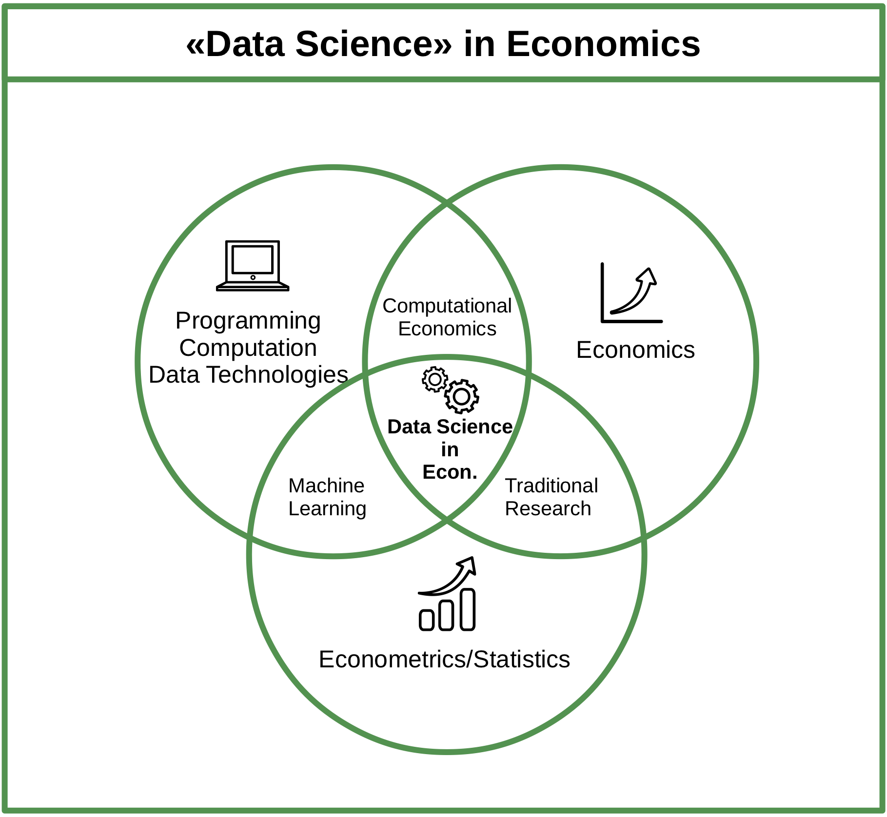
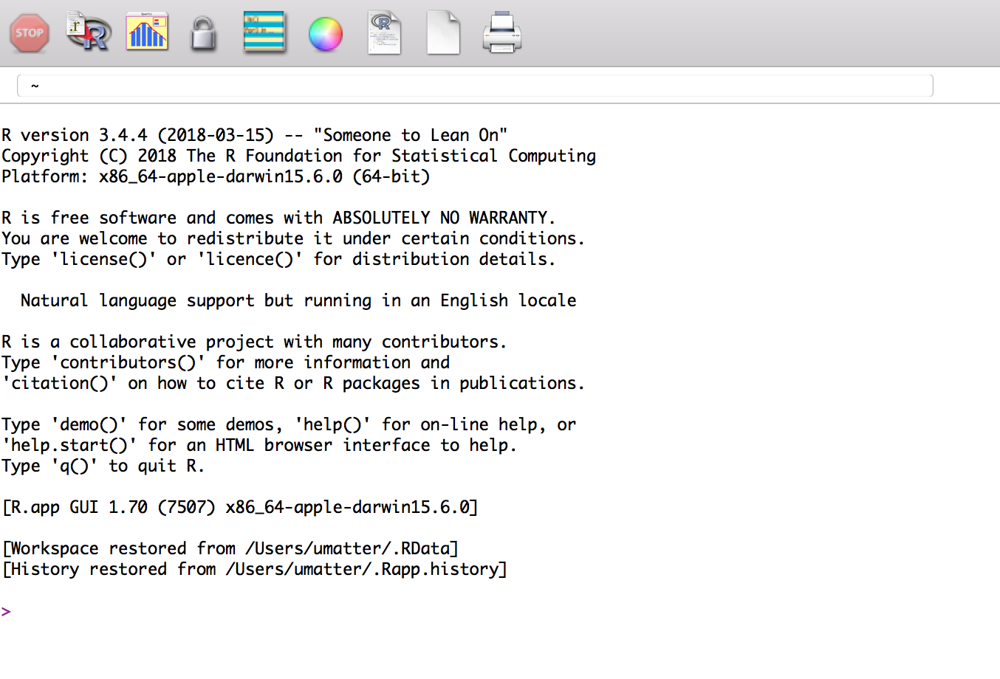
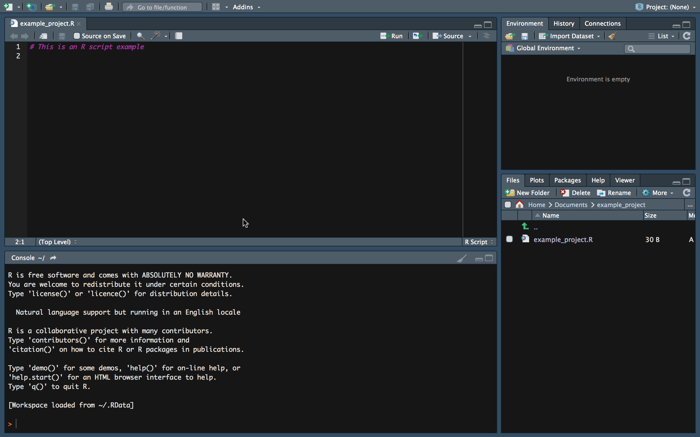
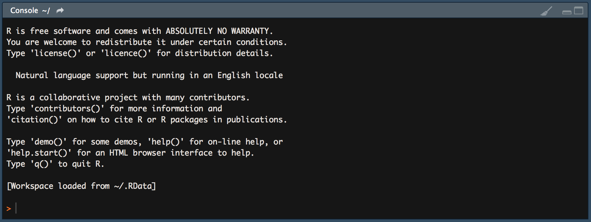
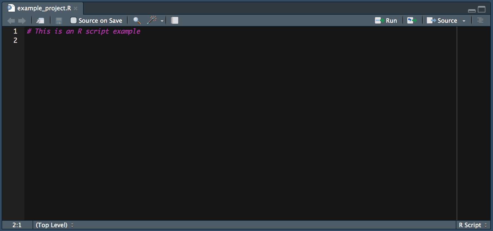
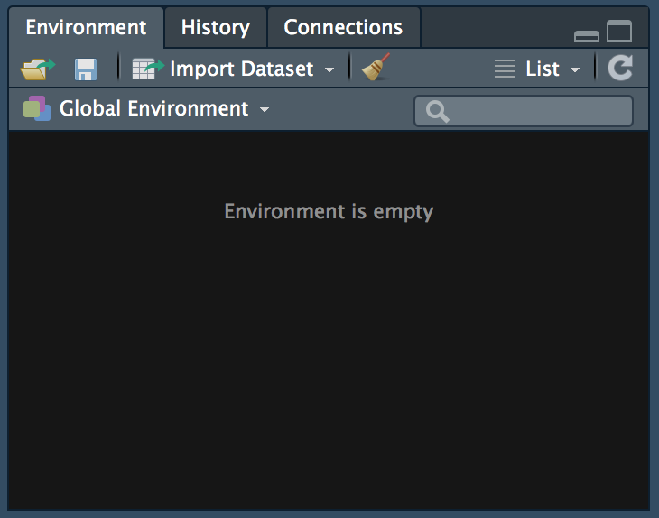
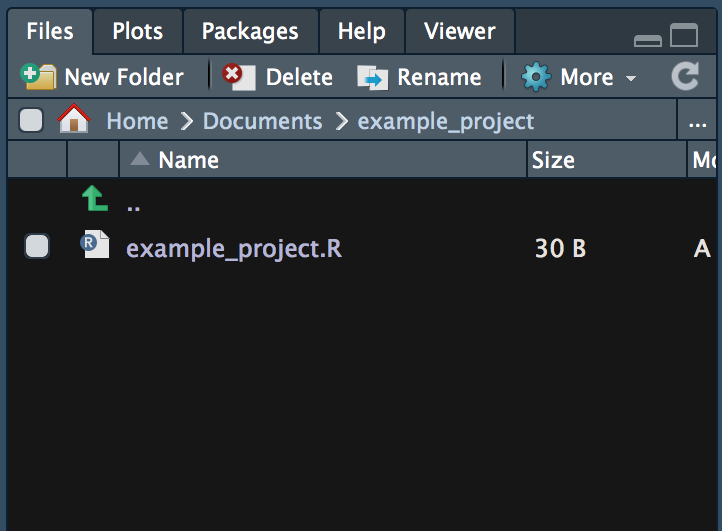
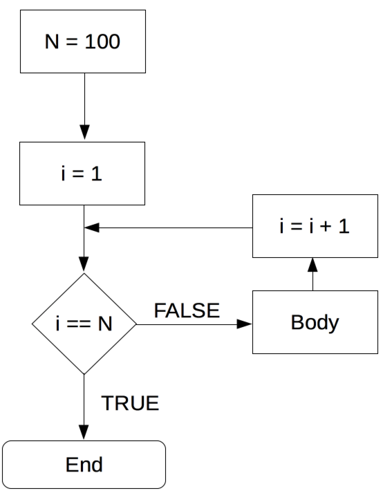
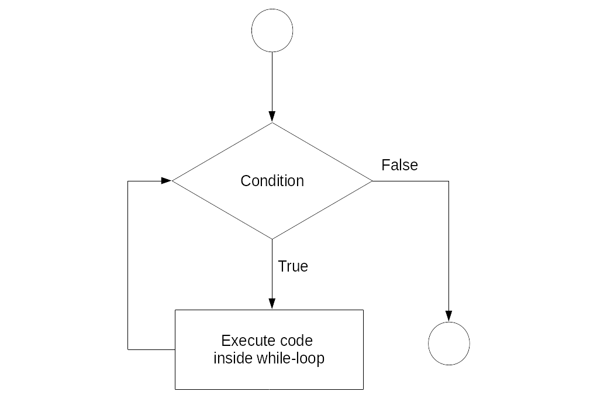

# Programming with Data

This chapter introduces the tools and environment we will use throughout this book to work with data: the R programming language and the RStudio development environment. You will learn why R is well-suited for data analysis, how to set up your working environment, and the fundamental programming concepts needed to start working with data.

**Prerequisites:** No prior programming experience is required. Basic computer literacy (creating files, navigating folders) is assumed.

**What you will learn:**

- Why R is a good choice for data analysis (and how it compares to alternatives)
- How to use R and RStudio
- Core programming concepts: variables, data types, functions, and control flow
- How to organize data analysis projects

## Handling data programmatically

The need for proper handling of large amounts of digital data has given rise to the interdisciplinary field of 'Data Science'\index{Data Science} as well as an increasing demand for 'Data Scientists'. While nothing within Data Science is particularly new on its own, it is the combination of skills and insights from different fields (particularly Computer Science and Statistics) that has proven to be very productive in meeting new challenges posed by a data-driven economy. The various facets of this new craft are often illustrated in the 'Data Science' Venn diagram, reflecting the combination of knowledge and skills from Mathematics/Statistics, substantive expertise in the particular scientific field in which Data Science is applied (here: Economics), and the skills for *acquiring, cleaning, and analyzing* data *programmatically*.

```{r venn, echo=FALSE, fig.align='center', fig.cap="(ref:venn)", out.width="95%", purl=FALSE}

```

(ref:venn) Venn diagram illustrating Data Science as the intersection of three domains: Computer Science (programming, algorithms, data structures), Statistics/Mathematics (probability, inference, modeling), and Domain Knowledge (economics, business, social sciences). Effective data work requires competence in all three areas.

In the proposed Data Science framework followed in this book, programming skills, basic knowledge about computing and in data technologies serve as a complement to engaging in modern economic, business, and social science analysis. They are necessary ingredients to both working with new econometric approaches in machine learning (and the preceding feature engineering) as well as to solving complex problems in the domain of economic modeling. Moreover, programming (or 'coding') is the basis to better understand and engage with the handling of data for analytics purposes.

While industry-scale data science projects tend to include data processing frameworks and programming languages (such as Scala\index{Scala}, Python\index{Python}, and SQL\index{SQL}), we will see that the core steps of how to get from the raw data to the final analysis report can be easily managed for most simpler data projects with just one programming language. In the case of this book, we choose *R*\index{R}.


## Why *R*?

### The 'data language'
The programming language and open-source statistical computing environment [*R*](https://www.r-project.org) has over the last decade become a core tool for data science in industry and academia. It was originally designed as a tool for statistical analysis. Many characteristics of the language make *R* particularly useful for working with data. *R* is increasingly used in various domains, going well beyond the traditional applications of academic research.  

### High-level language, relatively easy to learn
*R* is a relatively easy computer language to learn for people with no previous programming experience. The syntax is rather intuitive and error messages are not too cryptic to understand (this facilitates learning by doing). Moreover, with *R*'s recent stark rise in popularity, there are plenty of freely accessible resources online that help beginners to learn the language.

### Free, open source, large community
Due to its vast base of contributors, *R* serves as a valuable tool for users in various fields related to data analysis and computation (economics/econometrics, biomedicine, business analytics, etc.). *R* users have direct access to thousands of freely available '*R*-packages'\index{R Packages} (small software libraries written in *R*), covering diverse aspects of data analysis, statistics, data preparation, and data import.

Hence, a lot of people using *R* as a tool in their daily work do not actually 'write programs' (in the traditional sense of the word), but apply *R* packages. Applied econometrics with *R* is a good example of this. Almost any function a modern commercial computing environment with a focus on statistics and econometrics (such as [STATA](http://www.stata.com/)\index{Stata}) is offering, can also be found within the *R* environment. Furthermore, there are *R* packages covering all the areas of modern data analytics, including natural language processing\index{Natural Language Processing (NLP)}, machine learning, big data analytics, etc. (see the [CRAN Task Views](https://cran.r-project.org/web/views/)\index{CRAN} for an overview). We thus do not actually have to write a program for many tasks we perform with *R*. Instead, we can build on already existing and reliable packages.

### What about Python?

If you have looked into data science or programming, you have likely encountered Python as another popular language for data analysis. Python is indeed an excellent choice, and in industry it is often the preferred language for machine learning and production systems. Both R and Python are capable of handling the tasks covered in this book.

We use R in this book for several reasons:

- **Statistical heritage**: R was designed specifically for statistical computing and has deep roots in the statistics community. Many cutting-edge statistical methods appear first as R packages.
- **Widely used in economics and social sciences**: R is widely used in academic economics, political science, and related fields, alongside Stata and increasingly Python. Learning R helps you engage directly with existing research code and collaborate with colleagues.
- **Visualization**: R's `ggplot2`\index{ggplot2} package is widely regarded as one of the best tools for creating publication-quality graphics.
- **The tidyverse ecosystem**\index{tidyverse}: Packages like `dplyr`\index{dplyr}, `tidyr`\index{tidyr}, and `readr`\index{readr} provide a consistent, intuitive approach to data manipulation.

That said, skills transfer between languages. The concepts you learn here—data structures, data cleaning, visualization principles, statistical thinking—apply regardless of which language you use. Many data scientists work fluently in both R and Python, choosing the right tool for each task.

### Base R vs. the tidyverse

Within R itself, there are two main "dialects" for data manipulation: **base R**\index{Base R} (the functions that come with R's standard installation) and the **tidyverse**\index{Tidyverse} (a collection of packages designed to work together with a consistent syntax).

The differences go beyond just which functions you use. Here are the key distinctions:

**Syntax philosophy**:

- Base R uses bracket notation (`[]`) and the dollar sign (`$`) to access data: `df[df$age > 25, ]`
- Tidyverse uses verb-like functions that take data as the first argument: `filter(df, age > 25)`
- Tidyverse allows you to refer to column names directly without quotes or `$`: just `age` instead of `df$age`

**Function naming**:

- Base R function names are often abbreviated: `str()`, `nchar()`, `gsub()`
- Tidyverse uses descriptive verbs: `filter()`, `select()`, `mutate()`, `summarise()`

**Data structures**:

- Base R works with traditional data frames
- Tidyverse introduces "tibbles"\index{Tibble}—enhanced data frames with better printing and stricter subsetting behavior

**The pipe operators**\index{Pipe Operator}

One of the tidyverse's most influential features is the pipe operator, which chains operations together. There are now two pipes in common use:

- `%>%` — the original pipe from the `magrittr` package\index{magrittr}, loaded automatically with the tidyverse
- `|>` — the native pipe introduced in R 4.1 (2021), requiring no packages

Both allow you to write code that reads left-to-right, like a recipe:

```{r eval=FALSE}
# Without pipe (nested functions—read inside-out)
summarise(group_by(filter(df, age > 25), gender),
          mean_income = mean(income))

# With pipe (sequential steps—read top-to-bottom)
df %>%
  filter(age > 25) %>%
  group_by(gender) %>%
  summarise(mean_income = mean(income))
```

The `%>%` and `|>` pipes work similarly for most purposes. The main difference is that `%>%` has more features (like the `.` placeholder), while `|>` requires no package loading. R 4.2+ added a `_` placeholder for `|>` (for named arguments only), making them more similar. For the tasks in this book, either works well.

**Why learn both dialects?**

This book primarily uses tidyverse functions for data manipulation tasks because:

- **Readability**: Piped code reads like a series of steps from left to right
- **Consistency**: Functions follow predictable naming conventions and argument patterns
- **Design for data frames**: Tidyverse functions are optimized for the tabular data we work with most

However, base R remains essential:

- **Vectors and matrices**: For operations on vectors\index{Vector} and matrices\index{Matrix}, base R is often more natural
- **Package internals**: Many R packages are built on base R; understanding it helps when debugging
- **No dependencies**: Base R requires no additional package installation
- **Legacy code**: You will encounter base R in existing scripts and documentation

**This book's approach**

Throughout this book, we use:

- **Traditional R assignment syntax**: `<-` for assignment (e.g., `x <- 5`), which is the dominant convention in R
- **Tidyverse functions** for data manipulation: `filter()`, `select()`, `mutate()`, `group_by()`, `summarise()`, etc.
- **Base R** for fundamental operations on vectors, control flow, and when it is more direct

Here's a quick comparison for a common task—selecting rows where `age > 25`:

```{r eval=FALSE}
# Base R approach
df[df$age > 25, ]

# Tidyverse approach
df %>% filter(age > 25)

# Tidyverse with native pipe (R 4.1+)
df |> filter(age > 25)
```

All three produce the same result. The tidyverse versions are more verbose for simple operations but become more readable when chaining multiple steps. As you learn R, you will develop intuitions about when each approach is more appropriate.


## *R*/RStudio overview

*R* is a high-level programming language for statistical computing\index{Statistical Computing}. Once we have installed *R* on our computer, we can run it...

 a. ...directly from the command line, by typing `R` and hitting enter (here in the OSX terminal):

```{r terminal, echo=FALSE, fig.align='center', fig.cap="(ref:rterminal)", out.width="95%", purl=FALSE}
include_graphics("img/r_terminal.png")
```
(ref:rterminal) Running R directly in the Mac/OSX terminal (command-line interface). This minimal interface accepts R commands one at a time but lacks features like syntax highlighting, file browsing, or help integration that modern IDEs provide.


 b. ...with the simple *Integrated Development Environment (IDE)*\index{IDE (Integrated Development Environment)}—a software application that provides comprehensive tools for programming, including a code editor, debugger, and build automation—delivered with the basic *R* installation

```{r ide, echo=FALSE, fig.align='center', fig.cap="(ref:ride)", out.width="95%", purl=FALSE}

```
(ref:ride) Running R in the original R GUI (graphical user interface) that comes bundled with R installations. This basic interface provides a console window for entering commands but has limited features compared to modern development environments like RStudio.


 c. ...or with the more elaborate and user-friendly IDE called *RStudio*\index{RStudio} (either locally or in the cloud, see, for example [Posit Cloud](https://posit.cloud/)\index{Posit Cloud}:

```{r rstudio, echo=FALSE, fig.align='center', fig.cap="(ref:rstudio)", out.width="95%", purl=FALSE}

```
(ref:rstudio) The RStudio integrated development environment (IDE), the recommended interface for working with R. The interface is organized into four panes: Source (top-left) for editing scripts, Console (bottom-left) for running commands, Environment/History (top-right) for viewing objects and command history, and Files/Plots/Packages/Help (bottom-right) for file management and output.

The latter is what we will do throughout this book. RStudio is a very helpful tool for simple data analysis with *R*, writing *R* scripts (short *R* programs), or even for developing *R* packages (software written in *R*), as well as building interactive documents, presentations, etc. Moreover, it offers many options to change its own appearance (Pane Layout, Code Highlighting, etc.).

In the following, we have a look at each of the main panels that will be relevant in this book.


### The *R*-Console

When working in an interactive session, we simply type *R* commands directly into the *R* console\index{R Console}. Typically, the output of executing a command this way is also directly printed to the console. Hence, we type a command on one line, hit enter, and the output is presented on the next line.

```{r console, echo=FALSE, fig.align='center', fig.cap="(ref:console)", out.width="95%", purl=FALSE}

```
(ref:console) The R Console pane in RStudio. This is where R commands are executed and output is displayed. The `>` prompt indicates R is ready to accept commands. Users can type commands directly here or run code from a script file.

For example, we can tell *R* to print the phrase `Hello world` to the console, by typing the following command in the console and hitting enter:

```{r}
print("Hello world")
```


### *R*-Scripts

Apart from very short interactive sessions, it usually makes sense to write *R* code not directly in the command line but to an *R*-script\index{R Script} in the script panel. This way, we can easily execute several lines at once, comment the code (to explain what it does), save it on our hard disk, and further develop the code later on.

```{r rscript, echo=FALSE, fig.align='center', fig.cap="(ref:script)", out.width="95%", purl=FALSE}

```
(ref:script) The R Script editor pane in RStudio. Scripts allow you to write, save, and reuse sequences of R commands. Code can be executed line-by-line (Ctrl/Cmd+Enter) or as a complete script. Comments beginning with `#` document what each section does. Scripts are essential for reproducible analysis because they create a permanent record of your work.

> **In Practice:** Why do researchers and analysts use scripts instead of spreadsheets? @gentzkow_shapiro_code argue that code-based workflows are essential for *reproducibility*—the ability to recreate your results exactly. Their influential guide "Code and Data for the Social Sciences" recommends: (1) automate everything that can be automated, (2) write code that is easy for others to read, and (3) version control your files. @wilson2017good extend these ideas in "Good Enough Practices in Scientific Computing," recommending that even beginners should save commands in scripts, use meaningful file names, and back up work regularly. These practices are now expected in academic research and increasingly in industry.

### *R* Environment

The environment pane shows what variables, objects, and data are loaded in our current *R* session. Moreover, it offers functions to open documents and import data.

```{r renvironment, echo=FALSE, fig.align='center', fig.cap="(ref:environment)", out.width="95%", purl=FALSE}

```
(ref:environment) The Environment pane in RStudio. This pane displays all objects currently loaded in your R session—variables, data frames, functions, and other objects you have created. For each object, it shows the type and a preview of its contents. The broom icon clears all objects from memory. The History tab shows previously executed commands, which can be searched and re-executed.


### File Browser

With the file browser window we can navigate through the folder structure and files on our computer's hard disk, modify files, and set the working directory of our current *R* session. Moreover, it has a pane to show plots generated in *R* and a pane with help pages and *R* documentation.

```{r rfiles, echo=FALSE, fig.align='center', fig.cap="(ref:files)", out.width="95%", purl=FALSE}

```
(ref:files) The Files/Plots/Packages/Help pane in RStudio. The Files tab provides a file browser for navigating your computer's directory structure, creating folders, and managing files. The Plots tab displays graphics generated by R code. The Packages tab lists installed R packages and allows installing new ones. The Help tab displays documentation for R functions and packages.


## First steps with R

Before introducing some of the key functions and packages for data handling and data analysis with R, we should understand how such programs basically work and how we can write them in R. Once we understand the basics of the R language and how to write simple programs, understanding and applying already implemented programs is much easier.^[In fact, since R is an open source environment, you can directly look at already implemented programs in order to learn how they work.]


### Values, Vectors, and Variables

The simplest objects to work with in R are vectors. In fact, even a simple numeric value such as `5.5` or a string of characters (text) like `"Hello"` is considered a vector of length one. (In R, there are no true scalars\index{Scalar}—even single values are stored as vectors.)^[You can try this out in the R console by typing `is.vector(5.5)` and `is.vector("Hello")`.]

A first good step to get familiar with coding in R is to assign names to the objects/values you are working with. For example, when summing up two numeric values, you might want to store the result in a separate object and call this object `result`. This is done with the assignment operator\index{Assignment Operator} `<-` (or `=`, which serves the same purpose).

```{r}
# assign the variable name "result" to the sum of two numeric values
result <- 25.6 + 53.4
```

> **Common Error:** Variable names cannot start with numbers or contain spaces. `2nd_result` and `my result` will cause errors. Use `result_2` or `my_result` instead.

Whenever you want to re-use the just computed sum, you can directly call the object by its name (the variable `result`):

```{r}
# check what "is stored in" result
result
```

```{r}
# further work with the value in result
result - 20
```

With the combine-function (`c()`), you easily form vectors with several elements and name the elements in the vector. By doing so, you create a very simple dataset. For example, suppose you survey the age of a sample of persons. The age values (in years) give you an integer vector. By naming each integer value (each vector element) after the corresponding person's name, you then have a simple dataset stored in a named R vector.


```{r}
# a simple integer vector
a <- c(10,22,33, 22, 40)

# give names to vector elements
names(a) <- c("Andy", "Betty", "Claire", "Daniel", "Eva")
a

```

To retrieve specific values from this vector, you can either select the corresponding vector element with the element's index (the first, second, third, etc. element) or via its name.

```{r}

# indexing via element number (start count with 1)
# or by element name
a[3]
a["Claire"]

```

When not sure what kind of object `a` is, the `str()` (structure) function, provides you with a short summary.

```{r}
# inspect the object you are working with
# str() returns the structure of the object
str(a)

```

If you want to learn more about what the `c()` or `str()` functions (or any other pre-defined R functions) do and how they should be used, type `help(FUNCTION-NAME)` or `?FUNCTION-NAME` in the console and hit enter. A help-page with detailed explanations of what the function is for and how it can be used will appear in one of the R-Studio panels.

```{r}
help(str)
?c
```


### Math operators

One of R's most basic—but genuinely useful—applications is as a sophisticated calculator. Unlike a handheld calculator, R lets you store intermediate results, work with entire datasets at once, and automate repetitive calculations. This section introduces the arithmetic operators you will use constantly throughout this book.

#### Basic arithmetic

The four fundamental operations use symbols familiar from any calculator:

```{r}
2 + 2        # addition
10 - 3       # subtraction
4 * 5        # multiplication
20 / 5       # division
```

You can store results in variables and use them in subsequent calculations:

```{r}
sum_result <- 2 + 2
sum_result
sum_result - 2
```

#### Order of operations

R follows standard mathematical precedence: multiplication and division are evaluated before addition and subtraction. Use parentheses to override this order when needed:

```{r}
2 + 2 * 3      # multiplication first: 2 + 6 = 8
(2 + 2) * 3    # parentheses first: 4 * 3 = 12
(5 + 5) / (2 + 3)
```

#### Working with variables

Variables make calculations readable and reusable. If the underlying values change, you only need to update them in one place:

```{r}
a <- 20
b <- 10
a / b
```

#### Vector arithmetic

Here is where R becomes powerful: arithmetic operations work on entire vectors at once. When you apply an operator to a vector, R applies it to each element automatically—no loops required:

```{r}
a <- c(1, 4, 6)
a * 2           # each element multiplied by 2
```

When two vectors have the same length, operations are performed element-wise:

```{r}
b <- c(10, 40, 80)
a * b           # 1*10, 4*40, 6*80
a + b           # 1+10, 4+40, 6+80
```
This vectorized behavior is fundamental to efficient data analysis in R. Instead of writing loops to process each observation, you simply write the operation once and R applies it to all elements.

#### Powers, roots, and logarithms

For more advanced calculations, R provides operators and functions for exponentiation, roots, and logarithms:

```{r}
4^2            # exponentiation: 4 squared
sqrt(16)       # square root
log(2)         # natural logarithm (base e)
exp(10)        # exponential function (e^10)
log(exp(10))   # these are inverse functions
```

#### Summary of math operators

Table \@ref(tab:mathops) summarizes the key arithmetic operators and mathematical functions in R.

```{r mathops, echo=FALSE}
math_ops <- data.frame(
  Operator = c("`+`", "`-`", "`*`", "`/`", "`^`", "`%%`", "`%/%`"),
  Description = c("Addition", "Subtraction", "Multiplication", "Division",
                  "Exponentiation", "Modulo (remainder)", "Integer division"),
  Example = c("`5 + 3`", "`5 - 3`", "`5 * 3`", "`5 / 3`",
              "`5^3`", "`5 %% 3`", "`5 %/% 3`"),
  Result = c("8", "2", "15", "1.667", "125", "2", "1")
)
knitr::kable(math_ops, caption = "Arithmetic operators in R.", booktabs = TRUE)
```

```{r mathfuncs, echo=FALSE}
math_funcs <- data.frame(
  Function = c("`sqrt(x)`", "`abs(x)`", "`log(x)`", "`log10(x)`",
               "`exp(x)`", "`round(x, n)`", "`floor(x)`", "`ceiling(x)`"),
  Description = c("Square root", "Absolute value", "Natural logarithm",
                  "Base-10 logarithm", "Exponential (e^x)",
                  "Round to n decimal places", "Round down to integer",
                  "Round up to integer"),
  Example = c("`sqrt(16)`", "`abs(-5)`", "`log(10)`", "`log10(100)`",
              "`exp(1)`", "`round(3.567, 1)`", "`floor(3.7)`", "`ceiling(3.2)`"),
  Result = c("4", "5", "2.303", "2", "2.718", "3.6", "3", "4")
)
knitr::kable(math_funcs, caption = "Common mathematical functions in R.", booktabs = TRUE)
```

To access R's built-in documentation for arithmetic operators, type `?'+'` in the console.


## Basic programming concepts in R

In very simple terms, programming/coding is all about using a computer language to instruct a computer what to do. What reads very complex at first sight is actually rather simple (at least for a large array of basic programming problems). At the core of almost any R program is the right application and combination of just a handful of basic programming concepts: loops\index{Loop}, logical statements, control statements\index{Control Statement}, and functions\index{Function}. Once you a) conceptually understand what these concepts are for, and b) have learned the syntax of how to use these concepts when writing a program in R, addressing all kind of data handling problems efficiently with R, will simply become a matter of training/practice. 

### Loops
A loop is typically a sequence of statements executed a specific number of times. How often the code 'inside' the loop is executed depends on a clearly defined control statement. If we know in advance how often the code inside the loop has to be executed, we typically write a so-called 'for-loop'. We typically write a so-called 'while-loop' if the number of iterations is not clearly known before executing the code. The following subsections illustrate both of these concepts in R.

### For-loops
In simple terms, a for-loop\index{For-Loop} tells the computer to execute a sequence of commands 'for each case in a set of n cases'. The flowchart in Figure \@ref(fig:for) illustrates the concept.

```{r for, echo= FALSE, fig.align="center", out.width="65%", fig.cap="(ref:capfor)", purl=FALSE}

```
(ref:capfor) Flowchart illustrating a for-loop. The loop starts by initializing a counter variable, then repeatedly executes a block of code while incrementing the counter until a specified condition is met. For-loops are used when you know in advance how many iterations are needed—for example, processing each element in a vector of known length.


For example, a for-loop could be used to sum up each element in a numeric vector of fixed length (thus, the number of iterations is clearly defined). In plain English, the for-loop would state something like: "Start with 0 as the current total value, for each of the elements in the vector, add the value of this element to the current total value." Note how this logically implies that the loop will 'stop' once the value of the last element in the vector is added to the total. Let's illustrate this in R. Take the numeric vector `c(1, 2.1, 3.5, 4.8, 5)`. A for loop to sum up all elements can be implemented as follows:

```{r}
# vector to be summed up
numbers <- c(1,2.1,3.5,4.8,5)
# initiate total
total_sum <- 0
# number of iterations
n <- length(numbers)
# start loop
for (i in 1:n) {
     total_sum <- total_sum + numbers[i]
}

# check result
total_sum
# compare with the result of sum() function
sum(numbers)

```

#### Nested for-loops
In some situations, a simple for-loop might not be sufficient.\index{Nested Loop} Within one sequence of commands, there might be another sequence of commands that also has to be executed for a number of times each time the first sequence of commands is executed. In such a case, we speak of a 'nested for-loop'. We can illustrate this easily by extending the example of the numeric vector above to a matrix for which we want to sum up the values in each column. Building on the loop implemented above, we would say 'for each column `j` of a given numeric matrix, execute the for-loop defined above'.


```{r}
# matrix to be summed up
numbers_matrix <- matrix(1:20, ncol = 4)
numbers_matrix

```

```{r}

# number of iterations for the outer loop
m <- ncol(numbers_matrix)
# number of iterations for the inner loop
n <- nrow(numbers_matrix)
# start outer loop (loop over columns of the matrix)
for (j in 1:m) {
     # start inner loop
     # initiate total
     total_sum <- 0
     for (i in 1:n) {
          total_sum <- total_sum + numbers_matrix[i, j]
          }
     print(total_sum)
     }


```

#### While-loop
In a situation where a program has to repeatedly run a sequence of commands, but we don't know in advance how many iterations we need to reach the intended goal, a while-loop\index{While-Loop} can help. In simple terms, a while loop keeps executing a sequence of commands as long as a certain logical statement is true. The flow chart in Figure \@ref(fig:while) illustrates this point.


```{r while, echo= FALSE, fig.align="center", out.width="100%", fig.cap="(ref:capwhile)", purl=FALSE}

```
(ref:capwhile) Flowchart illustrating a while-loop. The loop checks a condition before each iteration: if true, it executes the code block and checks again; if false, the loop terminates and execution continues. While-loops are used when the number of iterations is not known in advance—for example, continuing until a convergence criterion is met or a certain threshold is reached.

For example, a while-loop in plain English could state something like "start with 0 as the total, add 1.12 to the total until the total is larger than 20." We can implement this in R as follows.

```{r}
# initiate starting value
total <- 0
# start loop
while (total <= 20) {
     total <- total + 1.12
}

# check the result
total

```


### Booleans and logical statements

Note that in order to write a meaningful while-loop we have to make use of a logical statement\index{Logical Statement} such as "the value stored in the variable `total`is smaller or equal to `20`" (`total <= 20`). A logical statement results in a 'Boolean'\index{Boolean} data type. That is, a data type with only two possible values: `TRUE` or `FALSE`. (These can be coerced to `1` and `0` in numeric contexts.)


```{r}
2+2 == 4
3+3 == 7
```

> **Common Error:** Don't confuse `=` with `==` (comparison). In R, `<-` is the preferred assignment operator (as used throughout this book), though `=` also works for assignment. Writing `if (x = 5)` assigns 5 to x instead of comparing. Always use `==` for comparisons: `if (x == 5)`.

Logical statements play an important role in fundamental programming concepts. In particular, they are crucial to make conditional statements\index{Conditional Statement} ('if-statements'\index{If-Statement}) that build the control structure of a program, controlling the 'direction' the program takes (given certain conditions).

```{r}
condition <- TRUE
if (condition) {
     print("This is true!")
} else {
     print("This is false!")
}

condition <- FALSE
if (condition) {
     print("This is true!")
} else {
     print("This is false!")
}


```


### R functions

R programs heavily rely on functions. Conceptually, 'functions' in R are very similar to what we know as 'functions' in math (i.e., $f:X \rightarrow Y$). A function can thus, e.g., take a variable $X$ as input and provide value $Y$ as output. The actual calculation of $Y$ based on $X$ can be something as simple as $2\times X = Y$. But it could also be a very complex algorithm or an operation that does not directly have anything to do with numbers and arithmetic.^[Of course, on the very low level, everything that happens in a microprocessor can, in the end, be expressed in some formal way using math. However, the point here is that at the level we work with R, a function could simply process different text strings (i.e., stack them together). Thus for us as programmers, R functions do not necessarily have to do anything with arithmetic and numbers but could serve all kinds of purposes, including the parsing of HTML code, etc.]

In R—and many other programming languages—functions take 'parameter values' as input, process those values according to a predefined program, and 'return' the result. For example, a function could take a numeric vector as input and return the sum of all the individual numeric values in the input vector.

When we open RStudio, all basic functions are already loaded automatically. This means we can directly call them from the R-Console or by executing an R-Script. As R is made for data analysis and statistics, the basic functions loaded with R cover many aspects of tasks related to working with and analyzing data. Besides these basic functions, thousands of additional functions covering all kinds of topics related to data analysis can be loaded additionally by installing the respective R-packages (`install.packages("PACKAGE-NAME")`) and then loading the packages with `library(PACKAGE-NAME)`. In addition, it is straightforward to define our own functions.

R packages are distributed primarily through **CRAN** (the Comprehensive R Archive Network)\index{CRAN}, a repository that hosts over 20,000 packages. When you run `install.packages("tidyverse")`, R downloads the package from CRAN and installs it on your computer. CRAN ensures that packages meet certain quality standards and are compatible with the current R version.

For reproducibility, it is good practice to note which package versions you used in an analysis. You can check installed versions with `packageVersion("tidyverse")` or see all loaded packages with `sessionInfo()`. If you need to install a specific version of a package (for example, to reproduce someone else's analysis), you can use the `remotes` package: `remotes::install_version("dplyr", version = "1.1.0")`. Recording package versions helps ensure that your analysis can be reproduced even as packages are updated.


#### Case study: Compute the mean

To illustrate the point of how functions work in R and how we can write our own functions in R, the following code-example illustrates how to implement a function that computes the mean/average value, given a numeric vector.

First, we initiate a simple numeric vector which we then use as an example to test the function. Whenever you implement a function, it is very useful to first define a simple example of an input for which you know what the output should be.

```{r}
# a simple integer vector, for which we want to compute the Mean
a <- c(5.5, 7.5)
# desired functionality and output:
# my_mean(a)
# 6.5
```

In this example, we would thus expect the output to be `6.5`. Later, we will compare the output of our function with this in order to check whether our function works as desired.

In addition to defining a simple example and the desired output, it makes sense to also think about *how* the function is expected to produce this output. When implementing functions related to statistics (such as the mean), it usually makes sense to have a look at the mathematical definition:

$\bar{x} = \frac{1}{n}\left (\sum_{i=1}^n{x_i}\right ) = \frac{x_1+x_2+\cdots +x_n}{n}$.

Now, we can start thinking about implementing the function based on built-in R functions. From looking at the mathematical definition of the mean ($\bar{x}$), we recognize that there are two main components to computing the mean:

 - $\sum_{i=1}^n{x_i}$: the sum of all the elements in vector $x$
 - $n$: the number of elements in vector $x$.
 
Once we know how to get these two components, computing the mean is straightforward. In R, there are two built-in functions that deliver exactly these two components:

 - `sum()` returns the sum of all the values in its arguments (i.e., if `x` is a numeric vector, `sum(x)` returns the sum of all elements in `x`).
 - `length()` returns the length of a given vector.

With the following short line of code, we thus get the mean of the elements in vector `a`.
```{r}
sum(a)/length(a)
```

All that is left to do is to pack all this into the function body of our newly defined `my_mean()` function:

```{r}
# define our own function to compute the mean
my_mean <- function(x) {
     x_bar <- sum(x) / length(x)
     return(x_bar)
}
```

Now we can test it based on our example:

```{r}
# test it
my_mean(a)
```

Moreover, we can test it by comparing it with the built-in `mean()` function:

```{r}
b <- c(4,5,2,5,5,7)
my_mean(b) # our own implementation
mean(b) # the built_in function
```

## Key Takeaways

- R is a powerful language for statistical computing that excels in data analysis and visualization, with a rich ecosystem of packages.
- While Python is a valid alternative, R's statistical heritage and dominance in social science research make it the focus of this book.
- RStudio provides a productive environment for writing, testing, and organizing R code.
- R's basic building blocks—variables, vectors, data types, and functions—form the foundation for all data manipulation tasks.
- Writing your own functions allows you to automate repetitive tasks and better understand how built-in functions work.
- Loops (`for`, `while`) and control flow (`if`/`else`) enable you to write programs that handle complex, conditional operations.

> **AI Support Prompt:** When you encounter an R error you don't understand, try asking an AI assistant:
>
> `I'm learning R programming. I ran this code: [paste your code]. I got this error: [paste error message]. Can you explain what went wrong and suggest a fix?`
>
> AI assistants excel at explaining cryptic error messages and suggesting debugging strategies. They can also explain why R behaves in unexpected ways.

> **AI Support Prompt:** To generate practice exercises for the concepts in this chapter, try:
>
> `I'm learning about [control flow / functions / loops / vectors] in R. Can you give me 3 practice exercises at a beginner level, with increasing difficulty? Don't give me the solutions yet—I'll try them first and ask for help if I get stuck.`
>
> This is a great way to get personalized practice beyond the exercises at the end of each chapter.

> **AI Support Prompt:** If you want to understand how a built-in R function works, try:
>
> `Can you explain what the R function [function name, e.g., 'apply' or 'tapply'] does? Give me a simple example and explain each argument.`
>
> R has many functions, and understanding them deeply helps you write better code.

## Further Reading

- @wickham_cetinkaya_grolemund_2023: *R for Data Science* (2nd edition) covers data import, tidying, transformation, and visualization. Freely available at https://r4ds.hadley.nz/.
- @wickham_adv_2019: *Advanced R* (2nd edition) provides deeper insight into R's programming model for those who want to go further. Freely available at https://adv-r.hadley.nz/.
- @posit_cheatsheets: The Posit Cheatsheets provide quick references for popular R packages. Available at https://posit.co/resources/cheatsheets/.
- @tidyverse_style: The tidyverse style guide helps you write clean, consistent R code. Available at https://style.tidyverse.org/.

## Exercises

1. **Vector operations**: Create a numeric vector containing the values 10, 20, 30, 40, 50. Then:
   a) Calculate the sum and mean of this vector using built-in functions.
   b) Create a new vector that contains each element multiplied by 2.
   c) Extract only the elements greater than 25.

2. **Writing functions**: Write a function called `my_sd()` that computes the standard deviation of a numeric vector. Recall that the standard deviation is defined as $s = \sqrt{\frac{1}{n-1}\sum_{i=1}^{n}(x_i - \bar{x})^2}$. Test your function on the vector `c(2, 4, 4, 4, 5, 5, 7, 9)` and compare your result with R's built-in `sd()` function.

3. **Control flow**: Write a function called `grade_letter()` that takes a numeric score (0-100) as input and returns the corresponding letter grade: "A" for 90-100, "B" for 80-89, "C" for 70-79, "D" for 60-69, and "F" for below 60.

4. **Loops**: Using a `for` loop, compute the first 20 numbers in the Fibonacci sequence (where each number is the sum of the two preceding ones: 1, 1, 2, 3, 5, 8, ...). Store the results in a vector.

5. **Debug the code**: The following code is supposed to calculate the mean of all positive numbers in a vector, but it produces an error. What is the problem, and how would you fix it?

```{r eval=FALSE}
numbers <- c(-3, 5, -1, 8, 2, -4, 7)
positive_mean <- mean(numbers[numbers > 0)
```

6. **Debug the code**: This function is meant to check whether a number is even and return `"even"` or `"odd"`. It runs without errors, but gives wrong results. What is the problem, and how would you fix it?

```{r eval=FALSE}
check_even <- function(x) {
    if (x %% 2 = 0) {
        return("even")
    } else {
        return("odd")
    }
}
check_even(4)
```

7. **Debug the code**: The following code attempts to calculate the total price of items, but produces an unexpected result. What is the problem, and how would you fix it?

```{r eval=FALSE}
prices <- c("10.50", "25.00", "8.75")
total <- sum(prices)
```

8. **Debug the code**: This loop is supposed to print the numbers 1 through 5, but it runs forever (infinite loop). What is the problem, and how would you fix it?

```{r eval=FALSE}
i <- 1
while (i <= 5) {
    print(i)
}
```


