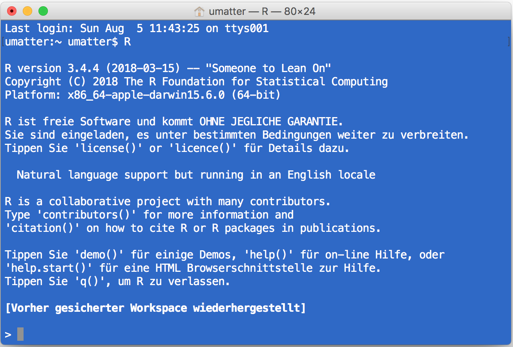
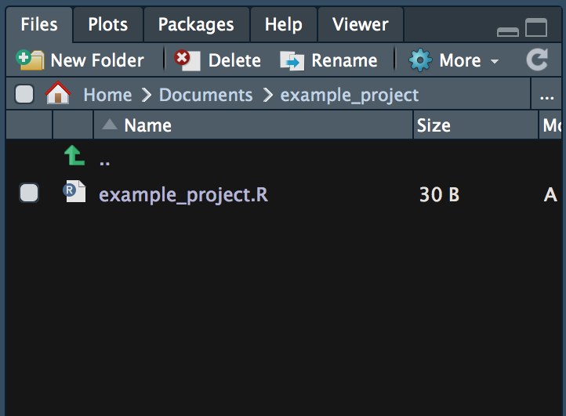

# Programming with Data

## Handling data programmatically 

The need for proper handling of large amounts of digital data has given rise to the interdisciplinary field of ['Data Science'](https://en.wikipedia.org/wiki/Data_science) as well as an increasing demand for 'Data Scientists'. While nothing within Data Science is particularly new on its own, it is the combination of skills and insights from different fields (particularly Computer Science and Statistics) that has proven to be very productive in meeting new challenges posed by a data-driven economy. The various facets of this new craft are often illustrated in the 'Data Science' Venn diagram, reflecting the combination of knowledge and skills from Mathematics/Statistics, substantive expertise in the particular scientific field in which Data Science is applied (here: Economics), and the  skills for *acquiring, cleaning, and analyzing* data *programmatically*.

```{r venn, echo=FALSE, fig.align='center', fig.cap="(ref:venn)", out.width="60%", purl=FALSE}
include_graphics("img/venn_diagramm.png")
```

(ref:venn) Venn diagram illustrating the domains of Data Science in the context of Economics.

In the proposed framework of Data Science in Economics followed in this book, programming skills, basic knowledge about computing and in data technologies serve as a complement to engaging in modern economic analysis. They are necessary ingredients to both working new econometric approaches in machine learning (and the preceding feature engineering) as well as to solving complex problems in the domain of economic modeling. Moreover, programming (or 'coding') is the basis to better understand and engage with the handling of data for analytics purposes.

While industry-scale data science projects tend to include data processing frameworks and programming languages (such as Scala, Python, and SQL), we will see that the core steps of how to get from the raw data to the final analysis report can for most simpler data projects be easily managed with just one programming language. In the case of this book, we choose *R*.


## Why *R*?

### The 'data language'
The programming language and open-source statistical computing environment [*R*](www.r-project.org) has over the last decade become a core tool for data science in industry and academia. It was originally designed as a tool for statistical analysis. Many characteristics of the language make *R* particularly useful to work with data. *R* is increasingly used in various domains, going well beyond the traditional applications of academic research.  

### High-level language, relatively easy to learn
*R* is a relatively easy computer language to learn for people with no previous programming experience. The syntax is rather intuitive and error messages are not too cryptic to understand (this facilitates learning by doing). Moreover, with *R*'s recent stark rise in popularity, there are plenty of freely accessible resources online that help beginners to learn the language.

### Free, open source, large community
Due to its vast base of contributors, *R* serves as a valuable tool for users in various fields related to data analysis and computation (economics/econometrics, biomedicine, business analytics, etc.). *R* users have direct access to thousands of freely available '*R*-packages' (small software libraries written in *R*), covering diverse aspects of data analysis, statistics, data preparation, and data import.

Hence, a lot of people using *R* as a tool in their daily work do not actually 'write programs' (in the traditional sense of the word), but apply *R* packages. Applied econometrics with *R* is a good example of this. Almost any function a modern commercial computing environment with a focus on statistics and econometrics (such as [STATA](http://www.stata.com/)) is offering, can also be found within the *R* environment. Furthermore, there are *R* packages covering all the areas of modern data analytics, including natural language processing, machine learning, big data analytics, etc. (see the [CRAN Task Views](https://cran.r-project.org/web/views/) for an overview). We thus do not actually have to write a program for many tasks we perform with *R*. Instead, we can build on already existing and reliable packages.


## *R*/RStudio overview

*R* is the high-level (meaning 'more user friendly') programming language for statistical computing. Once we have installed *R* on our computer, we can run it...

 a. ...directly from the command line, by typing `R` and hit enter (here in the OSX terminal):

```{r terminal, echo=FALSE, fig.align='center', fig.cap="(ref:rterminal)", out.width="60%", purl=FALSE}

```
(ref:rterminal) Running *R* in the Mac/OSX terminal.


 b. ...with the simple [Integrated Development Environment (IDE)](https://en.wikipedia.org/wiki/Integrated_development_environment) delivered with the basic *R* installation

```{r ide, echo=FALSE, fig.align='center', fig.cap="(ref:ride)", out.width="75%", purl=FALSE}
include_graphics("img/r_ide.png")
```
(ref:ride) Running *R* in the original *R* GUI/IDE.


 c. ...or with the more elaborated and user-friendly IDE called *RStudio* (either locally or in the cloud, see, for example [RStudio Cloud](https://rstudio.cloud/):

```{r rstudio, echo=FALSE, fig.align='center', fig.cap="(ref:rstudio)", out.width="75%", purl=FALSE}
include_graphics("img/rstudio_panels.png")
```
(ref:rstudio) Running *R* in RStudio (IDE).

The latter is what we will do throughout this course. RStudio is a very helpful tool for simple data analysis with *R*, writing *R* scripts (short *R* programs), or even for developing *R* packages (software written in *R*), as well as building interactive documents, presentations, etc. Moreover, it offers many options to change its own appearance (Pane Layout, Code Highlighting, etc.).

In the following, we have a look at each of the main panels that will be relevant in this course.


### The *R*-Console

When working in an interactive session, we simply type *R* commands directly into the *R* console. Typically, the output of executing a command this way is also directly printed to the console. Hence, we type a command on one line, hit enter, and the output is presented on the next line.

```{r console, echo=FALSE, fig.align='center', fig.cap="(ref:console)", out.width="75%", purl=FALSE}
include_graphics("img/rstudio_console.png")
```
(ref:console) Running *R* in the Mac/OSX terminal.

For example, we can tell *R* to print the phrase `Hello world` to the console, by typing to following command in the console and hit enter:

```{r}
print("Hello world")
```


### *R*-Scripts

Apart from very short interactive sessions, it usually makes sense to write *R* code not directly in the command line but to an *R*-script in the script panel. This way, we can easily execute several lines at once, comment the code (to explain what it does), save it on our hard disk, and further develop the code later on.

```{r rscript, echo=FALSE, fig.align='center', fig.cap="(ref:script)", out.width="75%", purl=FALSE}
include_graphics("img/rstudio_script.png")
```
(ref:script) The *R* Script window in RStudio.


### *R* Environment

The environment pane shows what variables, objects, and data are loaded in our current *R* session. Moreover, it offers functions to open documents and import data.

```{r renvironment, echo=FALSE, fig.align='center', fig.cap="(ref:environment)", out.width="50%", purl=FALSE}
include_graphics("img/rstudio_environment.png")
```
(ref:environment) The environment window in RStudio.


### File Browser

With the file browser window we can navigate through the folder structure and files on our computer's hard disk, modify files, and set the working directory of our current *R* session. Moreover, it has a pane to show plots generated in *R* and a pane with help pages and *R* documentation.

```{r rfiles, echo=FALSE, fig.align='center', fig.cap="(ref:files)", out.width="50%", purl=FALSE}

```
(ref:files) The file browser window in RStudio.


## First steps with R

Before introducing some of the key functions and packages for data handling and data analysis with R, we should understand how such programs basically work and how we can write them in R. Once we understand the basics of the R language and how to write simple programs, understanding and applying already implemented programs is much easier.^[In fact, since R is an open source environment, you can directly look at already implemented programs in order to learn how they work.]


### Values, Vectors, and Variables

The simplest objects to work with in R are vectors. In fact, even a simple numeric value such as `5.5` or a string of characters (text) like `"Hello"` is considered a vector (a scalar).^[You can try this out in the R console by typing `is.vector(5.5)` and `is.vector("Hello")`.]

A first good step to get familiar with coding in R is to assign names to the objects/values you are working with. For example, when summing up two numeric values, you might want to store the result in a separate object and call this object `result`. This is done with the assignment operator `<-` (or `=`, which serves the same purpose).

```{r}
# assign the variable name "result" to the sum of two numeric values
result <- 25.6 + 53.4 
```

Whenever you want to re-use the just computed sum, you can directly call the object by its name (the variable `result`):

```{r}
# check what "is stored in" result
result
```

```{r}
# further work with the value in result
result - 20
```

With the combine-function (`c()`), you easily form vectors with several elements and name the elements in the vector. By doing so, you create a very simple dataset. For example, suppose you survey the age of a sample of persons. The age values (in years) gives you an integer vector. By naming each integer value (each vector element) after the corresponding person's name, you then have a simple dataset stored in a named R vector.


```{r}
# a simple integer vector
a <- c(10,22,33, 22, 40)

# give names to vector elements
names(a) <- c("Andy", "Betty", "Claire", "Daniel", "Eva")
a

```

To retrieve specific values from this vector, you can either select the corresponding vector element with the element's index (the first, second, third, etc. element) or via its name.

```{r}

# indexing either via a number of vector element (start count with 1)
# or by element name
a[3]
a["Claire"]

```

When not sure what kind of object `a` is, the `str()` (structure) function, provides you with a short summary.

```{r}
# inspect the object you are working with
str(a) # returns the structure of the object ("what is in variable a?")

```

If you want to learn more about what the `c()` or `str()` functions (or any other pre-defined R functions) do and how they should be used, type `help(FUNCTION-NAME)` or `?FUNCTION-NAME` in the console and hit enter. A help-page with detailed explanations of what the function is for and how it can be used will appear in one of the R-Studio panels.

```{r}
help(str)
?c
```


### Math operators

Above, we have just in a side remark introduced the very intuitive syntax for two common math operators in R: `+` for the addition of numeric or integer values, and `-` for subtraction. R knows all basic math operators and has a variety of functions to handle more advanced mathematical problems. One basic practical application of R in academic life is to use it as a sophisticated (and programmable) calculator.

```{r}
# basic arithmetic
2+2
sum_result <- 2+2
sum_result
sum_result -2
4*5
20/5

# order of operations
2+2*3
(2+2)*3
(5+5)/(2+3)

# work with variables
a <- 20
b <- 10
a/b

# arithmetics with vectors
a <- c(1,4,6)
a * 2

b <- c(10,40,80)
a * b
a + b


# other common math operators and functions
4^2
sqrt(4^2)
log(2)
exp(10)
log(exp(10))


```

To look up the most common math operators in R and get more details about how to use them type 

```{r}

?`+`

```

in the R console and hit enter.


## Basic programming concepts in R

In very simple terms, programming/coding is all about using a computer language to instruct a computer what to do. What reads very complex at first sight, is actually rather simple in (at least for a large array of basic programming problems). At the core of almost any R program is the right application and combination of just a handful of basic programming concepts: loops, logical statements, control statements, and functions. Once you a) conceptually understand what these concepts are for, and b) have learned the syntax of how to use these concepts when writing a program in R, addressing all kind of data handling problems efficiently with R, will simply become a matter of training/practice. 

### Loops
A loop is typically a sequence of statements executed a specific number of times. How often the code 'inside' the loop is executed depends on a clearly defined control statement. If we know in advance how often the code inside the loop has to be executed, we typically write a so-called 'for-loop'. We typically write a so-called' while-loop' if the number of iterations is not clearly known before executing the code. The following subsections illustrate both of these concepts in R.

### For-loops
In simple terms, a for-loop tells the computer to execute a sequence of commands 'for each case in a set of n cases'. The flowchart in Figure \@ref(fig: for) illustrates the concept.

```{r for, echo= FALSE, fig.align="center", out.width="40%", fig.cap="(ref:capfor)", purl=FALSE}
include_graphics("img/forloop.png")
```
(ref:capfor) For-loop illustration.


For example, a for-loop could be used, to sum up each element in a numeric vector of fixed length (thus, the number of iterations is clearly defined). In plain English, the for-loop would state something like: "Start with 0 as the current total value, for each of the elements in the vector, add the value of this element to the current total value." Note how this logically implies that the loop will 'stop' once the value of the last element in the vector is added to the total. Let's illustrate this in R. Take the numeric vector `c(1,2,3,4,5)`. A for loop to sum up all elements can be implemented as follows:

```{r}
# vector to be summed up
numbers <- c(1,2.1,3.5,4.8,5)
# initiate total
total_sum <- 0
# number of iterations
n <- length(numbers)
# start loop
for (i in 1:n) {
     total_sum <- total_sum + numbers[i]
}

# check result
total_sum
# compare with the result of sum() function
sum(numbers)

```

#### Nested for-loops
In some situations, a simple for-loop might not be sufficient. Within one sequence of commands, there might be another sequence of commands that also has to be executed for a number of times each time the first sequence of commands is executed. In such a case, we speak of a 'nested for-loop'. We can illustrate this easily by extending the example of the numeric vector above to a matrix for which we want to sum up the values in each column. Building on the loop implemented above, we would say 'for each column `j` of a given numeric matrix, execute the for-loop defined above'.


```{r}
# matrix to be summed up
numbers_matrix <- matrix(1:20, ncol = 4)
numbers_matrix

```

```{r}

# number of iterations for the outer loop
m <- ncol(numbers_matrix)
# number of iterations for the inner loop
n <- nrow(numbers_matrix)
# start outer loop (loop over columns of the matrix)
for (j in 1:m) {
     # start inner loop
     # initiate total
     total_sum <- 0
     for (i in 1:n) {
          total_sum <- total_sum + numbers_matrix[i, j]
          }
     print(total_sum)
     }


```

#### While-loop
In a situation where a program has to repeatedly run a sequence of commands, but we don't know in advance how many iterations we need to reach the intended goal, a while-loop can help. In simple terms, a while loop keeps executing a sequence of commands as long as a certain logical statement is true. The flow chart in Figure \@ref(fig: while) illustrates this point.


```{r while, echo= FALSE, fig.align="center", out.width="70%", fig.cap="(ref:capwhile)", purl=FALSE}

```
(ref:capwhile) While-loop illustration.

For example, a while-loop in plain English could state something like "start with 0 as the total, add 1.12 to the total until the total is larger than 20." We can implement this in R as follows.

```{r}
# initiate starting value
total <- 0
# start loop
while (total <= 20) {
     total <- total + 1.12
}

# check the result
total

```


### Booleans and logical statements

Note that in order to write a meaningful while-loop we have to make use of a logical statement such as "the value stored in the variable `total`is smaller or equal to `20`" (`total <= 20`). A logical statement results in a 'Boolean' data type. That is, a data type with the only two possible values `TRUE` or `FALSE` (`1` or `0`).


```{r}
2+2 == 4
3+3 == 7
```

Logical statements play an important role in fundamental programming concepts. In particular, they are crucial to make conditional statements ('if-statements') that build the control structure of a program, controlling the 'direction' the program takes (given certain conditions).

```{r}
condition <- TRUE
if (condition) {
     print("This is true!")
} else {
     print("This is false!")
}

condition <- FALSE
if (condition) {
     print("This is true!")
} else {
     print("This is false!")
}


```


### R functions

R programs heavily rely on functions. Conceptually, 'functions' in R are very similar to what we know as 'functions' in math (i.e., $f:X \rightarrow Y$). A function can thus, e.g., take a variable $X$ as input and provide value $Y$ as output. The actual calculation of $Y$ based on $X$ can be something as simple as $2\times X = Y$. But it could also be a very complex algorithm or an operation that does not directly have anything to do with numbers and arithmetic.^[Of course, on the very low level, everything that happens in a microprocessor can, in the end, be expressed in some formal way using math. However, the point here is that at the level we work with R, a function could simply process different text strings (i.e., stack them together). Thus for us as programmers, R functions do not necessarily have to do anything with arithmetic and numbers but could serve all kinds of purposes, including the parsing of HTML code, etc.]

In R—and many other programming languages—functions take 'parameter values' as input, process those values according to a predefined program, and 'return' the result. For example, a function could take a numeric vector as input and return the sum of all the individual numeric values in the input vector.

When we open RStudio, all basic functions are already loaded automatically. This means we can directly call them from the R-Console or by executing an R-Script. As R is made for data analysis and statistics, the basic functions loaded with R cover many aspects of tasks related to working with and analyzing data. Besides these basic functions, thousands of additional functions covering all kinds of topics related to data analysis can be loaded additionally by installing the respective R-packages (`install. packages("PACKAGE-NAME")`) and then loading the packages with `library(PACKAGE-NAME)`. In addition, it is straightforward to define our own functions.


#### Case study: Compute the mean

To illustrate the point of how functions work in R and how we can write our own functions in R, the following code-example illustrates how to implement a function that computes the mean/average value, given a numeric vector.

First, we initiate a simple numeric vector which we then use as an example to test the function. Whenever you implement a function, it is very useful to first define a simple example of an input for which you know what the output should be.

```{r}
# a simple integer vector, for which we want to compute the Mean
a <- c(5.5, 7.5)
# desired functionality and output:
# my_mean(a)
# 6.5
```

In this example, we would thus expect the output to be `6.5`. Later, we will compare the output of our function with this in order to check whether our function works as desired.

In addition to defining a simple example and the desired output, it makes sense to also think about *how* the function is expected to produce this output. When implementing functions related to statistics (such as the mean), it usually makes sense to have a look at the mathematical definition:

$\bar{x} = \frac{1}{n}\left (\sum_{i=1}^n{x_i}\right ) = \frac{x_1+x_2+\cdots +x_n}{n}$.

Now, we can start thinking about implementing the function based on built-in R functions. From looking at the mathematical definition of the mean ($\bar{x}$), we recognize that there are two main components to computing the mean:

 - $\sum_{i=1}^n{x_i}$: the sum of all the elements in vector $x$
 - $n$: the number of elements in vector $x$.
 
Once we know how to get these two components, computing the mean is straightforward. In R, there are two built-in functions that deliver exactly these two components:

 - `sum()` returns the sum of all the values in I ts arguments (i.e., if `x` is a numeric vector, `sum(x)` returns the sum of all elements in `x`).
 - `length()` returns the length of a given vector.

With the following short line of code, we thus get the mean of the elements in vector `a`.
```{r}
sum(a)/length(a)
```

All that is left to do is to pack all this into the function body of our newly defined `my_mean()` function:

```{r}
# define our own function to compute the mean, given a numeric vector
my_mean <- function(x) {
     x_bar <- sum(x) / length(x)
     return(x_bar)
}
```

Now we can test it based on our example:

```{r}
# test it
my_mean(a)
```

Moreover, we can test it by comparing it with the built-in `mean()` function:

```{r}
b <- c(4,5,2,5,5,7)
my_mean(b) # our own implementation
mean(b) # the built_in function
```


