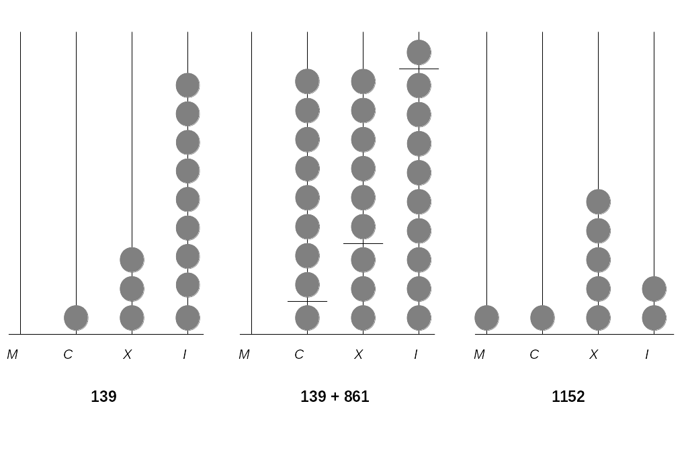
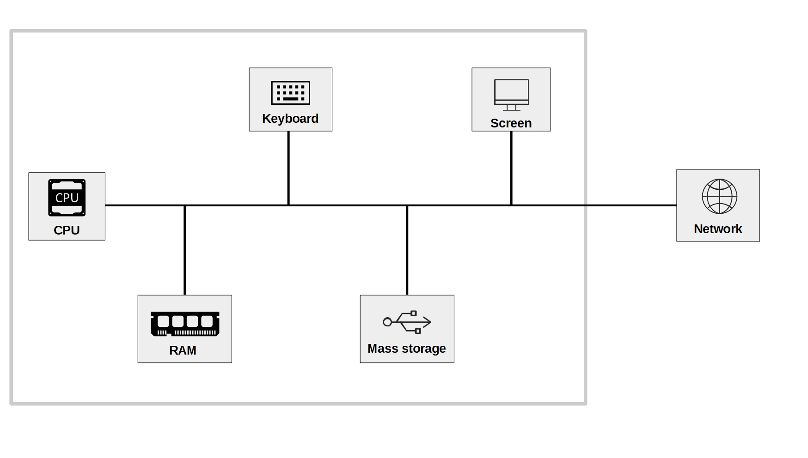
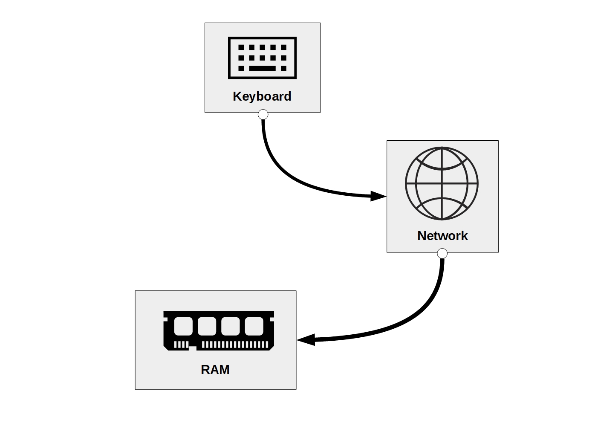
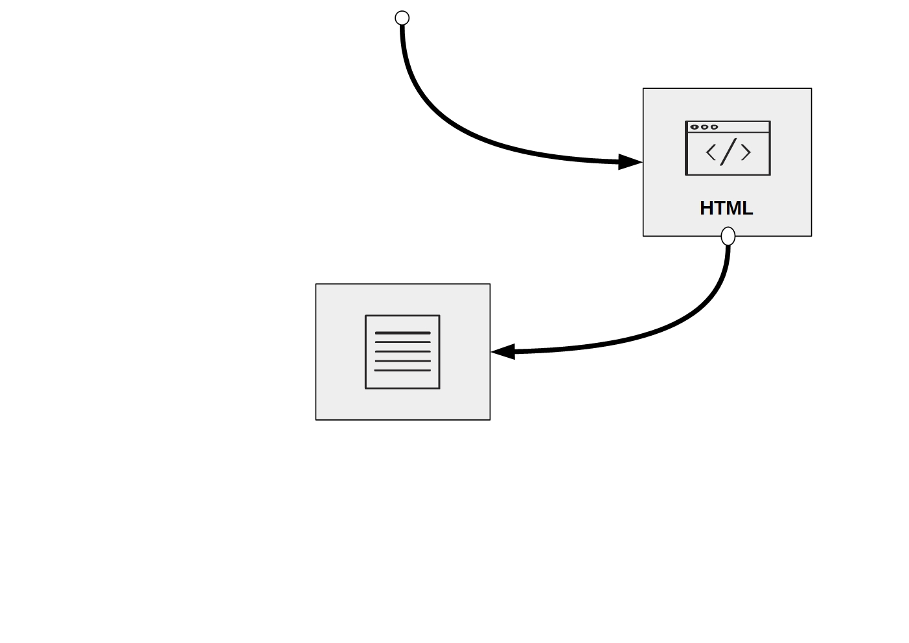
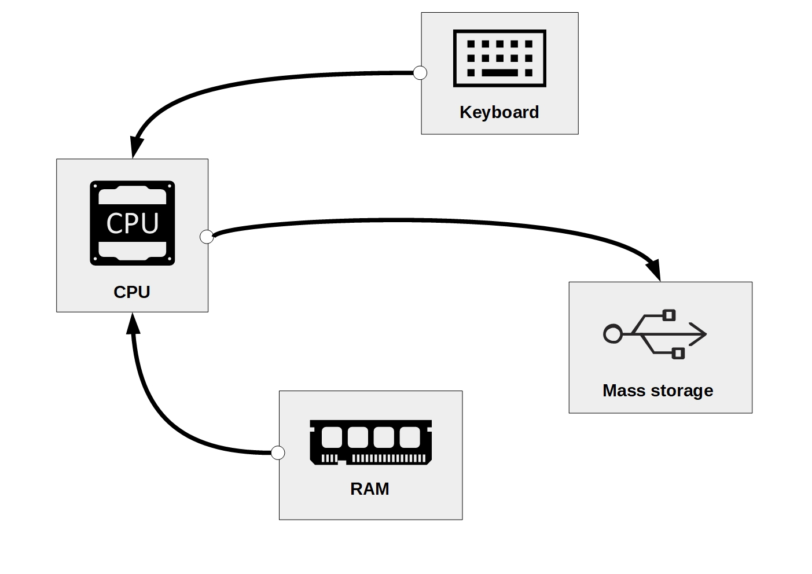

# Data


To better understand the role of data in today's economy and society, we study the usage forms and purposes of data records in human history. In the second step, we look at how a computer processes digital data.

Throughout human history, the recording and storage of data have primarily been motivated by measuring, quantifying, and keeping records of both our social and natural environments. Early on, data recording was related to economic activity and scientific endeavors. The neolithic transition from hunter-gatherer societies to agriculture and settlements (the economic development sometimes referred to as the 'first industrial revolution') came along with a division of labor and more complex organizational structures of society. Because of the change in agricultural food production, more people could be fed. But it also implied that food production would need to follow a more careful planning (e.g., the right time to seed and harvest) and that the produced food (e.g., grains) would partly be stored and not consumed entirely on the spot. It is believed that partly due to these two practical problems, keeping track of time and keeping record of production quantities, neolithic societies started to use signs (numbers/letters) carved in stone or wood [@hogben_1983]. Keeping record of the time and later measuring and keeping record of production quantities in order to store and trade likely led to the first 'data sets'. At the same time the development of mathematics, particularly geometry, took shape.

## Processing data: simple calculations in numeral systems
In order to keep track of calculations with large numbers, humans started to use mechanical aids such as pebbles or shells and later developed the [counting frame ('abacus')](https://en.wikipedia.org/wiki/Abacus).^[See @hogben_1983, Chapter 1 for a detailed account of the abacus' origin and usage.] We can understand the counting frame as a simple mechanical tool to process numbers (data). In order to use the abacus properly, one must agree on a standard regarding what each column of the frame represents, as well as how many beads each column can contain. In other words, one has to define what the *base* of the frame's numeral system is. For example, the Roman numeral system is essentially of base 10, with 'I' representing one, 'X' representing ten, 'C' representing one hundred, and 'M' representing one thousand. Figure \@ref(fig:abacus) illustrates how a counting frame based on this numeral system works (examples are written out in Arabic numbers). The first column on the right represents units of $10^0=1$, the second $10^1=10$, and so forth.

```{r abacus, echo=FALSE, out.width = "80%", fig.align='center', fig.cap= "(ref:capabacus)", purl=FALSE}

```

(ref:capabacus) A simple abacus.

From inspecting Figure \@ref(fig:abacus) we recognize that the columns of the abacus are the positions of the digits, which also denote the power of 10 with which the digit is multiplied: $139=(1 \times 10^{2}) + (3 \times 10^{1}) + (9 \times 10^{0})$. In addition, a base of 10 means that the system is based on 10 different signs (0, 1, ..., 9) with which we distinguish one-digit numbers. Further, we recognize that each column in the abacus has 9 beads (when we agree on the standard that a column without any bead represents the sign 0).

The numeral system with base 10 (the 'decimal system') is what we use to measure/count/quantify things in our everyday life. Moreover, it is what we normally work with in applied math and statistics. However, the simple but very useful concept of the counting frame also works well for numeral systems with other bases. Historically, numeral systems with other bases existed in various cultures. For example, ancient cultures in Mesopotamia used different forms of a sexagesimal system (base 60), consisting of 60 different signs to distinguish 'one-digit' numbers.

Note that this logic holds both ways: if a numeral system only consists of two different signs, it follows that the system has to be of base 2 (i.e., a 'binary system'). As it turns out, this is exactly the kind of numeral system that becomes relevant once we use electronic tools, that is, digital computers, to calculate and process data.


### The binary system

Anything related to electronically processing (and storing) *digital data* has to be built on a binary system. The reason is that a microprocessor (similar to a light switch) can only represent two signs (states): *on and off*. We usually refer to 'off' with the sign '0' and to 'on' with the sign '1'. A numeral system consisting only of the signs 0 and 1 must, thus, be of base 2. It follows that an abacus of this binary system has columns $2^0=1$, $2^1=2$, $2^3=4$, and so forth. Moreover, each column has only one bead (1) or none (0). Nevertheless, we can express all (natural) numbers from the decimal system.^[Representing fractions is much harder in a binary system than representing natural numbers. The reason is fractions such as $1/3=0.333..$ actually constitute an infinite sequence of 0s and 1s. The representation of such numbers in a computer (via so-called 'floating point' numbers) is thus in reality not 100% accurate.] For example, the number 139 which we have expressed with the 'decimal abacus', would be expressed as follows with a base 2 system:

$$(1 \times 2^7) + (1 \times 2^3) + (1 \times 2^1) + (1 \times 2^0) = 139.$$

More precisely, when including all columns of our binary system abacus (that is, including also the columns set to 0), we would get the following:

$$(1 \times 2^7) + (0 \times 2^6) +  (0 \times 2^5) +  (0 \times 2^4) + (1 \times 2^3) + (0 \times 2^2) + (1 \times 2^1) +  (1 \times 2^0)  = 139.$$


Now, compare this with the abacus in the decimal system above. There, we set the third column to 1, the second column to 3, and the first column (from the right) to 9, resulting in 139. If we do the same in the binary system (where we can set each column either to 0 or 1), we get 10001011. That is, the number 139 in the decimal system corresponds to 10001011 in the binary system.

How can a computer know that? To correctly print the three symbols `139` to our computer screen when dealing with the binary expression `10001011`, the computer needs to rely on a predefined mapping between binary coded values and the symbols for (Arabic) decimal numbers like `3`. Since a computer can only understand binary expressions, we have to define a *standard* of how `0`s and `1`s correspond to symbols, colors, etc. that we see on the screen.

Of course, this does not change the fact that any digital data processing is, in the end, happening in the binary system. But in order to avoid having to work with a keyboard consisting only of an on/off (1/0) switch, low-level standards that define how symbols like `3`, `A`, `#`, etc. corresponding expressions in 0s and 1s help us to interact with the computer. It makes it easier to enter data and commands into the computer as well as understand the output (i.e., the result of a calculation performed on the computer) on the screen. A standard defining how our number symbols in the decimal system correspond to binary numbers (again, reflecting the idea of an abacus) can be illustrated in the following table:

Number  | 128 | 64 | 32 | 16 | 8  | 4  | 2  |  1
-----|-----|----|----|----|----|----|----|----
0  = | 0   |  0 | 0  |  0 | 0 |  0 | 0  |  0  
1  = | 0   |  0 | 0  |  0 | 0 |  0 | 0  |  1
2  = | 0   |  0 | 0  |  0 | 0 |  0 | 1  |  0
3  = | 0   |  0 | 0  |  0 | 0 |  0 | 1  |  1
... |    |   |   |  |  |   |   |  
139 = | 1   |  0 | 0  |  0 |  1 |  0 | 1  |  1    


### The hexadecimal system

From the above table, we also recognize that binary numbers can become quite long rather quickly  (have many digits). In Computer Science it is, therefore, quite common to use another numeral system to refer to binary numbers: the *hexadecimal* system. In this system, we have 16 symbols available, consisting of `0`-`9` (used like in the decimal system) and `A`-`F` (for the numbers 10 to 15). Because we have 16 symbols available, each digit represents an increasing power of 16 ($16^{0}$, $16^{1}$, etc.). The decimal number 139 is expressed in the hexadecimal system as follows.

$$(8\times 16^1) +  (11\times 16^0) = 139.$$
More precisely, following the convention of the hexadecimal system used in Computer Science (where `B` stands for `11`), it is:
$$(8\times 16^1) +  (B\times 16^0) = 8B = 139.$$

Hence, `10001011` in the binary system is `8B` in the hexadecimal system and `139` in the decimal system. The primary use of hexadecimal notation when dealing with binary numbers is the more 'human-friendly' representation of binary-coded values. First, it is shorter than the raw binary representation (as well as the decimal representation). Second, with a little bit of practice it is much easier for humans to translate forth and back between hexadecimal and binary notation than it is between decimal and binary. This is because each hexadecimal digit can directly be converted into its four-digit binary equivalent (from looking at the table above): $8=1000$, $B=11=1011$, thus `8B` in hexadecimal notation corresponds to `10001011` (`1000 1011`) in binary coded values.


## Character encoding
Computers are not only used to process numbers but in a wide array of applications, they are used to process text. Most fundamentally, when writing computer code, we type in commands in the form of text consisting of common alphabetical letters. How can a computer understand text if it only understands `0`s and `1`s? Well, again, we have to agree on a certain standard of how `0`s and `1`s correspond to characters/letters. While the conversions of integers between different numeral systems follow all essentially the same principle (~ the idea of a 'digital' abacus), the introduction of standards defining how `0`s and `1`s correspond to specific letters of different human languages is way more arbitrary.

Today, many standards define how computers translate `0`s and `1`s into more meaningful symbols like numbers, letters, and special characters in various natural (human) languages. These standards are called *character encodings*. They consist of what is called a 'coded character set', basically a mapping of unique numbers (in the end in binary coded values) to each character in the set. For example, the classical ASCII (American Standard Code for Information Interchange) assigns the following numbers to the respective characters:


Binary  | Hexadecimal | Decimal | Character
-----|-----|----|----
0011 1111 | 3F   |  63 | `?`  
0100 0001 | 41   |  65 | `A`  
0110 0010 | 62  |  98 | `b`

The convention that `0100 0001` corresponds to `A` is only true by definition of the ASCII character encoding.^[Each character digit is expressed in 1 byte (8 `0`/`1` digits). The ASCII character set thus consists of $2^{8}=256$ different characters.] It does not follow any law of nature or fundamental logic. Somebody simply defined this standard at some point. To have such standards (and widely accept them) is paramount to have functioning software and meaningful data sets that can be used and shared across many users and computers. If we write a text and store it in a file based on the ASCII standard, and that text (which, under the hood, only consists of `0`s and `1`s) is read on another computer only capable of mapping the binary code to another character set, the output would likely be complete gibberish.

In practice, the software we use to write emails, browse the Web, or conduct statistical analyses all have some of these standards built into them. Usually, we do not have to worry about encoding issues when simply interacting with a computer through such programs. The practical relevance of such standards becomes much more relevant once we *store* or *read* previously stored data/computer code.


## Computer code and text files

Understanding the fundamentals of what digital data is and how computers process them is the basis for approaching two core themes of this book: $(I)$ How *data* can be *stored* digitally and be read by/imported to a computer (this will be the main subject of the next chapter), and $(II)$ how we can give instructions to a computer by writing *computer code* (this will be the main topic of the first two exercises/workshops).

In both of these domains, we mainly work with one simple type of document: *text files*. Text files are a collection of characters (with a given character encoding). Following the logic of how binary code is translated forth and back into text, they are a straightforward representation of the underlying information (`0`s and `1`s).  They are used to store both structured data (e.g., tables), unstructured data (e.g., plain texts), or semi-structured data (such as websites). Similarly, they are used to write and store a collection of instructions to the computer (i.e., computer code) in any computer language.

From our everyday use of computers (notebooks, smartphones, etc.), we are accustomed to certain software packages to write text. Most prominently, we use programs like Microsoft Word or email clients (Outlook, Thunderbird, etc.). However, these programs are a poor choice for writing/editing plain text. Such programs tend to add all kinds of formatting to the text and use specific file formats to store formatting information in addition to the raw text. In other words, when using this type of software, we actually do not only write plain text. However, any program to read data or execute computer code expects only plain text. Therefore, we must only use *text editors* to write and edit text files. For example, with [Atom](https://atom.io/) or [RStudio](https://www.rstudio.com/products/RStudio/).


## Data processing basics


By now, we already have a much better understanding of what the `0`s and `1`s stand for, how they might enter the computer, where they might be stored on the computer, and where we might see the output of processing data on a computer.

```{r dsdiagram, echo=FALSE, out.width = "75%", fig.align='center', fig.cap= "(ref:capdsdiagram)", purl=FALSE}
include_graphics("img/cpu_blackbox_white.png")
```

(ref:capdsdiagram) The 'blackbox' of data processing.

This section briefly summarizes the key components of processing data with a computer, following @murrell_2009 (chapter 9, pages 199-204).


### Components of a standard computing environment

Figure \@ref(fig: components) illustrates the key components of a standard computing environment (PC, notebook, tablet, etc.) with which we can process data. A programming language (such as R) allows us to work with these hardware components (i.e., control them) in order to perform our tasks (e.g., cleaning/analyzing data).

```{r components, echo=FALSE, out.width = "60%", fig.align='center', fig.cap= "(ref:components)", purl=FALSE}

```

(ref:components) Basic components of a standard computing environment.


- The component actually *processing* data is the Central Processing Unit (CPU). When using R to process data, R commands are translated into complex combinations of a small set of basic operations which the *CPU* then executes.

- To work with data (e.g., in R), it first must be loaded into the *memory* of our computer. More specifically, into the Random Access Memory (*RAM*). Typically, data is only loaded in the RAM as long as we work with it.

- The *Keyboard* is the typical *input* hardware. It is the key tool we need to interact with the computer in this book (in contrast, in a book on graphic design this would rather be the mouse).

- *Mass Storage* refers to the type of computer memory we use to store data in the long run. Typically this is what we call the *hard drive* or *hard disk*. In these days, the relevant hard disk for storing and accessing data is actually often not the one physically built into our computer but a hard disk 'in the cloud' (built into a server to which we connect over the Internet).

- The *Screen* is our primary output hardware that is key to interact with the computer.

- Today almost all computers are connected to a local *network* which in turn is connected to the Internet. With the rise of 'Big Data' this component has become increasingly relevant to understand, as the key data sources might reside in this network.

Note how understanding the role of these components helps us to capture what happened in the initial example of this book (online survey of the class):

1. You have used your computers to access a website (over the Internet) and used your keyboards to enter data into this website (a Google sheet in that case).

2. My R program has accessed the data you have entered into the Google sheet (again over the Internet), downloaded the data, and loaded it into the RAM on my notebook.

3. There, the data has been processed in order to produce an output (in the form of statistics/plots), which in the end has been shown on the screen.

In the following, we look at a related example (taken from @murrell_2009, Chapter 9), illustrating which hardware components are involved when extracting data from a website.

### Illustration

#### Downloading/accessing a website

First, we use our keyboard to enter the address of a website in the address bar of our browser (i.e., Firefox). The browser then accesses the network and loads the webpage to the RAM. Figure \@ref(fig:htmldownload) illustrates this point.


```{r htmldownload, echo=FALSE, out.width = "40%", fig.align='center', fig.cap= "(ref:htmldownload)", purl=FALSE}

```

(ref:htmldownload) Components involved in visiting a website.


In this simple task of accessing/visiting a website, several parts of data are involved, as shown in \@ref(fig:htmldownloaddata):

1. The string of characters that we type into the address bar of the browser

2. The source code of the website (written in Hypertext markup language, HTML), being sent through the network

3. The HTML document (the website) stored in the RAM

```{r htmldownloaddata, echo=FALSE, out.width = "40%", fig.align='center', fig.cap= "(ref:htmldownloaddata)", purl=FALSE}

```

(ref:htmldownloaddata) Data involved in visiting a website.

What we just did with our browser can also be done via R. First, we tell R to download the webpage and read its source code into RAM:

```{r}
clockHTML <- readLines("https://www.census.gov/popclock/")
```

And we can have a look at the first lines of the web page's source code:

```{r}
head(clockHTML)
```


Note that what happened is essentially the same as displayed in the diagram above. The only difference is that here, we look at the raw code of the webpage, whereas in the example above, we looked at it through our browser. What the browser did, is to *render* the source code, meaning it translated it into the nicely designed webpage we see in the browser window.

#### Searching/filtering the webpage

Having the webpage loaded into RAM, we can now process this data in different ways via R. For example; we can search the source code for the line that contains the part of the website with the world population counter:

```{r}
line_number <- grep('id="world-pop-container"', clockHTML)
```

That is, we ask R on which line in `clockHTML` (the source code stored in RAM) the text `id="world-pop-container"` is and store the answer (the line number) in RAM under the variable name `line_number`.

We can now check on which line the text was found.

```{r}
line_number
```

Again, we can illustrate with a simple diagram which computer components were involved in this task. First, we entered an R command with the keyboard; the CPU is processing it and as a result accesses `clockHTML` in RAM, executes the search, returns the line number, and stores it in a new variable called `line_number` in RAM. In our current R session, we thus now have two 'objects' stored in RAM: `clockHTML` and `line_number`, which we can further process with R.


```{r ramcalc, echo=FALSE, out.width = "40%", fig.align='center', fig.cap= "(ref:ramcalc)", purl=FALSE}
include_graphics("img/script-ramcalc_w.jpg")
```

(ref:ramcalc) Accessing data in RAM, processing it, and storing the result in RAM.


Finally, we can tell R to store the source code of the downloaded webpage on our local hard drive.

```{r eval=FALSE}
writeLines(clockHTML, "clock.html")
```

That means we tell R to access the data stored in `clockHTML` in RAM and write this data to a text file called "clock.html" on our local hard drive (in the current working directory of our R session). The following diagram again illustrates the hardware components involved in these steps.


```{r htmlstore, echo=FALSE, out.width = "40%", fig.align='center', fig.cap= "(ref:htmlstore)", purl=FALSE}

```

(ref:htmlstore) Writing data stored in RAM to a Mass Storage device (hard drive).


