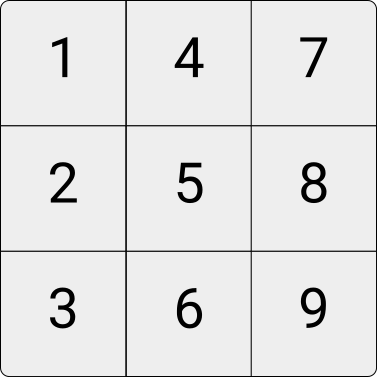
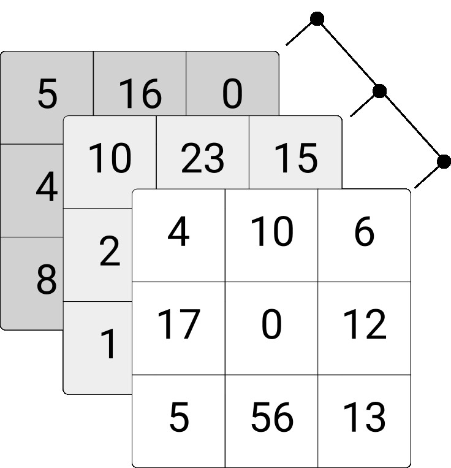
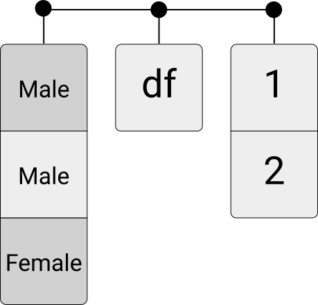

# Data Storage and Data Structures

This chapter bridges the gap between how data is stored on disk and how we work with it in R. You will learn about common file formats for storing data and R's fundamental data structures for representing data in memory.

**Prerequisites:** Understanding of basic R programming concepts from Chapter 2 (variables, vectors, functions) and the data fundamentals from Chapter 3 (binary representation, character encoding).

**What you will learn:**

- How text files store data and what can go wrong (encoding issues)
- The structure of CSV files and how parsers read them
- Units of digital storage (bits, bytes, kilobytes, etc.)
- R's core data structures: vectors, factors, matrices, arrays, data frames, and lists
- When to use each data structure

---

A core part of the practical skills covered in this book has to do with writing, executing, and storing *computer code* (i.e., instructions to a computer in a language that it understands) as well as storing and reading *data*. The way data is typically stored on a computer follows quite naturally from the outlined principles of how computers process data (both technically speaking and in terms of practical applications). Based on a given standard of how `0`s and `1`s are translated into the more meaningful symbols we see on our keyboard, we simply write data (or computer code) to a *text file* and save this file on the hard-disk drive of our computer. Again, what is stored on disk is in the end only consisting of `0`s and `1`s. But, given the standards outlined in the previous chapter, these `0`s and `1`s properly map to characters that we can understand when reading the file again from the disk and looking at its content on our computer screen.

## Unstructured data in text files

In the simplest case, we want to store a text literally. For example, we store the following phrase

`Hello, World!`

in a text file named `helloworld.txt`. Technically, this means that we allocate a block of computer memory to `helloworld.txt` (a 'file' is, in the end, a block of computer memory). The ending `.txt` indicates to the operating system of our computer what kind of data is stored in this file. When clicking on the file's symbol, the operating system will open the file (read it into RAM) with the default program assigned to open `.txt`-files (for example, [VS Code](https://code.visualstudio.com/) or [RStudio](https://www.rstudio.com/)). That is, the *format* of a file says something about how to interpret the `0`s and `1`s. If the text editor displays `Hello World!` as the content of this file, the program correctly interprets the `0`s and `1`s as representing plain text and uses the correct character encoding to convert the raw `0`s and `1`s yet again to symbols that we can read more easily. Similarly, we can show the content of the file in the command-line terminal (here OSX or Linux):


```{bash eval=FALSE}
cat helloworld.txt
```

```{bash echo=FALSE}
cat data/helloworld.txt; echo
```

Or, from the R-console:
```{R eval=FALSE}
system("cat helloworld.txt")
```


However, we can also use a command-line program (here, `xxd`) to display the content of `helloworld.txt` without actually 'translating' it into ASCII characters.^[To be precise, this program shows both the raw binary content as well as its ASCII representation.] That is, we can directly look at what the content looks like as `0`s and `1`s:

```{bash eval = FALSE}
xxd -b helloworld.txt
```

```{bash echo = FALSE}
xxd -b data/helloworld.txt
```

Similarly, we can display the content in hexadecimal values:


```{bash eval = FALSE}
xxd  helloworld.txt
```

```{bash echo = FALSE}
xxd  data/helloworld.txt
```


Next, consider what happens when character encodings (introduced in Chapter 3) cause practical problems. The text file `hastamanana.txt` was written and stored with a different character encoding than what our system expects. When looking at the content, assuming the now common UTF-8 encoding, the content seems a little odd:

```{bash eval=FALSE}
cat hastamanana.txt
```

```
## Hasta Ma?ana!
```


We see that it is a short phrase written in Spanish. Strangely, it contains the character `?` in the middle of a word. The occurrence of special characters in unusual places of text files is an indication of using the wrong character encoding to display the text. Let's check what the file's encoding is.


```{bash eval = FALSE}
file -b hastamanana.txt
```


```{bash echo = FALSE}
file -b data/hastamanana.txt
```

This tells us that the file is encoded with ISO-8859 ('Latin1'), a character set for several Latin languages (including Spanish). Knowing this, we can check what the content looks like when we change the encoding to UTF-8 (which then properly displays the content on the screen)^[Note that changing the encoding in this way only works well if we know what the original encoding of the file is (i.e., the encoding used when the file was initially created). While the `file` command above simply tells us what the original encoding was, it has to make an educated guess in most cases (as the original encoding is often not stored as metadata describing a file). Encoding detection algorithms analyze byte patterns and character frequencies to infer the most likely encoding—a process that is inherently heuristic and can fail for short or ambiguous files.]:

```{bash eval = FALSE}
iconv -f iso-8859-1 -t utf-8 hastamanana.txt | cat
```

```{bash echo = FALSE}
iconv -f iso-8859-1 -t utf-8 data/hastamanana.txt | cat
```


When working with data, we must therefore ensure that we apply the proper standards to translate the binary coded values into a character/text representation that is easier to understand and work with. In recent years, much more general (or even 'universal') standards have been developed and adopted worldwide, particularly UTF-8. Thus, if we deal with recently generated data sets, we usually can expect that they are encoded in UTF-8, independent of the data's country of origin. However, when working on a research project with slightly older data sets from different sources, encoding issues still occur quite frequently. It is thus crucial to understand the origin of the problem early on when the data seem to display weird characters. Encoding issues are among the most basic problems that can occur when importing data.

So far, we have only looked at very simple examples of data stored in text files, essentially only containing short phrases of text. Nevertheless, the most common formats of storing and transferring data (CSV\index{CSV}, XML\index{XML}, JSON\index{JSON}, etc.) build on exactly the same principle: characters in a text-file. The difference between such formats and the simple examples above is that their content is structured in a very specific way. That is, on top of the lower-level conversion of `0`s and `1`s into characters/text, we add another standard, a data format, giving the data more *structure*, making it even simpler to interpret and work with the data on a computer. Once we understand how data is represented at a low level (the topic of the previous chapter), it is much easier to understand and distinguish different forms of storing structured data.


## Structured data formats

As nicely pointed out by @murrell_2009, the most commonly used software today is designed in a very 'user-friendly' way, leading to situations in which we as users are 'told' by the computer what to do (rather than the other way around). A prominent symptom of this phenomenon is that specific software is automatically assigned to open files of specific formats, so we don't have to bother about what the file's format actually is but only have to click on the icon representing the file.

However, if we actually want to engage seriously with a world driven by data, we have to go beyond the habit of simply clicking on (data-)files and let the computer choose what to do with it. Since most common formats to store data are in essence text files (in research contexts usually in ASCII or UTF-8 encoding), a good way to start engaging with a data set is to look at the raw text file containing the data in order to get an idea of how the data is structured.

> **In Practice:** Which file format should you use? The answer depends on your audience and purpose. **CSV** is the universal exchange format—any software can read it, making it ideal for sharing data with collaborators who may use Python, Stata, or Excel. **RDS**\index{RDS (R Data Single)} (R's native format) preserves all R metadata (factor levels, date formats) and is much faster for large files—use it for your own intermediate files. **Excel (.xlsx)** is useful when sharing with non-programmers who expect to open files in a spreadsheet. For archival and replication packages, data repositories like ICPSR recommend CSV because it's human-readable and software-independent, ensuring your data remains accessible decades from now.

For example, let's have a look at the file `ch_gdp.csv`. When opening the file in a text editor we see the following:

```{}
year,gdp_chfb
1980,184
1985,244
1990,331
1995,374
2000,422
2005,464
```

At first sight, the file contains a collection of numbers and characters. Having a closer look, certain structural features become apparent. The content is distributed over several rows, with each row containing a comma character (`,`). Moreover, the first row seems systematically different from the following rows: it is the only row containing alphabetical characters, all the other rows contain numbers. Rather intuitively, we recognize that the specific way in which the data in this file is structured might, in fact, represent a table with two columns: one with the variable `year` describing the year of each observation (row), the other with the variable `gdp_chfb` with numerical values describing another characteristic of each observation/row (we can guess that this variable is somehow related to GDP and CHF/Swiss francs).

The question arises, how do we work with this data? Recall that it is simply a text file. All the information stored in it is displayed above. How could we explain to the computer that this is a table with two columns containing two variables describing six observations? We would have to come up with a sequence of instructions/rules (i.e., an algorithm) of how to distinguish columns and rows when all that a computer can do is sequentially read one character after the other (more precisely one `0`/`1` after the other, representing characters).

This algorithm could be something along the lines of:

  1.  Start with an empty table consisting of one cell (1 row/column).
  2.  While the end of the input file is not yet reached, do the following:
    Read characters from the input file, and add them one-by-one to the current cell.
      If you encounter the character '`,`', ignore it, create a new field, and jump to the new field.
      If you encounter the end of the line, create a new row and jump to the new row.

Consider the usefulness of this algorithm. It would certainly work quite well for the particular file we are looking at. But what if another file we want to read data from does not contain any '`,`' but only '`;`'? We would have to tweak the algorithm accordingly. Hence, again, it is extremely useful if we can agree on certain standards of how data structured as a table/matrix is stored in a text file.

### CSVs and fixed-width format

Incidentally, the example we are looking at here is in line with such a standard, i.e., Comma-Separated Values\index{Comma-Separated Values (CSV)} (CSV, therefore `.csv`). The CSV format is formalized in [RFC 4180](https://datatracker.ietf.org/doc/html/rfc4180), which defines the precise rules for delimiters, quoting, and line endings. In technical terms, the simple algorithm outlined above is a CSV *parser*\index{Parser}—a software component that analyzes text according to formal rules and converts it into a structured format the computer can work with. A CSV parser is a software component which takes a text file with CSV standard structure as input and builds a data structure in the form of a table (represented in RAM). If the input file does not follow the agreed-on CSV standard, the parser will likely fail to properly 'parse' (read/translate) the input.

CSV files are very often used to transfer and store data in a table-like format. They essentially are based on two rules defining the structure of the data: commas delimit values/fields in a row and the end of a line indicates the end of a row.^[In addition, if a field contains itself a comma (the comma is part of the data), the field needs to be surrounded by double-quotes (`"`). If a field contains double-quotes it also has to be surrounded by double-quotes, and the double quotes in the field must be preceded by an additional double-quote.]

The comma is clearly visible when looking at the raw text content of `ch_gdp.csv`. However, how does the computer know that a line is ending? By default most programs to work with text files do not show an explicit symbol for line endings but instead display the text on the next line. Under the hood, these line endings are, however, non-printable characters. We can see this when investigating `ch_gdp.csv` in the command-line terminal (via `xxd`):

```{bash eval = FALSE, purl=FALSE}
xxd ch_gdp.csv
```

```{bash echo = FALSE}
xxd data/ch_gdp.csv
```


When comparing the hexadecimal values with the characters they represent on the right side, we recognize that a full stop (`.`) is printed to the output right before every year. Moreover, when inspecting the hexadecimal output, we recognize that this `.` corresponds to `0a`. The hexadecimal value `0a` represents the *line feed* (LF) character—the standard line ending on Unix and macOS systems. Windows systems use a two-character sequence: *carriage return* followed by *line feed* (`0d 0a`, or CR-LF). Because these control characters do not correspond to printable symbols, they are replaced by `.` in the `xxd` output.^[The same applies to other sequences of `0`s and `1`s that do not correspond to a printable character. The terminology comes from typewriters: "carriage return" moved the print head back to the left margin, while "line feed" advanced the paper by one line.]

While CSV files have become a very common way to store 'flat'/table-like data in plain text files, several similar formats can be encountered in practice. Most commonly they either use a different delimiter\index{Delimiter} (for example, tabs/white space) to separate fields in a row, or fields are defined to consist of a fixed number of characters (so-called fixed-width formats\index{Fixed-width Format}). In addition, various more complex standards to store and transfer digital data are widely used to store data. Particularly in the context of web data (data stored and transferred online), files storing data in these formats (e.g., XML, JSON, YAML\index{YAML}, etc.) are in the end, just plain text files. However, they contain a larger set of special characters/delimiters (or combinations of these) to indicate the structure of the data stored in them.


## Units of information/data storage

The question of how to store digital data on computers also raises the question of storage capacity. Because every type of digital data can, in the end, only be stored as `0`s and `1`s, it makes perfect sense to define the smallest unit of information in computing as consisting of either a `0` or a `1`. We call this basic unit a *bit* (from *bi*nary dig*it*; abbrev. 'b'). Recall that the decimal number `139` corresponds to the binary number `10001011`. To store this number on a hard disk, we require a capacity of 8 bits or one *byte* (1 byte = 8 bits; abbrev. 'B'). Historically, one byte was sufficient to encode a single character of text: standard ASCII uses only 7 bits (128 characters), leaving one bit unused, while extended character sets use all 8 bits (256 characters). In modern systems, 4 bytes (or 32 bits) are called a *word*. The following figure illustrates this point.

```{r bitbyteword, echo=FALSE, out.width = "75%", fig.align='center', fig.cap= "(ref:capbitbyteword)", purl=FALSE}
include_graphics("img/bitbyte.png")
```
(ref:capbitbyteword) Illustration of bits and bytes. A bit is the smallest unit of digital information, holding either 0 or 1. Eight bits form one byte—the amount of memory traditionally needed to store a single character. Here, the byte `10001011` represents the decimal number 139.


Bigger units for storage capacity usually build on bytes:\index{Kilobyte}\index{Megabyte}\index{Gigabyte}\index{Terabyte}

 - $1 \text{ kilobyte (KB)} = 1000^{1}   \text{ bytes} = 1{,}000 \text{ bytes}$
 - $1 \text{ megabyte (MB)} = 1000^{2}   \text{ bytes} = 1{,}000{,}000 \text{ bytes}$
 - $1 \text{ gigabyte (GB)} = 1000^{3}   \text{ bytes}$
 - $1 \text{ terabyte (TB)} = 1000^{4}   \text{ bytes}$
 - $1 \text{ petabyte (PB)} = 1000^{5}   \text{ bytes}$
 - $1 \text{ exabyte (EB)} = 1000^{6}    \text{ bytes}$
 - $1 \text{ zettabyte (ZB)} = 1000^{7}  \text{ bytes}$

These are the *SI (decimal) prefixes*, which use powers of 1000. However, because computers work in binary, you may also encounter *binary prefixes* that use powers of 1024: kibibyte (KiB) = $2^{10}$ = 1,024 bytes, mebibyte (MiB) = $2^{20}$ = 1,048,576 bytes, and so on. In practice, the two systems are often conflated—for example, RAM is typically measured in binary units (a "16 GB" memory stick actually has $16 \times 2^{30}$ bytes), while hard drive manufacturers use decimal units. This ambiguity means a "1 TB" hard drive holds about 931 GiB of usable space.

$1 ZB = 1000000000000000000000\text{ bytes} = 1 \text{ billion terabytes} = 1 \text{ trillion gigabytes}.$


## Data structures and data types in R

So far, we have focused on how data is stored on the hard disk. That is, we discovered how `0`s and `1`s correspond to characters (using specific standards: character encodings), how a sequence of characters in a text file is a useful way to store data on a hard disk, and how specific standards are used to structure the data in a meaningful way (using special characters). When thinking about how to store data on a hard disk, we are usually concerned with how much space (in bytes) the data set needs, how well it is transferable/understandable, and how well we can retrieve information from it. All of these aspects go into the decision of what structure/format to choose etc.

However, none of these considers how we actively work with the data. For example, when we want to sum up the `gdp_chfb` column in `ch_gdp.csv` (the table example above), do we actually work within the CSV data structure? The answer is usually no.

Recall from the basics of data processing that data stored on the hard disk is loaded into RAM to work with (analysis, manipulation, cleaning, etc.). The question arises as to how data is structured in RAM? That is, what data structures/formats are used to work with the data actively?

We distinguish two basic characteristics:

  1. Data **types**\index{Data Type}: integers\index{Integer}; real numbers ('numeric values'\index{Numeric}, floating point numbers\index{Floating Point}); text ('string'\index{String}, 'character values'\index{Character}).
  2. Basic **data structures**\index{Data Structure} in RAM:
    - *Vectors*
    - *Factors*
    - *Arrays/matrices*
    - *Lists*
    - *Data frames* (very `R`-specific)

Depending on the data structure/format stored in on the hard disk, the data will be more or less usefully represented in one of the above structures in RAM. For example, in the `R` language it is quite common to represent data stored in CSVs on disk as *data frames* in RAM. Similarly, it is quite common to represent a more complex format on disk, such as JSON, as a nested list in RAM.

Importing data from the hard disk (or another mass storage device) into RAM in order to work with it in `R` essentially means reading the sequence of characters (in the end, of course, `0`s and `1`s) and mapping them, given the structure they are stored in, into one of these structures for representation in RAM.^[In the chapter on data gathering and data import, we will cover this crucial step in detail.]


### Data types

From the previous chapters, we know that digital data (`0`s and `1`s) can be interpreted in different ways depending on the *format* it is stored in. Similarly, data loaded into RAM can be interpreted differently by R depending on the data *type*. Some operators or functions in R only accept data of a specific type as arguments. For example, we can store the numeric values `1.5` and `3` in the variables `a` and `b`, respectively.

```{r}
a <- 1.5
b <- 3
```

R interprets this data as type `double` (class 'numeric'; a 'double precision floating point number'):

```{r}
typeof(a)
class(a)
```

Given that these bytes of data are interpreted as numeric, we can use operators (here: math operators) that can work with such types:

```{r}
a + b
```

If we define `a` and `b` as follows, R will interpret the values stored in `a` and `b` as text (`character`).

```{r}
a <- "1.5"
b <- "3"
```

```{r}
typeof(a)
class(a)
```


Now the same line of code as above will result in an error:

```{r error=TRUE}
a + b
```

The reason is that an operator `+` expects numeric or integer values as arguments. When importing data sets with many different variables (columns), it is thus necessary to ensure that each column is interpreted in the intended way. That is, we have to make sure R is assigning the right type to each of the imported variables. Usually, this is done automatically. However, with large and complex data sets, the automatic recognition of data types when importing data can fail when the data is not perfectly cleaned/prepared (in practice, this is very often the case).

> **Common Error:** Numbers stored as text (e.g., `"42"` instead of `42`) cause silent failures in calculations. Check types with `typeof()` or `class()`. Convert with `as.numeric()`: `as.numeric("42")` returns `42`. Watch for "NA introduced by coercion" warnings—these indicate conversion failures.


### Data structures

For now, we have only looked at individual bytes of data. An entire data set can consist of gigabytes of data containing text and numeric values. How can such collections of data values be represented in R? Here, we look at the main data structures implemented in R. All of these structures will play a role in some of the hands-on exercises.

#### Vectors
Vectors are collections of values of the same type. They can contain either all numeric values or all character values. We will use the following symbol to refer to vectors.

```{r numvec, echo=FALSE, out.width = "10%", fig.align='center', fig.cap= "(ref:capnumvec)", purl=FALSE}

```

(ref:capnumvec) Icon representing a numeric vector in R. Vectors are the most basic data structure—one-dimensional sequences of values of the same type. A numeric vector contains only numbers (integers or floating-point values).

For example, we can initiate a character vector containing the names of persons:
```{r}
persons <- c("Andy", "Brian", "Claire")
persons
```

And we can initiate a numeric vector with the age of these persons:
```{r}
ages <- c(24, 50, 30)
ages
```


#### Factors
Factors\index{Factor} are sets of categories. Thus, the values come from a fixed set of possible values.

```{r factor, echo=FALSE, out.width = "10%", fig.align='center', fig.cap= "(ref:capfactor)", purl=FALSE}

```

(ref:capfactor) Icon representing a factor in R. Factors store categorical data with a fixed set of possible values (called levels). They are useful for variables like gender, country, or treatment group where values come from predefined categories.

For example, we might want to initiate a factor that indicates the gender of a number of people.

```{r}
gender <- factor(c("Male", "Male", "Female"))
gender
```


#### Matrices/Arrays

Matrices are two-dimensional collections of values; arrays\index{Array} are higher-dimensional collections of values of the same type. For an illustration, consider the following $3\times3$ integer matrix and the $3\times3\times3$ integer array.

```{r matrix, warning=FALSE, message=FALSE, echo=FALSE, out.width="20%",fig.align='center', fig.cap= "(ref:capmatrix)", purl=FALSE}

```

(ref:capmatrix) Icon representing a matrix in R. Matrices are two-dimensional arrays where all elements must be of the same type. They are commonly used for mathematical operations, storing numeric data in rows and columns.

```{r array, warning=FALSE, message=FALSE, echo=FALSE, out.width="30%", fig.align='center', fig.cap= "(ref:caparray)", purl=FALSE}

```

(ref:caparray) Icon representing a three-dimensional array in R. Arrays extend matrices to three or more dimensions. Like matrices, all elements must be of the same type. A 3×3×3 array can be thought of as three stacked 3×3 matrices.

In R, we can initiate a three-row/three-column integer matrix as follows.

```{r}
my_matrix <- matrix(1:9, nrow = 3)
my_matrix

```


Similarly, we can initiate a three-dimensional array via the `array()`-function as shown below. Note that instead of defining only the numbers of rows (columns), you need to define the number of elements in each dimension via the `dim`-parameter.


```{r}
my_array <- array(1:27, dim = c(3,3,3))
my_array

```


We can access parts of matrices and arrays via indexing implemented with the `[]`-syntax. For example, select a particular row, column, or individual element of a matrix.

```{r}
# Select the first row
my_matrix[1,]

# Select the second column
my_matrix[,2]

# Select the value in the second column, third row.
my_matrix[3,2]

```
Following the same syntax, we can access specific parts of an array. Note, though, that we need to consider the correct number of dimensions of the corresponding array object. In the example above, we have generated a three-dimensional array, hence there needs to be three parts within the `[]`.

```{r}

# Select the first rows
my_array[1,,]

# Select the "third matrix"
my_array[,,3]

# Select the "last" element in the array
my_array[3,3,3]

```


#### Data frames, tibbles, and data tables
Data frames are the typical representation of a (table-like) data set in R. Each column can contain a vector of a given data type (or a factor), but all columns need to be of identical length. Thus in the context of data analysis, we would say that each row of a data frame contains an observation, and each column contains a characteristic of this observation.

```{r df, echo=FALSE, out.width = "25%", fig.align='center', fig.cap= "(ref:capdf)", purl=FALSE}
include_graphics("img/dataframe.png")
```


(ref:capdf) Icon representing a data frame in R. Data frames are the standard structure for tabular data, similar to a spreadsheet or database table. Each column can hold a different data type (numeric, character, factor), but all columns must have the same number of rows. Most data analysis in R begins with data in this format.

The original `data.frame` implementation in base R has performance limitations when working with large datasets: subsetting rows is slow because it copies the entire data structure, and common operations like grouping and aggregation are inefficient.^[In the early days of R, this was not an issue because datasets that are rather large by today's standards (in the gigabytes) could not have been handled properly by normal computers anyway (due to a lack of RAM).] These days there are new implementations of the data frame concept in R provided by different packages, which aim at making data processing based on 'data frames' faster. One is called `tibbles`,  implemented and used in the `tidyverse` packages. The other is called `data.table`\index{data.table}, implemented in the `data.table`-package. In this book, we will encounter primarily classical `data.frame` and `tibble` (however, there will also be some hints to tutorials with `data.table`). In any case, once we understand data frames in general, working with `tibble` and `data.table` is quite easy because functions that accept classical data frames as arguments also accept those newer implementations.

Here is how we define a data frame in R, based on the examples of vectors and factors shown above.

```{r}
df <- data.frame(person = persons, age = ages, gender = gender)
df

```


#### Lists

Unlike data frames, lists\index{List} can contain different data types in each element. Moreover, they even can contain different data structures of *different dimensions* in each element. For example, a list could contain different other lists, data frames, and vectors with differing numbers of elements.

```{r list, echo=FALSE, out.width = "25%", fig.align='center', fig.cap= "(ref:caplist)", purl=FALSE}

```

(ref:caplist) Icon representing a list in R. Lists are the most flexible data structure—they can contain elements of different types and different dimensions. A single list can hold vectors, matrices, data frames, and even other lists. This flexibility makes lists useful for storing complex results (like regression output) or nested data structures.

This flexibility can easily be demonstrated by combining some of the data structures created in the examples above:

```{r}
my_list <- list(my_array, my_matrix, df)
my_list
```

### Choosing the right data structure

With several data structures available, how do you decide which to use? Table \@ref(tab:datastructures) provides a quick reference guide.

```{r datastructures, echo=FALSE, message=FALSE}
library(kableExtra)

ds_table <- data.frame(
  Structure = c("Vector", "Factor", "Matrix", "Array", "Data frame", "List"),
  Dim. = c("1D", "1D", "2D", "nD", "2D", "1D"),
  Types = c("Same", "Same", "Same", "Same", "Mixed", "Mixed"),
  `Typical use` = c(
    "Single variable, calculations",
    "Categorical with fixed levels",
    "Math operations, numeric tables",
    "Multi-dimensional numeric data",
    "Tabular datasets (rows = obs.)",
    "Complex/nested data, model output"
  ),
  check.names = FALSE
)

knitr::kable(ds_table,
             caption = "R data structures: characteristics and typical uses.",
             booktabs = TRUE,
             align = c("l", "c", "c", "l")) |>
  kable_styling(latex_options = c("hold_position"),
                font_size = 10,
                full_width = FALSE) |>
  column_spec(1, width = "2cm") |>
  column_spec(2, width = "1cm") |>
  column_spec(3, width = "1.2cm") |>
  column_spec(4, width = "4.5cm")
```

**When to use each:**

- **Vector**: Your default for any sequence of values of the same type. Use for calculations, storing variable values, or as building blocks for other structures.
- **Factor**: Use when a variable has a fixed set of categories (e.g., gender, country, treatment group). Factors ensure only valid values are used and control ordering in plots and tables.
- **Matrix**: Use when you need mathematical operations on two-dimensional numeric data (matrix multiplication, linear algebra). Also useful when all your data is numeric and you need fast operations.
- **Array**: Use for multi-dimensional numeric data—rare in typical data analysis but common in image processing (height × width × color channels) or time series across multiple dimensions.
- **Data frame**: Your default for datasets. Use whenever you have observations (rows) with multiple variables (columns) of potentially different types. This is where you'll spend most of your time.
- **List**: Use when nothing else fits—storing results from statistical models, combining objects of different types/sizes, or representing hierarchical data structures like JSON.

> **In Practice:** When importing data for analysis, you'll almost always want a data frame (or tibble). When a function returns complex results (like `lm()` for regression), it typically returns a list. When doing mathematical operations, matrices are fastest. When in doubt, start with a data frame—you can always convert later.

## Key Takeaways

- Data can be stored in different file formats: text-based (CSV, JSON, XML), binary (RDS, RData), and spreadsheet formats (Excel)—each with trade-offs in portability, size, and ease of use.
- Understanding data structures is essential: vectors hold elements of one type, matrices extend vectors to two dimensions, and arrays extend to arbitrary dimensions.
- Data frames are the workhorse of data analysis in R—they store rectangular data with different column types and are the foundation for most tidyverse operations.
- Lists are the most flexible data structure, capable of holding elements of different types and dimensions, making them useful for complex data and function outputs.
- Modern implementations like `tibble` (tidyverse) and `data.table` improve on classic data frames for working with large datasets.

> **AI Support Prompt:** To choose the right data structure for your task, describe your situation to an AI assistant:
>
> `I need to store [describe your data, e.g., 'survey responses with different variable types' or 'a 3D array of image pixels' or 'results from multiple regression models']. Which R data structure should I use, and why? Show me how to create it.`
>
> This helps you develop intuition for when to use vectors, matrices, data frames, or lists.

> **AI Support Prompt:** To practice working with data structures, try:
>
> `Give me 3 exercises on [vectors / data frames / lists / matrices] in R, ranging from easy to challenging. Include examples of subsetting, modifying, and combining these structures.`
>
> Hands-on practice is the best way to internalize how R's data structures work.

> **AI Support Prompt:** If you're confused about type coercion or unexpected behavior, ask:
>
> `I created a vector with c(1, 2, 'three') and all values became character strings. Can you explain R's type coercion rules? What's the hierarchy of types, and why does R behave this way?`
>
> Understanding coercion prevents subtle bugs that arise from mixing types.

## Further Reading

- @wickham_cetinkaya_grolemund_2023: Chapters 12-13 of *R for Data Science* cover logical vectors and numbers in depth. Available at https://r4ds.hadley.nz/.
- @wickham_adv_2019: Part I of *Advanced R* provides a comprehensive treatment of R's data structures. Available at https://adv-r.hadley.nz/.
- @murrell_2009: *Introduction to Data Technologies* offers detailed explanations of file formats and data storage concepts.

## Exercises

1. **Vectors and types**: Create a vector that contains the values `1, 2, "three", 4`. What type is the resulting vector? Why? What happens when you try to compute `sum()` on this vector?

2. **Matrix operations**: Create a 3×3 matrix with the values 1 through 9. Then:
   a) Extract the element in the second row, third column.
   b) Extract the entire second row.
   c) Compute the sum of each column using `colSums()`.

3. **Building data frames**: Create a data frame called `students` with the following information:
   - `name`: "Alice", "Bob", "Carol"
   - `age`: 22, 25, 23
   - `major`: "Economics", "Statistics", "Economics"

   Then add a new column called `graduated` with values `FALSE`, `TRUE`, `FALSE`.

4. **Working with lists**: Create a list that contains: (1) a numeric vector of length 5, (2) a character vector of length 3, and (3) a 2×2 matrix. Practice accessing each element using both `[[]]` and `$` notation (after naming your list elements).

5. **File formats**: You need to share a dataset with a colleague who uses Python. Another colleague uses Stata. What file format(s) would you recommend for each, and why? What format would you use to save your work for your own future use in R?


