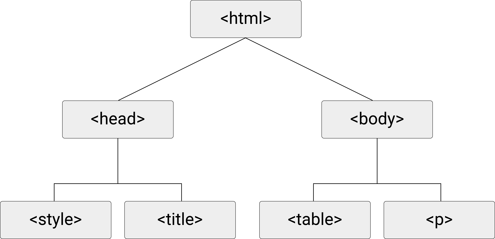
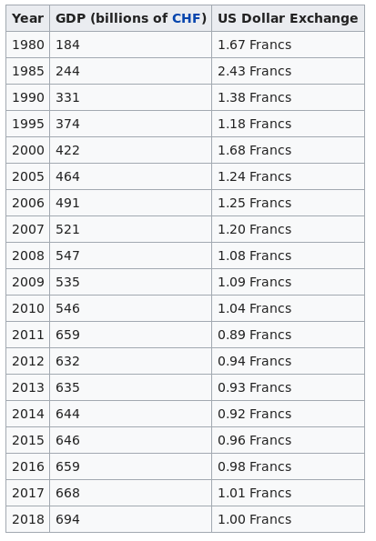

# (PART) Data Types {-}

# High-Dimensional Data

Not all data fits neatly into rows and columns. This chapter introduces you to data formats designed for complex, hierarchical, and nested data structures—the kind of data you will frequently encounter when working with web-based data sources or APIs. Understanding these formats is essential for modern data work, where much of the interesting data lives on the internet.

**Prerequisites:** This chapter builds on Chapter 3 (Digital Data Fundamentals), particularly the concepts of text encoding and file formats, as well as Chapter 4's discussion of data structures.

**What you will learn:**

- How XML and JSON represent hierarchical data structures
- The syntax and logic behind these web data formats
- How HTML relates to XML and why it matters for web scraping
- Practical skills for reading and navigating these formats in R

---

So far, we have only looked at data structured in a flat/table-like representation (e.g. CSV files). In applied econometrics/statistics, it is common to only work with data sets stored in such format. Data manipulation, filtering, aggregation, etc. presupposes data in a table-like format. Hence, storing data in this format makes perfect sense.

As we observed in the previous chapter, the CSV structure has some disadvantages when representing more complex data in a text file. This is in particular true if the data contains nested observations (i.e., hierarchical structures). While a representation in a CSV file is theoretically possible, it is often far more practical to use other formats for such data. CSV representations of hierarchical data tend to be less intuitive to read and introduce redundancy, as identical values must be repeated across rows. The following code block illustrates this point for a data set on two families ([@murrell_2009], p. 116).

```
father mother  name     age  gender
               John      33  male
               Julia     32  female
John   Julia   Jack       6  male
John   Julia   Jill       4  female
John   Julia   John jnr   2  male
               David     45  male
               Debbie    42  female
David  Debbie  Donald    16  male
David  Debbie  Dianne    12  female

```

From simply looking at the data, we can make the best guess which observations belong together (are one family). However, the implied hierarchy is not apparent at first sight. While it might not matter too much that several values have to be repeated several times in this format, given that this data set is so small, the repeated values can become a problem when the data set is much larger. Each time `John` is repeated in the `father` column, we use 4 bytes of memory. Suppose millions of people are in this data set, and we have to transfer this data set very often over a computer network. In that case, these repetitions can become quite costly (as we would need more storage capacity and network resources).

Issues with complex/hierarchical data\index{Hierarchical Data} (with several observation types), intuitive human readability (self-describing), and efficiency in storage, as well as transfer, are all of great importance on the Web. In the context of web technologies, several data formats have been put forward to address these issues. Here, we discuss the two most prominent of these formats: *Extensible Markup Language (XML)*\index{XML}—a flexible markup language that uses customizable tags to structure data hierarchically—and *JavaScript Object Notation (JSON)*\index{JSON}—a lightweight format using attribute-value pairs and arrays that has become the standard for web APIs.

## Deciphering XML
Before going into more technical details, let us figure out the basic logic behind the XML format by simply looking at some raw example data. Consider a small dataset containing GDP information for several countries.^[The example files `gdp_data.csv` and `gdp_data.xml` are available in the book's data folder.] In a simple CSV-type format, the data might look like this:

```
DATASET: World Bank GDP Indicators
UNIT: Billions USD
YEAR: 2023
country,gdp,population_millions
Switzerland,885.1,8.8
Germany,4456.1,84.5
United States,27357.8,334.9
Japan,4212.9,124.5
```


Below, the same data is displayed in XML format. Note that in both cases, the data is simply stored in a text file. However, it is stored in a format that imposes a different *structure* on the data.


```
<?xml version="1.0"?>
<gdp_data>
<dataset>World Bank GDP Indicators</dataset>
<unit>Billions USD</unit>
<year>2023</year>
<country name="Switzerland" gdp="885.1" population="8.8" />
<country name="Germany" gdp="4456.1" population="84.5" />
<country name="United States" gdp="27357.8" population="334.9" />
<country name="Japan" gdp="4212.9" population="124.5" />
</gdp_data>
```

What features does this format have? What is its logic? The XML data structure becomes more apparent by using indentation and code highlighting.


```{xml}
<?xml version="1.0"?>
<gdp_data>
  <dataset>World Bank GDP Indicators</dataset>
  <unit>Billions USD</unit>
  <year>2023</year>
  <country name="Switzerland" gdp="885.1" population="8.8" />
  <country name="Germany" gdp="4456.1" population="84.5" />
  <country name="United States" gdp="27357.8" population="334.9" />
  <country name="Japan" gdp="4212.9" population="124.5" />
</gdp_data>
```

First, note how special characters are used to define the document's structure. We notice that `<` and `>`, containing some text labels, play a key role in defining the structure. These building blocks are called 'XML tags'\index{XML Tags}. In the absence of a schema that constrains them, we are free to choose what tags we want to use. In essence, we can define them ourselves to most properly describe the data. Moreover, the example data reveals the flexibility of XML to depict hierarchical structures.

The actual content we know from the CSV-type example above is nested between the '`gdp_data`'-tags, indicating what the data is about.
```{xml}
<gdp_data>
  ...
</gdp_data>
```

Comparing the actual content between these tags with the CSV-type format above, we recognize that there are two principal ways to link variable names to values.
```{xml}
  <dataset>World Bank GDP Indicators</dataset>
  <unit>Billions USD</unit>
  <year>2023</year>
  <country name="Switzerland" gdp="885.1" population="8.8" />
  <country name="Germany" gdp="4456.1" population="84.5" />
  <country name="United States" gdp="27357.8" population="334.9" />
  <country name="Japan" gdp="4212.9" population="124.5" />
```

One way is to define opening and closing XML-tags with the variable name and surround the value with them, such as in `<unit>Billions USD</unit>`. Another way is to encapsulate values within one tag by defining tag attributes such as in `<country name="Switzerland" gdp="885.1" population="8.8" />`. In many situations, both approaches can make sense. For example, the way the country data is encoded in the example uses the tag-attributes approach:

```{xml}
  <country name="Switzerland" gdp="885.1" population="8.8" />
  <country name="Germany" gdp="4456.1" population="84.5" />
  <country name="United States" gdp="27357.8" population="334.9" />
  <country name="Japan" gdp="4212.9" population="124.5" />
```

We could rewrite this by only using XML tags and no attributes:

```{xml}
<countries>
  <country>
    <name>Switzerland</name>
    <gdp>885.1</gdp>
    <population>8.8</population>
  </country>
  <country>
    <name>Germany</name>
    <gdp>4456.1</gdp>
    <population>84.5</population>
  </country>
  <country>
    <name>United States</name>
    <gdp>27357.8</gdp>
    <population>334.9</population>
  </country>
  <country>
    <name>Japan</name>
    <gdp>4212.9</gdp>
    <population>124.5</population>
  </country>
</countries>
```

As long as we follow the basic XML syntax, both versions are valid, and XML parsers can read them equally well.

Note the key differences between storing data in XML format in contrast to a flat, table-like format such as CSV:

 - Storing the actual data and metadata in the same file is straightforward (as the above example illustrates). Storing metadata in the first lines of a CSV file (such as in the example above) is theoretically possible. However, by doing so, we break the CSV syntax, and a CSV-parser would likely break down when reading such a file (recall the simple CSV parsing algorithm). More generally, we can represent much more *complex (multi-dimensional)* data in XML files than what is possible in CSVs. In fact, the nesting structure can be arbitrarily complex as long as the XML syntax is valid.
 - The XML syntax is largely self-explanatory and thus both *machine-readable and human-readable*. That is, not only can parsers/computers more easily handle complex data structures, but human readers can intuitively understand what the data is all about by looking at the raw XML file.

A potential drawback of storing data in XML format is that variable names (in tags) are repeated. Since each tag consists of a couple of bytes, this can be highly inefficient compared to a table-like format where variable names are only defined once. Typically, this means that if the data at hand is only two-dimensional (observations/variables), a CSV format makes more sense.

## Deciphering JSON

In many web applications, JSON serves the same purpose as XML^[While older systems often supported both formats, JSON has become the dominant format for modern web APIs due to its simpler syntax and native compatibility with JavaScript.]. An obvious difference between the two conventions is that JSON does not use tags but attribute-value pairs to annotate data. The following code example shows how the same data can be represented in XML or in JSON:

*XML:*
```{xml}
<person>
  <firstName>John</firstName>
  <lastName>Smith</lastName>
  <age>25</age>
  <address>
    <streetAddress>21 2nd Street</streetAddress>
    <city>New York</city>
    <state>NY</state>
    <postalCode>10021</postalCode>
  </address>
  <phoneNumber>
    <type>home</type>
    <number>212 555-1234</number>
  </phoneNumber>
  <phoneNumber>
    <type>fax</type>
    <number>646 555-4567</number>
  </phoneNumber>
  <gender>
    <type>male</type>
  </gender>
</person>

```

*JSON:*
```{json}
{"firstName": "John",
  "lastName": "Smith",
  "age": 25,
  "address": {
    "streetAddress": "21 2nd Street",
    "city": "New York",
    "state": "NY",
    "postalCode": "10021"
  },
  "phoneNumber": [
    {
      "type": "home",
      "number": "212 555-1234"
    },
    {
      "type": "fax",
      "number": "646 555-4567"
    }
  ],
  "gender": {
    "type": "male"
  }
}

```


Note that despite the syntax differences, the similarities regarding the nesting structure are visible in both formats. For example, `postalCode` is embedded in `address`, `firstname` and `lastname` are at the same nesting level, etc. The following figure, illustrating the nesting structure further illustrates this point. The basic logic of which element belongs to which higher-level element—as displayed in the tree diagram—is encoded in both the JSON and the XML excerpts shown above.

> **In Practice:** Where do researchers and analysts actually encounter JSON and XML? Most commonly through **web APIs**\index{API (Application Programming Interface)} (Application Programming Interfaces). Data providers across many domains offer APIs that return data in JSON format: the Federal Reserve Economic Data (FRED) API\index{FRED API} provides economic time series; the World Bank API offers development indicators; Twitter/X and Reddit APIs enable social media research; company databases like Crunchbase provide business intelligence data. In academic research, @cavallo2016billion describe how the Billion Prices Project built automated systems to collect millions of online prices daily—work that fundamentally relies on understanding web data formats. Whether you work in market research, policy analysis, academic social science, or business analytics, learning to work with JSON and APIs opens access to vast real-time data sources that would be impossible to collect manually.


```{r xmltree, echo=FALSE, fig.align="center", out.width="99%", fig.cap="(ref:xmltree)"}
include_graphics("img/hierarch_data.png")
```

(ref:xmltree) Tree diagram illustrating the hierarchical structure of XML/JSON data. A `person` element contains `firstName`, `lastName`, `age`, and `address` as child elements. The `address` element is itself nested, containing `streetAddress`, `city`, `state`, and `postalCode`. This nesting structure allows complex, multi-level data to be represented in a self-describing format.


Both XML and JSON are predominantly used to store rather complex, multi-dimensional data. Because they are both human- and machine-readable, these formats are often used to transfer data between applications and users on the Web. Therefore, we encounter these data formats particularly often when we collect data from online sources. Moreover, in the economics/social science context, large and complex data sets ('Big Data') often come along in these formats exactly because of the increasing importance of the Internet as a data source for empirical research in these disciplines.


## Parsing XML and JSON in R

As in the case of CSV-like formats, there are several parsers in R that we can use to read XML and JSON data. The following examples are based on the example code shown above (the two text-files `persons.json` and `persons.xml`). We use the `xml2`\index{xml2} package to parse XML:


```{r eval=FALSE, purl=FALSE }
# load packages
library(xml2)

# parse XML, represent XML document as R object
xml_doc <- read_xml("persons.xml")
xml_doc

```


```{r echo=FALSE, purl=FALSE }
# load packages
library(xml2)

# parse XML, represent XML document as R object
xml_doc <- read_xml("data/persons.xml")
xml_doc

```


For JSON, we use `jsonlite`\index{jsonlite}:

```{r eval=FALSE, purl=TRUE}
# load packages
library(jsonlite)

# parse the JSON-document shown in the example above
json_doc <- fromJSON("persons.json")

# check the structure
str(json_doc)

```

```{r echo=FALSE, purl=FALSE}
# load packages
library(jsonlite)

# parse the JSON document shown in the example above
json_doc <- fromJSON("data/persons.json")

# check the structure
str(json_doc)

```

> **Common Error:** JSON parsing fails silently or with cryptic errors when the input is malformed. Common issues include: trailing commas after the last element (valid in JavaScript but not JSON), single quotes instead of double quotes for strings, and unquoted keys. Use `jsonlite::validate()` to check JSON syntax before parsing. Also note that `fromJSON()` and `read_json()` behave slightly differently—`fromJSON()` is more flexible with simplification options.


## HTML
Recall the data processing example in which we investigated how a webpage can be downloaded, processed, and stored via the R command line. The code constituting a webpage is written in *HyperText Markup Language (HTML)*\index{HTML}—the standard markup language for documents displayed in web browsers, which uses predefined tags to structure content into headings, paragraphs, links, tables, and other elements. Thus, HTML is predominantly designed for visual display in browsers, not for storing data. HTML is used to annotate content and define the hierarchy of content in a document to tell the browser how to display ('render') this document on the computer screen. Interestingly for us, its structure is very close to that of XML. However, the tags that can be used are strictly pre-defined and are aimed at explaining the structure of a website.

While not intended as a format to store and transfer data, HTML documents (webpages) have de facto become a very important data source for many data science applications both in industry and academia.^[The systematic collection and extraction of data from such web sources (often referred to as Web Data Mining) goes well beyond the scope of this book.] Note how the two key concepts of computer code and digital data (both residing in a text file) are combined in an HTML document. From a web designer's perspective, HTML is a tool to design the layout of a webpage (and the resulting HTML document is rather seen as *code*). On the other hand, from a data scientist's perspective, HTML gives the data contained in a webpage (the actual content) a certain degree of structure which can be exploited to systematically extract the data from the webpage. In the context of HTML documents/webpages as data sources, we thus also speak of 'semi-structured data': a webpage can contain an HTML table (structured data) but likely also contains just raw text (unstructured data). In the following, we explore the basic syntax of HTML by building a simple webpage.

### Write a simple webpage with HTML
We start by opening a new text-file in RStudio (File->New File->TextFile). On the first line, we tell the browser what kind of document this is with the `<!DOCTYPE>` declaration set to `HTML`. In addition, the content of the whole HTML document must be put within `<html>` and `</html>`, which represents the 'root' of the HTML document.  In this, you already recognize the typical (XML-like) annotation style in HTML  with so-called HTML tags, starting with `<` and ending with `>` or `/>` in the case of the closing tag, respectively. What is defined between two tags is either another HTML tag or the actual content. An HTML document usually consists of two main components: the head (everything between `<head>` and `</head>` ) and the body. The head typically contains metadata describing the whole document, like the title of the document: `<title>hello, world</title>`. The body (everything between `<body>` and `</body>`) contains all kinds of specific content: text, images, tables, links, etc. In our very simple example, we add a few words of plain text. We can now save this text document as `mysite.html` and open it in a web browser.

```{html}
     <!DOCTYPE html>

     <html>
         <head>
             <title>hello, world</title>
         </head>
         <body>
             <h2> hello, world </h2>
         </body>
     </html>
```

From this example, we can learn a few important characteristics of HTML:

1. It becomes apparent how HTML is used to annotate/'mark up' data/text (with tags) to define the document's content, structure, and hierarchy. Thus if we want to know what the title of this document is, we have to look for the `<title>`-tag.
2. This systematic structuring adheres to the nesting principle: 'head' and 'body' are nested within the 'HTML' document, at the same hierarchy level. The 'title' is defined within the 'head', one level lower. In other words, the 'title' is a component of the 'head,' which is a component of the 'html' document. This logic of encapsulating one part in another holds true in all correctly defined HTML documents. This is the type of 'data structure' mentioned above, which can be used to extract specific parts of data from HTML documents in a systematic manner.
3. We recognize that HTML code essentially expresses what is what in a document (note the similarity of the concept to storing data in XML). HTML code does not contain explicit instructions like programming languages, telling the computer what to do. If an HTML document contains a link to another website, all that is needed, is to define (with HTML tag `<a href=...>`) that this is a link. We do not have to explicitly express something like "if the user clicks on a link, then execute this and that...".
     
What to do with the HTML document is thus in the hands of the person who works with it. From the data scientist's perspective, we need to know how to traverse and exploit the structure of an HTML document in order to systematically extract the specific content/data that we are interested in. We thus have to learn how to tell the computer (with R) to extract a specific part of an HTML document. And to do so, we have to acquire a basic understanding of the nesting structure implied by HTML (essentially the same logic as with XML).

One way to think about an HTML document is to imagine it as a tree-diagram, with `<html>..</html>` as the 'root', `<head>...</head>` and `<body>...</body>` as the 'children' of `<html>..</html>` (and 'siblings' of each other), `<title>...</title>` as the child of `<head>...</head>`, etc. Figure \@ref(fig:html) illustrates this point.

```{r html, echo=FALSE, fig.align="center", out.width="95%", fig.cap="(ref:caphtml)"}

```

(ref:caphtml) Tree diagram showing the Document Object Model (DOM) structure of an HTML webpage. HTML documents are hierarchical: the root `<html>` element contains `<head>` (metadata, title) and `<body>` (visible content). The body contains elements like headings (`<h1>`), paragraphs (`<p>`), and tables (`<table>`)—each potentially containing further nested elements. Web scraping extracts data by navigating this tree structure.

The illustration of the nested structure can help to understand how we can instruct the computer to find/extract a specific part of the data from such a document. In the following exercise, we revisit the example shown in the chapter on data processing to do exactly this.


### Two ways to read a webpage into R

In this example—adapted from @matter_webmining2025—we look at [Wikipedia's Economy of Switzerland page](https://en.wikipedia.org/wiki/Economy_of_Switzerland), which contains the table depicted in Figure \@ref(fig:swiss).

```{r swiss, echo=FALSE, out.width = "85%", fig.align='center', fig.cap= "(ref:capswiss)"}

```

(ref:capswiss) Screenshot of a data table from Wikipedia's Economy of Switzerland page, showing GDP figures across years. This example demonstrates a common web scraping scenario: extracting structured tabular data embedded within an HTML document. Source: https://en.wikipedia.org/wiki/Economy_of_Switzerland.


As in the example shown in the data processing chapter ('world population clock'), we first tell R to read the lines of text from the HTML document that constitutes the webpage.

```{r}
URL <- "https://en.wikipedia.org/wiki/Economy_of_Switzerland"
swiss_econ <- readLines(URL)
```

And we can check if everything worked out well by having a look at the first lines of the web page's HTML code (truncated here for display):

```{r}
# Show first 6 lines, truncated to 70 characters each
head(substr(swiss_econ, 1, 70))
```

The next thing we do is to look at how we can filter the webpage for certain information. For example, we search in the source code for the line that contains the part of the webpage with the table showing data on the Swiss GDP:

```{r}
line_number <- grep('US Dollar Exchange', swiss_econ)
```

Recall: we ask R on which line in `swiss_econ` (the source code stored in RAM) the text `US Dollar Exchange` is and store the answer (the line number) in RAM under the variable name `line_number`.

Then, we check on which line the text was found.

```{r}
line_number
```

Knowing that the R object `swiss_econ` is a character vector (with each element containing one line of HTML code as a character string), we can look at this particular line (truncated for display):

```{r}
# Show the line, truncated to 70 characters
substr(swiss_econ[line_number], 1, 70)
```

Note that this rather primitive approach is ok to extract a chunk of code from an HTML document, but it is far from practical when we want to extract specific parts of data (the actual content, not including HTML code). So far, we have completely ignored that the HTML tags give some structure to the data in this document. That is, we simply have read the entire document line by line, not making a difference between code and data. The approach to filter the document could have equally well been taken for a plain text file.

If we want to exploit the structure given by HTML, we need to *parse* the HTML when reading the webpage into R. We can do this with the help of functions provided in the `rvest` package\index{rvest}:


```{r echo=FALSE}
# install package if not yet installed
# install.packages("rvest")

# load the package
library(rvest)
```


```{r eval=FALSE, purl=FALSE}
# install package if not yet installed
# install.packages("rvest")

# load the package
library(rvest)
```

After loading the package, we read the webpage into R, but this time using a function that parses the HTML code:

```{r}
# parse the webpage, show the content
swiss_econ_parsed <- read_html(URL)
swiss_econ_parsed
```

Now we can easily separate the data/text from the HTML code. For example, we can extract the HTML table containing the data we are interested in as data frames.

We use XPath\index{XPath} to locate the table.^[Note that XPath expressions are specific to a website's HTML structure and may need updating if the site changes its layout. Wikipedia's structure, for example, is periodically modified.]

```{r}
XPATH <- "//*[@id='mw-content-text']/div/table[2]"
tab_node <- html_node(swiss_econ_parsed, xpath = XPATH)
tab <- html_table(tab_node)
tab
```

## A Note on Web Scraping Ethics

Before scraping\index{Web Scraping} data from websites, it is important to consider both legal and ethical aspects:

- **Check the robots.txt file**: Most websites have a `robots.txt` file (e.g., `https://example.com/robots.txt`) that specifies which parts of the site can be accessed by automated tools. Respect these guidelines.

- **Review terms of service**: Many websites explicitly prohibit automated data collection in their terms of service. Violating these terms could have legal consequences.

- **Be respectful with request rates**: Making too many requests too quickly can overload servers and may get your IP address blocked. Add delays between requests (e.g., using `Sys.sleep()` in R).

- **Consider the data's intended use**: Just because data is publicly visible doesn't mean it's freely available for any purpose. Personal data, in particular, may be protected by privacy regulations like GDPR.

- **Attribute your sources**: When using scraped data in research or publications, properly cite the original source.

When in doubt, consider whether an official API is available, or contact the website owner to request permission.

## Static vs. Dynamic Web Pages

The web scraping examples above work well for *static* web pages—pages where the HTML document sent by the server contains all the data you want to extract. However, many modern websites are *dynamic*: the initial HTML is minimal, and the actual content is loaded later using JavaScript\index{JavaScript}.

**What changes with JavaScript-rendered sites?**

When you visit a dynamic website in your browser, the following happens:

1. The server sends a basic HTML document with JavaScript code
2. Your browser executes the JavaScript
3. The JavaScript fetches additional data (often as JSON from an API)
4. The JavaScript builds the HTML content and inserts it into the page

Tools like `rvest::read_html()` only perform step 1—they download the initial HTML but do not execute JavaScript. If you scrape a JavaScript-heavy site with `read_html()`, you may get an HTML document that contains little more than `<div id="app"></div>` and a lot of JavaScript code, but none of the actual data you see in your browser.

**What stays the same?**

From a data handling perspective, the underlying data formats remain identical:

- The data itself is typically still JSON, transmitted from server to browser
- Once extracted, you parse and process it the same way as any other JSON
- The hierarchical structure concepts (nesting, key-value pairs) apply exactly as before

The challenge is *access*, not *format*. The data exists; it's just loaded dynamically rather than embedded in the initial HTML.

**Practical implications:**

1. **Check for APIs first**: If a website loads data via JavaScript, that data often comes from an API endpoint. Using your browser's developer tools (Network tab), you can sometimes identify these API calls and access the data directly—often more reliably than scraping HTML.

2. **Use browser automation when necessary**: Tools like Selenium (available in R via `RSelenium`\index{RSelenium}) can control a real browser, execute JavaScript, and then extract the rendered HTML. This is slower and more complex but handles dynamic content.

3. **Recognize the symptoms**: If your scraped HTML contains placeholders like "Loading..." or empty containers, or if `html_table()` returns empty results for a table you can clearly see in your browser, JavaScript rendering is likely the cause.

> **In Practice:** Before attempting complex browser automation, always check whether the website offers an official API. APIs provide structured data (usually JSON) directly, without the fragility of scraping rendered HTML. Many organizations that previously required scraping now offer APIs—check the website's developer documentation or footer links.

## Key Takeaways

- XML and JSON are two major formats for storing hierarchical and nested data—both are text-based and widely used for web data and APIs.
- XML uses tags (like HTML) to define structure; JSON uses a simpler syntax with key-value pairs and is often preferred for web applications.
- HTML shares a similar tag-based syntax with XML, making the parsing techniques transferable—though HTML5 is technically not XML-compliant, understanding nested element structures is essential for web scraping.
- XPath provides a powerful way to navigate XML and HTML documents and extract specific elements.
- R packages like `xml2`, `jsonlite`, and `rvest` make it straightforward to read and parse these formats into R data structures.

> **AI Support Prompt:** To practice parsing JSON or XML, paste your data and ask:
>
> `I have this JSON structure: [paste your JSON]. How do I parse this in R using jsonlite and extract [specific field or nested element]? Show me step by step.`
>
> Complex nested structures can be confusing—AI assistants can help you navigate them and write the correct extraction code.

> **AI Support Prompt:** If you're struggling with XPath expressions, try:
>
> `I'm trying to extract [describe what you want, e.g., 'all paragraph text inside div elements with class article'] from an HTML document. What XPath expression should I use? Explain how each part of the expression works.`
>
> XPath syntax can be cryptic. AI can help you build expressions and understand the logic behind them.

> **AI Support Prompt:** When working with APIs, get help designing your request:
>
> `I want to get data from [API name or type of data]. Can you help me understand how to construct an API request in R using httr2? What parameters do I typically need?`
>
> Understanding API request patterns makes it much easier to work with new data sources.

## Further Reading

- @matter_webmining2025: *An Introduction to Web Mining: with Applications in R* covers web data formats, web scraping, and text mining with practical R examples.
- @munzert_etal2014: *Automated Data Collection with R* provides comprehensive coverage of web scraping and working with web data formats.
- @nolan_lang2014: *XML and Web Technologies for Data Sciences with R* offers in-depth treatment of XML, JSON, and related technologies.
- The `rvest` package vignette provides practical examples for web scraping: https://rvest.tidyverse.org/.

## Exercises

1. **JSON structure**: Consider the following JSON representing a person:
   ```json
   {"name": "Alice", "age": 30, "cities": ["Zurich", "Geneva"]}
   ```
   Write R code using `jsonlite` to parse this JSON string and extract: (a) the person's name, (b) their age, and (c) the second city in their list.

2. **XML vs JSON**: You are designing a data format to store information about books (title, author, year, chapters with titles). Sketch out how this data would look in both XML and JSON formats. Which format do you find more readable? Which would result in a smaller file size?

3. **HTML tables**: Visit a Wikipedia page of your choice that contains a data table (e.g., a list of countries, sports statistics, etc.). Using `rvest`, write R code to:
   a) Read the HTML page
   b) Extract the table as a data frame
   c) Display the first few rows

4. **Web scraping ethics**: Before scraping data from a website, what three things should you check or consider? Find a website's `robots.txt` file and explain what it tells you about what can be scraped.

5. **XML parsing with R**: The file `data/library.xml` contains information about books in a library. Using the `xml2` package:
   a) Read the XML file and display its structure
   b) Extract all book titles as a character vector
   c) Find the book(s) published after 2015
   d) Extract all unique author names across all books

6. **XPath practice**: Using the file `data/company.xml`, write XPath expressions to extract:
   a) All employee names in the company
   b) Only employees in the "Marketing" department
   c) Employees with a salary greater than 80000
   d) The names of all departments

7. **Nested JSON**: The file `data/survey_responses.json` contains survey data with nested structures. Using `jsonlite`:
   a) Read the JSON file and explore its structure
   b) Extract all respondent ages as a vector
   c) Create a data frame with columns: id, age, major, hours_online
   d) Find which statistical software packages are used across all respondents

8. **Format conversion**: Take the GDP data from `data/gdp_data.csv` and:
   a) Read it into R as a data frame
   b) Convert it to a nested list structure suitable for JSON
   c) Write it out as a JSON file using `jsonlite::write_json()`
   d) Compare the file sizes of the CSV and JSON versions

9. **Designing hierarchical data**: A university wants to store information about its courses, including: department, course code, course name, instructor(s), schedule (day, time, room), and enrolled students (name, student ID, major). Design this data structure in both XML and JSON formats. Consider: Which format better handles the multiple instructors and students? How would you query "all courses taught on Monday"?


