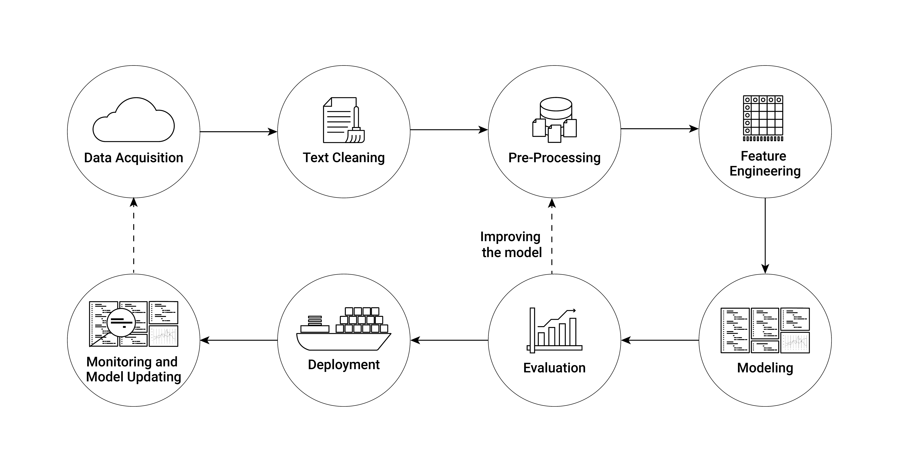
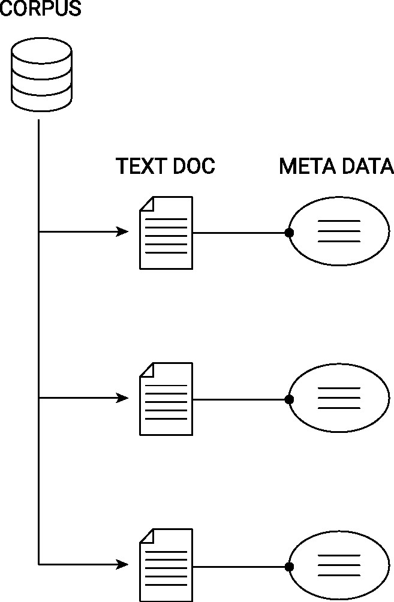

# Text Data
*This chapter has been contributed by Aurélien Sallin ([ASallin](https://github.com/ASallin))*.

Text data represents one of the most abundant yet challenging data types in modern research. From social media posts to legal documents, from news articles to survey responses, text surrounds us—but unlike numbers in a spreadsheet, text requires substantial preparation before it can be analyzed quantitatively. This chapter introduces the fundamental concepts and tools for working with text as data.

**Prerequisites:** Familiarity with basic R programming (Chapter 2) and data structures (Chapter 4). Some exposure to regular expressions is helpful but not required.

**What you will learn:**

- The structure of text data and the concept of a "corpus"
- How to use regular expressions to find patterns in text
- The text preprocessing pipeline: tokenization, stopword removal, and stemming
- How to create and work with document-term matrices
- Basic text analysis techniques including word frequencies and sentiment analysis

---

## Introduction
Text as data has become increasingly available in the past years, especially following the spread of the Internet and the digitization of text sources. We are now able to make use of literary texts, analyses (such as financial analyses), reactions on social media (e.g., sentiment analysis as inputs to financial prediction models), political discourses, judicial decisions, central bank minutes, etc. in quantitative analyses. 

The main challenge of working with text is that text is **unstructured**\index{Text Data}. Structured data are coded in such a way that variables can be directly used for analysis without too much loss of content. For instance, data are coded into binary or categorical variables in order to reduce and summarize the complexity of the information. In contrast, with unstructured text data, information is not easily summarized and requires a substantial amount of preparation in order to be used for analysis. 

Working with text data can be broken down into eight steps, as depicted in the figure below. (1) Data acquisition: text data are collected from disparate sources. Examples are web scraping, digitization of old administrative records, collection of tweets through an API, etc. (2) Text cleaning and (3) text preprocessing require the analyst to prepare the text in such a way that text information can be read by a statistical software. Most importantly, cleaning and preprocessing are important to remove all the "noise" from the text and get the relevant information. For instance, in many applications, punctuation and so-called "stopwords" are removed. At this step, text information is "transformed" into a matrix. (4) Feature engineering is the process of using domain knowledge to extract features (characteristics, properties, attributes) from raw data. The extraction of the relevant and meaningful features from the text must make sense and be informative in light of the context. 

In this introduction, we will focus on steps (1) to (4). Steps (5) to (8) are beyond the scope of a data handling course, as they involve modeling the text through machine learning or other statistical methods, deploying these models for statistical analyses (for research or industrial purpose), and the plausibilization of such models.

> **In Practice:** Text analysis has transformed research across the social sciences and business. @gentzkow2019text provide a comprehensive survey of using "text as data"—from measuring media slant to analyzing corporate communications. Political scientists study parliamentary debates and campaign speeches; sociologists analyze social media discourse; marketing researchers mine customer reviews; and organizations monitor brand sentiment in real time. Financial firms analyze earnings call transcripts, while researchers study historical documents—court records, newspapers, diplomatic correspondence—to understand long-run social and political change. The techniques in this chapter form the foundation for all such applications.

```{r nlppipeline, echo=FALSE, out.width = "100%", fig.align='center', fig.cap= "(ref:nlppipeline)", purl=FALSE}

```
(ref:nlppipeline) The Natural Language Processing (NLP) pipeline for text analysis. Raw text data progresses through several stages: (1) data acquisition from sources like web scraping or APIs; (2) cleaning to remove noise; (3) preprocessing including tokenization, stopword removal, and stemming; (4) feature engineering to extract meaningful attributes. Later stages involve model selection, training, and deployment—topics beyond this introductory chapter.


## Text Analysis with Quanteda

In R, steps (2) to (4) can be performed using the `quanteda`\index{quanteda} or the `tidytext`\index{tidytext} package—both available on CRAN\index{CRAN}. The `tidytext` package works very well with the packages of the `tidyverse` family, such as `dplyr` or `tidyr`, converting text to and from tidy formats (one token per row). This approach is covered extensively in @silge_robinson_2017.

The package `quanteda` [@benoit_etal2018] remains, however, the most comprehensive package for text analysis in R. It allows R users to perform all the preprocessing steps very easily and provides all the functions necessary for preprocessing, visualization, and even statistical analyses of the corpus. The `quanteda` ecosystem includes companion packages `quanteda.textstats` for computing text statistics and `quanteda.textplots` for visualization.   

```{r packages, echo=FALSE, message=FALSE, warning=FALSE}
library(tidytext)
library(quanteda)
library(readtext)
library(stringr)
library(quanteda.textstats)
library(quanteda.textplots)
```

\

### From raw text to corpus: step (1)
The base, raw material, of quantitative text analysis is a **corpus**\index{Corpus}. A corpus is, in NLP\index{NLP (Natural Language Processing)}, *a structured collection of text documents organized for analysis*. A corpus can be made up of everything from newspapers, novels, recipes, radio broadcasts to television shows, movies, and tweets. Typically, the data structure of a corpus organizes the individual text documents (e.g., tweets) as individual components of a larger object (the entire corpus), whereby each document-component is linked to its corresponding metadata-component (containing data describing the characteristics of a document; e.g., the timestamp a tweet was posted, the author of the tweet, etc.). The following figure illustrates this data structure for a generic text corpus.

```{r corpus, echo=FALSE, out.width = "55%", fig.align='center', fig.cap= "(ref:corpus)", purl=FALSE}

```
(ref:corpus) Conceptual illustration of a text corpus data structure. A corpus organizes multiple text documents (e.g., articles, tweets, speeches) together with their metadata (e.g., author, date, source). Each document is linked to its corresponding metadata, enabling analysis across documents while preserving context about each text's origin and characteristics.


In the specific case of `quanteda`, a corpus is a **a data frame consisting of a character vector for documents, and additional vectors for document-level variables**. In other words, a corpus is a data frame that contains, in each row, a text document, and additional columns with the corresponding metadata about the text.

Text in a raw form is often found in a `.json` format (after web scraping), in a `.csv` format, or in simple `.txt` files. The first task is then to import the text data in R and transform it as a corpus. For this introduction, we will use a corpus of US presidential inauguration speeches—a standard example in introductory text analysis. It contains the inauguration discourses of the first five US presidents. This example dataset is bundled with the `readtext` package. The text is contained in a csv file, and is loaded with the `read.csv()` function. The metadata of this corpus is the year of the inauguration and the name of the president taking office.

```{r inauguration}
# set path
path_data <- system.file("extdata/", package = "readtext")

# import csv file
dat_inaug <- read.csv(paste0(path_data, "/csv/inaugCorpus.csv"))
names(dat_inaug)

# Create a corpus
corp <- corpus(dat_inaug, text_field = "texts")
print(corp)

# Look at the metadata in the corpus using `docvars`
docvars(corp)

# In quanteda, metadata can be handled like data frames.
docvars(corp, field = "Century") <-
  floor(docvars(corp, field = "Year") / 100) + 1
```

\

#### Analyzing text the traditional way: regular expressions
A first basic step to extract simple information from written information is to use traditional **regular expressions**\index{Regular Expression}. Regular expressions are a flexible syntax used to detect and describe patterns in strings. They are used not only in R, but in other software as well. For a practical introduction, see @kim_regex. Regular expressions in R can be used with `base` R, but also with more practical packages such as `stringr`\index{stringr} and `stringi`.

> **Common Error:** In R, backslashes in regular expressions must be doubled: use `"\\d"` to match a digit, not `"\d"`. This is because R first interprets the string (consuming one backslash), then the regex engine interprets what remains. A common symptom is "unrecognized escape" errors or patterns that don't match as expected.

In the following example, we use regular expressions to count the number of occurrences of the word *peace* in the inaugural discourses using the command `str_count()` from `stringr`. In an additional step, we count the number of occurrences of the pronoun "I". Finally, we program a regular expression to extract the first five words of each discourse. 

```{r regex}

# Count occurrences of the word "peace"
str_count(corp, "[Pp]eace")

# Count occurrences of the words "peace" OR "war"
str_count(corp, "[Pp]eace|[Ww]ar")

# Count occurrences of the first person pronoun "I"
# This counts all "I" - not what we want:
str_count(corp, "I")
# This counts "I" followed by a space (better, but still misses "I" before punctuation):
str_count(corp, "[I][[:space:]]")

# Extract the first five words of each discourse
# ^ anchors at the start; (){5} matches the group 5 times
# \S+ = non-space chars; \s = space; [[:punct:]] = punctuation
str_extract(corp, "^(\\S+\\s|[[:punct:]]|\\n){5}")
```

\

### From corpus to tokens: steps (2) and (3)
Once we have a corpus, we want to extract the substance of the text. This means, in `quanteda` language, that we want to extract **tokens**\index{Tokenization}, i.e. to isolate the elements that constitute a corpus in order to quantify them in a second phase. Basically, tokens are expressions that form the building blocks (both grammatically and from a meaning perspective) of the text. In many quantitative text analyses, researchers want to remove all words that are unlikely to be informative of a document's content. This means that punctuation as well as so-called "stopwords"\index{Stopwords} (e.g. "and", "a", "the", "or", "but", etc.) are removed. 

In our example, we first create tokens from each document of our corpus. For instance, the first document of the corpus is made out of `r length(tokens(corp)[[1]])` tokens. Most of these tokens are not relevant. So we proceed by removing punctuation and stopwords. `quanteda` has a built-in list of stopwords in English. We also want to remove the words *fellow* and *citizens*, as those words appear in each document. 

Finally, not only are tokens for single words interesting, but also tokens of combined words (called "N-grams"\index{N-gram}). N-grams are a sequence of tokens from already tokenized text objects. Usually, these N-grams are generated in all possible combinations of tokens. For instance, if the expression "not friendly" appears often, we might lose valuable information when building tokens that do not account for the co-occurrence of these terms. We identify bigrams with the word "never".

```{r tokens}
toks <- tokens(corp)
head(toks[[1]], 20)

# Remove punctuation
toks <- tokens(corp, remove_punct = TRUE)
head(toks[[1]], 20)

# Remove stopwords (showing first 20 of 175 English stopwords)
head(stopwords("en"), 20)
toks <- tokens_remove(toks, pattern = stopwords("en"))
head(toks[[1]], 20)

# We can keep words we are interested in
tokens_select(toks, pattern = c("peace", "war", "great*", "unit*"))

# Remove "fellow" and "citizen"
toks <- tokens_remove(toks, pattern = c(
    "fellow*",
    "citizen*",
    "senate",
    "house",
    "representative*",
    "constitution"
))

# Build N-grams (onegrams, bigrams, and 3-grams)
toks_ngrams <- tokens_ngrams(toks, n = 2:3)

# Keep n-grams that contain "never"
toks_neg_bigram_select <- tokens_select(toks_ngrams,
                                        pattern = phrase("never_*"))
head(toks_neg_bigram_select[[1]], 30)
```

\

### From tokens to document-term-matrix (dtm): steps (3) and (4)
The last step of our introduction is to make our collection of tokens usable for quantitative analysis, i.e. to set the tokens into a structure that we can use to train machine learning models, compute statistics, word frequencies, or add to regression models. 

Tokens are usually represented as a document-term matrix\index{Document-Term Matrix} (DTM, also known as document-feature matrix, or DFM in `quanteda`). In a DTM, each row represents a document and each column represents a term. The cells contain the count of how often each term appears in each document (or sometimes just an indicator for whether a term appears). To create a dtm, we can use `quanteda`'s `dfm` command, as shown below. 

```{r dfm}
dfmat <- dfm(toks)
print(dfmat)
```

Our dtm has five rows for our five documents, and 6,694 (!) columns. Each column is a single token. The dtm is 79.88% sparse, which means that 79.88% of the cells are 0. Handling such large matrices is not trivial, as the number of columns might in many cases increase much faster than the number of rows. For this reason, it is important to clean the text, to remove stopwords, and to be selective about which tokens are kept in the dtm. Moreover, it might sound like a good idea to include N-grams at first, but N-grams are less likely to be matched across documents, which increases the dimension and sparsity of the matrix even more. 

The importance of feature engineering and the need to use domain knowledge becomes clear at this point. Everyone working with text faces a tradeoff between quantity of information and quality of information. Moreover, DTMs that are too large will be difficult to model and used in subsequent analyses. Domain knowledge is necessary to reduce the dimension of the DTM. Because our dtm is too large and not informative, we want to trim it and remove columns based on their frequencies. When removing tokens that appear less than two times, we are left with a dtm of 72 columns. 

```{r dfm clean}
dfmat <- dfm(toks)
# remove tokens that appear less than 2 times
dfmat <- dfm_trim(dfmat, min_termfreq = 2)
```

\ 

### From DTM to analysis and insights
DTMs are the basis of all text analyses. From a dtm, we can train machine learning methods to predict the sentiment of a text, to classify the documents into clusters (for instance, classifying spam and non-spam emails), to retrieve missing information, or to predict the authorship. 

Very basic statistics about documents include the **top features** of each document and the frequency of expressions in the corpus.

```{r stats}
topfeatures(dfmat, 10)

tstat_freq <- textstat_frequency(dfmat, n = 5)

textplot_wordcloud(dfmat, max_words = 100)
```

## Sentiment Analysis

One of the most common applications of text analysis is **sentiment analysis**\index{Sentiment Analysis}: determining whether a piece of text expresses positive, negative, or neutral sentiment. This technique is widely used in economics and social sciences to analyze financial news, social media reactions, consumer reviews, and political discourse.

### Dictionary-based approach

The simplest approach to sentiment analysis uses pre-defined dictionaries that categorize words as positive or negative. The `tidytext` package provides access to several sentiment lexicons.

```{r sentiment, warning=FALSE, message=FALSE}
library(tidytext)
library(dplyr)

# View available sentiment lexicons
# The "bing" lexicon categorizes words as positive or negative
get_sentiments("bing") %>% head(10)

# Convert our corpus to a tidy format for sentiment analysis
tidy_inaug <- dat_inaug %>%
  unnest_tokens(word, texts)

# Join with sentiment lexicon
inaug_sentiment <- tidy_inaug %>%
  inner_join(get_sentiments("bing"), by = "word") %>%
  count(President, sentiment)

# View sentiment counts by president
inaug_sentiment
```

The dictionary approach is intuitive but has limitations: it ignores context (e.g., "not good" would count "good" as positive), and domain-specific language may not be captured by general lexicons.

### Beyond word counts: a note on advanced methods

Modern text analysis increasingly relies on techniques that capture more context than simple word frequencies:

- **Word embeddings**\index{Word Embeddings} represent words as dense vectors in high-dimensional space, where similar words are located near each other. Models like Word2Vec [@mikolov2013word2vec] and GloVe [@pennington2014glove] learn these representations from large text corpora. For example, in a well-trained embedding, the vector for "king" minus "man" plus "woman" produces a vector close to "queen"—capturing semantic relationships that word counts cannot.

- **Transformer models**\index{Transformer Models} like BERT\index{BERT} [@devlin_etal2019] and GPT analyze entire sentences or documents, capturing complex relationships between words through a mechanism called "attention." Unlike earlier approaches that process text sequentially, transformers consider all words simultaneously, understanding that "bank" means something different in "river bank" versus "bank account." These models are the foundation of current state-of-the-art NLP, including large language models (LLMs)\index{Large Language Models (LLMs)}.

These advanced methods are beyond the scope of this chapter but represent the direction of modern text analysis. For most research applications—particularly when working with domain-specific corpora where pre-trained models may not perform well—the dictionary and DTM-based approaches covered here remain valuable starting points and often provide more interpretable results.

## Key Takeaways

- Text data is fundamentally unstructured and requires substantial preprocessing before quantitative analysis.
- A corpus is a structured collection of text documents with associated metadata—the starting point for text analysis.
- Regular expressions provide powerful pattern matching capabilities for finding and extracting information from text.
- The preprocessing pipeline—tokenization, stopword removal, stemming/lemmatization—transforms raw text into analyzable features.
- Document-term matrices (DTMs) represent text as numerical data, with documents as rows and terms as columns, enabling statistical analysis.
- Domain knowledge is essential for feature engineering: deciding which tokens to keep and how to handle the sparsity of text data.
- Sentiment analysis uses dictionary-based approaches or machine learning to classify text as positive, negative, or neutral—useful for analyzing opinions in news, reviews, or social media.

> **AI Support Prompt:** Regular expressions are notoriously difficult. Try asking:
>
> `Help me write a regular expression in R that matches [describe what you want to find, e.g., 'email addresses', 'phone numbers in format XXX-XXX-XXXX', 'dates in DD/MM/YYYY format']. Explain how each part of the pattern works.`
>
> Regex is one area where AI assistance is particularly valuable—it can explain cryptic patterns and help you test alternatives.

> **AI Support Prompt:** To get feedback on your text preprocessing pipeline, try:
>
> `I'm analyzing [type of text, e.g., 'news articles about climate change' or 'customer reviews']. I plan to: [list your preprocessing steps]. Are there any steps I'm missing? Any domain-specific considerations I should think about?`
>
> The best preprocessing choices depend on your specific text and research question.

> **AI Support Prompt:** To deepen your understanding of NLP concepts, ask:
>
> `Explain the difference between stemming and lemmatization with concrete examples. When would I choose one over the other for [your type of analysis]?`
>
> NLP has many terminology and methodological choices—AI can help you understand the trade-offs.

## Further Reading

- @silge_robinson_2017: *Text Mining with R: A Tidy Approach* is the definitive guide to text analysis with tidyverse tools. Freely available at https://www.tidytextmining.com/. The companion `tidytext` package\index{tidytext} [@silge_robinson_2016] provides an alternative to `quanteda` that integrates seamlessly with `dplyr`, `ggplot2`, and other tidyverse packages—ideal if you prefer the tidy data philosophy for your text analysis workflow.
- @benoit_etal2018: The `quanteda` package documentation and tutorials at https://quanteda.io/ provide comprehensive examples for text analysis, from basic preprocessing to advanced statistical methods.
- @gentzkow2010drives: "What Drives Media Slant?" demonstrates how text analysis can quantify media bias in economics research.
- @devlin_etal2019: The BERT paper introduces transformer-based language models that have revolutionized NLP. While implementing these models is beyond this chapter's scope, understanding their existence helps contextualize where the field is headed.

## Exercises

1. **Regular expressions**: Using `stringr` functions, write R code to:
   a) Find all words that start with a capital letter in the sentence: "The University of St. Gallen is located in Switzerland."
   b) Extract all numbers from the string: "In 2023, the GDP was $25.5 trillion, up from $23.0 trillion in 2021."
   c) Replace all email addresses in a text with "[EMAIL REMOVED]".

2. **Building a corpus**: Find a short collection of text documents (e.g., 3-5 news headlines, song lyrics, or product reviews). Create a corpus using `quanteda`, add appropriate metadata, and display the corpus summary.

3. **Text preprocessing decisions**: Consider a corpus of customer reviews for an online store. For each preprocessing step below, explain whether you would apply it and why:
   a) Converting to lowercase
   b) Removing stopwords
   c) Removing numbers
   d) Stemming

4. **Document-term matrix**: Create a simple DTM from three sentences of your choice. What does each row represent? Each column? Why might this matrix be "sparse"? What percentage of cells in your DTM contain zeros?

