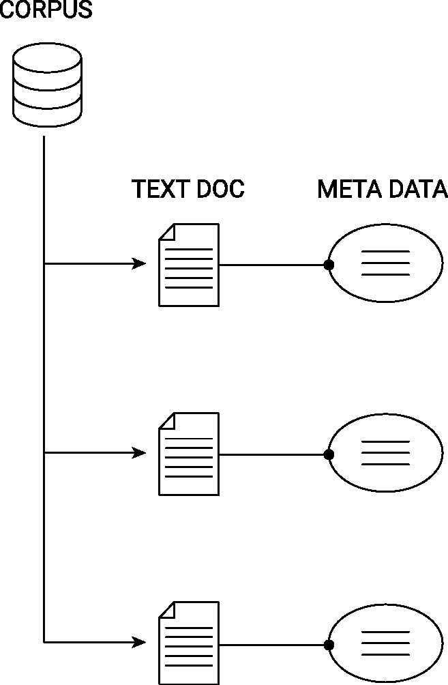

# Text Data
*This chapter has been contributed by Aurélien Salling ([ASallin](https://github.com/ASallin))*.

## Introduction
Text as data has become increasingly available in the past years, especially following the spread of the Internet and the numerisation of text sources. We are now able to make use of literary texts, analyses (such as financial analyses), reactions on social media (e.g., sentiment analysis to predict financial prices), political discourses, judicial decisions, central bank minutes, etc. in quantitative analyses. 

The main challenge of working with text is that text is **unstructured**. Structured data are coded in such a way that variables can be directly used for analysis without too much loss of content. For instance, data are coded into binary or categorical variables in order to reduce and summarize the complexity of the information. In contrast, with unstructured text data, information is not easily summarized and requires a substantial amount of preparation in order to be used for analysis. 

Working with text data can be broken down into eight steps, as depicted in the figure below. (1) Data acquisition: text data are collected from disparate sources. Examples are webpage scrapping, numerization of old administrative records, collection of tweets through an API, etc. (2) Text cleaning and (3) text preprocessing require the analyst to prepare the text in such a way that text information can be read by a statistical software. Most importantly, cleaning and preprocessing are important to remove all the "noise" from the text and get the relevant information. For instance, in many applications, punctuation and so-called "stopwords" are removed. At this step, text information is "transformed" into a matrix. (4) Feature engineering is the process of using domain knowledge to extract features (characteristics, properties, attributes) from raw data. The extraction of the relevant and meaningful features from the text must make sense and be informative in light of the context. 

In this introduction, we will focus on steps (1) to (4). Steps (5) to (8) are beyond the scope of a data handling course, as they involve modeling the text through machine learning or other statistical methods, deploying these models for statistical analyses (for research or industrial purpose), and the plausibilization of such models. 

```{r nlp, echo=FALSE, out.width = "85%", fig.align='center', fig.cap= "(ref:nlp)", purl=FALSE}
include_graphics("img/NLP.png")
```
(ref:nlp) Illustration of a NLP pipeline.


\

## One Package To Rule Them All: Quanteda

In R, steps (2) to (4) can be performed using the `quanteda` or the `tidytext` package. `tidytext` works very well with the packages of the `tidyverse` family, such as `dplyr` or `tidyr`. This package converts text to and from tidy formats. 

The package `quanteda` remains, however, the most complete and go-to package for text analysis in R. It allows R users to perform all the preprocessing steps very easily, and provides all the functions necessary for preprocessing, visualization, and even statistical analyses of the corpus.   
```{r packages}
pacman::p_load(
    tidytext,
    quanteda,
    readtext,
    stringr,
    quanteda.textstats,
    quanteda.textplots
)
```

\

### From raw text to corpus: step (1)
The base, raw material, of quantitative text analysis is a **corpus**. A corpus is, in NLP, *a collection of authentic text organized into datasets*. A corpus can be made up of everything from newspapers, novels, recipes, radio broadcasts to television shows, movies, and tweets. Typically, the data structure of a corpus organizes the individual text documents (e.g., tweets) as individual components of a larger object (the entire corpus), whereby each document-component is linked to its corresponding metadata-component (containing data describing the characteristics of a document; e.g., the timestamp a tweet was posted, the author of the tweet, etc.). The following figure illustrates this data structure for a generic text corpus.

```{r corpus, echo=FALSE, out.width = "25%", fig.align='center', fig.cap= "(ref:corpus)", purl=FALSE}

```
(ref:corpus) Illustration of the data structure behind a text corpus.


In the specific case of `quanteda`, a corpus is a **a data frame consisting of a character vector for documents, and additional vectors for document-level variables**. In other words, a corpus is a data frame that contains, in each row, a text document, and additional columns with the corresponding metadata about the text.

Text in a raw form is often found in a `.json` format (after web scraping), in a `.csv` format, or in simple `.txt` files. The first task is then to import the text data in R and transform it as a corpus. For this introduction, we will use the `inauguration` corpus from `quanteda`, which is a standard corpus used in introductory text analysis. It contains the inauguration discourses of the five first US presidents. This text data can be loaded from the `readtext` package. The text is contained in a csv file, and is loaded with the `read.csv()` function. The metadata of this corpus is the year of the inauguration and the name of the president taking office.

```{r inauguration}
# set path
path_data <- system.file("extdata/", package = "readtext")

# import csv file
dat_inaug <- read.csv(paste0(path_data, "/csv/inaugCorpus.csv"))
names(dat_inaug)

# Create a corpus
corp <- corpus(dat_inaug, text_field = "texts")
print(corp)

# Look at the metadata in the corpus using `docvars`
docvars(corp)

# In quanteda, the metadata in a corpus can be handled like data frames.
docvars(corp, field = "Century") <- floor(docvars(corp, field = "Year") / 100) + 1
```

\

#### Text the traditional way: regular expressions
A first basic step to extract simple information from written information is to use traditional **regular expressions**. Regular expressions are a flexible syntax used to detect and describe patterns in strings. They are used not only in R, but in other softwares. For an introduction, see https://rstudio-pubs-static.s3.amazonaws.com/74603_76cd14d5983f47408fdf0b323550b846.html. Regular expressions in R can be used with `base` R, but also with more practical packages such as `stringr` and `stringi`.

In the following example, we use regular expressions to count the number of occurences of the word *peace* in the inaugural discourses using the command `str_count()` from `stringr`. In an additional step, we count the number of occurences of the pronoun "I". Finally, we program a regular expression to extract the first five words of each discourse. 

```{r regex}

# Count occurences of the word "peace"
str_count(corp, "[Pp]eace")

# Count occurences of the words "peace" OR "war"
str_count(corp, "[Pp]eace|[Ww]ar")

# Count occurences of the mention of the first person pronoun "I"
str_count(corp, "I") # counts the number of "I" occurences. This is not what we want.
str_count(corp, "[I][[:space:]]") # counts the number of "I" followed by a space.

# Extract the first five words of each discourse
str_extract(corp, "^(\\S+\\s|[[:punct:]]|\\n){5}") # ^serves to anchor at the beginning of the string, (){5} shows the group of signs must be detected five times. \S if for any non-space character,  \s is for space, [[:punct:]] for punctuation, and \n for the string representation of paragraphs. Basically, it means: five the first five occurences of many non-space characters (+) followed either (|) by a space, a punctuation sign, or a paragraph sign.
```

\

### From corpus to tokens: steps (2) and (3)
Once we have a corpus, we want to extract the substance of the text. This means, in `quanteda` language, that we want to extract **tokens**, i.e. to isolate the elements that constitute a corpus in order to, in a second phase, to quantify them. Basically, tokens are expressions that form the building blocks (both grammatically and from a meaning perspective) of the text. In many quantitative text analyses, researchers want to remove all words that are unlikely to be informative of a document's content. This means that punctuation as well as so-called "stopwords" (e.g. "and", "a", "the", "or", "but", etc.) are removed. 

In our example, we first create tokens from each document of our corpus. For instance, the first document of the corpus is made out of `r length(tokens(corp)[[1]])` tokens. Most of these tokens are not relevant. So we proceed by removing punctuation and stopwords. `quanteda` has a built-in list of stopwords in English. We also want to remove the words *fellow* and *citizens*, as those words appear in each document. 

Finally, not only are tokens for single words interesting, but also tokens of combined words (called "N-grams"). N-grams are a sequence of tokens from already tokenized text objects. Usually, these N-grams are generated in all possible combinations of tokens. For instance, if the expression "not friendly" appears often, we might lose valuable information when building tokens that do not account for the co-occurence of these terms. We identify bigrams with the word "never".

```{r tokens}
toks <- tokens(corp)
head(toks[[1]], 20)

# Remove punctuation
toks <- tokens(corp, remove_punct = TRUE)
head(toks[[1]], 20)

# Remove stopwords
stopwords("en")
toks <- tokens_remove(toks, pattern = stopwords("en"))
head(toks[[1]], 20)

# We can keep words we are interested in
tokens_select(toks, pattern = c("peace", "war", "great*", "unit*"))

# Remove "fellow" and "citizen"
toks <- tokens_remove(toks, pattern = c(
    "fellow*",
    "citizen*",
    "senate",
    "house",
    "representative*",
    "constitution"
))

# Build N-grams (onegrams, bigrams, and 3-grams)
toks_ngrams <- tokens_ngrams(toks, n = 2:3)

# Build N-grams based on a structure: keep n-grams that containt a "not"
toks_neg_bigram_select <- tokens_select(toks_ngrams, pattern = phrase("never_*"))
head(toks_neg_bigram_select[[1]], 30)
```

\

### From tokens to document-term-matrix (dtm): steps (3) and (4)
The last step of our introduction is to make our collection of tokens usable for quantitative analysis, i.e. to set the tokens into a structure that we can use to train machine learning models, compute statistics, word frequencies, or add to regression models. 

Tokens are usually represented as a document-term-matrix (dtm, also known as document-feature-matrix, dfm). dtms have as rows the document, and as columns the tokens. They contain the count frequency, or sometimes an indicator for whether a given token appears in a document. To create a dtm, we can use `quanteda`'s `dfm` command, as shown below. 

```{r dfm}
dfmat <- dfm(toks)
print(dfmat)
```

Our dtm has five rows for our five documents, and 6,694 (!) columns. Each column is a single token. The dtm is 79.88% sparse, which means that 79.88% of the cells are 0. Handling such large matrices is not trivial, as the number of columns might in many cases increase much faster than the number of rows. For this reason, it is important to clean the text, to remove stopwords, and to be selective about which tokens are kept in the dtm. Moreover, it might sound like a good idea to include N-grams at first, but N-grams are less likely to be matched across documents, which increases the dimension and sparsity of the matrix even more. 

The importance of feature engineering and the need to use domain knowledge becomes clear at this point. Everyone working with text faces a tradeoff between quantity of information and quality of information. Moreover, dts that are too large will be difficult to model and used in subsequent analyses. Domain knowledge is necessary to reduce the dimensino of the dtm matrix. Because our dtm is too large and not informative, we want to trim it and remove columns based on their frequencies. When removing tokens that appear less than two times, we are left with a dtm of 72 columns. 

```{r dfm clean}
dfmat <- dfm(toks)
dfmat <- dfm_trim(dfmat, min_termfreq = 2) # remove tokens that appear less than 1 times
```

\ 

### From dtm to analysis and insights
Dtms are the basis of all text analyses. From a dtm, we can train machine learning methods to predict the sentiment of a text, to classify the documents into clusters (for instance, classifying spam and non-spam emails), to retrieve missing information, or to predict the autorship. 

Very basic statistics about documents are the **top features** of each document, the frequency of expressions in the corpus

```{r stats}
topfeatures(dfmat, 10)

tstat_freq <- textstat_frequency(dfmat, n = 5)

textplot_wordcloud(dfmat, max_words = 100)
```

