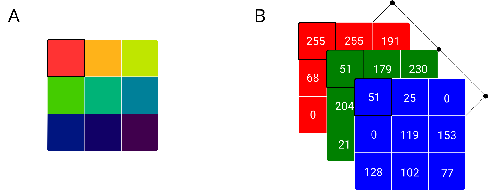

# Image Data
*This chapter has substantially benefited from contributions by Michael Tüting ([MTueting](https://github.com/MTueting))*.

Images are everywhere in the digital world, and increasingly, researchers are finding ways to extract valuable information from them. From satellite imagery measuring economic development to digitized historical documents, image data opens up new possibilities for quantitative research. This chapter explains how digital images are structured as data and how to work with them in R.

**Prerequisites:** Understanding of basic R programming (Chapter 2) and data structures, particularly arrays and matrices (Chapter 4).

**What you will learn:**

- How raster images (photos, satellite imagery) store data as pixel matrices
- How vector images represent graphics using coordinate-based definitions
- How to read, manipulate, and create images in R
- The basics of image processing operations

---

With the advent of broadband internet and efforts in digitizing analogue archives, a large part of the world's available data is stored in the form of images (and moving images). Subsequent advances in computer vision\index{Computer Vision} (machine learning techniques focused on images and videos) have made usage of images for economic and social science purposes accessible to non-computer science researchers. Examples of how image data is used in economic research involve the quantification of urban appearance (based on the analysis of street-level images in cities, @naik_etal2016), the digitization of old text documents via optical character recognition (@cesarini_etal2016), and the measurement of economic development/wealth with nighttime light-intensity based on satellite image data (@hodler_raschky2014). In the following subsections, you will first explore the most common image formats, and how the data behind digital images is structured and stored.

> **In Practice:** Image data has opened new frontiers across research and business. Satellite imagery enables measurement where traditional data is scarce: @henderson2012lights showed that nighttime lights correlate with economic activity, while @donaldson2016view survey applications from tracking agricultural output to monitoring deforestation. Beyond remote sensing, organizations use image analysis for quality control in manufacturing, medical diagnostics from scans, retail analytics from store cameras, and document digitization from historical archives. Social scientists analyze protest imagery, urban planners study city development patterns, and marketing teams assess brand visibility. Understanding image data structures is the first step toward working with these powerful data sources.

## Image data structure and storage

There are two important variants of how digital images are stored: raster images\index{Raster Image} (for example, jpg files), and vector-based images\index{Vector Image} (for example, eps files). In terms of data structure, the two formats differ quite substantially:

- The data structure behind raster images basically defines an image as a matrix of pixels\index{Pixel}, as well as the color of each pixel. Screen colors are combinations of the three base colors red, green, blue (RGB)\index{RGB (Red, Green, Blue)}. Technically speaking, a raster image thus consists of an array of three matrices with the same dimension (one for each base color). The values of each array element are then indicating the intensity of each base color for the corresponding pixel. For example, a black pixel would be indicated as (0,0,0). Raster images play a major role in essentially all modern computer vision applications related to social science/economic research. Photos, videos, satellite imagery, and scans of old documents are all stored as raster images.

- Vector images are essentially text files that store the coordinates of points on a surface and how these dots are connected (or not) by lines. Some of the commonly used formats to store vector images are based on XML (for example SVG files). The most common use of vector image files in a data analytics/research context is for storing map data. Streets, borders, rivers, etc. can be defined as polygons (consisting of individual lines/vectors).

Given the fundamental differences in how the data behind these two types of images is structured, practically handling such data in R differs quite substantially between the two formats with regard to the R packages used and the representation of the image object in RAM.


## Raster images in R

This is meant to showcase some of the most frequent tasks related to images in R.

```{r}
# Load the raster package
library(raster)

```

> **Note:** The `raster` package is being superseded by the `terra` package for new projects. We use `raster` here for its simpler syntax in introductory examples, but `terra` is recommended for production work and is covered in the Further Reading section.

### Basic data structure

Recall that raster images are stored as arrays\index{Array} ($X\times Y \times Z$). $X$ and $Y$ define the height (rows) and width (columns) of the image, and $Z$ the number of layers (color channels). Grayscale images usually have only one layer, whereas most colored images have 3 layers (such as in the case of RGB images). The following figure illustrates this point based on a $3 \times 3$ pixels bitmap image. 

```{r rgb, echo=FALSE, out.width = "95%", fig.align='center', fig.cap= "(ref:rgb)", purl=FALSE}

```

(ref:rgb) Illustration of a bitmap\index{Bitmap} file data structure (with RGB schema). Panel A shows a 3x3 pixels bitmap image as it is shown on screen. Panel B illustrates the corresponding bitmap file's data structure: a three-dimensional array with 3x3 elements represents the image matrix in the three base screen colors red, green, and blue. As a reading example, consider the highlighted upper left pixel in A with the correspondingly highlighted values in the RGB array in B. The color of this pixel is RGB code 255 (full red), 51 (some green), and 51 (some blue): (255,51,51). 


To get a better feeling for the corresponding data structure in R, we start with generating RGB-images step-by-step in R. First we generate three matrices (one for each base color), arrange these matrices in an array, and then save the plots to disk.

#### Example 1: Generating solid color images

Let's create a simple red image (RGB code: 255, 0, 0) to understand the basic workflow:

```{r, out.width="45%", fig.align='center'}
# Step 1: Define image dimensions
width <- 300
height <- 300
layers <- 3  # RGB = 3 layers

# Step 2: Generate three matrices for Red, Green, and Blue channels
# For a red image: full red (255), no green (0), no blue (0)
red <- matrix(255, nrow = height, ncol = width)
green <- matrix(0, nrow = height, ncol = width)
blue <- matrix(0, nrow = height, ncol = width)

# Step 3: Combine into a 3D array
image_array <- array(c(red, green, blue),
                     dim = c(width, height, layers))
dim(image_array)

# Step 4: Create RasterBrick and plot
image <- brick(image_array)
plotRGB(image)
```

> **Common Error:** For standard 8-bit RGB images, values must be integers between 0 and 255 (some functions also accept normalized values between 0 and 1). Values outside the expected range will cause errors or unexpected colors. If your pixel values come from calculations, always check they fall within bounds before creating images: `pmax(0, pmin(255, values))` clips values to the valid range.

Creating other solid colors follows the same pattern—simply change which channel has value 255:

```{r, out.width="45%", fig.align='center'}
# Green image: (0, 255, 0)
green_img <- brick(array(c(
  matrix(0, height, width),    # red = 0
  matrix(255, height, width),  # green = 255
  matrix(0, height, width)     # blue = 0
), dim = c(width, height, 3)))
plotRGB(green_img)

# Blue image: (0, 0, 255)
blue_img <- brick(array(c(
  matrix(0, height, width),    # red = 0
  matrix(0, height, width),    # green = 0
  matrix(255, height, width)   # blue = 255
), dim = c(width, height, 3)))
plotRGB(blue_img)
```

You can also combine channels to create other colors. For example, yellow is red + green (255, 255, 0), and purple is red + blue (255, 0, 255).

#### Example 2: Generating a random RGB image

What if we want each pixel to have a different, random color? This example demonstrates how to generate random values and normalize them to the valid RGB range.

```{r}
# Draw random color intensities from a standard-normal distribution
shades_of_red <- rnorm(n = width * height, mean = 0, sd = 1)
shades_of_green <- rnorm(n = width * height, mean = 0, sd = 1)
shades_of_blue <- rnorm(n = width * height, mean = 0, sd = 1)
```

The color intensity must be in the range 0 to 255, however, our random values are standard normally distributed around 0:

```{r, out.width="45%", fig.align='center'}
plot(density(shades_of_red))
```

We normalize them to a range of 0 to 1 using the formula $z_i = \frac{x_i - min(x)}{max(x)-min(x)}$ and then multiply by 255:

```{r, out.width="45%", fig.align='center'}
# Normalize to 0-255 range
normalize <- function(x) (x - min(x)) / (max(x) - min(x)) * 255

shades_of_red <- normalize(shades_of_red)
shades_of_green <- normalize(shades_of_green)
shades_of_blue <- normalize(shades_of_blue)

plot(density(shades_of_red))

# Create matrices and combine into array
red <- matrix(shades_of_red, nrow = height, ncol = width)
green <- matrix(shades_of_green, nrow = height, ncol = width)
blue <- matrix(shades_of_blue, nrow = height, ncol = width)

image_array <- array(c(red, green, blue),
                     dim = c(width, height, layers))

# Create and plot
random_image <- brick(image_array)
plotRGB(random_image)
```


From the examples above, you recognize that in order to generate/manipulate raster images in R, we basically generate/manipulate matrices/arrays (i.e., structures very common to any data analytics task in R). Several additional R packages come with pre-defined functions for more advanced image manipulations in R.


### Advanced Image Manipulation with the magick Package\index{magick}

The `magick` package provides an R interface to the powerful [ImageMagick](https://imagemagick.org/) image processing library, enabling a wide range of image manipulations.

```{r message=FALSE, out.width="24%"}
# load package
library(magick)

# We can import images from local files or the web
marx <- image_read("img/marx_coffee.png")
print(marx)
```

```{r out.width="30%"}
# Rotate
image_rotate(marx, 45)
```

```{r out.width="24%"}
# Flip
image_flip(marx)
```

```{r out.width="24%"}
# Flop
image_flop(marx)
```

<!-- Working with GIFs -->
<!-- ```{r } -->
<!-- # Download earth gif -->
<!-- earth <- image_read("https://jeroen.github.io/images/earth.gif") -->

<!-- # Retrieve information -->
<!-- length(earth) # The gif is made from 44 individual images -->

<!-- # Working with pipelines  -->
<!-- ## Let us make the earth spin the wrong way! -->
<!-- earth %>% -->
<!--   image_flop() -->

<!-- # Adding Marx to the GIF -->
<!-- marx.resize = marx %>%  -->
<!--   image_resize('400x400!') %>%  -->
<!--   image_animate() -->

<!-- new_gif = image_animate(c(marx.resize, earth)) -->
<!-- length(new_gif) -->

<!-- new_gif -->

<!-- ``` -->

### Optical Character Recognition\index{tesseract}

A common context to encounter image data in empirical economic research is the digitization of old texts. In that context, optical character recognition (OCR)\index{OCR (Optical Character Recognition)} is used to extract text from scanned images. For example, in a setting where an archive of old newspapers is digitized in order to analyze historical news reports. R provides a straightforward approach to OCR in which the input is an image file (e.g., a png-file) and the output is a character string.


```{r, message=FALSE, warning=FALSE, out.width='95%'}

# For Optical Character Recognition
library(tesseract)

# Try to download from URL; if unavailable, show placeholder message
nyt_url <- paste0("https://s3.amazonaws.com/",
                  "libapps/accounts/30502/images/new_york_times.png")
img <- tryCatch({
  image_read(nyt_url)
}, error = function(e) {
  message("Note: External image unavailable.")
  # Create a simple placeholder image
  image_blank(800, 600, color = "lightgray") |>
    image_annotate("NYT Image\n(external source unavailable)",
                   size = 30,
                   gravity = "center")
})
print(img)

headline <- tryCatch({
  image_crop(image = img, geometry = '806x180')
}, error = function(e) img)

headline

# Extract text (will show placeholder text if image unavailable)
headline_text <- image_ocr(headline)
cat(headline_text)

```


```{r echo=FALSE, message=FALSE, warning=FALSE}

# clean up
detach("package:raster", unload=TRUE)

```


## Vector Images in R

An alternative to storing figures in matrix/bitmap-based image-files are vector-based graphics. Vector-based formats are not stored in the form of arrays/matrices that contain the color information of each pixel of an image. Instead they define the shapes, colors and coordinates of the objects shown in an image. Typically such vector-based images are computer drawings, plots, maps, and blueprints of technical infrastructure (and not, for example, photos). There are different specific file-formats to store vector-based graphics, but typically they use a nesting structure and basic syntax that is similar to or a version of XML. A common vector format is SVG\index{SVG (Scalable Vector Graphics)}. That is, in order to work with the basic data contained in such files, we often can use familiar functions like `read_xml()`. To translate the basic vector-image data into images and modify these images additional packages such as `magick` are available. The following code example demonstrates these points. We first import the raw vector-image data of the R logo (stored as an SVG file) as an XML file into R. This allows us to have a closer look at the underlying data structure of such files. Then, we import it as an actual vector-based graphic via `image_read_svg()`


```{r}
# Common Packages for Vector Files
library(magick)

# Download and read svg image from url
URL <- paste0("https://upload.wikimedia.org/",
              "wikipedia/commons/1/1b/R_logo.svg")
Rlogo_xml <- read_xml(URL)

# Data structure
Rlogo_xml
xml_structure(Rlogo_xml)

# Raw data
Rlogo_text <- as.character(Rlogo_xml)

# Plot
svg_img <- image_read_svg(Rlogo_text)
image_info(svg_img)
```


```{r eval=FALSE}
svg_img
```

```{r rlogo, echo=FALSE, out.width = "15%", fig.align='center',  purl=FALSE}
include_graphics("img/R_logo.svg.png")
```

## Key Takeaways

- Digital images come in two fundamental types: raster images (pixel-based, like photos) and vector images (coordinate-based, like diagrams).
- Raster images are stored as arrays: width × height × color channels (typically RGB with three layers for red, green, and blue).
- Each pixel in an RGB image is defined by three values (0-255), representing the intensity of each color channel.
- Vector images store geometric definitions rather than pixels, making them resolution-independent and ideal for diagrams and maps.
- R packages like `raster` and `magick` provide tools for reading, manipulating, and creating images programmatically.

> **AI Support Prompt:** To understand RGB color values better, try:
>
> `What RGB values would create [describe a color, e.g., 'a dark blue', 'burnt orange', 'a pastel pink']? Explain how the red, green, and blue channels combine to produce this color.`
>
> Understanding RGB helps you manipulate images programmatically and create visualizations with specific colors.

> **AI Support Prompt:** If you're unsure what image operations to use, describe your goal:
>
> `I have an image and I want to [describe your goal, e.g., 'make it grayscale', 'crop to a square', 'overlay text', 'reduce file size']. How would I do this in R using the magick package?`
>
> The magick package has many functions—AI can help you find the right one for your task.

> **AI Support Prompt:** To understand how images are stored as data, ask:
>
> `Explain how a color photograph is stored as a 3D array. If I have a 100×100 pixel RGB image, how many numbers are stored? What does each number represent?`
>
> Understanding image data structures helps you work with image analysis and computer vision tasks.

## Further Reading

- The `magick` package vignette: https://cran.r-project.org/web/packages/magick/vignettes/intro.html provides comprehensive coverage of image manipulation in R.
- The `terra` package (successor to `raster`): https://rspatial.org/terra/ for modern geospatial raster data handling.
- W3Schools SVG Tutorial: https://www.w3schools.com/graphics/svg_intro.asp for learning more about vector graphics.

## Exercises

1. **RGB colors**: What RGB values (each between 0-255) would produce the following colors?
   a) White
   b) Black
   c) Yellow (hint: it's a combination of two primary colors)
   d) Gray (50% brightness)

2. **Creating images**: Modify the code from Example 1 (generating a red image) to create a 200×200 pixel image that is purple (a mix of red and blue). Save it to disk as "purple.png".

3. **Image dimensions**: A digital photograph from a modern smartphone might be 4000×3000 pixels with 3 color channels (RGB).
   a) How many total values are stored in this image?
   b) If each value takes 1 byte (8 bits), how many megabytes of raw data does this represent?
   c) Why are actual JPEG files much smaller than this?

4. **Raster vs. vector**: For each of the following use cases, would you recommend a raster or vector format? Explain your reasoning.
   a) A company logo that needs to appear on business cards and billboards
   b) A satellite photograph of a city
   c) A map showing country borders
   d) A photograph of a product for an online store

<!-- ### Example: Manipulating Output width and height of SVGs -->
<!-- ```{r} -->
<!-- # Find information about output width and height in original source code -->
<!-- # Take a look at the first line of the source code: -->
<!-- Rlogo_raw[1] -->

<!-- # We want to have an image of size 400 x 800 instead: -->
<!-- Rlogo_raw[1] <- "<svg xmlns=\"http://www.w3.org/2000/svg\" xmlns:xlink=\"http://www.w3.org/1999/xlink\" preserveAspectRatio=\"xMidYMid\" width=\"400\" height=\"800\" viewBox=\"0 0 724 561\">" -->

<!-- # Save as magick object -->
<!-- svg_new <- image_read_svg(paste0(Rlogo_raw, collapse ="")) -->
<!-- image_info(svg_new) -->
<!-- svg_new -->
<!-- ``` -->


<!-- ### Example: Maps  -->


