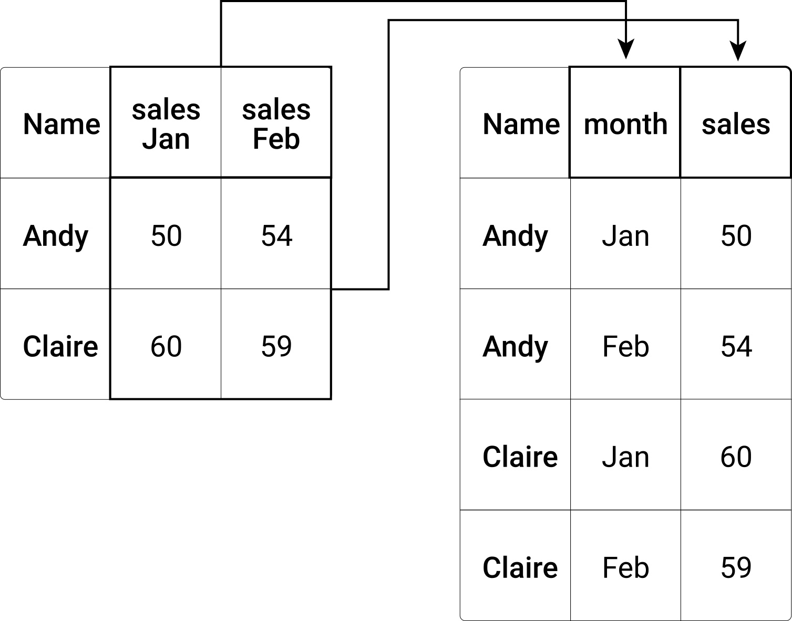
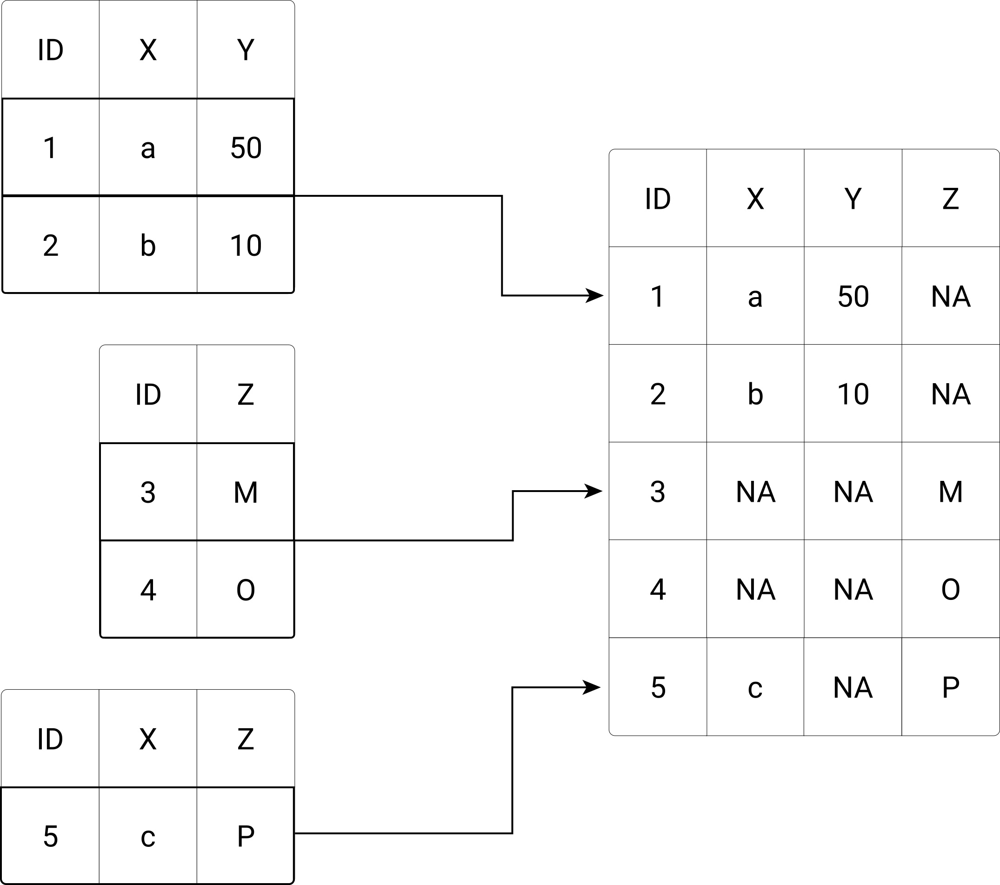

# Data Preparation and Transformation

Importing a dataset properly is just the first of several milestones until an analysis-ready dataset is generated. In some cases, cleaning the raw data is a necessary step to facilitate/enable proper parsing of the data set to import it. However, most of the cleaning/preparation ('wrangling')\index{Data Wrangling} with the data follows after properly parsing structured data. Many aspects of data wrangling are specific to certain datasets and an entire curriculum could be filled with different approaches and tools to address specific problems. Moreover, proficiency in data wrangling is generally a matter of experience in working with data, gained over many years.

This chapter covers the key techniques for transforming raw data into analysis-ready datasets:

- **Cleaning**: String operations to fix inconsistent values
- **Reshaping**: Converting between wide and long formats
- **Combining**: Stacking datasets and merging/joining tables
- **Transforming**: Selecting, filtering, and creating new variables

## The data preparation workflow

The following diagram illustrates a typical data preparation workflow. Note that the order of steps may vary depending on your specific data and analysis needs, and you may iterate between steps as you discover new issues in your data.

```{r dataprep-workflow, echo=FALSE, out.width = "75%", fig.align='center', fig.cap= "(ref:dataprep-workflow)", purl=FALSE}
include_graphics("img/data_preparation_workflow.png")
```

(ref:dataprep-workflow) The data preparation workflow. Raw data passes through several transformation stages—import, clean, reshape—before reaching analysis-ready form. The Stack/Combine and Merge paths handle cases where multiple datasets need to be combined.

Each step addresses specific data issues:

- **Import** (Chapter 8): Read data from various sources and formats into R
- **Clean** (Section 9.1): Fix inconsistent text, handle special characters, standardize formats
- **Reshape** (Section 9.2): Convert between wide and long data layouts
- **Stack** (Section 9.3): Combine datasets with the same structure vertically
- **Merge** (Section 9.4): Join datasets based on shared key variables
- **Transform** (Sections 9.5-9.7): Select columns, filter rows, and create new variables

> **In Practice:** How much time do data professionals actually spend on data preparation? Industry surveys consistently find that data cleaning and preparation consume 60-80% of a typical data project. A 2016 CrowdFlower survey found that data scientists spend about 60% of their time cleaning and organizing data—and 57% consider this the least enjoyable part of their job. @wickham_2014 formalized the concept of "tidy data"\index{Tidy Data} precisely because messy data is so ubiquitous. In academic research, poor data preparation is a leading cause of non-reproducible results. @christensen2018transparency document that many published papers across the social sciences cannot be replicated because data cleaning steps were poorly documented. The techniques in this chapter—while perhaps unglamorous—are where most real data work happens.

## Cleaning data with basic string operations
Recall that most of the data we read into R for analytic purposes is a collection of raw text (structured with special characters). When parsing the data to read it into R with high-level functions such as the ones provided in the `readr`-package, both the structure and the data types are considered. The resulting `data.frame`/`tibble` might thus contain variables (different columns) of type `character`, `factor`, or `integer`, etc. At this stage, it often happens that the raw data is not clean enough for the parser to recognize the data types in each column correctly, and it resorts to just parsing it as `character`. Indeed, if we have to deal with a very messy dataset, it can make a lot of sense to constrain the parser such that it reads each column a as `character`.

We first load this package as we rely on functions provided in the `tidyverse`.

```{r message=FALSE, warning=FALSE}
library(tidyverse)
```


Let's create a sample dataset to illustrate some of the typical issues regarding unclean data that we might encounter in empirical economic research (and many similar domains of data analysis).^[The option `stringsAsFactors = FALSE` ensures that all of the columns in this data frame are of type `character`.]

```{r}
messy_df <- data.frame(
  last_name = c("Wayne", "Trump", "Karl Marx"),
  first_name = c("John", "Melania", ""),
  gender = c("male", "female", "Man"),
  date = c("2018-11-15", "2018.11.01", "2018/11/02"),
  income = c("150,000", "250000", "10000"),
  stringsAsFactors = FALSE)
```

Assuming we have managed to read this dataset from a local file (with all columns as type `character`), the next step is to clean each of the columns such that the dataset is ready for analysis. Thereby we want to make sure that each variable (column) is set to a meaningful data type, once it is cleaned. The *cleaning* of the parsed data is often easier to do when the data is of type `character`. Once it is cleaned, however, we can set it to a type that is more useful for the analysis part. For example, a column containing numeric values in the final dataset should be stored as `numeric` or `integer`, so we can perform math operations on it later on (compute sums, means, etc.).

### Find/replace character strings, recode factor levels
Our dataset contains a typical categorical variable: `gender`. In R, storing such variables as type `factor` is good practice. Without really looking at the data values, we might thus be inclined to do the following:

```{r}
messy_df$gender <- as.factor(messy_df$gender)
messy_df$gender
```

The column is now of type `factor`. And we see that R defined the factor variable such that an observation can be one of three categories ('levels'): `female`, `male`, or `Man`. In terms of content, that probably does not make too much sense. If we were to analyze the data later and compute the sample's share of males, we would only count one instead of two. Hence, we better *recode* the gender variable of male subjects as `male` and not `Man`. How can this be done programmatically?

One approach is to select all entries in `messy_df$gender` that are equal to `"Man"` and replace these entries with `"male"`.
```{r}
messy_df$gender[messy_df$gender == "Man"] <- "male"
messy_df$gender
```

Note, however, that this approach is not perfect because R still considers `Man` as a valid possible category in this column. This can have consequences for certain analyses we might want to run on this dataset later on.^[If we perform the same operation on this variable *before* coercing it to a `factor`, this problem does not occur.] Alternatively, we can use a function `fct_recode()` (provided in `tidyverse`), specifically for such operations with factors.

```{r}
messy_df$gender <- fct_recode(messy_df$gender, "male" = "Man")
messy_df$gender
```

The latter can be very useful when several factor levels need to be recoded at once. Note that in both cases, the underlying logic is that we search for strings that are identical to `"Man"` and replace those values with `"male"`. Now, the gender variable is ready for analysis.


### Removing individual characters from a string

The `income` column contains numbers, so let's try to set this column to type `integer`.

```{r}
as.integer(messy_df$income)
```

R is warning us that something did not go well when executing this code. We see that the first value of the original column has been replaced with `NA` ('Not Available'/'Not Applicable'/'No Answer'). The reason is that the original value contained a comma (`,`), a special character. The function `as.integer()` does not know how to translate such a symbol to a number. Hence, the original data, value cannot be translated into a number (integer). In order to resolve this issue, we have to remove the comma (`,`) from this string. Or, more precisely, we will locate this specific character *within* the string and replace it with an empty string (`""`) To do so, we'll use the function `str_replace()`\index{str\_replace()} (for 'string replace').

> **Common Error:** The warning "NAs introduced by coercion" means some values couldn't be converted. Common culprits: currency symbols (`$`, `€`), thousands separators (`,`), percentage signs (`%`), or extra whitespace. Always clean strings with `str_replace()` or `gsub()` *before* converting to numeric.

```{r}
messy_df$income <- str_replace(messy_df$income,
                               pattern = ",",
                               replacement = "")
```
Now we can successfully set the column as type integer.

```{r}
messy_df$income <- as.integer(messy_df$income)
```


### Splitting strings

From looking at the `last_name` and `first_name` columns of our messy dataset, it becomes clear that the last row is not accurately coded. `Karl` should show up in the `first_name` column. In order to correct this, we have to extract a part of one string and store this sub-string in another variable. There are several ways to do this. Here, it probably makes sense to split the original string into two parts, as the whitespace between `Karl` and `Marx` indicates the separation of first and last names. For this, we can use the function `str_split()`\index{str\_split()}.

First, we split the strings at every occurrence of white space (`" "`). Setting the option `simplify=TRUE`, we get a matrix containing the individual sub-strings after the splitting.
```{r}
splitnames <- str_split(messy_df$last_name,
                        pattern = " ",
                        simplify = TRUE)
splitnames
```

As the first two observations did not contain any white space, there was nothing to split there, and the function simply returned empty strings `""`. In a second step, we replace empty observations in the `first_name` column with the corresponding values in `splitnames`.

```{r}
problem_cases <- messy_df$first_name == ""
messy_df$first_name[problem_cases] <- splitnames[problem_cases, 1]
```

Finally, we must correct the `last_name` column by replacing the respective values.

```{r}
messy_df$last_name[problem_cases] <- splitnames[problem_cases, 2]
messy_df
```


### Parsing dates

Finally, we take a look at the `date`-column of our dataset. For many data preparation steps as well as visualization and analysis, it is advantageous to have times and dates properly parsed as type `Date`. In practice, dates and times are often particularly messy because no unique standard has been used to define the format in the data collection phase. This also seems to be the case in our dataset. In order to work with dates, we load the `lubridate`\index{lubridate} package.

```{r message=FALSE}
library(lubridate)
```

This package provides several functions to parse and manipulate date and time data. From the 'date' column, we see that the format is year, month, and day. Thus, we can use the `ymd()`-function provided in the `lubridate`-package to parse the column as `Date` type.

```{r}
messy_df$date <- ymd(messy_df$date)
```

Note how this function automatically recognizes how different special characters have been used in different observations to separate years from months/days.

Now, our dataset is cleaned up and ready to go.

```{r}
messy_df
```

```{r}
str(messy_df)
```


## Reshaping datasets

Besides cleaning and standardizing individual data columns, preparing a dataset for analysis often involves bringing the entire dataset in the right 'shape.' Typically, we mean this in a table-like (two-dimensional) format such as `data.frames` and `tibbles`, data with repeated observations for the same unit can be displayed/stored in either *long* or *wide* format. It is often seen as good practice to prepare data for analysis in *long* ('tidy') format. This way we ensure that we follow the ('tidy') paradigm of using the rows for individual observations and the columns to describe these observations.^[Depending on the dataset, however, an argument can be made that storing the data in wide format might be more efficient (using up less memory) than long format.] Tidying/reshaping a dataset in this way thus involves transforming columns into rows (historically called *melting* in older R packages like `reshape2`, now performed with `pivot_longer()`). In the following, we first have a close look at what this means conceptually and then apply this technique in two examples.

### Tidying messy datasets

Consider the following stylized example [@wickham_2014].


```{r echo=FALSE, warning=FALSE, message=FALSE, purl=FALSE}
rawdata <- read_csv("data/treatments.csv")
```


```{r echo=FALSE, purl=FALSE}
kable(rawdata)
```


The table shows observations of three individuals participating in an experiment. In this experiment, the subjects might have been exposed to treatment a and/or treatment b. Their reaction to either treatment is measured in numeric values (the results of the experiment). From looking at the raw data in its current shape, this is not really clear. While we see which numeric value corresponds to which person and treatment, it is unclear what this value is. One might, for example, wrongly assume that the numeric values refer to the treatment intensity of a and b. Such interpretation would align with the idea of columns containing variables and rows of observations. But, considering what the numeric values stand for, we realize that the columns are not *names of variables* but *values* of a variable (the categorical variable `treatment`, with levels `a` and `b`).

Now consider the same data in 'tidy' format (variables in columns and observations in rows).


```{r echo=FALSE, warning=FALSE, message=FALSE}
tidydata <- pivot_longer(data = rawdata,
                         c(treatmenta, treatmentb),
                         names_to = "treatment",
                         values_to = "result")
tidydata$treatment <- gsub("treatment", "", tidydata$treatment)
```


```{r echo=FALSE, purl=FALSE}
kable(tidydata)  
```


This *long*/*tidy* shape of the dataset has several advantages. First, it is now clear what the numeric values refer to. Second, it is much easier to filter/select the observations in this format.


### Pivoting from wide to long\index{pivot\_longer()}

In the `tidyverse` context, we call the transformation of columns to rows 'pivoting from wide to long'. That is, we pivot columns into keys (or names) and values. A typical situation where this has to be done in applied data analysis is when a dataset contains several observations over time for the same subjects. The following figure illustrates the basic concept. On the left, you see a wide data frame, which is not in line with the tidy data concept. Reshaping it to long format yields the new data frame on the right.


```{r widetolong, echo=FALSE, out.width = "75%", fig.align='center', fig.cap= "(ref:widetolong)", purl=FALSE}

```

(ref:widetolong) Reshaping a data frame from wide to long format (pivoting). In the wide format (left), multiple observations of the same variable (e.g., income in different years) are stored in separate columns. The long format (right) follows tidy data principles: each row is a single observation, with a new column identifying the time period. This transformation is performed using `pivot_longer()` in the tidyverse.


To illustrate how *pivoting from wide to long* works in practice, consider the following example dataset (extending on the example above).


```{r}
wide_df <- data.frame(last_name = c("Wayne", "Trump", "Marx"),
                       first_name = c("John", "Melania", "Karl"),
                       gender = c("male", "female", "male"),
                       income.2018 = c("150000", "250000", "10000"),
                      income.2017 = c( "140000", "230000", "15000"),
                      stringsAsFactors = FALSE)
wide_df
```

The last two columns contain information on the same variable (`income`), but for different years. We thus want to pivot these two columns into a new `year` and `income` column, ensuring that columns correspond to variables and rows correspond to observations. For this, we call the `pivot_longer()`-function as follows:

```{r}
long_df <- pivot_longer(wide_df,
                        c(income.2018, income.2017),
                        names_to = "year",
                        values_to = "income")
long_df
```

We can further clean the `year` column to only contain the respective numeric values.

```{r}
long_df$year <- str_replace(long_df$year, "income.", "")
long_df
```


### Pivoting from long to wide\index{pivot\_wider()}

As we want to adhere to the 'tidy' paradigm of keeping our data in long format, transforming 'long to wide' is less common. However, it might be necessary if the dataset at hand is particularly messy. The following example illustrates such a situation.


```{r}
weird_df <- data.frame(last_name = c("Wayne", "Trump", "Marx",
                                     "Wayne", "Trump", "Marx",
                                     "Wayne", "Trump", "Marx"),
                       first_name = c("John", "Melania", "Karl",
                                      "John", "Melania", "Karl",
                                      "John", "Melania", "Karl"),
                       gender = c("male", "female", "male",
                                  "male", "female", "male",
                                  "male", "female", "male"),
                       value = c("150000", "250000", "10000",
                                 "2000000", "5000000", "NA",
                                 "50", "25", "NA"),
                       variable = c("income", "income", "income",
                                    "assets", "assets", "assets",
                                    "age", "age", "age"),
                       stringsAsFactors = FALSE)
weird_df
```

While the data is somehow in a long format, the rule that each column should correspond to a variable (and vice versa) is ignored. Data on income, assets, and the age of the individuals in the dataset, are all put in the same column. We can call the function `pivot_wider()` with the two parameters `names` and `value` to correct this.

```{r}
tidy_df <- pivot_wider(weird_df,
                       names_from = "variable",
                       values_from = "value")
tidy_df
```


## Stacking/row-binding datasets

In practice, you will encounter situations in which the raw data is partitioned according to one of the variables into separate data files. Typically, in the economics research context, this is done by date (sales records of a firm stored in one CSV file per month) or by geographic entities (e.g., one file with GDP per capita figures per country). 

Unless the combined dataset of all separate files would be very large in memory, you likely would prefer one file to run analytics scripts on. Therefore, data preparation often also involves the stacking/binding of sub-sets into a larger combined dataset. As each of the separate files might slightly differ in terms of variable names, variable availability, and tidiness. It is important to first standardize/clean all of the separate datasets after importing them (following the examples above).

Once all of the subsets are imported and cleaned, there is typically still one remaining inconsistency: some variables might be available in some subsets (e.g., for some years, some regions) but not for others. In addition, the column/variable-order might vary between subsets. 

Figure \@ref(fig:rowbinding) illustrates the concept of stacking datasets (binding the rows of separate data frames) with some inconsistencies regarding the availability and order of columns.


```{r rowbinding, echo=FALSE, out.width = "95%", fig.align='center', fig.cap= "(ref:rowbinding)", purl=FALSE}

```

(ref:rowbinding) Row-binding (stacking) three data subsets into one combined dataset. Each subset may have different columns available or in different orders. The `bind_rows()` function from dplyr handles these inconsistencies by aligning columns by name and filling missing values with `NA`. This operation is common when combining data from multiple sources, time periods, or regions.

The `dplyr`-package provides an easy-to-use framework to implement such a stacking of data frames in R. In the following code illustration, we build on the same exemplary data as shown in the conceptual illustration above. First, we initiate the three subsets, and then bind their rows to generate the combined dataset via `bind_rows()`

```{r}
# initialize sample data
subset1 <- data.frame(ID=c(1,2),
                      X=c("a", "b"),
                      Y=c(50,10))

subset2 <- data.frame(ID=c(3,4),
                      Z=c("M", "O"))

subset3 <- data.frame(ID= c(5),
                      X=c("c"),
                      Z="P")
```

Note that, apart from the inconsistencies regarding the column availability and column order, the three subsets are consistent with each other in terms of basic data structure and data types (if that were not the case, binding their rows might be problematic).

```{r}
str(subset1)
str(subset2)
str(subset3)
```
To stack the three subsets together, we call `bind_rows()`\index{bind\_rows()} as follows (`dplyr` needs to be installed and loaded for this).

```{r}

# install if needed
# install.packages("dplyr")

# load packages
library(dplyr)

# stack data frames
combined_df <- bind_rows(subset1, subset2, subset3)

# inspect the result
combined_df
```

Note how `bind_rows()` automatically matches the column names (orders the columns before stacking), and fills missing values with `NA`s (not available).


## Merging/joining datasets\index{merge()}\index{Join}

Beyond stacking datasets vertically (row-binding), we often need to combine datasets horizontally by matching observations based on a common identifier. In database terminology, this operation is called a "join"—combining tables by matching values in key columns. The following two data sets contain data on persons' characteristics and their consumption spending. Both are cleaned datasets. But, for analysis purposes, we have to combine the two datasets. There are several ways to do this in R, but most commonly (for `data.frames` as well as `tibbles`), we can use the `merge()`-function.

> **Common Error:** Joins that produce more rows than expected usually indicate duplicate keys. If `id` appears twice in one table, each match creates multiple rows in the result. Always check for duplicates before joining: `any(duplicated(df$id))`. Also ensure key columns have matching types—joining character `"1"` to numeric `1` may fail silently or produce unexpected results.

```{r message=FALSE, warning=FALSE}
# load packages
library(tidyverse)

# initiate data frame on persons' spending
df_c <- data.frame(
  id = c(1:3, 1:3),
  money_spent = c(1000, 2000, 6000, 1500, 3000, 5500),
  currency = c("CHF", "CHF", "USD", "EUR", "CHF", "USD"),
  year = c(2017, 2017, 2017, 2018, 2018, 2018))
df_c

# initiate data frame on persons' characteristics
df_p <- data.frame(id = 1:4,
                   first_name = c("Anna", "Betty", "Claire", "Diane"),
                   profession = c("Economist", "Data Scientist",
                                  "Data Scientist", "Economist"))
df_p
```

Our aim is to compute the average spending by profession. Therefore, we want to link `money_spent` with `profession`. Both datasets contain a unique identifier `id`, which we can use to link the observations via `merge()`.

```{r}
df_merged <- merge(df_p, df_c, by="id")
df_merged
```

Note how only the exact matches are merged. The observation of `"Diane"` is not part of the merged data frame because there is no corresponding row in `df_c` with her spending information. This approach to merging two data sets (only keeping the matched rows on both sides) is often referred to as an *inner join*.

> **Note:** While base R's `merge()` function works well, the tidyverse provides equivalent functions with more explicit names: `inner_join()`, `left_join()`, `right_join()`, and `full_join()` from the `dplyr` package. These integrate seamlessly with other tidyverse operations and are often preferred in modern R workflows.

If for some reason, we would like to have all persons in the merged dataset, we can specify the `merge()`-call accordingly:


```{r}
df_merged2 <- merge(df_p, df_c, by="id", all = TRUE)
df_merged2
```

This version of merging two data sets is also often referred to as an *outer join*.

Finally, you might be in a situation in which keeping all rows of the first (left) dataset or the ones of the second (right) dataset makes sense, but not both. You can do this by specifying `all.x=TRUE` (keep all rows of the first dataset) or `all.y=TRUE` (keep all of the second dataset). These types of merging datasets are often also referred to *left join* and *right join*, respectively.

```{r}
# left join
df_merged3 <- merge(df_p, df_c, by="id", all.x = TRUE)
df_merged3
```

```{r}
# right join
df_merged4 <- merge(df_p, df_c, by="id", all.y = TRUE)
df_merged4
```


The following figure illustrates the four types of joins.


```{r joins, echo=FALSE, out.width = "95%", fig.align='center', fig.cap= "(ref:joins)", purl=FALSE}
include_graphics("img/joins.jpg")
```
(ref:joins) Four types of joins for merging datasets. **Left join** keeps all rows from the left table, adding matched data from the right (unmatched rows get `NA`). **Right join** keeps all rows from the right table. **Inner join** keeps only rows that match in both tables. **Outer join** (full join) keeps all rows from both tables, filling unmatched values with `NA`. The choice depends on whether you need to preserve all observations or only matched ones.


## Selecting columns\index{select()}

For our analysis's next steps, we do not need to have all columns. Via the `select()`-function provided in `tidyverse` we can easily select the columns of interest:


```{r}
df_selection <- select(df_merged, id, year, money_spent, currency)
df_selection
```


## Filtering rows\index{filter()}

In the next step, we want to select only observations with specific characteristics. Say we want to select only observations from 2018. Again there are several ways to do this in R, but the most comfortable way is to use the `filter()` function provided in `tidyverse`.

```{r}
filter(df_selection, year == 2018)
```

We can use several filtering conditions simultaneously:

```{r}
filter(df_selection, year == 2018, money_spent < 5000, currency=="EUR")
```

## Creating new variables (mutating)\index{mutate()}

Before we compute aggregate statistics based on our selected dataset, we have to deal with the fact that the `money_spent`-variable is not tidy. It describes each observation's characteristic, but it is measured in different units (here, different currencies) across some of these observations. To make the values comparable, we need to normalize them to a common currency. We do this by adding an additional variable/column with the amount of money spent converted to CHF. That is, we want to have every value converted to one currency (given a certain exchange rate). In order to do so, we use the `mutate()` function (again provided in `tidyverse`).

First, we look up the USD/CHF and EUR/CHF exchange rates and add those as a variable (CHF/CHF exchange rates are equal to 1, of course).

```{r}
exchange_rates <- data.frame(
  exchange_rate = c(0.9, 1, 1.2),
  currency = c("USD", "CHF", "EUR"),
  stringsAsFactors = FALSE)
df_selection <- merge(df_selection, exchange_rates, by = "currency")
```

Now we can define an additional variable with the money spent in CHF via `mutate()`:

```{r}
df_mutated <- mutate(df_selection,
                     money_spent_chf = money_spent * exchange_rate)
df_mutated
```


## Tutorial: Hotel Bookings Time Series

> **This tutorial applies:** Sections 9.1 (cleaning with string operations), 9.2 (reshaping), 9.3 (stacking/row-binding)

This tutorial guides you step-by-step through the cleaning script (with a few adaptions) of [tidytuesday's Hotel Bookings repo](https://github.com/rfordatascience/tidytuesday/tree/master/data/2020/2020-02-11), dealing with the preparation and analysis of two datasets with *hotel demand data*. Along the way, you also get in touch with the [janitor package](https://github.com/sfirke/janitor). For details about the two datasets, see the [paper](https://www.sciencedirect.com/science/article/pii/S2352340918315191#f0010) by @nuno_etal2019, and for the original research contribution related to these datasets see the [paper](https://ieeexplore.ieee.org/document/8260781) by @nunes_etal2017.

### Background and aim

@nuno_etal2019 summarizes the content of the datasets as follows: "One of the hotels (H1) is a resort hotel, and the other is a city hotel (H2). Both datasets share the same structure, with 31 variables describing the 40,060 observations of H1 and 79,330 observations of H2. Each observation represents a hotel booking. Both datasets comprehend bookings due to arrive between the 1st of July 2015 and the 31st of August 2017, including bookings that effectively arrived and bookings that were canceled. Since this is real data, all data elements pertaining to hotel or customer identification were deleted. Due to the scarcity of real business data for scientific and educational purposes, these datasets can have an important role for research and education in revenue management, machine learning, or data mining, as well as in other fields."

The aim of the tutorial is to get the data in the form needed for the following plot.

```{r echo=FALSE, purl=FALSE, message=FALSE, warning=FALSE}
library(tidyverse)
library(feasts)

# fixed variables
BASE_URL <- paste0("https://raw.githubusercontent.com/",
                   "rfordatascience/tidytuesday/master/",
                   "data/2020/2020-02-11/")
url_h1 <- paste0(BASE_URL, "H1.csv")
url_h2 <- paste0(BASE_URL, "H2.csv")

# resort hotel
h1 <- read_csv(url_h1) %>%
  janitor::clean_names() %>%
  mutate(hotel = "Resort Hotel") %>%
  select(hotel, everything())

# city hotel
h2 <- read_csv(url_h2) %>%
  janitor::clean_names() %>%
  mutate(hotel = "City Hotel") %>%
  select(hotel, everything())

hotel_df <- bind_rows(h1, h2)

hotel_plot <- hotel_df %>%
  filter(hotel == "City Hotel") %>%
  mutate(date = glue::glue("{arrival_date_year}-",
                           "{arrival_date_month}-",
                           "{arrival_date_day_of_month}"),
         date = parse_date(date, format = "%Y-%B-%d")) %>%
  select(date, everything()) %>%
  arrange(date) %>%
  count(date) %>%
  rename(daily_bookings = n) %>%
  tsibble::as_tsibble() %>%
  model(STL(daily_bookings ~ season(window = Inf))) %>%
  components() %>% autoplot()

hotel_plot
```

The first few rows and columns of the final dataset should combine the two source datasets and look as follows:

```{r}
head(hotel_df)
```


### Set up and import
All the tools we need for this tutorial are provided in `tidyverse` and `janitor`, and the data is directly available from the [tidytuesday GitHub repository](https://github.com/rfordatascience/tidytuesday/tree/master/data/2020/2020-02-11). The original data is provided in CSV format.

```{r message=FALSE, warning=FALSE}

# SET UP --------------

# load packages
library(tidyverse)
library(janitor) # install.packages("janitor") (if not yet installed)
# janitor provides utilities for cleaning dirty data, including clean_names()
# which standardizes column names to a consistent format (lowercase with underscores)

# fixed variables
BASE_URL <- paste0("https://raw.githubusercontent.com/",
                   "rfordatascience/tidytuesday/master/",
                   "data/2020/2020-02-11/")
url_h1 <- paste0(BASE_URL, "H1.csv")
url_h2 <- paste0(BASE_URL, "H2.csv")

## DATA IMPORT -----------------

h1 <- read_csv(url_h1)
h2 <- read_csv(url_h2)

```


In the next step, we clean the column names and add columns to clarify which of the two hotels the corresponding observations belong to (see dataset description above). Finally, we stack the observations (rows) together in one tibble/data.frame.

```{r}
## CLEAN DATA -------------------------

# use janitor's clean_names(); see ?clean_names for details
h1 <- clean_names(h1)
h2 <- clean_names(h2)

# add a column to clarify the origin of observation
h1 <- mutate(h1, hotel="Resort Hotel")
h2 <- mutate(h2, hotel="City Hotel")

# stack observations
hotel_df <- bind_rows(h1,h2)

# inspect the first observations
head(hotel_df)

```


## Tutorial: Cleaning messy Excel sheets

> **This tutorial applies:** Sections 9.4-9.7 (merging, selecting, filtering, mutating), plus Chapter 8 (importing Excel data)

The following tutorial is a (substantially) shortened and simplified version of Ista Zahn and Daina Bouquin's ["Cleaning up messy data tutorial" (Harvard Datafest 2017)](https://rawgit.com/izahn/R-data-cleaning/master/dataCleaning.html). The tutorial aims to clean up an Excel sheet provided by the UK Office of National Statistics that provides data on the most popular baby names in England and Wales in 2015. The dataset is stored in `data/2015boysnamesfinal.xlsx`.

### Preparatory steps


```{r echo=FALSE }
## SET UP -------------------
# load packages
library(tidyverse)
library(readxl)

# fixed variables
INPUT_PATH <- "data/2015boysnamesfinal.xlsx"
```


```{r eval= FALSE }
## SET UP -------------------
# load packages
library(tidyverse)
library(readxl)

# fixed variables
INPUT_PATH <- "data/2015boysnamesfinal.xlsx"
```

Before diving into the data import and cleaning, it is helpful to first open the file in Excel. We notice a couple of things there: first, there are several sheets in this Excel file. For this exercise, we only rely on the sheet called "Table 1". Second, in this sheet, we notice intuitively some potential problems with importing this dataset due to the way the spreadsheet is organized. The actual data entries only start on row 7. These two issues can be considered when importing the data with `read_excel()`.

```{r}
## LOAD/INSPECT DATA -----------------

# import the excel sheet
# sheet: the name of the sheet to be loaded into R
# skip: skip the first 6 rows of the original sheet
boys <- read_excel(INPUT_PATH,
                   col_names = TRUE,
                   sheet = "Table 1",
                   skip = 6)
# inspect
boys
```


Note that by default, `read_excel()` "repairs" the column names of imported datasets to ensure all columns have unique names. We do not need to worry about the automatically assigned column names. However, some of the columns are not needed for analytics purposes. In addition, we note that some rows are empty (contain `NA` values). In the next step we *select* only those columns needed and *filter* incomplete observations out.

```{r}
# FILTER/CLEAN ---------------------------

# select columns
boys <- select(boys,
               Rank...1, Name...2, Count...3,
               Rank...7, Name...8, Count...9)
# filter rows
boys <-  filter(boys, !is.na(Rank...1))
```

Finally, we re-arrange the data by stacking them in a three-column format.

```{r}

# stack columns
boys_long <- bind_rows(boys[,1:3], boys[,4:6])

# inspect result
boys_long
```

## Key Takeaways

- Data preparation is where most of the work in a data project happens—cleaning and transforming data into analysis-ready form.
- String operations (`gsub()`, `trimws()`) are essential for cleaning messy text values in your data.
- Reshaping data between wide and long formats (`pivot_longer()`, `pivot_wider()`) is crucial for matching data to your analysis needs.
- The tidyverse provides a consistent set of verbs for data manipulation: `select()` (columns), `filter()` (rows), `mutate()` (create/modify variables), and joins (combine datasets).
- Different types of joins (left, right, inner, full) handle the combination of datasets differently—choose based on which observations you want to keep.
- Real-world data often comes in messy formats (especially Excel files); anticipate and plan for data cleaning challenges.

> **AI Support Prompt:** When faced with messy data, describe your problem:
>
> `I have a messy dataset with [describe issues, e.g., 'inconsistent date formats', 'numbers stored as text with currency symbols', 'missing values coded as -999']. How would you approach cleaning this in R using tidyverse functions? Suggest a step-by-step workflow.`
>
> AI excels at suggesting cleaning strategies and dplyr/stringr code for common data problems.

> **AI Support Prompt:** If you're unsure which join to use, ask:
>
> `I have two datasets: [describe dataset A] and [describe dataset B]. I want to combine them by [key variable]. I want to [describe desired outcome, e.g., 'keep all rows from A even if no match in B', 'only keep rows that appear in both']. Which type of join should I use?`
>
> Understanding joins is crucial—AI can help you choose the right one and visualize what will happen.

> **AI Support Prompt:** To diagnose why your code isn't working, try:
>
> `I'm trying to reshape/merge/clean my data with this code: [paste code]. I expected [what you wanted] but got [what actually happened]. Can you explain what went wrong?`
>
> Data wrangling has many gotchas—AI can spot common mistakes and explain unexpected behavior.

## Further Reading

- @wickham_cetinkaya_grolemund_2023: Chapters 3-6 of *R for Data Science* provide comprehensive coverage of data transformation with dplyr. Available at https://r4ds.hadley.nz/.
- @posit_cheatsheets: The dplyr and tidyr cheatsheets are essential quick references. Available at https://posit.co/resources/cheatsheets/.
- The `tidyr` package vignette on pivoting: https://tidyr.tidyverse.org/articles/pivot.html explains reshaping in detail.

## Exercises

1. **String cleaning**: Create a messy character vector:
   ```r
   prices <- c("$1,234.56", "  €987.00  ", "£456", "$2,000")
   ```
   Write code to clean this into a numeric vector containing just the numbers (1234.56, 987.00, 456, 2000).

2. **Reshaping data**: The `economics` dataset (from `ggplot2`) is in wide format with separate columns for different economic indicators. Using `pivot_longer()`, reshape it so that you have columns for: `date`, `indicator` (the name of the economic measure), and `value`.

3. **Joins**: Consider two data frames:
   ```r
   customers <- data.frame(id = c(1, 2, 3), name = c("Alice", "Bob", "Carol"))
   orders <- data.frame(customer_id = c(1, 1, 3, 4), amount = c(100, 150, 200, 50))
   ```
   a) Perform a left join to see all customers and their orders
   b) Perform an inner join to see only customers who have placed orders
   c) Which customer(s) appear in `orders` but not in `customers`?

4. **Data transformation pipeline**: Using the `swiss` dataset:
   a) Filter to include only provinces where more than 50% are Catholic
   b) Select only the columns `Fertility`, `Education`, and `Catholic`
   c) Create a new variable `edu_category` that is "High" if Education > 10 and "Low" otherwise
   d) Arrange the result by Fertility (descending)

   Write this as a single pipeline using `%>%`.


