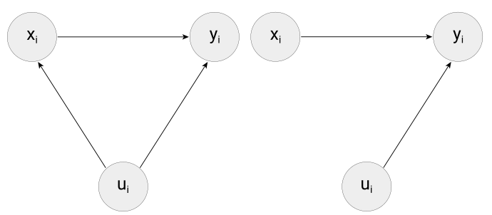

# Basic Statistical Modeling in R

When working with data in economics and social sciences, statistical modeling is often the final destination of the data pipeline. After importing, cleaning, transforming, and exploring your data, you typically want to understand relationships between variables or test specific hypotheses. This chapter introduces the most fundamental tool for this purpose: linear regression\index{Linear Regression} using ordinary least squares (OLS)\index{OLS (Ordinary Least Squares)}.

**Prerequisites:** Familiarity with R data frames and basic operations (Chapters 2 and 4). Understanding of summary statistics from Chapter 10 is helpful. Basic knowledge of statistics (mean, standard deviation, correlation) is assumed.

**What you will learn:**

- The conceptual framework of linear regression and OLS estimation
- How to fit and interpret linear models using R's `lm()` function
- How to read regression output: coefficients, standard errors, p-values, R-squared
- How to extend simple regression to multiple predictors
- When regression estimates can (and cannot) be interpreted causally

---

> **In Practice:** Regression analysis remains the workhorse of empirical research across the social sciences and is fundamental to business analytics. Publishing standards have evolved significantly: @christensen2018transparency document that top journals now routinely require replication packages containing all code and data. Referees expect robustness checks: alternative specifications, different sample restrictions, and sensitivity analyses. In industry, similar rigor applies—A/B tests, marketing mix models, and operational research all rely on regression. @angrist_pischke_2009 transformed thinking about regression by emphasizing when estimates have causal interpretations. The `lm()` skills covered in this chapter are just the beginning; building credible analysis requires understanding when regression estimates can—and cannot—be interpreted causally.

## The linear model\index{Linear Model}

Generally, we denote the *dependent variable*\index{Dependent Variable} (what we want to explain) as $y_i$ and the *explanatory variable*\index{Explanatory Variable} (what we think explains it) as $x_i$. All factors not explicitly included in our model are captured by the *error term*\index{Error Term} ($u_{i}$). When we estimate the model, the differences between observed and predicted values are called *residuals*\index{Residuals}—our best approximation of the unobserved error term. The basic linear model can be written as:

$y_{i}= \alpha + \beta x_{i} + u_{i}$

where:
- $\alpha$ is the intercept (the expected value of $y$ when $x=0$)
- $\beta$ is the slope coefficient\index{Coefficient} (how much $y$ changes when $x$ increases by one unit)
- $u_{i}$ captures everything else affecting $y$ that we haven't measured

The goal is to estimate $\alpha$ and $\beta$ from our data. The method of *ordinary least squares* finds the values that minimize the sum of squared differences between predicted and actual values of $y$.

### Causality considerations\index{Causality}

A key question in applied research is whether we can interpret the estimated relationship as *causal*. The computer scientist Judea Pearl [@pearl2009causality] introduced causal diagrams to think about this clearly.

```{r causality, warning=FALSE, message=FALSE, echo=FALSE, out.width="95%", fig.show='hold', fig.align='center', fig.cap= "(ref:causality)", purl=FALSE}


```
(ref:causality) Causal diagrams (directed acyclic graphs, DAGs) illustrating when regression can identify causal effects. **Left panel**: An endogeneity problem exists because unobserved factors ($u$) affect both the explanatory variable ($x$) and the outcome ($y$)—the estimated relationship may reflect these confounders rather than the true causal effect of $x$ on $y$. **Right panel**: No endogeneity—$u$ affects only $y$, so regression can estimate the causal effect of $x$ on $y$.

For a causal interpretation of $\beta$, the error term $u_{i}$ must be unrelated to $x_i$. Other factors may affect $y$, but they must not simultaneously affect both $y$ and $x$. When this assumption is violated, we have an *endogeneity problem*\index{Endogeneity}.

## Regression in R with `lm()`\index{lm()}

R provides the `lm()` function (for "linear model") to estimate regression models. Let's use the familiar `swiss` dataset to investigate whether education affects examination success.

```{r message=FALSE, warning=FALSE}
# load the data
data(swiss)
```

The dataset contains information on Swiss provinces. We'll examine whether higher education levels (`Education`: percentage of draftees with education beyond primary school) are associated with better examination outcomes (`Examination`: percentage receiving the highest mark on standardized tests).

### Visualizing the relationship

Before running a regression, always visualize your data:

```{r}
plot(swiss$Education, swiss$Examination,
     xlab = "Education (% beyond primary)",
     ylab = "Examination (% highest mark)",
     main = "Education vs Examination in Swiss Provinces")
```

There appears to be a positive relationship between education and examination success.

### Fitting a linear model

The `lm()` function takes a formula and a dataset:

```{r}
# fit the model
model <- lm(Examination ~ Education, data = swiss)
```

The formula `Examination ~ Education` means "Examination as a function of Education."

> **Common Error:** The formula uses a tilde (`~`), not an equals sign or minus. Also, variable names must match exactly—`lm(examination ~ education, data = swiss)` will fail because R is case-sensitive.

### Viewing the results

The simplest way to see the estimated coefficients:

```{r}
model
```

For more detailed output including statistical tests:

```{r}
summary(model)
```

### Interpreting the output

The `summary()` output contains several important pieces of information:

**Coefficients:**
- `(Intercept)`: The estimated $\hat{\alpha}$. Here, about 5.8, meaning a province with 0% education beyond primary school would be predicted to have about 5.8% achieving the highest examination mark.
- `Education`: The estimated $\hat{\beta}$. Here, about 0.58, meaning each additional percentage point of education beyond primary school is associated with about 0.58 percentage points more draftees achieving the highest mark.

**Statistical significance:**\index{Statistical Significance}
- `Std. Error`\index{Standard Error}: The uncertainty in our estimate
- `t value`: The ratio of the estimate to its standard error
- `Pr(>|t|)`: The p-value\index{P-value} testing whether the true coefficient is zero. Small values (typically < 0.05) suggest the relationship is statistically significant.

The stars (`***`, `**`, `*`) indicate significance levels.

**Model fit:**
- `R-squared`\index{R-squared}: The proportion of variance in $y$ explained by the model. Here, about 0.33, meaning education explains about 33% of the variation in examination success across provinces.

### Visualizing the fitted model

Add the regression line to your scatter plot:

```{r}
plot(swiss$Education, swiss$Examination,
     xlab = "Education (% beyond primary)",
     ylab = "Examination (% highest mark)")
abline(model, col = "red", lwd = 2)
```

## Multiple regression\index{Multiple Regression}

Often we want to control for multiple factors. The `lm()` function handles this easily:

```{r}
# include Agriculture as a control variable
model2 <- lm(Examination ~ Education + Agriculture, data = swiss)
summary(model2)
```

The interpretation of `Education` now changes to: the effect of education *holding agriculture constant*.

To include all variables in a dataset:

```{r}
model3 <- lm(Examination ~ ., data = swiss)
summary(model3)
```

The `.` means "all other variables in the dataset."

## Working with model objects

The model object contains useful information you can extract:

```{r}
# get coefficients
coef(model)

# get fitted values (predicted y)
head(fitted(model))

# get residuals (y - predicted y)
head(residuals(model))

# get confidence intervals for coefficients
confint(model)
```

## A word of caution

Statistical significance does not automatically imply causality. In our education example, provinces with higher education levels might differ in other ways that also affect examination success (parental wealth, urbanization, etc.). The simple regression cannot distinguish the effect of education from these confounding factors.

For causal conclusions, you need either:
- A randomized experiment
- A natural experiment or quasi-experimental design
- Careful identification and control for all potential confounders (rarely achievable with observational data alone)

The mathematical details of how OLS estimates are computed, including the derivation of the estimators and a simple implementation, are provided in Appendix B for interested readers.

## Key Takeaways

- The `lm()` function is R's workhorse for linear regression—it estimates the relationship between variables using ordinary least squares.
- The `summary()` function provides essential regression output: coefficients, standard errors, t-statistics, p-values, and R-squared.
- Multiple regression allows you to estimate the effect of one variable while controlling for others—add predictors with `+` in the formula.
- Model objects store valuable information you can extract: `coef()` for coefficients, `fitted()` for predictions, `residuals()` for errors, and `confint()` for confidence intervals.
- Statistical significance does not imply causality—correlation can arise from confounding factors, reverse causation, or coincidence.
- For causal conclusions, you need experimental or quasi-experimental designs, not just regression analysis.

> **AI Support Prompt:** To interpret regression output, paste your results and ask:
>
> `I ran a linear regression in R and got this output: [paste summary(lm(...)) output]. Can you explain what each coefficient means in plain language? What does the R-squared tell me? Should I be concerned about any of these results?`
>
> Interpreting regression output is a skill that improves with practice—AI can provide plain-language explanations of statistical results.

> **AI Support Prompt:** To think through causal claims, describe your analysis:
>
> `I found that [variable X] is significantly associated with [variable Y] in my regression. I want to claim that X causes Y. What confounders should I be worried about? What would I need to rule out alternative explanations?`
>
> Moving from correlation to causation requires careful thinking—AI can help you identify potential threats to causal inference.

> **AI Support Prompt:** To understand regression concepts more deeply, ask:
>
> `I'm learning about regression and don't understand [concept, e.g., 'why we divide by n-k-1 for standard errors', 'what heteroskedasticity means', 'why multicollinearity is a problem']. Can you explain this intuitively with a simple example?`
>
> Statistics concepts can be abstract—AI excels at providing intuitive explanations and concrete examples.

## Further Reading

- @stock_watson_2020: *Introduction to Econometrics* provides a rigorous yet accessible treatment of regression analysis for economics students.
- @angrist_pischke_2009: *Mostly Harmless Econometrics* is essential reading for understanding causal inference in empirical economics.
- @cunningham_2021: *Causal Inference: The Mixtape* offers a modern, accessible introduction to causal inference methods. Freely available at https://mixtape.scunning.com/.

## Exercises

1. **Simple regression**: Using the `mtcars` dataset, estimate a linear regression of `mpg` (miles per gallon) on `wt` (weight).
   a) Write the estimated regression equation
   b) Interpret the coefficient on `wt`—what does it mean in practical terms?
   c) What is the R-squared, and what does it tell you?

2. **Multiple regression**: Extend your model to include both `wt` and `hp` (horsepower) as predictors.
   a) How does the coefficient on `wt` change compared to the simple regression?
   b) Is `hp` statistically significant at the 5% level?
   c) Did adding `hp` improve the model fit? How do you know?

3. **Model diagnostics**: For your multiple regression model:
   a) Extract the residuals and create a histogram—do they look approximately normal?
   b) Plot residuals against fitted values—do you see any patterns?
   c) Identify the three cars with the largest (absolute) residuals

4. **Causality challenge**: A researcher finds that countries with more televisions per capita have higher life expectancy. They conclude that watching TV improves health.
   a) Why might this conclusion be incorrect?
   b) Suggest at least two confounding variables that might explain this correlation
   c) What would be needed to establish a causal relationship?

