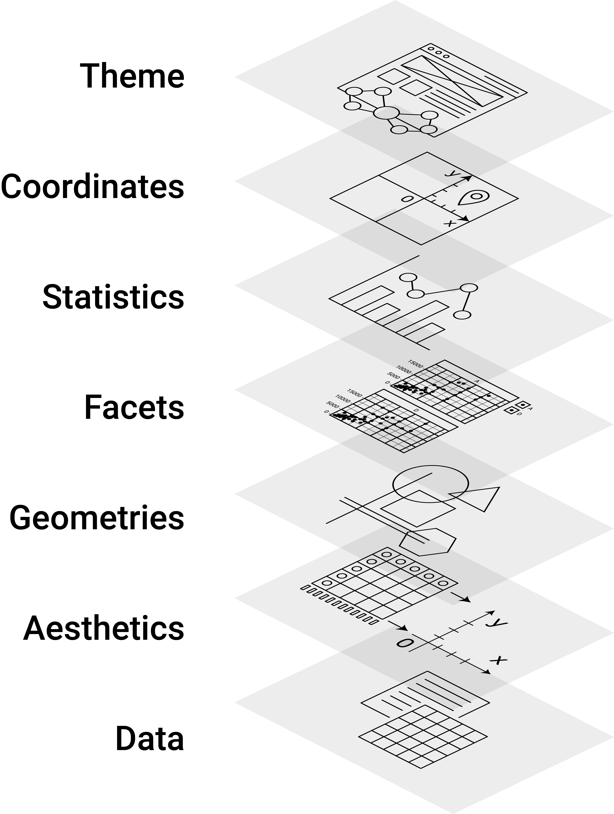

# Data Visualization\index{Data Visualization}

The final stage of any data analysis is communication—sharing your findings with others. Data visualization is one of the most powerful tools for this purpose. A well-designed chart can reveal patterns, highlight relationships, and tell stories that tables of numbers simply cannot. This chapter introduces the principles and practice of data visualization in R using the `ggplot2`\index{ggplot2} package.

**Prerequisites:** Basic R programming skills (Chapter 2) and familiarity with data frames and the tidyverse (Chapters 4, 9). Having completed some exploratory data analysis (Chapter 10) provides helpful context.

**What you will learn:**

- Principles of effective visualization (data-ink ratio, choosing chart types, avoiding deception)
- How to format data values for presentation
- The "Grammar of Graphics" framework underlying `ggplot2`
- How to build plots layer by layer using aesthetics, geometries, and scales
- Creating common plot types: scatter plots, bar charts, histograms, and more
- Customizing plots with themes, labels, and annotations

---

> **In Practice:** Effective data visualization varies dramatically by audience. @schwabish2014guide argues that researchers have traditionally underinvested in visualization, relying too heavily on dense tables that obscure key findings. His practical recommendations—simplify, focus on the message, eliminate chartjunk—apply whether you're creating figures for a journal article, a consulting report, or a business dashboard. In many settings, visualization *is* the deliverable: policy organizations, consulting firms, and corporate analytics teams communicate complex findings primarily through charts. The `ggplot2` skills in this chapter enable you to create publication-quality graphics, but the harder skill is knowing what story your data should tell and designing a visualization that tells it clearly.

## Data display

In the last part of a data pipeline, we typically deal with data visualization and statistical results for presentation/communication. Typical output formats are reports, a thesis (BA, MA, Dissertation chapter), interactive dashboards, and websites. R (and particularly RStudio) provides a very flexible framework to manage the steps involved in visualization/presentation for all of these output formats. The first (low-level) step in preparing data/results for publication is the formatting of data values for publication. Typically, this involves some string operations to make numbers and text look nicer before we show them in a table or graph.

Consider, for example, the following summary statistics.

```{r message=FALSE, warning=FALSE}
# load packages and data
library(tidyverse)
data("swiss")
# compute summary statistics
swiss_summary <-
  summarise(swiss,
          avg_education = mean(Education, na.rm = TRUE),
          avg_fertility = mean(Fertility, na.rm = TRUE),
          N = n()
          )
swiss_summary

```

We likely do not want to present these numbers with that many decimal places. The function `round()` can take care of this.

```{r}
swiss_summary_rounded <- round(swiss_summary, 2)
swiss_summary_rounded
```

More specific formatting of numeric values is easier when coercing the numbers to character strings (text).^[Note that this step only makes sense if we are sure that the numeric values won't be further analyzed or used in a plot (except for labels).] For example, depending on the audience (country/region) to which we want to communicate our results, different standards of how to format numbers are expected. In the English-speaking world, it is quite common to use `.` as decimal mark; in the German-speaking world, it is rather common to use `,`. The `format()`-function provides an easy way to format numbers in this way (once they are coerced to character).

```{r}
swiss_summary_formatted <- format(swiss_summary_rounded,
                                  decimal.mark = ",")
swiss_summary_formatted
```

R also provides various helpful functions to better format/display text strings. See, for example:

- Uppercase/lowercase: `toupper()`/`tolower()`.
- Remove white spaces: `trimws()`.

```{r}
string <- "AbCD "
toupper(string)
tolower(string)
trimws(tolower(string))
```


## Data visualization with `ggplot2`

A key technique to convincingly communicate statistical results and insights from data is visualization. How can we visualize raw data and insights gained from statistical models with R? It turns out that R is a really useful tool for data visualization, thanks to its very powerful graphics engine (i.e., the underlying low-level R functions that handle things like colors, shapes, etc.). Building on this graphics engine, three R packages are particularly prominent, each providing a variety of high-level functions to plot data:

- The original `graphics` package [@r_2018], shipped with the base R installation.
- The `lattice` package [@lattice_2008], an implementation of the original Bell Labs 'Trellis' system.
- The `ggplot2` package [@wickham_navarro_pedersen_2024], an implementation of Leland Wilkinson's 'Grammar of Graphics'.

While these packages provide well-documented high-level R functions to plot data, their syntax differs in some important ways. For R beginners, it thus makes sense to first learn how to generate plots in R with *one* of these packages. Here, we focus on `ggplot2` because it is part of the `tidyverse`.

## 'Grammar of Graphics'\index{Grammar of Graphics}
In 1999, statistician and computer scientist Leland Wilkinson published an influential book called *The Grammar of Graphics* [@wilkinson2005grammar]. In this book, Wilkinson develops a formal description ('grammar') of graphics used in statistics, illustrating how different types of plots (bar plot, histogram, etc.) are special cases of an underlying framework. In short, his idea was that we can think of graphics as consisting of different design layers and thus can build and describe graphics/plots *layer by layer* as illustrated below.


```{r gg2, echo=FALSE, fig.align='center', fig.cap="(ref:gg2)", out.width="85%", purl=FALSE}

```

(ref:gg2) The Grammar of Graphics framework, which underlies `ggplot2`. A visualization is built by combining independent components: **data** (what you're plotting), **aesthetics** (how variables map to visual properties like position, color, size), **geometries** (the visual marks—points, lines, bars), **scales** (how data values translate to visual values), **facets** (splitting into subplots), and **themes** (non-data visual elements). This modular approach makes it easy to build complex, publication-quality graphics incrementally.


This framework was implemented in R with the prominent `ggplot2` package, building on the already powerful R graphics engine. The result is a user-friendly environment to visualize data with enormous potential to plot almost any graphic illustrating data.

## Principles of Effective Visualization

Before diving into the mechanics of `ggplot2`, it's worth considering *what makes a visualization effective*. Edward Tufte, a pioneer in data visualization, articulated several principles that remain influential.

### The data-ink ratio\index{Data-Ink Ratio}

Tufte introduced the concept of the "data-ink ratio": the proportion of a graphic's ink devoted to displaying actual data, as opposed to decorative elements. His recommendation: *maximize the data-ink ratio*. Every element in your visualization should serve a purpose. If removing something doesn't reduce the information conveyed, remove it.

This principle suggests avoiding:

- **Chartjunk**: decorative elements that don't convey data (3D effects, unnecessary gridlines, clip art)
- **Redundant encoding**: using multiple visual channels (color, size, position, labels) to encode the same information unnecessarily (though intentional redundancy can improve accessibility)
- **Heavy borders and backgrounds**: that distract from the data itself

### Choosing the right chart type

Different data relationships call for different chart types:

| Data Relationship | Recommended Chart Types |
|-------------------|------------------------|
| **Distribution** of one variable | Histogram, density plot, box plot\index{Box Plot} |
| **Comparison** across categories | Bar chart\index{Bar Chart} (horizontal for many categories) |
| **Relationship** between two variables | Scatter plot, with trend line if appropriate |
| **Change over time** | Line chart (connects sequential observations) |
| **Part-to-whole** relationships | Stacked bar chart (avoid pie charts for precise comparisons) |
| **Many variables** | Small multiples (faceted plots), parallel coordinates |

### Small multiples

Tufte strongly advocated for "small multiples"—the same chart repeated across different subsets of data, aligned for easy comparison. In `ggplot2`, this is achieved with `facet_wrap()` or `facet_grid()`. Small multiples are often more effective than cramming multiple groups into a single, cluttered chart.

### Honesty in visualization

Visualizations can mislead, intentionally or not. Common pitfalls include:

- **Truncated axes**: starting a bar chart's y-axis at a value other than zero can exaggerate differences
- **Manipulated aspect ratios**: stretching or compressing a chart to emphasize or hide trends
- **Cherry-picked time periods**: showing only the portion of data that supports your narrative
- **Non-sequential ordering**: as illustrated in the Georgia COVID tutorial later in this chapter

The best visualizations are honest: they present data accurately and make interpretation as straightforward as possible.

### Color accessibility\index{Color Accessibility}

Approximately 8% of men and 0.5% of women have some form of color vision deficiency (commonly called "colorblindness")\index{Colorblindness}. The most common form is red-green colorblindness, which makes it difficult to distinguish between reds and greens—precisely the colors many default palettes use to indicate "bad" vs. "good" or different categories.

Designing accessible visualizations means choosing color palettes that remain distinguishable to people with various types of color vision:

- **Avoid red-green distinctions** as the sole way to encode information
- **Use colorblind-friendly palettes** such as viridis\index{viridis}, which was specifically designed to be perceptually uniform and accessible
- **Combine color with other encodings** (shape, line type, direct labels) so color is not the only way to distinguish categories
- **Test your visualizations** with colorblindness simulators (available online or via R packages like `colorBlindness`)

The `viridis` color scales are built into `ggplot2` and provide excellent options:

- `scale_color_viridis_c()` / `scale_fill_viridis_c()` for continuous variables
- `scale_color_viridis_d()` / `scale_fill_viridis_d()` for discrete variables

Other colorblind-friendly options include the ColorBrewer palettes (via `scale_color_brewer()`) and the Okabe-Ito palette. When in doubt, viridis is a safe default that works well in print, on screen, and for colorblind viewers.

### `ggplot2` basics
Using `ggplot2` to generate a basic plot in R is quite simple. It involves three key points:

1. The data must be stored in a `data.frame`/`tibble` (tidy format is recommended but not required).
2. The starting point of a plot is always the function `ggplot()`.
3. The first line of plot code declares the data and the 'aesthetics' (e.g., which variables are mapped to the x-/y-axes):

```{r echo=TRUE, eval=FALSE, purl=FALSE}
ggplot(data = my_dataframe, aes(x= xvar, y= yvar))
```


### Tutorial

> **This tutorial applies:** The `ggplot2` basics covered above

In this section, we learn the basic functionality of `ggplot` by applying it to the `swiss` dataset.

### Loading/preparing the data

First, we load and inspect the data. This historical dataset (from around 1888) contains, among other variables, information about the share of inhabitants of a given Swiss province who indicate to be of Catholic faith (and not Protestant).

```{r echo=TRUE}
# load the R package
library(ggplot2)
# load the data
data(swiss)
# get details about the data set
# ?swiss
# inspect the data
head(swiss)
```


As we do not only want to use this continuous measure in the data visualization, we generate an additional factor variable called `Religion` which has either the value `'Protestant'` or `'Catholic'` depending on whether more than 50 percent of the inhabitants of the province are Catholics.

```{r}
# code province as 'Catholic' if more than 50% are catholic
swiss$Religion <- 'Protestant'
swiss$Religion[50 < swiss$Catholic] <- 'Catholic'
swiss$Religion <- as.factor(swiss$Religion)

```


#### Data and aesthetics\index{Aesthetics}
We initiate the most basic plot with `ggplot()` by defining which data to use and, in the plot aesthetics, which variable to use on the x and y axes. Here, we are interested in whether the level of education beyond primary school in a given district is related to how well draftees from the same district do in a standardized army examination (% of draftees that get the highest mark in the examination).

```{r echo=TRUE, out.width="95%", fig.width=6,fig.height=2.8}
ggplot(data = swiss, aes(x = Education, y = Examination))

```

As we have not yet defined according to what rules the data shall be visualized, all we get is an empty 'canvas' and the axes (with the respective label and ticks indicating the range of the values).

> **Common Error:** The `+` in ggplot2 must come at the *end* of a line, not the beginning of the next line. `ggplot(data) + geom_point()` works, but `ggplot(data)` followed by `+ geom_point()` on a new line fails. Also, don't confuse `+` (adding layers) with `%>%` (piping)—ggplot2 uses `+` to combine components.

### Geometries (~ type of plot)\index{Geometries}
To actually plot the data, we have to define the 'geometries'—the rules according to which the data should be mapped/visualized. In other words, geometries define which 'type of plot' we use to visualize the data (histogram\index{Histogram}, lines, points, etc.). In the example code below, we use `geom_point()`\index{geom\_point()} to get a simple scatter plot\index{Scatter Plot}.

```{r echo=TRUE, out.width="95%", fig.width=6,fig.height=2.8}
ggplot(data = swiss, aes(x = Education, y = Examination)) +
     geom_point()

```

The result indicates a positive correlation between the level of education and how well draftees do in the examination. We want to understand this correlation better—particularly what other factors could drive this picture.

#### Facets\index{Facets}\index{facet\_wrap()}

According to a thesis explored by economic historians [@becker_woessmann2009], the Protestant Reformation and the spread of the Protestant movement in Europe were driving the development of compulsory schooling. It would thus be reasonable to hypothesize that the picture we see is partly driven by differences in schooling between Catholic and Protestant districts. To make such differences visible in the data, we use 'facets' to show the same plot again, but this time separating observations from Catholic and Protestant districts:

```{r echo=TRUE, out.width="95%", fig.width=6,fig.height=2.8}
ggplot(data = swiss, aes(x = Education, y = Examination)) +
     geom_point() +
     facet_wrap(~Religion)

```

Draftees from Protestant districts tend to do generally better (which might indicate better primary schools or a generally stronger focus on the educational achievements of Protestant children). However, the relationship between education (beyond primary schools) and examination success seems to hold for either type of district.

#### Additional layers and statistics\index{geom\_smooth()}
Let's visualize this relationship more clearly by drawing trend lines through the scatter plots—first with the non-parametric 'loess' approach, then with a linear model.

```{r echo=TRUE, out.width="95%", fig.width=6,fig.height=2.8}
ggplot(data = swiss, aes(x = Education, y = Examination)) +
     geom_point() +
     geom_smooth(method = 'loess') +
     facet_wrap(~Religion)

```


```{r echo=TRUE, out.width="95%", fig.width=6,fig.height=2.8}
ggplot(data = swiss, aes(x = Education, y = Examination)) +
     geom_point() +
     geom_smooth(method = 'lm') +
     facet_wrap(~Religion)

```


#### Additional aesthetics

Knowing a little about Swiss history and geography, we realize that rural cantons in mountain regions remained Catholic during the Reformation. In addition, cantonal school systems historically considered that children have to help their parents on the farms during the summers. Thus, in some rural cantons, schools were closed from spring until autumn. Hence, we might want to indicate in the plot which point refers to a predominantly agricultural district. We use the aesthetics of the point geometry to color the points according to the '`Agriculture`'-variable (the % of males involved in agriculture as an occupation).

```{r echo=TRUE, out.width="95%", fig.width=6,fig.height=2.8}
ggplot(data = swiss, aes(x = Education, y = Examination)) +
     geom_point(aes(color = Agriculture)) +
     geom_smooth(method = 'lm') +
     facet_wrap(~Religion)

```

The resulting picture is in line with what we have expected. Overall, the districts with a lower share of agricultural occupation tend to have higher levels of education and achievements in the examination.


#### Coordinates/Themes: Fine-tuning the plot\index{theme()}

Finally, there are countless options to refine the plot further. For example, we can easily change the orientation/coordinates of the plot:

```{r echo=TRUE, out.width="95%", fig.width=6,fig.height=2.8}
ggplot(data = swiss, aes(x = Education, y = Examination)) +
     geom_point(aes(color = Agriculture)) +
     geom_smooth(method = 'lm') +
     facet_wrap(~Religion) +
     coord_flip()

```


In addition, the `theme()`-function allows changing almost every aspect of the plot (margins, font face, font size, etc.). For example, we might prefer to have the plot legend at the bottom and have larger axis labels.


```{r echo=TRUE, out.width="95%", fig.width=6,fig.height=2.8}
ggplot(data = swiss, aes(x = Education, y = Examination)) +
     geom_point(aes(color = Agriculture)) +
     geom_smooth(method = 'lm') +
     facet_wrap(~Religion) +
     theme(legend.position = "bottom", axis.text=element_text(size=12) )

```


Moreover, several theme templates offer ready-made designs for plots:

```{r echo=TRUE, out.width="95%", fig.width=6,fig.height=2.8}
ggplot(data = swiss, aes(x = Education, y = Examination)) +
     geom_point(aes(color = Agriculture)) +
     geom_smooth(method = 'lm') +
     facet_wrap(~Religion) +
     theme_minimal()

```

```{r echo=TRUE, out.width="95%", fig.width=6,fig.height=2.8}
ggplot(data = swiss, aes(x = Education, y = Examination)) +
     geom_point(aes(color = Agriculture)) +
     geom_smooth(method = 'lm') +
     facet_wrap(~Religion) +
     theme_dark()

```

#### Colorblind-friendly palettes

As discussed in the principles section, using accessible color palettes ensures your visualizations work for all viewers. Here we apply the viridis color scale\index{viridis} to our plot—a palette specifically designed to be perceptually uniform and distinguishable by people with color vision deficiencies:

```{r echo=TRUE, out.width="95%", fig.width=6,fig.height=2.8}
ggplot(data = swiss, aes(x = Education, y = Examination)) +
     geom_point(aes(color = Agriculture)) +
     geom_smooth(method = 'lm') +
     facet_wrap(~Religion) +
     scale_color_viridis_c() +
     theme_minimal()

```

The viridis palette progresses from dark purple through blue, green, to yellow—a sequence that remains distinguishable even in grayscale or for viewers with red-green colorblindness. For discrete variables, use `scale_color_viridis_d()` instead. You can also choose alternative viridis palettes with the `option` parameter: `"magma"`, `"inferno"`, `"plasma"`, or `"cividis"` (the last being optimized for viewers with complete colorblindness).

## Dynamic documents\index{R Markdown}\index{Dynamic Documents}

Dynamic documents are a way to directly/dynamically integrate the results of an analysis in R (numbers, tables, plots) in written text (a report, thesis, slide set, website, etc.). That is, we can write a report in the so-called 'R-Markdown' format and place it directly in the same document 'chunks' of R code, which we want to be executed each time we 'knit' the report [@xie_allaire_grolemund_2018]. Knitting the document means that the following steps are executed under the hood:

1. The code in the R chunks is executed, and the results are collected and formatted for print.
2. The formatted R output is embedded in a so-called 'Markdown'-file (`.md`).
3. The markdown file is rendered as either a PDF, HTML, or Word file (with additional formatting options, depending on the output format).

The entire procedure of importing, cleaning, analyzing, and visualizing data can thus be combined in one document, based on which we can generate a meaningful output to communicate our results.


## Tutorial: How to give the wrong impression with data visualization

> **This tutorial applies:** The `ggplot2` basics and Grammar of Graphics concepts covered above

### Background and aim
Referring to the supposed trade-off between public health and economic performance in the context of the SARS-CoV-2 pandemic, Georgia Governor Brian Kemp "reopened the state on April 24 [2020], citing a downward trend of COVID-19 cases being reported by the Georgia Department of Health [...] Georgians have been relying on this data (number of cases, hospitalizations and deaths in their areas) to determine whether or not it's safe for them to go out." ([FIRSTCOAST NEWS](https://www.firstcoastnews.com/article/news/local/georgia/georgia-data-numbers-misrepresented/77-08c31538-3f26-4348-9f30-d81b11dd4d24)) It later turned out that there was no downward trend at all but that the data on Covid cases was intentionally visualized in such a way to give the impression of a downward trend. In this tutorial, we aim to replicate the doctored downward trend visualization, using the original data and `ggplot2`.^[Note that the original data is not 100% identical with the data used in the original plot. The reason is that Covid-numbers are updated/corrected over time, and the original plot used data available at that time.]

```{r echo=FALSE, purl=FALSE, fig.width=0.7, out.width="300pt"}

knitr::include_graphics("img/georgia_vis.jpg")
```


### Data import and preparation

The original raw data was provided by the Georgia Department of Health. We have a cached copy of this data in `data/epicurve_rpt_date.csv`.

```{r, message=FALSE, warning=FALSE}
# SET UP ----------------

# load packages
library(tidyverse)
library(ggplot2)

# fixed variables
COUNTIES <- c("Cobb", "DeKalb", "Fulton", "Gwinnett", "Hall")
MIN_DATE <- as.Date("2020-04-26")
MAX_DATE <- as.Date("2020-05-09")

# read the cached data
cases <- read_csv("data/epicurve_rpt_date.csv")
# inspect the data
head(cases)

```

Once the data is imported, we select/filter the part of the dataset used in the original bar plot. Note the tidyverse functions introduced in previous chapters to prepare an analytic dataset out of the raw data efficiently. At one point, we use the `order()`-function to order the observations according to the report date of covid cases. This is done when displaying the frequency of cases over time. This way, in the following plot, the x-axis serves as a time axis, displaying the date of the corresponding reported case numbers from the beginning of the observation period on the left to the end of the observation period on the right.

```{r}
# filter to five major counties and relevant days
cases <- filter(cases,
                county %in% COUNTIES,
                MIN_DATE <= report_date,
                report_date <= MAX_DATE)
# only the relevant variables
cases <- select(cases, county, report_date, cases)
# order according to date
cases <- cases[order(cases$report_date),]
# we add an additional column in which we treat dates as categories
cases <- mutate(cases, date=factor(report_date))
```

### Plot

First, we show what the actual (honest) plot would essentially look like.

```{r,out.width="95%", fig.width=6,fig.height=2.8}
# guide_axis(n.dodge=2) avoids overlapping x-axis labels
ggplot(cases, aes(y=cases, x=date, fill=county)) +
  geom_bar(position = position_dodge2(), stat = "identity") +
  scale_x_discrete(guide = guide_axis(n.dodge = 2))
 
```

There is no obvious downward trend visible. Now, let us look at what steps are involved in manipulating the visualization in order to give the wrong impression of a downward trend. Importantly, all the manipulation is purely done via the data plotting. We do not touch/manipulate the underlying data (such as removing observations or falsifying numbers).

Two things become apparent when comparing the original plot with what we have so far. First, the order of days on the x-axis is not chronological but seems to be based on the total number of cases per day. Second, the order of the bars of a given day does not follow the alphabetical order of the county names but the number of cases in each of the counties. Let's address the two aspects one at a time. To change the order on the x-axis, we have to re-order the factor levels in `date`.

```{r, out.width="95%", fig.width=6,fig.height=2.8}
# Re-order dates based on total cases per date
cases2 <- mutate(cases,
                 date = fct_reorder(date, cases, sum, .desc = TRUE))

ggplot(cases2, aes(y=cases, x=date, fill=county)) +
  geom_bar(position = position_dodge2(), stat = "identity") +
  scale_x_discrete(guide = guide_axis(n.dodge = 2))
 
```

Note that the number of cases is not exactly the same as in the original. The likely reason for this is that the numbers were updated during May. Given that the overall pattern is very similar, there is no reason to believe that the actual numbers underlying the original figure had been manipulated too. Now, let us address the second aspect (ordering of bars per date). For this, we use the `group` aesthetic, indicating to `ggplot` that we want the number of cases to be used to order the bars within each point in time (date). Setting `position_dodge2(reverse=TRUE)` simply means we want the bars per date to be ordered in decreasing order (by default, it would be increasing; try out the difference by changing it to `position_dodge2(reverse=FALSE)` or simply `position_dodge2()`).


```{r, out.width="95%", fig.width=6,fig.height=2.8}

ggplot(cases2, aes(y=cases, x=date, fill=county, group=cases)) +
  geom_bar(aes(group=cases),
           position = position_dodge2(reverse=TRUE),
           stat = "identity") +
  # this avoids overlapping of x-axis labels
  scale_x_discrete(guide = guide_axis(n.dodge = 2))

 
```

This already looks much more like the original plot.


### Cosmetics: theme

Finally, we tweak the plot's theme to make it look more similar to the original. The following code is a first shot at addressing the most obvious aspects to make the plot more similar to the original. More steps might be needed to make it essentially identical (consider, for example, the color scheme of the bars). This part of the tutorial is a nice illustration of how versatile the `ggplot2`-`theme()`-function is to tweak every cosmetic detail of a plot.

```{r, out.width="95%", fig.width=8,fig.height=4}
ggplot(cases2, aes(y=cases, x=date, fill=county, group=cases)) +
  geom_bar(aes(group=cases),
           position = position_dodge2(reverse=TRUE),
           stat = "identity") +
  ggtitle("Top5 Counties with the Greatest Number of
Confirmed COVID-19 Cases") +
  # this avoids overlapping of x-axis labels
  scale_x_discrete(guide = guide_axis(n.dodge = 2)) +
  guides(fill=guide_legend(title = "County",
                           title.position = "top",
                           direction = "horizontal",
                           title.hjust = 0.5)) +
  theme(legend.position = "top",
        plot.title = element_text(colour = "white", hjust = -0.1),
        legend.key.size = unit(0.5,"line"),
        panel.grid.major = element_blank(),
        panel.grid.minor = element_blank(),        
        panel.background = element_rect(fill="#132a52"),
        legend.background = element_rect(fill="#132a52"),
        plot.background = element_rect(fill="#132a52"),
        legend.text = element_text(colour = "#536b8d"),
        legend.title = element_text(colour = "white"),
        axis.text = element_text(colour = "#536b8d"),
        axis.ticks = element_line(colour = "#71869e"),
        axis.line = element_line(colour="#71869e"),
        axis.title = element_blank())
```

## Key Takeaways

- Data visualization is essential for communicating findings—a well-designed chart can convey insights that tables cannot.
- Effective visualizations follow principles like maximizing the data-ink ratio (minimize chartjunk) and choosing chart types appropriate to the data relationship.
- The "Grammar of Graphics" framework thinks of plots as layers: data, aesthetics (mapping variables to visual properties), geometries (shapes), and themes (styling).
- In `ggplot2`, every plot starts with `ggplot()` and adds layers with `+`: geoms define what to draw, aesthetics define how to map data to visuals.
- Common plot types—scatter plots (`geom_point()`), bar charts (`geom_bar()`), histograms (`geom_histogram()`), and line plots (`geom_line()`)—each serve different purposes.
- Small multiples (`facet_wrap()`, `facet_grid()`) are often more effective than cramming multiple groups into one cluttered chart.
- The `theme()` function provides fine-grained control over every visual element of a plot, enabling publication-quality graphics.
- Honest visualizations avoid common pitfalls: truncated axes, manipulated aspect ratios, cherry-picked time periods, and non-standard orderings.

> **AI Support Prompt:** To choose the right visualization for your data, ask:
>
> `I have data about [describe your data, e.g., 'monthly sales by region over 3 years', 'survey responses by age group', 'correlation between two variables']. I want to show [what you want to communicate, e.g., 'trends over time', 'comparisons between groups', 'the distribution']. What type of chart would work best? Can you show me the ggplot2 code?`
>
> Choosing the right chart type is half the battle in data visualization—AI can suggest options based on your data structure and communication goals.

> **AI Support Prompt:** To customize your ggplot2 visualizations, try:
>
> `I have this ggplot2 code: [paste your code]. I want to [describe what you want to change, e.g., 'change the colors to a colorblind-friendly palette', 'move the legend to the bottom', 'rotate the x-axis labels', 'add annotations']. How do I do this?`
>
> ggplot2 has hundreds of customization options—AI can help you find the right function and syntax for your specific needs.

> **AI Support Prompt:** To make your visualizations more accessible and professional, ask:
>
> `Review this visualization for accessibility and clarity: [describe your chart or paste your ggplot2 code]. Are there any issues with color choices, labeling, or design that might make it hard to understand? How can I improve it?`
>
> Good visualization design considers the audience—AI can help identify accessibility issues and suggest improvements for publication-ready graphics.

## Further Reading

- @wickham_navarro_pedersen_2024: *ggplot2: Elegant Graphics for Data Analysis* (3rd edition) is the definitive guide to ggplot2. Freely available at https://ggplot2-book.org/.
- @tufte_2001: *The Visual Display of Quantitative Information* is the classic text on visualization principles and design.
- @schwabish2021better: *Better Data Visualizations* provides practical guidance on creating effective charts for different audiences.
- The R Graph Gallery: https://r-graph-gallery.com/ offers hundreds of examples with code.

## Exercises

1. **Basic ggplot2**: Using the `mpg` dataset (from `ggplot2`):
   a) Create a scatter plot of highway fuel efficiency (`hwy`) vs. engine displacement (`displ`)
   b) Color the points by the type of drive (`drv`)
   c) Add a smoothed trend line using `geom_smooth()`

2. **Choosing the right chart**: For each of the following scenarios, what type of plot would be most appropriate? Explain your choice.
   a) Showing the distribution of income in a population
   b) Comparing average sales across five product categories
   c) Displaying how stock prices changed over a year
   d) Showing the relationship between two continuous variables

3. **Customizing plots**: Start with a basic scatter plot of `mpg` data (`hwy` vs. `displ`) and customize it:
   a) Add meaningful axis labels and a title
   b) Change the theme to `theme_minimal()`
   c) Adjust the point size and transparency
   d) Save your plot to a file using `ggsave()`

4. **Misleading visualizations**: The Georgia COVID case visualization in the tutorial shows how charts can be misleading. List three common ways that data visualizations can mislead viewers. For each, explain how a careful reader might detect the manipulation.


