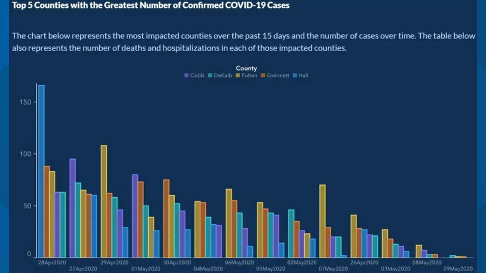

# Data Visualization

## Data display

In the last part of a data pipeline, we typically deal with data visualization and statistical results for presentation/communication. Typical output formats are reports, a thesis (BA, MA, Dissertation chapter), interactive dashboards, and websites. R (and particularly RStudio) provides a very flexible framework to manage the steps involved in visualization/presentation for all of these output formats. The first (low-level) step in preparing data/results for publication is the formatting of data values for publication. Typically, this involves some string operations to make numbers and text look nicer before we show them in a table or graph.

Consider, for example, the following summary statistics.

```{r message=FALSE, warning=FALSE}
# load packages and data
library(tidyverse)
data("swiss")
# compute summary statistics
swiss_summary <-
  summarise(swiss,
          avg_education = mean(Education, na.rm = TRUE),
          avg_fertility = mean(Fertility, na.rm = TRUE),
          N = n()
          )
swiss_summary

```

We likely do not want to present these numbers with that many decimal places. The function `round()` can take care of this.

```{r}
swiss_summary_rounded <- round(swiss_summary, 2)
swiss_summary_rounded
```

More specific formatting of numeric values is easier when coercing the numbers to character strings (text).^[Note that this step only makes sense if we are sure that the numeric values won't be further analyzed or used in a plot (except for labels).] For example, depending on the audience (country/region) to which we want to communicate our results, different standards of how to format numbers are expected. In the English-speaking world it is quite common to use `.` as decimal mark, in the German-speaking world it is rather common to use `,`. The `format()`-function provides an easy way to format numbers in this way (once they are coerced to character).

```{r}

swiss_summary_formatted <- format(swiss_summary_rounded, decimal.mark=",")
swiss_summary_formatted
```

R also provides various helpful functions to better format/display text strings. See, for example:

- Uppercase/lowercase: `toupper()`/`tolowe()`.
- Remove white spaces: `trimws()`,

```{r}
string <- "AbCD "
toupper(string)
tolower(string)
trimws(tolower(string))
```


## Data visualization with `ggplot2`

A key technique to convincingly communicate statistical results and insights from data is visualization. How can we visualize raw data and insights gained from statistical models with R? It turns out that R is a really useful tool for data visualization, thanks to its very powerful graphics engine (i.e., the underlying low-level R functions that handle things like colors, shapes, etc.). Building on this graphics engine, there are particularly three R packages with a variety of high-level functions to plot data in R:

- The original `graphics` package (@r_2018[]; shipped with the base R installation).
- The `lattice` package [@lattice_2008], an implementation of the original Bell Labs 'Trellis' system.
- The `ggplot2` package [@wickham_2016], an implementation of Leland Wilkinson's 'Grammar of Graphics'.

While these packages provide well-documented high-level R functions to plot data, their syntax differs in some important ways. For R beginners, it thus makes sense to first learn how to generate plots in R with *one* of these packages. Here, we focus on `ggplot2` because it is part of the `tidyverse`.

## 'Grammar of Graphics'
A few years back, statistician and computer scientist Leland Wilkinson wrote an influential book called 'The Grammar of Graphics'. In this book, Wilkinson develops a formal description ('grammar') of graphics used in statistics, illustrating how different types of plots (bar plot, histogram, etc.) are special cases of an underlying framework. In short, his idea was that we can think of graphics as consisting of different design layers and thus can build and describe graphics/plots *layer by layer* as illustrated below.


```{r gg, echo=FALSE, fig.align='center', fig.cap="(ref:gg)", out.width="40%", purl=FALSE}
include_graphics("img/grammargraphics.png")
```

(ref:gg) Illustration of the Grammar of Graphics concept.


```{r gg2, echo=FALSE, fig.align='center', fig.cap="(ref:gg2)", out.width="40%", purl=FALSE}

```

(ref:gg2) Illustration of the Grammar of Graphics concept.


This framework got implemented in R with the prominent `ggplot2`-package, building on the already powerful R graphics engine. The result is a user-friendly environment to visualize data with enormous potential to plot almost any graphic illustrating data.

### `ggplot2` basics
Using `ggplot2` to generate a basic plot in R is quite simple. It involves three key points:

1. The data must be stored in a `data.frame`/`tibble` (in tidy format).
2. The starting point of a plot is always the function `ggplot()`.
3. The first line of plot code declares the data and the 'aesthetics' (e.g., which variables are mapped to the x-/y-axes):

```{r echo=TRUE, eval=FALSE, purl=FALSE}
ggplot(data = my_dataframe, aes(x= xvar, y= yvar))
```


### Tutorial

In the following, we learn the basic functionality of `ggplot` by applying it to the `swiss` dataset.

### Loading/preparing the data

First, we load and inspect the data. Among other variables, it contains information about the share of inhabitants of a given Swiss province who indicate to be of Catholic faith (and not Protestant).

```{r echo=TRUE}
# load the R package
library(ggplot2)
# load the data
data(swiss)
# get details about the data set
# ?swiss
# inspect the data
head(swiss)
```


As we do not only want to use this continuous measure in the data visualization, we generate an additional factor variable called `Religion` which has either the value `'Protestant'` or `'Catholic'` depending on whether more than 50 percent of the inhabitants of the province are Catholics.

```{r}
# code province as 'Catholic' if more than 50% are catholic
swiss$Religion <- 'Protestant'
swiss$Religion[50 < swiss$Catholic] <- 'Catholic'
swiss$Religion <- as.factor(swiss$Religion)

```


#### Data and aesthetics
We initiate the most basic plot with `ggplot()` by defining which data to use and, in the plot aesthetics, which variable to use on the x and y axes. Here, we are interested in whether the level of education beyond primary school in a given district is related to how well draftees from the same district do in a standardized army examination (% of draftees that get the highest mark in the examination).

```{r echo=TRUE, out.width="85%", fig.width=6,fig.height=2.8}
ggplot(data = swiss, aes(x = Education, y = Examination))

```

As we have not yet defined according to what rules the data shall be visualized, all we get is an empty 'canvas' and the axes (with the respective label and ticks indicating the range of the values).

### Geometries (~ type of plot)
To actually plot the data, we have to define the 'geometries', defined according to which function the data should be mapped/visualized. In other words, geometries define which 'type of plot' we use to visualize the data (histogram, lines, points, etc.). In the example code below, we use `geom_point()` to get a simple point plot.

```{r echo=TRUE, out.width="85%", fig.width=6,fig.height=2.8}
ggplot(data = swiss, aes(x = Education, y = Examination)) +
     geom_point()

```

The result indicates a positive correlation between the level of education and how well draftees do in the examination. We want to understand this correlation better. Particularly what other factors could drive this picture?

#### Facets

According to a popular thesis, the protestant reformation and the spread of the protestant movement in Europe were driving the development of compulsory schooling. It would thus be reasonable to hypothesize that the picture we see is partly driven by differences in schooling between Catholic and Protestant districts. To make such differences visible in the data, we use 'facets' to show the same plot again, but this time separating observations from Catholic and Protestant districts:

```{r echo=TRUE, out.width="85%", fig.width=6,fig.height=2.8}
ggplot(data = swiss, aes(x = Education, y = Examination)) +
     geom_point() +
     facet_wrap(~Religion)

```

Draftees from protestant districts tend to do generally better (which might indicate better primary schools or a generally stronger focus on the educational achievements of Protestant children). However, the relationship between education (beyond primary schools) and examination success seems to hold for either type of district.

#### Additional layers and statistics
Let's visualize this relationship more clearly by drawing trend lines through the scattered diagrams. Once with the non-parametric 'loess'-approach and once forcing a linear model on the relationship between the two variables.

```{r echo=TRUE, out.width="85%", fig.width=6,fig.height=2.8}
ggplot(data = swiss, aes(x = Education, y = Examination)) +
     geom_point() +
     geom_smooth(method = 'loess') +
     facet_wrap(~Religion)

```


```{r echo=TRUE, out.width="85%", fig.width=6,fig.height=2.8}
ggplot(data = swiss, aes(x = Education, y = Examination)) +
     geom_point() +
     geom_smooth(method = 'lm') +
     facet_wrap(~Religion)

```


#### Additional aesthetics

Knowing a little about Swiss history and geography, we realize that rural cantons in mountain regions remained Catholic during the Reformation. In addition, cantonal school systems historically considered that children have to help their parents on the farms during the summers. Thus in some rural cantons, schools were closed from spring until autumn. Hence, we might want to indicate in the plot which point refers to a predominantly agricultural district. We use the aesthetics of the point geometry to color the points according to the '`Agriculture`'-variable (the % of males involved in agriculture as an occupation).

```{r echo=TRUE, out.width="85%", fig.width=6,fig.height=2.8}
ggplot(data = swiss, aes(x = Education, y = Examination)) +
     geom_point(aes(color = Agriculture)) +
     geom_smooth(method = 'lm') +
     facet_wrap(~Religion)

```

The resulting picture is in line with what we have expected. Overall, the districts with a lower share of agricultural occupation tend to have higher levels of education and achievements in the examination.


#### Coordinates/Themes: Fine-tuning the plot

Finally, there are countless options to refine the plot further. For example, we can easily change the orientation/coordinates of the plot:

```{r echo=TRUE, out.width="85%", fig.width=6,fig.height=2.8}
ggplot(data = swiss, aes(x = Education, y = Examination)) +
     geom_point(aes(color = Agriculture)) +
     geom_smooth(method = 'lm') +
     facet_wrap(~Religion) +
     coord_flip()

```


In addition, the `theme()`-function allows changing almost every aspect of the plot (margins, font face, font size, etc.). For example, we might prefer to have the plot legend at the bottom and have larger axis labels.


```{r echo=TRUE, out.width="85%", fig.width=6,fig.height=2.8}
ggplot(data = swiss, aes(x = Education, y = Examination)) +
     geom_point(aes(color = Agriculture)) +
     geom_smooth(method = 'lm') +
     facet_wrap(~Religion) +
     theme(legend.position = "bottom", axis.text=element_text(size=12) )

```


Moreover, several theme templates offer ready-made designs for plots:

```{r echo=TRUE, out.width="85%", fig.width=6,fig.height=2.8}
ggplot(data = swiss, aes(x = Education, y = Examination)) +
     geom_point(aes(color = Agriculture)) +
     geom_smooth(method = 'lm') +
     facet_wrap(~Religion) +
     theme_minimal()

```

```{r echo=TRUE, out.width="85%", fig.width=6,fig.height=2.8}
ggplot(data = swiss, aes(x = Education, y = Examination)) +
     geom_point(aes(color = Agriculture)) +
     geom_smooth(method = 'lm') +
     facet_wrap(~Religion) +
     theme_dark()

```

## Dynamic documents

Dynamic documents are a way to directly/dynamically integrate the results of an analysis in R (numbers, tables, plots) in written text (a report, thesis, slide set, website, etc.). That is, we can write a report in the so-called 'R-Markdown' format and place it directly in the same document 'chunks' of R code, which we want to be executed each time we 'knit' the report. Knitting the document means that the following steps are executed under the hood:

1. The code in the R chunks is executed, and the results are cached and formatted for print.
2. The formatted R output is embedded in a so-called 'Markdown'-file (`.md`).
3. The markdown file is rendered as either a PDF, HTML, or Word file (with additional formatting options, depending on the output format).

The entire procedure of importing, cleaning, analyzing, and visualizing data can thus be combined in one document, based on which we can generate a meaningful output to communicate our results.


## Tutorial: How to give the wrong impression with data visualization

### Background and aim
Referring to the supposed trade-off between public health and economic performance in the context of the SARS-CoV-2 pandemic, Georgia Governor Brian Kemp has "reopened the state on April 24 [2020], citing a downward trend of COVID-19 cases being reported by the Georgia Department of Health [...] Georgians have been relying on this data (number of cases, hospitalizations and deaths in their areas) to determine whether or not it's safe for them to go out." ([FIRSTCOAST NEWS](https://www.firstcoastnews.com/article/news/local/georgia/georgia-data-numbers-misrepresented/77-08c31538-3f26-4348-9f30-d81b11dd4d24)) It later turned out that there was no downward trend at all but that the data on Covid cases was intentionally visualized in such a way to give the impression of a downward trend. In this tutorial, we aim to replicate the doctored downward trend visualization, using the original data and `ggplot2`.^[Note that the original data is not 100% identical with the data used in the original plot. The reason is that Covid-numbers are updated/corrected over time, and the original plot uses very recent data.]

```{r echo=FALSE, purl=FALSE, fig.width=0.7, out.width="300pt"}


```


### Data import and preparation

The original raw data is provided in a zip-file (compressed file). The code chunk below shows some tricks of how to download and import data from an online zip-file as part of a simple data analytics script. First, we generate a temporary file with `tempfile()`. We then download the compressed zip file containing the Covid-data to the temporary file via `download.file(DATA_URL, destfile = tmp)`. Finally, we use `unzip(tmp, files = "epicurve_rpt_date.csv" )` in order to decompress the one CSV-file in the zip-file we want to work with. After that, we can simply import the CSV-file the usual way (with the `read_cav()` function).

```{r, message=FALSE, warning=FALSE}
# SET UP ----------------

# load packages
library(tidyverse)
library(ggplot2)

# fix vars
DATA_URL <- "https://ga-covid19.ondemand.sas.com/docs/ga_covid_data.zip"
COUNTIES <- c("Cobb", "DeKalb", "Fulton", "Gwinnett", "Hall")
MIN_DATE <- as.Date("2020-04-26")
MAX_DATE <- as.Date("2020-05-09")


# FETCH/IMPORT DATA -----------------------

# create a temporary file to store the downloaded zipfile
tmp <- tempfile()
download.file(DATA_URL, destfile = tmp)
# unzip the file we need
path <- unzip(tmp, files = "epicurve_rpt_date.csv" )
# read the data
cases <- read_csv(path)
# inspect the data
head(cases)

```

Once the data is imported, we select/filter the part of the dataset used in the original bar plot. Note the tidyverse-functions introduced in previous lectures to prepare an analytic dataset out of the raw data efficiently. At one point, we use the `order()`-function to order the observations according to the report date of covid cases. This is done when displaying the frequency of cases over time. This way, in the following plot, the x-axis serves as a time axis, displaying the date of the corresponding reported case numbers from the beginning of the observation period on the left to the end of the observation period on the right).

```{r}
# only observations in the five major counties and during the relevant days
cases <- filter(cases, county %in% COUNTIES, MIN_DATE <= report_date, report_date <= MAX_DATE)
# only the relevant variables
cases <- select(cases, county, report_date, cases)
# order according to date
cases <- cases[order(cases$report_date),]
# we add an additional column in which we treat dates as categories
cases <- mutate(cases, date=factor(report_date))
```

### Plot

First, we show what the actual (honest) plot would essentially look like.

```{r,out.width="85%", fig.width=6,fig.height=2.8}
ggplot(cases, aes(y=cases, x=date, fill=county)) +
  geom_bar(position = position_dodge2(), stat = "identity") +
  scale_x_discrete(guide = guide_axis(n.dodge = 2)) # this avoids overlapping of x-axis labels (and is similar to what is done in the original plot)
 
```

There is no obvious downward trend visible. Now, let us look at what steps are involved in manipulating the visualization in order to give the wrong impression of a downward trend. Importantly, all the manipulation is purely done via the data plotting. We do not touch/manipulate the underlying data (such as removing observations or falsifying numbers).

Two things become apparent when comparing the original plot with what we have so far. First, the order of days on the X-axis is not chronological but seems to be based on the total number of cases per day. Second, the order of the bars of a given day does not follow the alphabetical order of the county names but the number of cases in each of the counties. Let's address the two aspects one at the time. To change the order on the x-axis, we have to re-order the factor levels in `date`.

```{r, out.width="85%", fig.width=6,fig.height=2.8}
cases2 <- mutate(cases, date= fct_reorder(date, cases, sum,.desc = TRUE)) # re-order the dates based on the total number of cases per date.

ggplot(cases2, aes(y=cases, x=date, fill=county)) +
  geom_bar(position = position_dodge2(), stat = "identity") +
  scale_x_discrete(guide = guide_axis(n.dodge = 2))  # this avoids overlapping of x-axis labels (and is similar to what is done in the original plot)
 
```

Note that the number of cases is not exactly the same as in the original. Quite the reason for this is that the numbers have been updated during May. Given that the overall pattern is very similar, there is no reason to believe that the actual numbers underlying the original figure had been manipulated too. Now, let us address the second aspect (ordering of bars per date). For this, we use the `group` aesthetic, indicating to `ggplot` that we want the number of cases to be used to order the bars within each point in time (date). Setting `position_dodge2(reverse=TRUE)` simply means we want the bars per date to be ordered in decreasing order (per default, it would be increasing; try out the difference by changing it to `position_dodge2(reverse=FALSE)` or simply `position_dodge2()`).


```{r, out.width="85%", fig.width=6,fig.height=2.8}

ggplot(cases2, aes(y=cases, x=date, fill=county, group=cases)) +
  geom_bar(aes(group=cases), position = position_dodge2(reverse=TRUE), stat = "identity") +
    scale_x_discrete(guide = guide_axis(n.dodge = 2))  # this avoids overlapping of x-axis labels (and is similar to what is done in the original plot)

 
```

This already looks much more like the original plot.


### Cosmetics: theme

Finally, we tweaked the plot's theme to make it look more similar to the original. The following code is a first shot at addressing the most obvious aspects to make the plot more similar to the original. More steps might be needed to make it essentially identical (consider, for example, the color scheme of the bars). This part of the tutorial is a nice illustration of how versatile the `ggplot2`-`theme()`-function is to tweak every cosmetic detail of a plot.

```{r, out.width="85%", fig.width=8,fig.height=4}
ggplot(cases2, aes(y=cases, x=date, fill=county, group=cases)) +
  geom_bar(aes(group=cases), position = position_dodge2(reverse=TRUE), stat = "identity") +
  ggtitle("Top5 Counties with the Greatest Number of Confirmed COVID-19 Cases") +
  scale_x_discrete(guide = guide_axis(n.dodge = 2)) +  # this avoids overlapping of x-axis labels (and is similar to what is done in the original plot)
  guides(fill=guide_legend(title = "County",
                           title.position = "top",
                           direction = "horizontal",
                           title.hjust = 0.5)) +
  theme(legend.position = "top",
        plot.title = element_text(colour = "white", hjust = -0.1),
        legend.key.size = unit(0.5,"line"),
        panel.grid.major = element_blank(),
        panel.grid.minor = element_blank(),        
        panel.background = element_rect(fill="#132a52"),
        legend.background = element_rect(fill="#132a52"),
        plot.background = element_rect(fill="#132a52"),
        legend.text = element_text(colour = "#536b8d"),
        legend.title = element_text(colour = "white"),
        axis.text = element_text(colour = "#536b8d"),
        axis.ticks = element_line(colour = "#71869e"),
        axis.line = element_line(colour="#71869e"),
        axis.title = element_blank())
```


