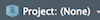
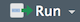
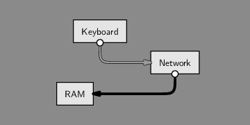
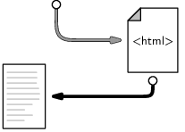
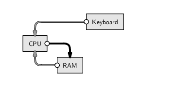
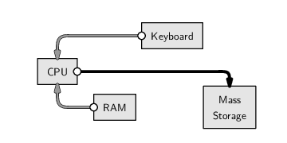

```{r set-options, echo=FALSE, cache=FALSE}
options(width = 100)
library(knitr)
```


# Why R?


## The 'data language'
- Widely used in Data Science jobs.
- Originaly designed as a tool for statistical analysis.
- Particularly useful to program with data.


## High-level language
- Relatively easy to learn.
- A lot free tutotials and support online.


## Free, open source, large community
- Used in various fields.
- Thousands of 'R-packages' covering diverse aspects of data analysis.
- Learn from open sources.


# The Tools

## R

```{r echo=FALSE, fig.align='center', out.width="55%"}

include_graphics("../../img/rlogo.png")

```
Install R from [here](https://stat.ethz.ch/CRAN/)!


## RStudio

```{r echo=FALSE, fig.align='center', out.width="55%"}

include_graphics("../../img/rstudio.png")

```
Install RStudio from [here](https://www.rstudio.com/products/rstudio/download/#download)!


 

## Atom

```{r echo=FALSE, fig.align='center', out.width="55%"}

include_graphics("../../img/atom.png")

```
Install Atom from [here](https://flight-manual.atom.io/getting-started/sections/installing-atom/)!


# Exercises

## Exercise A: Setting up a Working Environment {.smaller}

 1. Open RStudio and get familiar with the file browser pane on the lower right. Navigate to a folder on your hard disk in which you want to work throughout this course (and store all the code you write in this course).

 2. Use the 'New Folder'-button to create a new folder. Name this new folder `r_course`. 

 3. You should see the new folder listed in the file browser. Click on it to navigate to its contents (so far empty). Now, click on the 'More' button and select 'Set as Working Directory' in the drop-down menu.

 4. Again, use the 'New Folder'-button in order to create two new folders called `data` and `code`.

 5. Finally, click on the project button in the top-right corner of the RStudio window () and select 'New Project' in the drop-down menu. In the pop-up window, select 'Existing directory', browse to and select your `r_course` folder, then click 'Create Project'.

Now you know how to set up a meaningful basic folder structure and working environment for an R project. The next exercise teaches you how to write R scripts in this environment.


## Exercise B: R Scripts {.smaller}

1. Switch to the R console and type the following line of code and hit enter (see example from above).

```{r eval=FALSE, purl=FALSE}
print("Hello world")
```
You should see the words `"Hello world"` printed on screen. This is the usual way of working with R in an interactive session. However, as pointed out above, in most circumstances it makes sense to write the R code to an R script (in order to store and document it) and then execute the code from there.

2. In the RStudio Menu-bar select `File/New File/R Script` to create a new file, shown/opened in the Script pane.

3. Type `print("Hello world")` to the first line of the script, and click on 'Run' () to execute the code in the console.


# Part II: Data processing illustration

## Downloading/accessing a website

```{r htmldownload, echo=FALSE, out.width = "60%", fig.align='center', fig.cap= "Components involved in 'visiting' a website. Figure by @murrell_2009 (licensed under [CC BY-NC-SA 3.0 NZ](https://creativecommons.org/licenses/by-nc-sa/3.0/nz/))", purl=FALSE}

```


## Downloading/accessing a website

```{r htmldownloaddata, echo=FALSE, out.width = "40%", fig.align='center', fig.cap= "Data involved involved in 'visiting a website'. Figure by @murrell_2009 (licensed under [CC BY-NC-SA 3.0 NZ](https://creativecommons.org/licenses/by-nc-sa/3.0/nz/))", purl=FALSE}

```


## How can we do this in R? 

Download the website (read its source code into RAM)

```{r}
clockHTML <- readLines("https://www.census.gov/popclock/")
```

Have a look at the first lines of the webpage's source code:

```{r}
head(clockHTML)
```


## Searching/filtering the webpage

Search the source code for the line that contains the part of the website with the world population counter:

```{r}
line_number <- grep('id="world-pop-container"', clockHTML)
```

We can now check on which line the text was found.

```{r}
line_number
```

## Searching/filtering the webpage


```{r ramcalc, echo=FALSE, out.width = "60%", fig.align='center', fig.cap= "Accessing data in RAM, processing it, and storing the result in RAM. Figure by @murrell_2009 (licensed under [CC BY-NC-SA 3.0 NZ](https://creativecommons.org/licenses/by-nc-sa/3.0/nz/)).", purl=FALSE}

```


## Output to local hard drive


```{r eval=FALSE}
writeLines(clockHTML, "clock.html")
```


## Output to local hard drive


```{r htmlstore, echo=FALSE, out.width = "60%", fig.align='center', fig.cap= "Writing data stored in RAM to a Mass Storage device (hard drive). Figure by @murrell_2009 (licensed under [CC BY-NC-SA 3.0 NZ](https://creativecommons.org/licenses/by-nc-sa/3.0/nz/)).", purl=FALSE}

```


# Part III: Point Nemo

## Set Up  {.smaller}

1. Go to [NASA's Earth System Data Explorer](https://mynasadata.larc.nasa.gov/EarthSystemLAS/UI.vm)
2. Click on Data Set, select `Temperatures/Monthly Near-Surface Air Temperature (ISCCP)`. 
3. In the lower left corner of the dashboard under 'Line Plots' select `Time`.
4. Enter the coordinats `48.9 S`/`123.4 W` (Point Nemo)
5. Click 'Update Plot' in the upper left corner.

---

```{r nasa, echo=FALSE, fig.align='center', fig.cap="NASA's Earth System Data Explorer (Live Access Server), coordinates set to the Pacific Pole of Inaccessibility ('Point Nemo')", out.width="75%", purl=FALSE}
include_graphics("../../img/nasa_las.png")
```


## Download and data import {.smaller}

1. Click on `Save As...`.
2. In the new tab select `ASCII` from the `Select a Data Format:`-dropdown menu, and
3. select the time frame from January 1994 to December 1997.
4. Click `Save`.

The downloaded ASCII-file containing the raw data should open in a new tab. Inspect the data and save it as `PointNemo.txt` in your current R working directory (`File/Save Page As...`) or another directory dedicated to store data.


## Read Raw ASCII Data

```{r echo=FALSE, purl = FALSE}
# read the data
point_nemo <- 
  read.table("../../../data/PointNemo.txt", skip = 8,
           colClasses = c("character",
                          "NULL", "numeric"),
           col.names = c("date", "",  "temp"))
```


```{r eval=FALSE }
# read the data
point_nemo <- 
  read.table("PointNemo.txt", skip = 8,
           colClasses = c("character",
                          "NULL", "numeric"),
           col.names = c("date", "",  "temp"))

```

```{r}
# inspect the first rows
head(point_nemo)

```


## Exercise C  {.smaller}

 - Repeat what we've just done for a different point on earth: the Eurasian Pole of Inaccessibility (46.17 N, 86.4 E). 
 - Hint: Once you have stored the raw ASCII data in the same folder as `Eurasia.txt`, we can simply reuse the piece of code from before to load the data into R. The only thing we have to change is the file name.


## Read Raw ASCII Data


```{r echo=FALSE}
# read the data
eurasia <- 
  read.table("../../../data/Eurasia.txt", skip = 8,
           colClasses = c("character",
                          "NULL", "numeric"),
           col.names = c("date", "",  "temp"))


```

```{r eval=FALSE, purl=FALSE}
# read the data
eurasia <- 
  read.table("Eurasia.txt", skip = 8,
           colClasses = c("character",
                          "NULL", "numeric"),
           col.names = c("date", "",  "temp"))

```


```{r}

# inspect the first rows
head(eurasia)

```


# Q&A


<style>
slides > slide { overflow: scroll; }
slides > slide:not(.nobackground):after {
  content: '';
}
</style>

## References {.smaller}