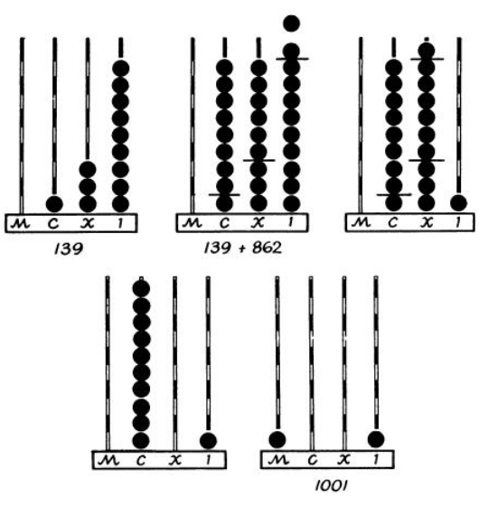
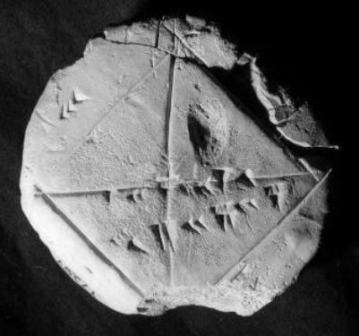

```{r set-options, echo=FALSE, cache=FALSE, purl=FALSE}
options(width = 100)
library(knitr)
library(bookdown)
```

# The recent rise of big data and Data Science

Lower computing costs, a stark decrease in storage costs for digital data, as well as the diffusion of the Internet have over the last few decades led to the development of new products (e.g., smartphones) and services (e.g., web search engines, cloud computing). Figure \@ref(fig:comprise) quantifies some of the key characteristics of this technological change. A side product of these developments is a stark increase in the availability of digital data describing all kind of every-day human activities [@einav_levin2014; @matter_stutzer2015]. As a consequence, new business models and economic structures are emerging with data as their core commodity (i.e., AI-related technological and economic change). For example, the current hype surrounding 'Artificial Intelligence' (AI), largely fueled by the broad application of machine-learning techniques such as 'deep learning' (a form of neural networks), would not be conceivable without the increasing abundance in large amounts of digital data on all kind of socio-economic entities and activities. In short, without understanding and handling the underlying data streams properly, the AI-driven economy cannot function. The same rationale applies, of course, to other ways of making use of digital data, be it traditional big data analytics or scientific research (e.g., applied econometrics). 


```{r comprise, echo=FALSE, out.width = "50%", fig.align='center', fig.cap= "(ref:capcomprise)", purl=FALSE}
include_graphics("../img/comp_costs.png")
```

(ref:capcomprise) Source: http://radar.oreilly.com/2011/08/building-data-startups.html.

The need for proper handling of large amounts of digital data has given rise to the interdisciplinary field of ['Data Science'](https://en.wikipedia.org/wiki/Data_science) as well as an increasing demand for 'Data Scientists'. While nothing within Data Science is particularly new on its own, it is the combination of skills and insights from different fields (particularly Computer Science and Statistics) that has proven to be very productive in meeting new challenges posed by a data-driven economy. In that sense, Data Science is rather a craft than a scientific field. As such, it presupposes a deeper and more practical understanding of the matter at hand (data) than the scientific disciplines Computer Science and Statistics from which it borrows its methods. This is often illustrated in the 'Data Science' Venn-Diagram (see Figure \@ref(fig:dsdiagram)), reflecting the combination of knowledge and skills from Mathematics/Statistics, substantive expertise in the particular scientific field in which Data Science is applied, and 'hacking skills', that is, the skills necessary for *acquiring, cleaning, and manipulating* massive amounts of electronic data. It is exactly this skill-set our course will focus on. 


```{r dsdiagram, echo=FALSE, out.width = "75%", fig.align='center', fig.cap= "(ref:capdsdiagram)", purl=FALSE}
include_graphics("../img/hacking_skills.png")
```

(ref:capdsdiagram) Source: http://berkeleysciencereview.com/how-to-become-a-data-scientist-before-you-graduate/.


Moreover, this course will revisit and apply/integrate concepts learned in the introductory Statistics course (3,222), and will generally presuppose 'substantive expertise' in economics. 


# A brief introduction to data

In order to better understand the role of data in today's economy and society, we have a look at the usage forms and purposes of data records in human history. In a second step, we look at how a computer processes data. Finally, we transfer the concept of analogue data storage to the digital realm.

## Data in human history
Throughout human history, the recording and storage of data has primarily been motivated by measuring, quantifying, and keeping record of both our social and natural environments. Early on, the recording of data has been related to economic activity and scientific endeavor. The neolithic transition from hunter-gatherer societies to agriculture and settlements (the economic development sometimes referred to as the 'first industrial revolution'), came along with a division of labor and more complex organizational structures of society. The change to agricultural food production had on the one hand the effect that more mouths could be fed, but on the other hand also that food production would need to follow a careful planning (the right time to seed and harvest) and that the produced food (e.g. grains) would partly be stored and not consumed entirely on the spot. It is believed that partly due to these two practical problems, keeping track of time and keeping record of produced quantities, neolithic societies started to use signs (numbers/letters) carved in stone or wood. Keeping record of the time and later measuring and keeping record of produce quantities in order to store and trade, likely led to the first 'data sets'. Simultaneously, the development of mathematics, particularly geometry took shape.

## Processing data: simple calculations in numeral systems
In order to keep track of calculations with large numbers, humans started to use mechanical aids such as pebbles or shells and later developed the [counting frame ('abacus')](https://en.wikipedia.org/wiki/Abacus).^[See @hogben_1983, Chapter 1 for a detailed account of the abacus' origin and usage.] We can understand the counting frame as a simple mechanical tool to process numbers (data). In order to use the abacus properly, we have to agree on a standard regarding what each column represents. In other words, we have to define what the *base* (or 'radix') of our numeral system is. For example, the Roman numeral system is essentially one of base 10, with 'I' representing one, 'X' representing ten, 'C' representing one hundred, and 'M' representing one thousand. That is, the first column on the right represents units of \\( 10^0=1 \\), the second \\( 10^1=10 \\), and so forth. The figure below illustrates how a counting frame based on this numeral system works (examples are written out in Arabic numbers). 


```{r abacus, echo=FALSE, out.width = "40%", fig.align='center', fig.cap= "(ref:capabacus)", purl=FALSE}

```

(ref:capybc) A simple abacus. Source: @hogben_1983.

From this we learn that the columns of the abacus are the positions of the digits, which also signify the power of 10 with which the digit is multiplied: \\( 139 =  (1 \\times 10^2) + (3 \\times 10^1) +  (9 \\times 10^0) \\).^[Starting with position/power 0.] In addition, a base of 10 means that the system is based on 10 different signs (0, 1, ..., 9), with which we distuingish one-digit numbers. Further, we recognize that each column in the abacus has 10 beads.

The numeral system with base 10 (the 'Decimal system') is what we use to measure, count, quantify things in our everyday life. Moreover, it is what we normally work with in applied math and statistics (at least in the realm of undergraduate economics). However, the simple but very useful concept of the counting frame also works well for numeral systems with other bases. Historically, numeral systems with other bases existed in various cultures. For example, ancient cultures in Mesopotamia used different forms of a sexagesimal systems (base 60). Which, therefore, consisted of 60 different signs to distinguish 'one-digit' numbers. This logic holds both ways: if a numeral system only consists of two different signs, it follows that the system has to be of base 2 (i.e., a 'Binary system'). As it turns out, this is exactly the kind of numeral system that gets relevant once we replace the abacus with a microprocessor, i.e., a digital computer. 

Anything related to electronically processing (and storing) *digital data*, has to be build on a binary system. The reason is that a microprocessor (similar to a light switch) can only represent two signs (states): on and off. We usually refer to 'off' with the sign '0' and to 'on' with the sign '1'. A numeral system consisting only of the signs 0 and 1 thus must be of base 2. It follows that an abacus of this binary system has columns \\( 2^0=1 \\), \\( 2^1=2 \\), \\( 2^3=4 \\), and so forth. Moreover, each column has only one bead (1) or none (0). Nevertheless we can express all numbers we know from the decimal system. For example, the number 139 that we above expressed with the 'decimal abacus', would be expressed as follows with the binary abacus:

\\[ (1 \\times 2^7) + (1 \\times 2^3) + (1 \\times 2^1) + (1 \\times 2^0) = 139 \\].

If we were to indicate each column of our binary system abacus (that is, including all the columns with 0), we would get the following:

\\[ (1 \\times 2^7) + (0 \\times 2^6) +  (0 \\times 2^5) +  (0 \\times 2^4) + (1 \\times 2^3) + (0 \\times 2^2) + (1 \\times 2^1) +  (1 \\times 2^0)  = 139 \\].


Now, compare this with the abacus in the decimal system above. There, we've set the third column to 1, the second column to 3 and the first column (from the right) to 9: 139. If we do the same in the binary system (takem from the example right above), we get 10001011. That is, the number 139 in the decimal system corresponds to 10001011 in the binary system. How can a computer know that? The only way a computer correctly prints the three symbols `139` to our computer screen when dealing with the binary expression `10001011`, is that the 'binary abacus' is hard-coded into the computer. Since a computer can only understand binary expressions (1s and 0s), we have to define a *standard* how 0s and 1s correspond to symbols, colors, etc. that we see on the screen. In simple terms, our binary abacus hard-coded into a computer is exactly such a standard to work with numbers in the decimal system on a computer. Any digital data processing is in the end happing in the binary system. But, in order to avoid having to work with a keyboard consisting only of an on/off (1/0) switch, these low-level standards help us to interact with the computer. It makes it easier to enter data and commands into the computer and understand the output (i.e., the result of a calculation performed on the computer) on the screen. In simple terms, the standard defining how our number symbols in the decimal system correspond to binary numbers (again, reflecting the idea of an abacus) can be illustrated in the following table:

Number  | 128 | 64 | 32 | 16 | 8  | 4  | 2  |  1 
-----|-----|----|----|----|----|----|----|----
0  = | 0   |  0 | 0  |  0 | 0 |  0 | 0  |  0  
1  = | 0   |  0 | 0  |  0 | 0 |  0 | 0  |  1
2  = | 0   |  0 | 0  |  0 | 0 |  0 | 1  |  0
3  = | 0   |  0 | 0  |  0 | 0 |  0 | 1  |  1
139 = | 1   |  0 | 0  |  0 |  1 |  0 | 1  |  1    


Importantly, such standards are simply derived from a law of nature. Somebody simply has to define them at some point (and hopefully everybody agrees to them lateron).We would probably all agree on that defining the standard to translate binary numbers to the decimal system and back along the lines of our concept of a binary abacus makes a lot of sense. However, when it comes to defining how alphabetical letters should be expressed in binary numbers, many choices might seem reasonable. 


### Storing data


```{r ybc, echo=FALSE, out.width = "40%", fig.align='center', fig.cap= "(ref:capybc)", purl=FALSE}

```

(ref:capybc) YBC 7289. Photo by Bill Casselman.


# References
