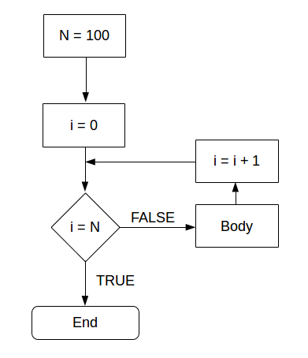

```{r set-options, echo=FALSE, cache=FALSE, purl=FALSE}
options(width = 100)
library(knitr)
library(bookdown)
knitr::opts_chunk$set(fig.pos = 'htb!')
```


Programming: Murrell chapter 9.11
- Go through key concepts (maybe extend a bit, take some from cs50)
- Go through the case study (maybe update needed here)


# Data Structures and Indeces
R provides different object classes to work with data. In simple terms, they differ with regard to how data is structured when saved in a variable. This, in turn, defines how we can access different parts of the data in this variable. For example, if we store a bunch of numbers in a numeric vector, we can then access each of these numbers individually, by telling R to give us the first, second, nth element of this vector. If we store data in a two-dimensional structure such as a matrix, we can then access the data column-wise, row-wise, or cell-wise. Depending on the task, one or the other object class is preferable to store and work with data.

## Vectors and Lists
```{r}
# A vector containing numeric (or integer) values
numeric_vector <- 10:20
numeric_vector[2]
numeric_vector[2:5]

# A string vector ('a vector containing text')
string_vector <- c("a", "b", "c")
string_vector[-3]

# Lists
# A list can contain different types of elements, for example a numeric vector and a string_vector
mylist <- list(numbers = numeric_vector, letters = string_vector)
mylist

# We can access the elements of a list in various ways
# with the element's name
mylist$numbers
mylist["numbers"]
# via the index
mylist[1]
# with [[]] we can access directly the content of the element
mylist[[1]]

# lists can also be nested (list of lists of lists....)
mynestedlist <- list(a = mylist, b = 1:5)
```

## Matrices and Data Frames
```{r}

# matrices
mymatrix <- matrix(numeric_vector, nrow = 4)
# get the second row
mymatrix[2,]
# get the first two columns
mymatrix[, 1:2]

# data frames ("lists as columns")
mydf <- data.frame(Name = c("Alice", "Betty", "Claire"), Age = c(20, 30, 45))
mydf
# select the age column
mydf$Age
mydf[, "Age"]
mydf[, 2]
# select the second row
mydf[2,]


```

## Classes and Data Structure
When importing data to R, using a new R-package, or extracting data from web sources, it is imperative to understand how the data is structured in the R-object (variable) one is working with. A lot of errors occur due to giving R functions input in the wrong format/structure. Having a close look at how the data stored in a variable that we want to work with further can help avoid such errors.^[Note that basic R functions as well as functions distributed via R packages are usually very well documented (look up documentation with `help(FUNCTION-NAME)` or `?FUNCTION-NAME`. An important part of such documentations is what class the input arguments of a function must have and what the class of the returned object is. See, for example the documentation of `mean()` by typing `?mean` into the R-console and hit enter.] The function `class()` returns the class(es) of an R object:

```{r}
# have a look at what kind of object you are dealing with
class(mydf)
class(mymatrix)

```

To get a clear idea of the structure of data stored in a specific variable, we can call the function `str()` (for structure) with the object of interest as the only function argument. This is particularly helpful when dealing with a complex/nested data structure. 

```{r}
# have a closer look at the data structure
str(mydf)
```


<!-- ## Working with Text -->

<!-- ```{r} -->
<!-- # store a string in a variable -->
<!-- astring <- "Hello, world" -->
<!-- class(astring) -->

<!-- # string operations -->
<!-- # split  -->
<!-- strsplit(astring, ", ") -->
<!-- # paste -->
<!-- paste(astring, "! How are you?", sep = "") -->
<!-- # count number of characters -->
<!-- nchar(astring) -->

<!-- # character vectors -->
<!-- stringvec <- c("Apple", "Banana", "Orange") -->
<!-- stringvec -->
<!-- # search patterns -->
<!-- grep(pattern = "A", x = stringvec) -->
<!-- grep(pattern = "an", x = stringvec) -->
<!-- # operations with vectors -->
<!-- paste0(stringvec, "!", sep="") -->

<!-- ``` -->


# Basic programming concepts in R

## Loops
A loop is typically a sequence of statements that is executed a specific number of times. How often the code 'inside' the loop is executed depends on a (hopefully) clearly defined control statement. If we know in advance how often the code inside of the loop has to be executed, we typically write a so-called 'for-loop'. If the number of iterations is not clearly known before executing the code, we typically write a so-called 'while-loop'. The following subsections illustrate both of these concepts in R.

### For-loops
In simple terms, a for-loop tells the computer to execute a sequence of commands 'for each case in a set of n cases'. The following flow-chart illustrates the concept.

```{r for, echo= FALSE, fig.align="center", out.width="40%", fig.cap="(ref:capfor)", purl=FALSE}

```
(ref:capfor) Foor-loop illustration. 


For example, a for-loop could be used to sum up each of the elements in a numeric vector of fix length (thus the number of iterations is clearly defined). In plain English, the for-loop would state something like:"Start with 0 as the current total value, for each of the elements in the vector add the value of this element to the current total value." Note how this logically implies that the loop will 'stop' once the value of the last element in the vector is added to the total. Let's illustrate this in R. Take the numeric vector `c(1,2,3,4,5)`. A for loop to sum up all elements can be implemented as follows:

```{r}
# vector to be summed up
numbers <- c(1,2.1,3.5,4.8,5)
# initiate total
total_sum <- 0
# number of iterations
n <- length(numbers)
# start loop
for (i in 1:n) {
     total_sum <- total_sum + numbers[i]
}

# check result
total_sum
# compare with result of sum() function
sum(numbers)

```

### Nested for-loops
In some situations a simple for-loop might not be sufficient. Within one sequence of commands there might be another sequence of commands that also has to be executed for a number of times each time the first sequence of commands is executed. In such a case we speak of a 'nested for-loop'. We can illustrate this easily by extending the example of the numeric vector above to a matrix for which we want to sum up the values in each column. Building on the loop implemented above, we would say 'for each column `j` of a given numeric matrix, execute the for-loop defined above'.


```{r}
# matrix to be summed up
numbers_matrix <- matrix(1:20, ncol = 4)
numbers_matrix

```

```{r}

# number of iterations for outer loop
m <- ncol(numbers_matrix)
# number of iterations for inner loop
n <- nrow(numbers_matrix)
# start outer loop (loop over columns of matrix)
for (j in 1:m) {
     # start inner loop
     # initiate total
     total_sum <- 0
     for (i in 1:n) {
          total_sum <- total_sum + numbers_matrix[i, j]
          }
     print(total_sum)
     }


```

### While-loop
In a situation where a program has to repeatedly run a sequence of commands but we don't know in advance how many iterations we need in order to reach the intended goal, a while-loop can help. In simple terms, a while loop keeps executing a sequence of commands as long as a certain logical statement is true. The flow chart in Figure \@ref(fig:while) illustrates this point.

```{r while, echo= FALSE, fig.align="center", out.width="65%", fig.cap="(ref:capwhile)", purl=FALSE}
include_graphics("../img/while_loop.png")
```
(ref:capwhile) While-loop illustration. Source: https://en.wikipedia.org/wiki/While_loop#/media/File:While-loop-diagram.svg.

For example, a while-loop in plain English could state something like "start with 0 as the total, add 1.12 to the total until the total is larger than 20." We can implement this in R as follows.

```{r}
# initiate starting value
total <- 0
# start loop
while (total <= 20) {
     total <- total + 1.12
}

# check the result
total

```


## Booleans and Logical Statements
```{r}
2+2 == 4
3+3 == 7

condition <- TRUE
if (condition) {
     print("This is true!")
} else {
     print("This is false!")
}

condition <- FALSE
if (condition) {
     print("This is true!")
} else {
     print("This is false!")
}


```


## R Functions

R programs heavily rely on functions. Conceptually, 'functions' in R are very similar to what we know as 'functions' in math (i.e., $f:X \rightarrow Y$). A function can thus, e.g., take a variable $X$ as input and provide value $Y$ as output. The actual calculation of $Y$ based on $X$ can be something as simple as $2\times X = Y$. But, it could also be a very complex algorithm or an operation that has not directly anything to do with numbers and arithmetic.^[Of course, on the very low level, everything that happens in a microprocessor can in the end be expressed in some formal way using math. However, the point here is, that at the level we work with R, a function could simply process different text strings (i.e., stack them together). Thus for us as programmers, R functions do not necessarily have to do anything with arithmetic and numbers but could serve all kind of purposes, including the parsing of HTML code, etc.]

In R—and many other programming languages—functions take 'parameter values' as input, process those values according to a predefined program, and 'return' the result. For example, a function could take a numeric vector as input and return the sum of all the individual numeric values in the input vector.

When we open RStudio, all basic functions are already loaded automatically. This means we can directly call them from the R-Console or by executing an R-Script. As R is made for data analysis and statistics, the basic functions loaded with R cover many aspects of tasks related to working with and analyzing data. Besides these basic functions, thousands of additional functions covering all kind of topics related to data analysis can be loaded additionally by installing the respective R-packages (`install.packages("PACKAGE-NAME")`), and then loading the packages with `library(PACKAGE-NAME)`. In addition, it is straightforward to define our own functions.


### Compute the mean

```{r}
# own implementation: use R-function for summing up the elements in a vector
# and getting the number of elements in a vector
sum(a) / length(a)

# or use the function delivered with the R installation
mean(a)

# define our own function to compute the mean, given a numeric vector
my_mean <- function(x) {
     x_bar <- sum(x) / length(x)
     return(x_bar)
}

# test it
my_mean(a)

```


# References
