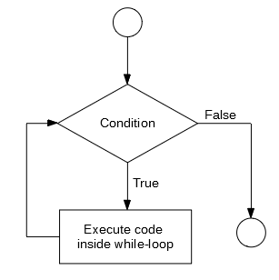

```{r set-options, echo=FALSE, cache=FALSE, purl=FALSE}
options(width = 100)
library(knitr)
library(bookdown)
knitr::opts_chunk$set(fig.pos = 'htb!')
```


___

```{r, echo=FALSE, results='asis', warning=FALSE, purl=FALSE}
# conditional on the output format of the whole document,
# generate and render a HTML or a LaTeX table.
if (knitr::is_latex_output()) {
  
  cat('
  \\begin{center}
  \\href{http://creativecommons.org/licenses/by-nc-sa/4.0/}{\\includegraphics[width = .1\\textwidth]{../img/cc.png}}
  
  \\smallskip
  
  This work is licensed under a \\href{http://creativecommons.org/licenses/by-nc-sa/4.0/}{Creative Commons Attribution-NonCommercial-ShareAlike 4.0 International License}
  \\end{center}
  '
  )
  
} else {
     cat('
     
   <a rel="license" href="http://creativecommons.org/licenses/by-nc-sa/4.0/"></a><br />This work is licensed under a <a rel="license" href="http://creativecommons.org/licenses/by-nc-sa/4.0/">Creative Commons Attribution-NonCommercial-ShareAlike 4.0 International License</a>.
   
')
}
```
___


# First steps with R^[The following sections and examples are based on @umatter_2018.]

Once we understand the basics of the R language and how to write simple programs, understanding and applying already implemented programs is much easier.^[In fact, since R is an open source environment, you can directly look at already implemented programs in order to learn how they work.] 


## Variables and vectors
```{r}
# a simle integer vector
a <- c(10,22,33, 22, 40)

# give names to vector elements
names(a) <- c("Andy", "Betty", "Claire", "Daniel", "Eva")
a

# indexing either via number of vector element (start count with 1)
# or by element name
a[3]
a["Claire"]

# inspect the object you are working with
class(a) # returns the class(es) of the object
str(a) # returns the structure of the object ("what is in variable a?")

```

## Math operators
R knows all basic math operators and has a variety of functions to handle more advanced mathematical problems. One basic practical application of R in academic life is to use it as a sophisticated (and programmable) calculator.
```{r}
# basic arithmetic 
2+2
sum_result <- 2+2
sum_result
sum_result -2
4*5
20/5

# order of operations
2+2*3
(2+2)*3
(5+5)/(2+3)

# work with variables
a <- 20
b <- 10
a/b

# arithmetics with vectors
a <- c(1,4,6)
a * 2

b <- c(10,40,80)
a * b
a + b 


# other common math operators and functions
4^2
sqrt(4^2)
log(2)
exp(10)
log(exp(10))

# special numbers
# Euler's number
exp(1)
# Pi
pi


```


# Basic programming concepts in R

## Loops
A loop is typically a sequence of statements that is executed a specific number of times. How often the code 'inside' the loop is executed depends on a clearly defined control statement. If we know in advance how often the code inside of the loop has to be executed, we typically write a so-called 'for-loop'. If the number of iterations is not clearly known before executing the code, we typically write a so-called 'while-loop'. The following subsections illustrate both of these concepts in R.

### For-loops
In simple terms, a for-loop tells the computer to execute a sequence of commands 'for each case in a set of n cases'. The flow-chart in Figure \@ref(fig:for) illustrates the concept.

```{r for, echo= FALSE, fig.align="center", out.width="40%", fig.cap="(ref:capfor)", purl=FALSE}
include_graphics("../img/forloop.png")
```
(ref:capfor) For-loop illustration. 


For example, a for-loop could be used to sum up each of the elements in a numeric vector of fix length (thus the number of iterations is clearly defined). In plain English, the for-loop would state something like: "Start with 0 as the current total value, for each of the elements in the vector add the value of this element to the current total value." Note how this logically implies that the loop will 'stop' once the value of the last element in the vector is added to the total. Let's illustrate this in R. Take the numeric vector `c(1,2,3,4,5)`. A for loop to sum up all elements can be implemented as follows:

```{r}
# vector to be summed up
numbers <- c(1,2.1,3.5,4.8,5)
# initiate total
total_sum <- 0
# number of iterations
n <- length(numbers)
# start loop
for (i in 1:n) {
     total_sum <- total_sum + numbers[i]
}

# check result
total_sum
# compare with result of sum() function
sum(numbers)

```

### Nested for-loops
In some situations a simple for-loop might not be sufficient. Within one sequence of commands there might be another sequence of commands that also has to be executed for a number of times each time the first sequence of commands is executed. In such a case we speak of a 'nested for-loop'. We can illustrate this easily by extending the example of the numeric vector above to a matrix for which we want to sum up the values in each column. Building on the loop implemented above, we would say 'for each column `j` of a given numeric matrix, execute the for-loop defined above'.


```{r}
# matrix to be summed up
numbers_matrix <- matrix(1:20, ncol = 4)
numbers_matrix

```

```{r}

# number of iterations for outer loop
m <- ncol(numbers_matrix)
# number of iterations for inner loop
n <- nrow(numbers_matrix)
# start outer loop (loop over columns of matrix)
for (j in 1:m) {
     # start inner loop
     # initiate total
     total_sum <- 0
     for (i in 1:n) {
          total_sum <- total_sum + numbers_matrix[i, j]
          }
     print(total_sum)
     }


```

### While-loop
In a situation where a program has to repeatedly run a sequence of commands but we don't know in advance how many iterations we need in order to reach the intended goal, a while-loop can help. In simple terms, a while loop keeps executing a sequence of commands as long as a certain logical statement is true. The flow chart in Figure \@ref(fig:while) illustrates this point.


```{r while, echo= FALSE, fig.align="center", out.width="70%", fig.cap="(ref:capwhile)", purl=FALSE}

```
(ref:capwhile) While-loop illustration.

For example, a while-loop in plain English could state something like "start with 0 as the total, add 1.12 to the total until the total is larger than 20." We can implement this in R as follows.

```{r}
# initiate starting value
total <- 0
# start loop
while (total <= 20) {
     total <- total + 1.12
}

# check the result
total

```


## Booleans and logical statements
```{r}
2+2 == 4
3+3 == 7

condition <- TRUE
if (condition) {
     print("This is true!")
} else {
     print("This is false!")
}

condition <- FALSE
if (condition) {
     print("This is true!")
} else {
     print("This is false!")
}


```


## R functions

R programs heavily rely on functions. Conceptually, 'functions' in R are very similar to what we know as 'functions' in math (i.e., $f:X \rightarrow Y$). A function can thus, e.g., take a variable $X$ as input and provide value $Y$ as output. The actual calculation of $Y$ based on $X$ can be something as simple as $2\times X = Y$. But it could also be a very complex algorithm or an operation that has not directly anything to do with numbers and arithmetic.^[Of course, on the very low level, everything that happens in a microprocessor can in the end be expressed in some formal way using math. However, the point here is, that at the level we work with R, a function could simply process different text strings (i.e., stack them together). Thus for us as programmers, R functions do not necessarily have to do anything with arithmetic and numbers but could serve all kind of purposes, including the parsing of HTML code, etc.]

In R—and many other programming languages—functions take 'parameter values' as input, process those values according to a predefined program, and 'return' the result. For example, a function could take a numeric vector as input and return the sum of all the individual numeric values in the input vector.

When we open RStudio, all basic functions are already loaded automatically. This means we can directly call them from the R-Console or by executing an R-Script. As R is made for data analysis and statistics, the basic functions loaded with R cover many aspects of tasks related to working with and analyzing data. Besides these basic functions, thousands of additional functions covering all kind of topics related to data analysis can be loaded additionally by installing the respective R-packages (`install.packages("PACKAGE-NAME")`), and then loading the packages with `library(PACKAGE-NAME)`. In addition, it is straightforward to define our own functions.


### Tutorial: Compute the mean

In order to illustrate the point of how functions work in R and how we can write our own functions in R, the following code-example illustrates how to implement a function that computes the mean/average value, given a numeric vector.

First, we initiate a simple numeric vector which we then use as an example to test the function. Whenever you implement a function, it is very useful to first define a simple example of an input for which you know what the output should be.

```{r}
# a simle integer vector, for which we want to compute the Mean
a <- c(5.5, 7.5)
# desired functionality and output:
# my_mean(a)
# 6.5
```

In this example, we would thus expect the output to be `6.5`. Later, we will compare the output of our function with this in order to check whether our function works as desired. 

In addition to defining a simple example and the desired output, it makes sense to also think about *how* the function is expected to produce this output. When implementing functions related to statistics (such as the mean), it usually makes sense to have a look at the mathematical definition:

$\bar{x} = \frac{1}{n}\left (\sum_{i=1}^n{x_i}\right ) = \frac{x_1+x_2+\cdots +x_n}{n}$.

Now, we can start thinking about how to implement the function based on built-in R functions. From looking at the mathematical definition of the mean ($\bar{x}$), we recognize that there are two main components to computing the mean:

 - $\sum_{i=1}^n{x_i}$: the sum of all the elements in vector $x$
 - $n$: the number of elements in vector $x$.
 
Once we know how to get these two components, computing the mean is straightforward. In R there are two built-in functions that deliver exactly these two components: 

 - `sum()` returns the sum of all the values in i ts arguments (i.e., if `x` is a numeric vector, `sum(x)` returns the sum of all elements in `x`).
 - `length()` returns the length of a given vector.

With the following short line of code we thus get the mean of the elements in vector `a`.
```{r}
sum(a)/length(a)
```

All that is left to do is to pack all this into the function body of our newly defined `my_mean()` function:

```{r}
# define our own function to compute the mean, given a numeric vector
my_mean <- function(x) {
     x_bar <- sum(x) / length(x)
     return(x_bar)
}
```

Now we can test it based on our example:

```{r}
# test it
my_mean(a)
```

Moreover, we can test it by comparing it with the built-in `mean()` function:

```{r}
b <- c(4,5,2,5,5,7)
my_mean(b) # our own implementation
mean(b) # the built_in function
```


# References


