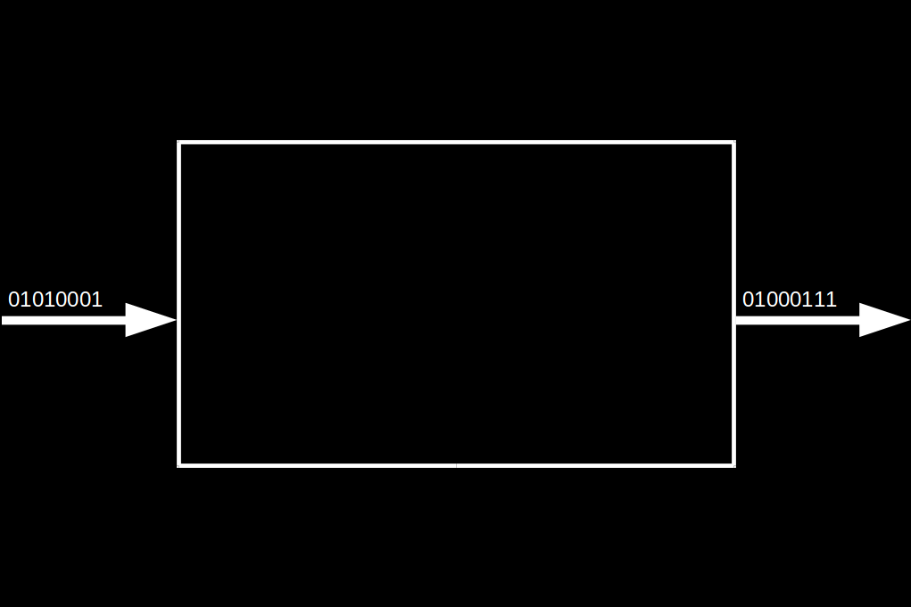
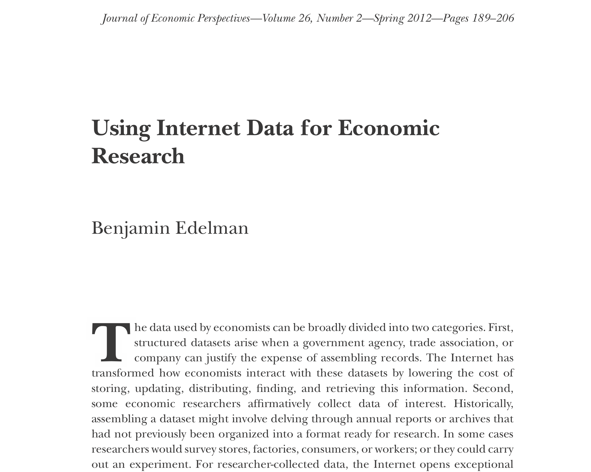
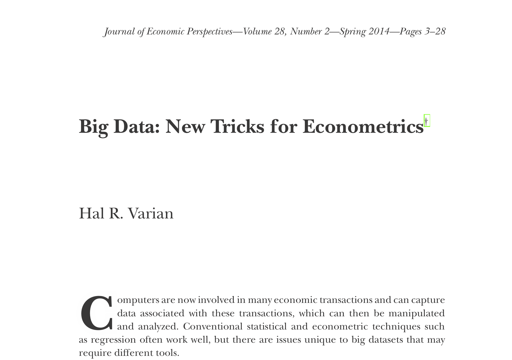
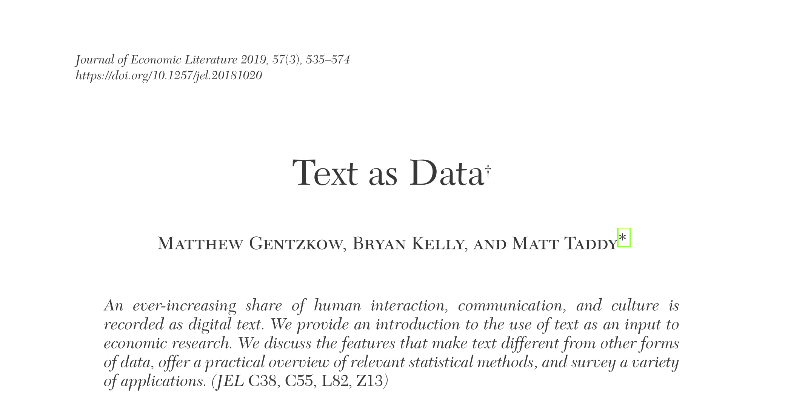
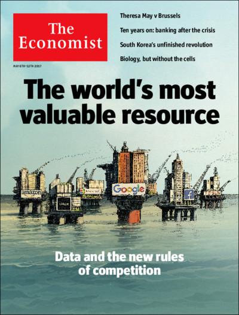
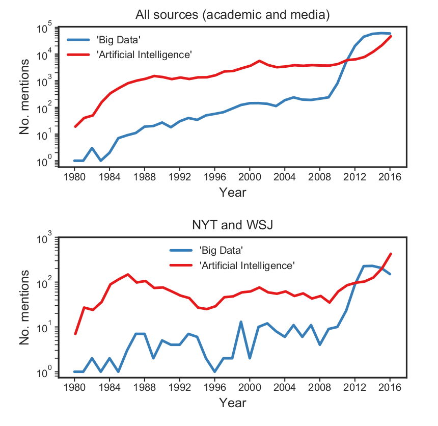

```{r set-options, echo=FALSE, cache=FALSE, warning=FALSE}
options(width = 100)
library(knitr)
```

## Welcome to Data Handling: I.C.V. 2021!

- Fire up your notebooks!
- Go to this page: http://bit.ly/datahandling-2021
- Use one row to respond to the questions in the column headers (see the first two rows for examples).


# Introductory Example

## Data input, processing, output

```{r blackbox, echo=FALSE, out.width = "90%", fig.align='center', purl=FALSE}

```

## The Data Pipeline

```{r datascience, echo=FALSE, out.width = "90%", fig.align='center', purl=FALSE, fig.cap="Data Science workflow. Source: @wickham_grolemund2017, licensed under the [Creative Commons Attribution-Share Alike 3.0 United States](https://creativecommons.org/licenses/by-nc-nd/3.0/us/) license."}
include_graphics("../img/data-science.png")
```

## The Data Pipeline

```{r datascience2, echo=FALSE, out.width = "90%", fig.align='center', purl=FALSE, fig.cap="Data Science workflow. Source: @wickham_grolemund2017, licensed under the [Creative Commons Attribution-Share Alike 3.0 United States](https://creativecommons.org/licenses/by-nc-nd/3.0/us/) license."}
include_graphics("../img/data-science.png")
```

What could be the *output* of all this?


## The Data Pipeline

- Research report/paper (e.g., BA Thesis)
- Presentation/Slides
- Website
- Web application (interactive; alas the introductory example)
- Dashboard for management
- Recommender system (i.e., a trained machine learning algorithm)
- ...

## 'Data Science'?


## 'Data Science'?

*"This coupling of scientific discovery and practice involves the collection, management, processing, analysis, visualization, and interpretation of vast amounts of heterogeneous data associated with a diverse array of scientific, translational, and inter-disciplinary applications."*

University of Michigan 'Data Science Initiative', 2015


## But, what about statistics?!

*"Seemingly, statistics is being marginalized here; the implicit message is that statistics is a part of what goes on in data science but not a very big part. At the same time, many of the concrete descriptions of what the DSI will actually do will seem to statisticians to be bread-and-butter statistics. Statistics is apparently the word that dare not speak its name in connection with such an initiative!"*

David Donoho (2015). __50 years of Data Science__


# Background

## What's new about all this?

*"All in all, I have come to feel that my central interest is in data analysis, which I take to include, among other things: ..."*

## What's new about all this?

*"All in all, I have come to feel that my central interest is in data analysis, which I take to include, among other things: procedures for analyzing data, techniques for interpreting the results of such procedures, ways of planning the gathering of data to make its analysis easier, more precise or more accurate, and all the machinery and results of (mathematical) statistics which apply to analyzing data."*

## What's new about all this?

```{r tukey1, echo=FALSE, out.width = "40%", fig.align='center', purl=FALSE}
include_graphics("../img/tukey.jpg")
```
<center>
John Tukey (_The Future of Data Analysis_, 1962!)
</center>


## Technological change


```{r computers, echo=FALSE, out.width = "90%", fig.align='center', purl=FALSE}

```


## Relevance for modern economic research

```{r css, echo=FALSE, out.width = "90%", fig.align='center',  purl=FALSE}
include_graphics("../img/css.png")
```


## Relevance for modern economic research

```{r internet, echo=FALSE, out.width = "90%", fig.align='center',  purl=FALSE}

```


## Relevance for modern economic research

```{r bigdata, echo=FALSE, out.width = "90%", fig.align='center',  purl=FALSE}

```


## Relevance for modern economic research

```{r text, echo=FALSE, out.width = "90%", fig.align='center',  purl=FALSE}

```


## Economy/Business


```{r newoil, echo=FALSE, out.width = "45%", fig.align='center',  purl=FALSE}

```

----


```{r airevolution, echo=FALSE, out.width = "80%", fig.align='center',  purl=FALSE}

```


<!-- ---- -->


<!-- ```{r bd_ai, echo=FALSE, out.width = "70%", fig.align='center', fig.cap="Top: Number of mentions of the terms 'Big Data' or 'Artificial Intelligence' in academic and media sources, 1980-2016. Bottom: Number of mentions in The New York Times and The Wall Street Journal, used as proxies for U.S. mainstream media and business media. Note logarithmic y-axis scale. Source: @katz_2017.",  purl=FALSE} -->
<!--  -->
<!-- ``` -->


# Organisation of the Course


## Our Team - At Your Service


|   |   |   |
|:-:|:-:|:-:|
|  | |  | 
|  Aurélien Sallin  | Michael Tüting | Ulrich Matter  |

<!-- --- -->

<!-- ```{r help, echo=FALSE, out.width = "75%", fig.align='center',  purl=FALSE} -->
<!-- include_graphics("../img/help_wanted.jpg") -->
<!-- ``` -->


<!-- ## Help wanted -->
<!-- - Experienced R user? -->
<!-- - Assist fellow students during exercises in class -->
<!-- - Disclaimer: this is not an official TA position! -->

<!-- ## Help wanted -->
<!-- - Experienced R user? -->
<!-- - Assist fellow students during exercises in class -->
<!-- - Disclaimer: this is not an official TA position! -->
<!-- - *Interested?*  -->
<!--     - Approach us at the end of today's lecture! -->
<!--     - Or send us an email: philine.widmer@unisg.ch -->


# Course Structure


## Course concept

- Lectures (Thursday morning)
    - Background/Concepts
    - Live demonstrations of concepts
    - Illustration of 'hands-on' approaches
    

## Course components I

- Lectures (Thursday morning)
    - Background/Concepts
    - Live demonstrations of concepts
    - Illustration of 'hands-on' approaches

- Exercises (handed out every other week)
  - Some conceptual questions (as they appear in the exam)
  - Hands-on exercises/tutorials in R
  - Detailed solution videos
  - *First Exercises (set up R/RStudio) is available on StudyNet/Canvas today*

## Course components II

    
- Workshops/Exercises (bi-weekly evening sessions)
    - Discussion of exercises and additional input 
    - Recap of theoretical concepts
    - Q&A, support

- Guest lecture and research insights


## Course concept

- Lectures (every Thursday morning)
    - Background/Concepts
    - Live demonstrations of concepts
    - Illustration of 'hands-on' approaches
    
- Workshops/Exercises (bi-weekly evening sessions)
    - Guided tutorials
    - Discussion of homework exercises
    - Recap of theoretical concepts
    - *First Exercises (set up R/RStudio) is available on StudyNet/Canvas today*


## Course concept

- Learning mode in this course: Visit the lecture, recap key concepts in lecture notes (self-study), work on exercises, watch solution video, come to exercise session, repeat...

- Strongly encouraged: (virtual) learning groups!
    - Biweekly exercises provide opportunity.
    - Tackle the tricky exercises together!


<!-- ## 28/11/2018: Guest lecture by Dr. Michael Zehnder -->

<!-- ```{r mzehnder, echo=FALSE, out.width = "65%", fig.align='center',  purl=FALSE} -->
<!--  -->
<!-- ``` -->

<!-- <center> -->
<!-- *Michael Zehnder*, PhD, Trium EMBA<br/> -->
<!-- Co-Founder & CEO Swiss Data Labs AG -->
<!-- <center/> -->


## Part I: Data (Science) fundamentals {.smaller}

```{r echo = FALSE, warning=FALSE}
library(readxl)
library(knitr)
library(magrittr)
library(kableExtra)

sched <- read_xlsx("../../../admin/2021/schedule.xlsx", col_types = "text")

kable(sched[1:7, c(1,5)], format = "markdown")
```


## Part II: Data gathering and preparation {.smaller}

```{r echo = FALSE}
kable(sched[8:14, c(1,5)], format = "markdown") 
```


## Part III: Analysis, visualisation, output {.smaller}

```{r echo = FALSE}
kable(sched[15:nrow(sched), c(1,5)], format = "markdown") 
```


## Core course resources

- All information and materials (notes, slides, course sheet, syllabus, etc.) are available on StudyNet/Canvas.
- Exercises will be handed out via GitHub Classroom!
- Solutions to the exercises will be made available on Canvas.
- This course is *open souce*: all raw materials (code, source code for slides, notes, etc.) are freely available on [GitHub](https://github.com/umatter/datahandling)

## Main textbooks
[Murrell, Paul (2009). *Introduction to Data Technologies*, London: Chapman & Hall/CRC.](https://www.stat.auckland.ac.nz/~paul/ItDT/)

[Wickham, Hadley and Garred Grolemund (2017). *R for Data Science*, 1st Edition. Sebastopol, CA: O’Reilly.](http://r4ds.had.co.nz/)


## Further resources

- [Stackoverflow](https://stackoverflow.com/questions)
- [Get inspired in the R blogsphere](https://www.r-bloggers.com)


## Exam information
- Central, written examination.
- Multiple choice questions.
- A few open questions.
- Theoretical concepts and practical applications in R (questions based on code examples).

## Exam information II
- Exercises towards the end of the term will contain sample questions.
    - Get familiar with the style/format of questions.
- Exchange students who need to take the exam before the central exam block:
    - Questions: *michael.tueting@unisg.ch*
    - Decentral exam for exchange students: *24 December 2021, 9:15am*.
    


# Q&A


<style>
slides > slide { overflow: scroll; }
slides > slide:not(.nobackground):after {
  content: '';
}
</style>

## References {.smaller}
