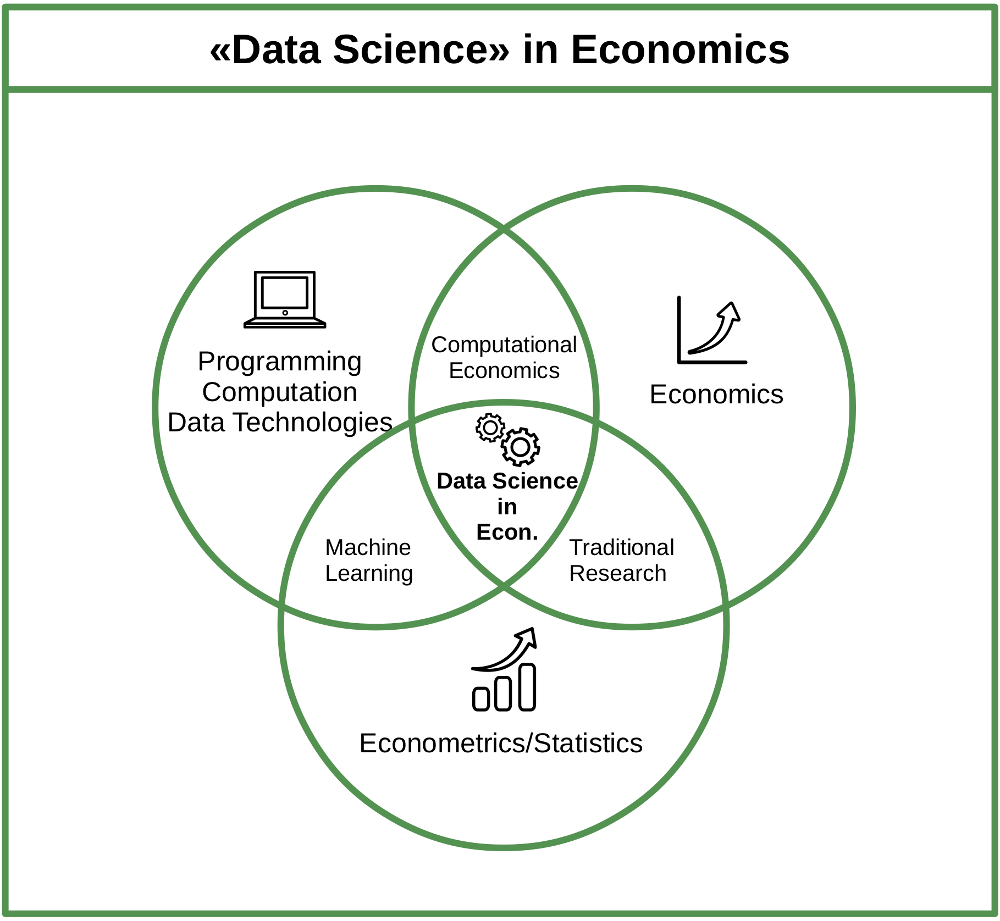
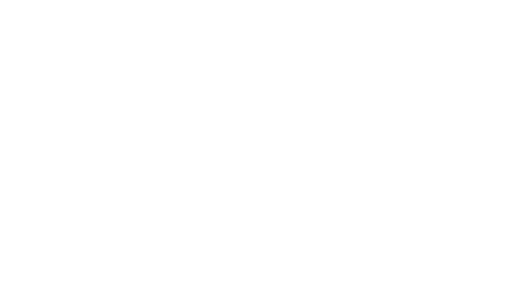
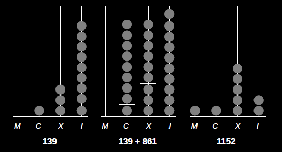
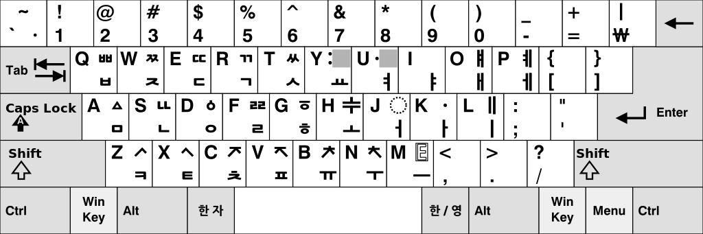
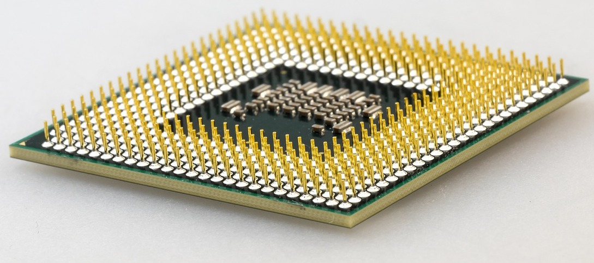
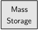

```{r set-options, echo=FALSE, cache=FALSE, warning=FALSE}
options(width = 100)
library(knitr)
```

# Updates


## Exam for exchange students

- Exchange students who need to take the exam before the central exam block:
    - Decentral exam for *exchange students: 24 December 2021, 14:15-15:45.*
    - Location: SIAW Institute, conference room (top floor), Bodanstrasse 8, 9000 St. Gallen

## Course resources

- Canvas page
- *GitHub repo*: https://github.com/umatter/datahandling
     - Source code of slides/notes
     - Code used in examples
          - Clone/fork: e.g., extend notes etc.
          - Open issues/report bugs 
          


# Recap: Data Science, Data Pipeline


## Class survey >>> Final output

---

```{r pipeline, echo=FALSE, out.width = "85%", fig.align='center',  purl=FALSE}
include_graphics("../img/data_science_pipeline.png")
```


## 'Data products'

- Research report/paper (e.g., BA Thesis)
- Presentation/Slides
- Website
- Web application (interactive; alas the introductory example)
- Dashboard for management
- Recommender system (i.e., a trained machine learning algorithm)
- ...

## Data Science skill set


```{r venn, echo=FALSE, out.width = "60%", fig.align='center',  purl=FALSE}

```


# Data in Human History


----

```{r stoneage, echo=FALSE, out.width = "90%", fig.align='center', fig.cap= '"Stone Age" (painting by Viktor Mikhailovich Vasnetsov, public domain).', purl=FALSE}

```


----


```{r domestication, echo=FALSE, out.width = "90%", fig.align='center', fig.cap= "Old Egyptian hieroglyphic painting showing an early instance of a domesticated animal. (public domain).", purl=FALSE}

```


----

```{r contract, echo=FALSE, out.width = "60%", fig.align='center', fig.cap= "Sumerian contract: selling of a field and a house. Shuruppak, pre-cuneiform script. Shuruppak, 2600 BC.  (Picture by Marie-Lan Nguyen 2005, public domain).", purl=FALSE}
include_graphics("../img/sales_contract.jpg")
```


## Ancient data records

- Measuring, quantifying, and keeping record of our social and natural environments.
    - Keep track of time, seasons.
    - Property rights: define/quantify land areas.
    - Quantify harvest/yield.

## Economic growth and data

More advanced economy:

- More sophisticated division of labor.
- More complex property rights.
- More need to keep track of everything.

## Economic growth and data

More advanced economy: *more data to handle!*

## Economic growth and data

More advanced economy: *more data to handle!*

- How to keep track of calculations with large numbers?

---

```{r pebbles, echo=FALSE, out.width = "55%", fig.align='center', purl=FALSE}

```


---

```{r shells, echo=FALSE, out.width = "85%", fig.align='center', purl=FALSE}

```

---

```{r ancientabacus, echo=FALSE, out.width = "85%", fig.align='center', purl=FALSE}

```

----

```{r newabacus, echo=FALSE, out.width = "80%", fig.align='center', purl=FALSE}
include_graphics("../img/new_abacus.jpg")
```


# Processing Data

## Simple calculations in numeral systems

How does the abacus work?

- Need to agree on a standard (numeral system)!
- Define the *base* of the frame's numeral system.
- For example, a Roman abacus with base 10.


## The Roman abacus (base 10)

```{r abacus, echo=FALSE, out.width = "85%", fig.align='center', purl=FALSE}

```


## The Roman abacus (base 10)
The example in more detail:

- Columns reflect the positions of the digits
- and signify the power of 10 with which the digit is multiplied:

$139=(1 \times 10^{2}) + (3 \times 10^{1}) + (9 \times 10^{0})$

- *Base 10*: 10 different signs (0-9) to distinguish one-digit numbers. 

## Base 10: the 'decimal system'

- What we work with in everyday life.
- What we encounter in undergraduate math, statistics, etc.
- However, not the relevant base once we use electronic tools.


## Recall the data processing 'blackbox'

```{r blackbox, echo=FALSE, out.width = "90%", fig.align='center', purl=FALSE}
include_graphics("../img/cpu_blackbox.png")
```


## The binary system

Microprocessors can only represent two signs (states): 

 - 'Off' = `0`
 - 'On' = `1`

```{r onoff, echo=FALSE, out.width = "10%", fig.align='center', purl=FALSE}
include_graphics("../img/on_off.png")
```


## The binary counting frame

- Only two signs: `0`, `1`.
- Base 2.
- Columns: $2^0=1$, $2^1=2$, $2^2=4$, and so forth.


## The binary counting frame

- Sufficient to represent all *natural* numbers in the decimal system.

## The binary counting frame

- Sufficient to represent all *natural* numbers in the decimal system.
- Representing fractions is tricky
    - e.g. $1/3=0.333..$ actually constitutes an infinite sequence of 0s and 1s.
    - Solution: 'floating point numbers' (not 100% accurate)


## The binary counting frame

What is the decimal number *139* in the binary counting frame?


## The binary counting frame

What is the decimal number *139* in the binary counting frame?
 
 - Solution:
 
$$(1 \times 2^7) + (1 \times 2^3) + (1 \times 2^1) + (1 \times 2^0) = 139.$$


## The binary counting frame

What is the decimal number *139* in the binary counting frame?
 
 - Solution:
 
$$(1 \times 2^7) + (1 \times 2^3) + (1 \times 2^1) + (1 \times 2^0) = 139.$$

  - More precisely:
  
$$(1 \times 2^7) + (0 \times 2^6) +  (0 \times 2^5) +  (0 \times 2^4) + (1 \times 2^3)\\ + (0 \times 2^2) + (1 \times 2^1) +  (1 \times 2^0)  = 139.$$

  - That is, the number `139` in the decimal system corresponds to `10001011` in the binary system.


## Decimal numbers in a computer

If computers only understand `0` and `1`, how can they express decimal numbers like *139*?


## Decimal numbers in a computer

If computers only understand `0` and `1`, how can they express decimal numbers like *139*?

- *Standards* define how symbols, colors, etc are shown on the screen.
- Facilitates interaction with a computer (our keyboards do not only consist of a `0`/`1` switch).


```{r binarykeyboard, echo=FALSE, out.width = "40%", fig.align='center', purl=FALSE}

```


## Decimal numbers in a computer


Number  | 128 | 64 | 32 | 16 | 8  | 4  | 2  |  1 
-----|-----|----|----|----|----|----|----|----


## Decimal numbers in a computer


Number  | 128 | 64 | 32 | 16 | 8  | 4  | 2  |  1 
-----|-----|----|----|----|----|----|----|----
0  = | 0   |  0 | 0  |  0 | 0 |  0 | 0  |  0  


## Decimal numbers in a computer


Number  | 128 | 64 | 32 | 16 | 8  | 4  | 2  |  1 
-----|-----|----|----|----|----|----|----|----
0  = | 0   |  0 | 0  |  0 | 0 |  0 | 0  |  0  
1  = | 0   |  0 | 0  |  0 | 0 |  0 | 0  |  1


## Decimal numbers in a computer


Number  | 128 | 64 | 32 | 16 | 8  | 4  | 2  |  1 
-----|-----|----|----|----|----|----|----|----
0  = | 0   |  0 | 0  |  0 | 0 |  0 | 0  |  0  
1  = | 0   |  0 | 0  |  0 | 0 |  0 | 0  |  1
2  = | 0   |  0 | 0  |  0 | 0 |  0 | 1  |  0


## Decimal numbers in a computer


Number  | 128 | 64 | 32 | 16 | 8  | 4  | 2  |  1 
-----|-----|----|----|----|----|----|----|----
0  = | 0   |  0 | 0  |  0 | 0 |  0 | 0  |  0  
1  = | 0   |  0 | 0  |  0 | 0 |  0 | 0  |  1
2  = | 0   |  0 | 0  |  0 | 0 |  0 | 1  |  0
3  = | 0   |  0 | 0  |  0 | 0 |  0 | 1  |  1


## Decimal numbers in a computer


Number  | 128 | 64 | 32 | 16 | 8  | 4  | 2  |  1 
-----|-----|----|----|----|----|----|----|----
0  = | 0   |  0 | 0  |  0 | 0 |  0 | 0  |  0  
1  = | 0   |  0 | 0  |  0 | 0 |  0 | 0  |  1
2  = | 0   |  0 | 0  |  0 | 0 |  0 | 1  |  0
3  = | 0   |  0 | 0  |  0 | 0 |  0 | 1  |  1
... |    |   |   |  |  |   |   |  
139 = | 1   |  0 | 0  |  0 |  1 |  0 | 1  |  1    


## The hexadecimal system

- Binary numbers can become quite long rather quickly.
- Computer Science: refer to binary numbers with the *hexadecimal* system.


## The hexadecimal system

- *16 symbols*: 
    - `0`-`9` (used like in the decimal system)...
    - and `A`-`F` (for the numbers 10 to 15).
  

## The hexadecimal system

- *16 symbols*: 
    - `0`-`9` (used like in the decimal system)...
    - and `A`-`F` (for the numbers 10 to 15).
  
- *16 symbols >>> base 16*: each digit represents an increasing power of 16 ($16^{0}$, $16^{1}$, etc.).


## The hexadecimal system

What is the decimal number 139 expressed in the hexadecimal system?


## The hexadecimal system

What is the decimal number 139 expressed in the hexadecimal system?

- Solution: 
$$(8\times 16^1) +  (11\times 16^0) = 139.$$


## The hexadecimal system

What is the decimal number 139 expressed in the hexadecimal system?

- Solution: 
$$(8\times 16^1) +  (11\times 16^0) = 139.$$

- More precisely:
$$(8\times 16^1) +  (B\times 16^0) = 8B = 139.$$


## The hexadecimal system

What is the decimal number 139 expressed in the hexadecimal system?

- Solution: 
$$(8\times 16^1) +  (11\times 16^0) = 139.$$

- More precisely:
$$(8\times 16^1) +  (B\times 16^0) = 8B = 139.$$

- Hence: `10001011` (in binary) = `8B` (in hexadecimal) = `139` in decimal.


## The hexadecimal system
Advantages (when working with binary numbers)

1. Shorter than raw binary representation
2. Much easier to translate forth and back between binary and hexadecimal than binary and decimal.

&nbsp;

<center>
*WHY?*
</center>

## The hexadecimal system
Advantages (when working with binary numbers)... 

- Hexadecimal digits can always be represented in four-digit binary equivalent.
-  $8=1000$, $B=11=1011$, thus...
- `8B` (in hexadecimal) = `10001011` (`1000 1011`) in binary.


# Character Encoding

## Computers and text
How can a computer understand text if it only understands `0`s and `1`s?

```{r keyboard, echo=FALSE, out.width = "90%", fig.align='center', fig.cap="A modified version of South Korean Dubeolsik (two-set type) for old hangul letters. (Illustration by Yes0song 2010,  [Creative Commons Attribution-Share Alike 3.0 Unported](https://creativecommons.org/licenses/by-sa/3.0/deed.en))", purl=FALSE}

```


## Computers and text
How can a computer understand text if it only understands `0`s and `1`s?

- *Standards* define how `0`s and `1`s correspond to specific letters/characters of different human languages.
- These standards are usually called *character encodings*.
- Coded character sets that map unique numbers (in the end in binary coded values) to each character in the set.

## Computers and text
How can a computer understand text if it only understands `0`s and `1`s?

- *Standards* define how `0`s and `1`s correspond to specific letters/characters of different human languages.
- These standards are usually called *character encodings*.
- Coded character sets that map unique numbers (in the end in binary coded values) to each character in the set.
- For example, ASCII (American Standard Code for Information Interchange).

```{r ascii, echo=FALSE, out.width = "30%", fig.align='center', fig.cap='ASCII logo. (public domain).', purl=FALSE}
include_graphics("../img/ascii.gif")
```


## ASCII Table


Binary  | Hexadecimal | Decimal | Character 
-----|-----|----|----
0011 1111 | 3F   |  63 | `?`  
0100 0001 | 41   |  65 | `A`  
0110 0010 | 62  |  98 | `b`


## Character encodings: why should we care?

## Character encodings: why should we care?
 
 - In practice, Data Science means handling digital data of all formats and shapes.
    - Diverse sources.
    - Different standards.
    - *read*/*store* data.
    
 - At the lowest level, this means understanding/handling encodings.


# Computer Code and Text-Files

## Putting the pieces together...

Two core themes of this course:

  1. How can *data* be *stored* digitally and be *read* by/imported to a computer?
  2. How can we give instructions to a computer by writing *computer code*?
 
## Putting the pieces together...

Two core themes of this course:

  1. How can *data* be *stored* digitally and be *read* by/imported to a computer?
  2. How can we give instructions to a computer by writing *computer code*?

In both of these domains we mainly work with one simple type of document: *text files*.


## Text-files

 - A *collection of characters* stored in a designated part of the computer memory/hard drive.
 - An easy-to-read representation of the underlying information (`0`s and `1`s)!

 
## Text-files

 - A *collection of characters* stored in a designated part of the computer memory/hard drive.
 - An easy to read representation of the underlying information (`0`s and `1`s)!
 - Common device to store data:
    - Structured data (tables)
    - Semi-structured data (websites)
    - Unstructured data (plain text)
 - Typical device to store computer code.


## Text-editors: RStudio

```{r echo=FALSE, fig.align='center', out.width="45%"}

include_graphics("../img/rstudio.png")

```
Install RStudio from [here](https://www.rstudio.com/products/rstudio/download/#download)!


 

## Text-editors: Atom

```{r echo=FALSE, fig.align='center', out.width="45%"}

include_graphics("../img/atom.png")

```
Install Atom from [here](https://flight-manual.atom.io/getting-started/sections/installing-atom/)!


# Data Processing Basics

----

```{r blackbox2, echo=FALSE, out.width = "75%", fig.align='center', fig.cap= "The 'blackbox' of data processing.", purl=FALSE}
include_graphics("../img/cpu_blackbox.png")
```


## Components of a standard computing environment

&nbsp;

```{r components, echo=FALSE, out.width = "80%", fig.align='center', fig.cap= "Basic components of a standard computing environment.", purl=FALSE}
include_graphics("../img/script-hardware.jpg")
```

## Central Processing Unit

&nbsp;

```{r cpu, echo=FALSE, out.width = "10%", fig.align='center', purl=FALSE}

```

```{r cpu2, echo=FALSE, out.width = "30%", fig.align='center', purl=FALSE}

```


## Random Access Memory

&nbsp;

```{r ram, echo=FALSE, out.width = "10%", fig.align='center', purl=FALSE}

```

```{r ram2, echo=FALSE, out.width = "45%", fig.align='center', purl=FALSE}
include_graphics("../img/ram.jpg")
```


## Input hardware: keyboard

&nbsp;

```{r keybd, echo=FALSE, out.width = "15%", fig.align='center', purl=FALSE}

```

```{r keyboard2, echo=FALSE, out.width = "45%", fig.align='center', fig.cap="A modified version of South Korean Dubeolsik (two-set type) for old hangul letters. (Illustration by Yes0song 2010,  [Creative Commons Attribution-Share Alike 3.0 Unported](https://creativecommons.org/licenses/by-sa/3.0/deed.en))", purl=FALSE}

```


## Mass storage: hard drive

&nbsp;

```{r harddrive, echo=FALSE, out.width = "10%", fig.align='center', purl=FALSE}

```

```{r harddrive2, echo=FALSE, out.width = "45%", fig.align='center', purl=FALSE}

```


## Screen: output hardware

&nbsp;

```{r output, echo=FALSE, out.width = "10%", fig.align='center', purl=FALSE}

```

```{r screen, echo=FALSE, out.width = "55%", fig.align='center', purl=FALSE}

```


## Network: Internet, cloud, etc.

&nbsp;

```{r network, echo=FALSE, out.width = "10%", fig.align='center', purl=FALSE}

```

```{r www, echo=FALSE, out.width = "45%", fig.align='center', purl=FALSE}
include_graphics("../img/www.png")
```


## Putting the pieces together...

Recall the initial example (survey) of this course.

  1. Access a website (over the Internet), use keyboard to enter data into a website (a Google sheet in that case). 

  2. R program accesses the data of the Google sheet (again over the Internet), downloads the data, and loads it into RAM.

  3. Data processing: produce output (in the form of statistics/plots), output on screen.


# Q&A


<style>
slides > slide { overflow: scroll; }
slides > slide:not(.nobackground):after {
  content: '';
}
</style>

## References {.smaller}

