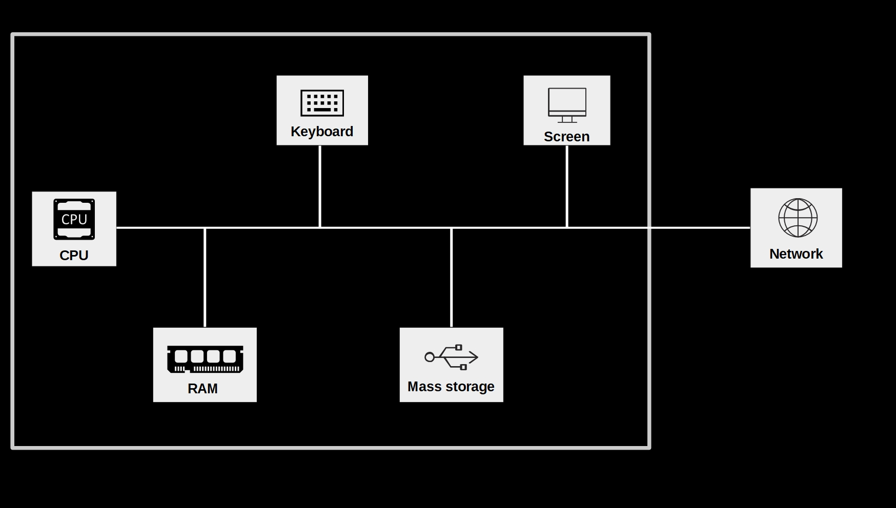
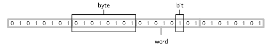
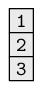
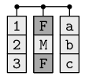
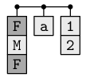

```{r set-options, echo=FALSE, cache=FALSE, warning=FALSE}
options(width = 100)
library(knitr)
```

# Updates

## Decentral exam for exchange students
(Provisional plan)

- The examination will take place during the *last exercise session (23 December, 4:15 PM - 6:00 PM) in room 01-013.*

- The last exercise session is moved to *December 22, 4:15 PM - 6:00 PM, fully online (Zoom).*

<!-- ## Thoughts on studying in this course -->

<!-- - Read the mandatory (and complementary) literature before lectures (see Syllabus) -->
<!-- - Follow the lectures (make your own notes) -->
<!-- - Read the lecture notes (extend with own notes) -->
<!-- - Solve the exercises (in virtual teams) -->
<!-- - Study the exercise solutions (notes + video) -->
<!-- - Visit the exercise Q&A sessions with Philine  -->
<!-- - Repeat... -->

# Recap

## The binary system

Microprocessors can only represent two signs (states): 

 - 'Off' = `0`
 - 'On' = `1`

```{r onoff, echo=FALSE, out.width = "10%", fig.align='center', purl=FALSE}

```


## The binary counting frame

- Only two signs: `0`, `1`.
- Base 2.
- Columns: $2^0=1$, $2^1=2$, $2^2=4$, and so forth.

## Decimal numbers in a computer


Number  | 128 | 64 | 32 | 16 | 8  | 4  | 2  |  1 
-----|-----|----|----|----|----|----|----|----


## Decimal numbers in a computer


Number  | 128 | 64 | 32 | 16 | 8  | 4  | 2  |  1 
-----|-----|----|----|----|----|----|----|----
0  = | 0   |  0 | 0  |  0 | 0 |  0 | 0  |  0  


## Decimal numbers in a computer


Number  | 128 | 64 | 32 | 16 | 8  | 4  | 2  |  1 
-----|-----|----|----|----|----|----|----|----
0  = | 0   |  0 | 0  |  0 | 0 |  0 | 0  |  0  
1  = | 0   |  0 | 0  |  0 | 0 |  0 | 0  |  1


## Decimal numbers in a computer


Number  | 128 | 64 | 32 | 16 | 8  | 4  | 2  |  1 
-----|-----|----|----|----|----|----|----|----
0  = | 0   |  0 | 0  |  0 | 0 |  0 | 0  |  0  
1  = | 0   |  0 | 0  |  0 | 0 |  0 | 0  |  1
2  = | 0   |  0 | 0  |  0 | 0 |  0 | 1  |  0


## Decimal numbers in a computer


Number  | 128 | 64 | 32 | 16 | 8  | 4  | 2  |  1 
-----|-----|----|----|----|----|----|----|----
0  = | 0   |  0 | 0  |  0 | 0 |  0 | 0  |  0  
1  = | 0   |  0 | 0  |  0 | 0 |  0 | 0  |  1
2  = | 0   |  0 | 0  |  0 | 0 |  0 | 1  |  0
3  = | 0   |  0 | 0  |  0 | 0 |  0 | 1  |  1


## Decimal numbers in a computer


Number  | 128 | 64 | 32 | 16 | 8  | 4  | 2  |  1 
-----|-----|----|----|----|----|----|----|----
0  = | 0   |  0 | 0  |  0 | 0 |  0 | 0  |  0  
1  = | 0   |  0 | 0  |  0 | 0 |  0 | 0  |  1
2  = | 0   |  0 | 0  |  0 | 0 |  0 | 1  |  0
3  = | 0   |  0 | 0  |  0 | 0 |  0 | 1  |  1
... |    |   |   |  |  |   |   |  
139 = | 1   |  0 | 0  |  0 |  1 |  0 | 1  |  1    


## The hexadecimal system

- Binary numbers can become quite long rather quickly.
- Computer Science: refer to binary numbers with the *hexadecimal* system.


## The hexadecimal system

- *16 symbols*: 
    - `0`-`9` (used like in the decimal system)...
    - and `A`-`F` (for the numbers 10 to 15).
  

## The hexadecimal system

- *16 symbols*: 
    - `0`-`9` (used like in the decimal system)...
    - and `A`-`F` (for the numbers 10 to 15).
  
- *16 symbols >>> base 16*: each digit represents an increasing power of 16 ($16^{0}$, $16^{1}$, etc.).


## The hexadecimal system

What is the decimal number 139 expressed in the hexadecimal system?


## The hexadecimal system

What is the decimal number 139 expressed in the hexadecimal system?

- Solution: 
$$(8\times 16^1) +  (11\times 16^0) = 139.$$


## The hexadecimal system

What is the decimal number 139 expressed in the hexadecimal system?

- Solution: 
$$(8\times 16^1) +  (11\times 16^0) = 139.$$

- More precisely:
$$(8\times 16^1) +  (B\times 16^0) = 8B = 139.$$


<!-- ## Floating point numbers -->

<!-- - Why would $1/3$ be an infinate string of '0's and '1's? -->
<!-- - Similar to manually writing our $1/3=0.3333...$. -->
<!-- - Floating point numbers: formulaic representation of real numbers (approximatively). -->
<!--      example in R* -->
<!--      - [Short YouTube video](https://youtu.be/0NhF8LE0Vqw) -->

## Computers and text
How can a computer understand text if it only understands `0`s and `1`s?

- *Standards* define how `0`s and `1`s correspond to specific letters/characters of different human languages.
- These standards are usually called *character encodings*.
- Coded character sets that map unique numbers (in the end in binary coded values) to each character in the set.
- For example, ASCII (American Standard Code for Information Interchange).

```{r ascii, echo=FALSE, out.width = "30%", fig.align='center', fig.cap='ASCII logo. (public domain).', purl=FALSE}

```


## ASCII Table


Binary  | Hexadecimal | Decimal | Character 
-----|-----|----|----
0011 1111 | 3F   |  63 | `?`  
0100 0001 | 41   |  65 | `A`  
0110 0010 | 62  |  98 | `b`


## Putting the pieces together...

Two core themes of this course:

  1. How can *data* be *stored* digitally and be *read* by/imported to a computer?
  2. How can we give instructions to a computer by writing *computer code*?

In both of these domains we mainly work with one simple type of document: *text files*.


## Text-files

 - A *collection of characters* stored in a designated part of the computer memory/hard drive.
 - A easy to read representation of the underlying information (`0`s and `1`s)!
 - Common device to store data:
    - Structured data (tables)
    - Semi-structured data (websites)
    - Unstructured data (plain text)
 
 - Typical device to store computer code.


## Digital data processing

&nbsp;

```{r components, echo=FALSE, out.width = "80%", fig.align='center', purl=FALSE}

```


# Computer Code and Data Storage

## Computer code

  - Instructions to a computer, in a language it understands... (R)
  - Code is written to *text files*
  - Text is 'translated' into 0s and 1s which the CPU can process.

## Data storage

- Data usually stored in *text files*

  - Read data from text files: data import.
  - Write data to text files: data export.


## Unstructured data in text files

- Store `Hello World!` in `helloworld.txt`.
  - Allocation of a block of computer memory containing `Hello World!`.
  - Simply a sequence of `0`s and `1`s...
  - `.txt` indicates to the operating system which program to use when opening this file.
- Encoding and format tell the computer how to interpret the `0`s and `1`s.


## Inspect a text file

Interpreting `0`s and `1`s as text...

```{bash eval=FALSE}
cat helloworld.txt; echo
```

```{bash echo=FALSE}
cat ../../data/helloworld.txt; echo
```

Or, from the R-console:
```{R eval=FALSE}
system("cat helloworld.txt")
```


## Inspect a text file

Directly looking at the `0`s and `1`s...

```{bash eval = FALSE}
xxd -b helloworld.txt
```

```{bash echo = FALSE}
xxd -b ../../data/helloworld.txt
```


## Inspect a text file

Similarly we can display the content in hexadecimal values:


```{bash eval = FALSE}
xxd  data/helloworld.txt
```

```{bash echo = FALSE}
xxd  ../../data/helloworld.txt
```


## Encoding issues

```{bash eval=FALSE}
cat hastamanana.txt; echo
```

```
## Hasta Ma?ana!
```

- What is the problem?


## Encoding issues
Inspect the encoding

```{bash eval = FALSE}
file -b hastamanana.txt
```


```{bash echo = FALSE}
file -b ../../data/hastamanana.txt
```


## Use the correct encoding

Read the file again, this time with the correct encoding

<style>
.lit {
  color: white;
}
</style>

```{eval = FALSE}
iconv -f iso-8859-1 -t utf-8 hastamanana.txt | cat
```

```{bash echo = FALSE}
iconv -f iso-8859-1 -t utf-8 ../../data/hastamanana.txt | cat
```


## UTF encodings
  - 'Universal' standards.
  - Contain broad variaty of symbols (various languages).
  - Less problems with newer data sources...


## Take-away message
  - *Recognize an encoding issue when it occurs!*
  - Problem occurs right at the beginning of the *data pipeline*!
    - Rest of pipeline affected...
    - ... cleaning of data fails ...
    - ... analysis suffers.


## Structured Data Formats

  - Still text files, but with standardized *structure*.
  - *Special characters* define the structure.
  - More complex *syntax*, more complex structures can be represented...

## Table-like formats

Example `ch_gdp.csv`. 

```{}
year,gdp_chfb
1980,184
1985,244
1990,331
1995,374
2000,422
2005,464
```

<center>
*What is the structure?*
</center>

## Table-like formats

- What is the reocurring pattern? 
  - Special character `,`
  - New lines
- Table is visible from structure in raw text file...

<center>
*How can we instruct a computer to read this text as a table?*
</center>


## A simple parser algorithm

  1.  Start with an empty table consisting of one cell (1 row/column).
  2.  While the end of the input file is not yet reached, do the following:

## A simple parser algorithm

  1.  Start with an empty table consisting of one cell (1 row/column).
  2.  While the end of the input file is not yet reached, do the following:
      - Read characters from the input file, and add them one-by-one to the current cell.
        

## A simple parser algorithm

  1.  Start with an empty table consisting of one cell (1 row/column).
  2.  While the end of the input file is not yet reached, do the following:
      - Read characters from the input file, and add them one-by-one to the current cell.
         - If you encounter the character '`,`', ignore it, create a new field, and jump to the new field.

## A simple parser algorithm

  1.  Start with an empty table consisting of one cell (1 row/column).
  2.  While the end of the input file is not yet reached, do the following:
      - Read characters from the input file, and add them one-by-one to the current cell.
         - If you encounter the character '`,`', ignore it, create a new field, and jump to the new field.
      - If you encounter the end of the line, create a new row and jump to the new row.


## CSVs and fixed-width format

  - *'Comma-Separated Values'* (therefore `.csv`)
    - commas separate values
    - new lines separate rows/observations
    - (many related formats with other separators)
  - Instructions of how to read a `.csv`-file: *CSV parser*.

## CSVs and fixed-width format

  - Common format to store and transfer data.
    - Very common in a data analysis context.
  - Natural format/structure when the dataset can be thought of as a table.


## CSVs and fixed-width format
&nbsp;

<center>
*How does the computer know that the end of a line is reached?*
</center>


<!-- - Let's investigate! -->


## End-of-line characters

```{bash eval = FALSE, purl=FALSE}
xxd ch_gdp.csv
```

```{bash echo = FALSE}
xxd ../../data/ch_gdp.csv
```


## End-of-line characters

```{bash eval = FALSE, purl=FALSE}
xxd ch_gdp.csv
```

```{bash echo = FALSE}
xxd ../../data/ch_gdp.csv
```

 - `.` (`0d`): indicates end of line! 

## Related formats
 
 - Other delimiters (`;`, tabs, etc.)
 - Fixed (column) width

## More complex formats
  - N-dimensional data
  - Nested data
  - *XML*, *JSON*, *YAML*, etc.
    - Often encountered online!
    - (Next lecture!)


# Units of Information/Data Storage

## Bit, Byte, Word

  - Smallest unit (a `0` or a `1`): *bit* (from *bi*nary dig*it*; abbrev. 'b').
  - *Byte* (1 byte = 8 bits; abbrev. 'B')
    - For example, `10001011` (`139`)
  - 4 bytes (or 32 bits) are called a *word*.
  


## Bit, Byte, Word

```{r bitbyteword, echo=FALSE, out.width = "80%", fig.align='center', fig.cap= "Bit, Byte, Word. Figure by @murrell_2009 (licensed under [CC BY-NC-SA 3.0 NZ](https://creativecommons.org/licenses/by-nc-sa/3.0/nz/))", purl=FALSE}

```

## Bigger units for storage capacity 

 - $1 \text{ kilobyte (KB)} = 1000^{1} \text{ bytes}$
 - $1 \text{ megabyte (MB)} = 1000^{2} \text{ bytes}$
 - $1 \text{ gigabyte (GB)} = 1000^{3} \text{ bytes}$
 
## Common units for data transfer (over a network)

 - $1 \text{ kilobit per second (kbit/s)} = 1000^{1} \text{ bit/s}$
 - $1 \text{ megabit per second (mbit/s)} = 1000^{2} \text{ bit/s}$
 - $1 \text{ gigabit per second (gbit/s)} = 1000^{3} \text{ bit/s}$


# Data Structures and Data Types in R

## Structures to work with...

- Data structures for storage on hard drive (e.g., csv).
- Representation of data in RAM (e.g. as an R-object)?
  - What is the representation of the 'structure' once the data is parsed (read into RAM)?

## Structures to work with (in R)

We distinguish two basic characteristics:

  1. Data **types**: integers; real numbers ('numeric values', floating point numbers); text ('string', 'character values').

    
    
## Structures to work with (in R)

We distinguish two basic characteristics:

  1. Data **types**: integers; real numbers ('numeric values', floating point numbers); text ('string', 'character values').
  2. Basic **data structures** in RAM:
      - *Vectors*
      - *Factors*
      - *Arrays/Matrices*
      - *Lists*
      - *Data frames* (very `R`-specific)


## Data types: numeric

```{r}
a <- 1.5
b <- 3
```

R interprets this data as type `double` (class 'numeric'):

```{r}
typeof(a)
class(a)
```


## Data types: numeric


Given that these bytes of data are interpreted as numeric, we can use operators (here: math operators) that can work with such functions:

```{r}
a + b
```


## Data types: character


```{r}
a <- "1.5"
b <- "3"
```

```{r}
typeof(a)
class(a)
```


## Data types: character

Now the same line of code as above will result in an error:

```{r error=TRUE}
a + b
```


## Data structures: vectors

```{r numvec, echo=FALSE, out.width = "10%", fig.align='center', fig.cap= "(ref:numvec) Illustration of a numeric vector (symbolic). Figure by @murrell_2009 (licensed under [CC BY-NC-SA 3.0 NZ](https://creativecommons.org/licenses/by-nc-sa/3.0/nz/)).", purl=FALSE}

```

## Data structures: vectors

Example:

```{r}
persons <- c("Andy", "Brian", "Claire")
persons
```

```{r}
ages <- c(24, 50, 30)
ages
```


## Data structures: factors

```{r factor, echo=FALSE, out.width = "10%", fig.align='center', fig.cap= "Illustration of a factor (symbolic). Figure by @murrell_2009 (licensed under [CC BY-NC-SA 3.0 NZ](https://creativecommons.org/licenses/by-nc-sa/3.0/nz/)).", purl=FALSE}
include_graphics("../img/factor.png")
```

## Data structures: factors

Example:

```{r}
gender <- factor(c("Male", "Male", "Female"))
gender
```


## Data structures: matrices/arrays

```{r matrix, echo=FALSE, out.width = "20%", fig.align='center', fig.cap= "Illustration of a numeric matrix (symbolic). Figure by @murrell_2009 (licensed under [CC BY-NC-SA 3.0 NZ](https://creativecommons.org/licenses/by-nc-sa/3.0/nz/)).", purl=FALSE}
include_graphics("../img/matrix.png")
```


## Data structures: matrices/arrays

Example:

```{r}
my_matrix <- matrix(c(1,2,3,4,5,6), nrow = 3)
my_matrix

```

```{r}
my_array <- array(c(1,2,3,4,5,6,7,8), dim = c(2,2,2))
my_array

```


## Data frames, tibbles, and data tables
 

```{r df, echo=FALSE, out.width = "20%", fig.align='center', fig.cap= "Illustration of a data frame (symbolic). Figure by @murrell_2009 (licensed under [CC BY-NC-SA 3.0 NZ](https://creativecommons.org/licenses/by-nc-sa/3.0/nz/)).", purl=FALSE}

```


## Data frames, tibbles, and data tables

Example: 

```{r}
df <- data.frame(person = persons, age = ages, gender = gender)
df

```


## Data structures: lists

```{r list, echo=FALSE, out.width = "20%", fig.align='center', fig.cap= "Illustration of a list (symbolic). Figure by @murrell_2009 (licensed under [CC BY-NC-SA 3.0 NZ](https://creativecommons.org/licenses/by-nc-sa/3.0/nz/)).", purl=FALSE}

```


## Data structures: lists

Example:

```{r}
my_list <- list(my_array, my_matrix, df)
my_list
```


# Q&A


<style>
slides > slide { overflow: scroll; }
slides > slide:not(.nobackground):after {
  content: '';
}


code {
  color: white;
}


pre {
  color: white;
}
</style>

## References {.smaller}

