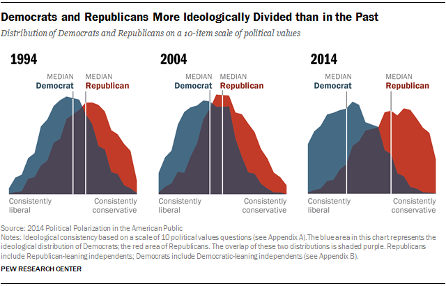
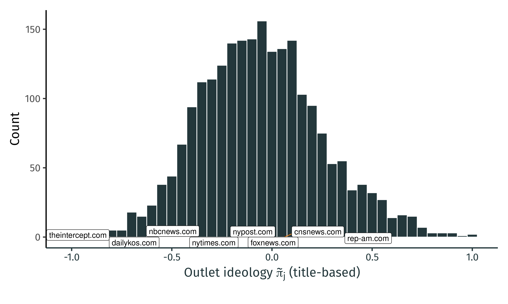
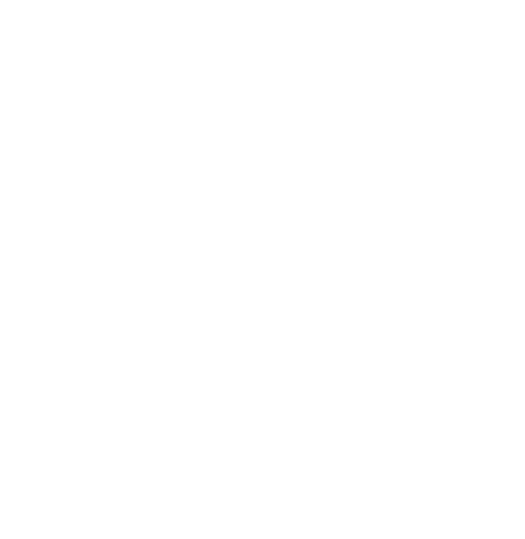
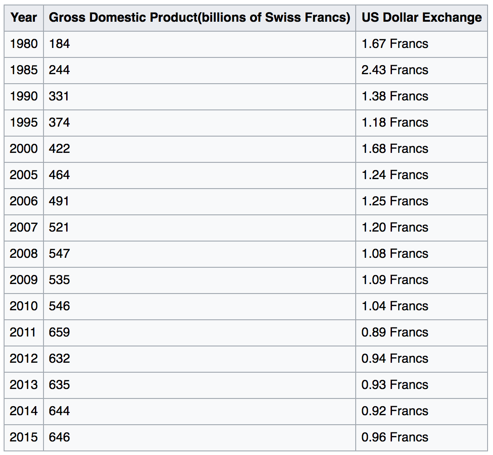

```{r set-options, echo=FALSE, cache=FALSE, warning=FALSE}
options(width = 100)
library(knitr)
```


<style>
pre {
  font-size: 21px;
}
</style>


# Updates


## Last Exercise Session 

- Fully online
- *New date/time: ?*
  - 21 December, 4.15pm-6:00pm (on Zoom)?
  - 22 December, 4.15pm-6:00pm (on Zoom)?

<!-- ## GitHub Classroom back on track -->

<!-- - Due to an update of the system that runs GitHub Classroom, courses around the world experienced problems with autograding in the last week. -->
<!-- - We apologize for any inconveniences that this might have caused! -->
<!-- - For the moment, it looks like we could fix the problem. Please write Philine in case you experience technical issues when committing your solutions in GH Classroom. -->

<!-- ## Guest lecture: 26.11.2020 -->

<!-- ```{r tspycher, echo=FALSE, out.width = "30%", fig.align='center', fig.cap= "Dr. Thomas Spycher (Novalytica AG).", purl=FALSE} -->
<!--  -->
<!-- ``` -->

<!-- - 45-60 minutes talk. -->
<!-- - Q&A. -->
<!-- - Time for bilateral exchange. -->


<!-- # Recap: Research Insights -->

<!-- ## Background: Increasing political polarization -->

<!-- ```{r polarization, echo=FALSE, out.width = "90%", fig.align='center', purl=FALSE} -->
<!--  -->
<!-- ``` -->

<!-- ## Background: "Algorithmic" polarization in the Web -->

<!-- ```{r google, echo=FALSE, out.width = "50%", fig.align='center', purl=FALSE} -->
<!--  -->
<!-- ``` -->

<!-- ## Insights: Ideological distribution of US online media sphere -->

<!-- ```{r distr, echo=FALSE, out.width = "90%", fig.align='center', purl=FALSE} -->
<!--  -->
<!-- ``` -->


# Recap: Computer Code and Data Storage

## Computer code

  - Instructions to a computer, in a language it understands... (R)
  - Code is written to *text files*
  - Code is 'translated' into 0s and 1s which the CPU can process.

## Data storage

- Data is usually stored in *text files*.
    - Read data from text files: data import.
    - Write data to text files: data export.


## Inspect a text file

Interpreting `0`s and `1`s as text...

```{bash eval=FALSE}
cat helloworld.txt; echo
```

```{bash echo=FALSE}
cat ../../data/helloworld.txt; echo
```


## Inspect a text file

Directly looking at the `0`s and `1`s...

```{bash eval = FALSE}
xxd -b helloworld.txt
```

```{bash echo = FALSE}
xxd -b ../../data/helloworld.txt
```


## Inspect a text file

Directly looking at the `0`s and `1`s...

```{bash eval = FALSE}
xxd -b helloworld.txt
```

```{bash echo = FALSE}
xxd -b ../../data/helloworld.txt
```


<center>
*How does the computer know that `01001000` is `H`?*
</center>


## Encoding issues

```{bash eval=FALSE}
cat hastamanana.txt; echo
```

```
## Hasta Ma?ana!
```

## UTF encodings
  - 'Universal' standards.
  - Contain broad variety of symbols (various languages).
  - Less problems with newer data sources...


## Take-away message
  - *Recognize an encoding issue when it occurs!*
  - Problem occurs right at the beginning of the *data pipeline*!
    - Rest of pipeline affected...
    - ... cleaning of data fails ...
    - ... analysis suffers.


## Structured Data Formats

  - Still text files, but with standardized *structure*.
  - *Special characters* define the structure.
  - More complex *syntax*, more complex structures can be represented...


## CSVs and fixed-width format

  - Common format to store and transfer data.
    - Very common in a data analysis context.
  - Natural format/structure when data represents a table.


## Structures to work with...

- Data structures for storage on hard drive (e.g., csv).
- Representation of data in RAM (e.g. as an R-object)?
  - What is the representation of the 'structure' once the data is parsed (read into RAM)?

## Structures to work with (in R)

We distinguish two basic characteristics:

  1. Data *types*: integers; real numbers ('numeric values', floating point numbers); text ('string', 'character values').
  2. Basic *data structures* in RAM:
      - *Vectors*
      - *Factors*
      - *Arrays/Matrices*
      - *Lists*
      - *Data frames* (very `R`-specific)


# Complex Data Structures

## A rectangular data set

```
father mother  name     age  gender
               John      33  male
               Julia     32  female
John   Julia   Jack       6  male
John   Julia   Jill       4  female
John   Julia   John jnr   2  male
               David     45  male
               Debbie    42  female
David  Debbie  Donald    16  male
David  Debbie  Dianne    12  female

```

<center>
*What is the data about?*
</center>


## A rectangular data set

```
father mother  name     age  gender
               John      33  male
               Julia     32  female
John   Julia   Jack       6  male
John   Julia   Jill       4  female
John   Julia   John jnr   2  male
               David     45  male
               Debbie    42  female
David  Debbie  Donald    16  male
David  Debbie  Dianne    12  female

```
<center>
*Which observations belong together?*
</center>


## A rectangular data set

```
father mother  name     age  gender
               John      33  male
               Julia     32  female
John   Julia   Jack       6  male
John   Julia   Jill       4  female
John   Julia   John jnr   2  male
               David     45  male
               Debbie    42  female
David  Debbie  Donald    16  male
David  Debbie  Dianne    12  female

```
<center>
*Can a parser understand which observations belong together?*
</center>


## Limitations of rectangular data

- Only *two dimensions*.
    - Observations (rows)
    - Characteristics/variables (columns)

## Limitations of rectangular data

- Only *two dimensions*.
    - Observations (rows)
    - Characteristics/variables (columns)
- Hard to represent hierarchical structures.
    - Might introduce redundancies.
    - Machine-readability suffers (standard parsers won't recognize it).
  

  
## Alternative formats

- [JavaScript Object Notation (JSON)](https://en.wikipedia.org/wiki/JSON)
- [Extensible Markup Language (XML)](https://en.wikipedia.org/wiki/XML)
- and more...

## Alternative formats

- [JavaScript Object Notation (JSON)](https://en.wikipedia.org/wiki/JSON)
- [Extensible Markup Language (XML)](https://en.wikipedia.org/wiki/XML)
- Origin and most common domain of application: The Web!
    - Need to *transfer* complex data (between machines).
    - Need to *embed* complex data (in human friendly layout).


# Deciphering XML

## Revisiting COVID-19 data

```
dateRep,day,month,year,cases,deaths,countriesAndTerritories,geoId,countryterritoryCode,popData2019,continentExp,Cumulative_number_for_14_days_of_COVID-19_cases_per_100000
14/10/2020,14,10,2020,66,0,Afghanistan,AF,AFG,38041757,Asia,1.94523087
13/10/2020,13,10,2020,129,3,Afghanistan,AF,AFG,38041757,Asia,1.81116766
12/10/2020,12,10,2020,96,4,Afghanistan,AF,AFG,38041757,Asia,1.50361089
```

## Revisiting COVID-19 data (in XML!)


```
<records>
<record>
<dateRep>14/10/2020</dateRep>
<day>14</day>
<month>10</month>
<year>2020</year>
<cases>66</cases>
<deaths>0</deaths>
<countriesAndTerritories>Afghanistan</countriesAndTerritories>
<geoId>AF</geoId>
<countryterritoryCode>AFG</countryterritoryCode>
<popData2019>38041757</popData2019>
<continentExp>Asia</continentExp>
<Cumulative_number_for_14_days_of_COVID-19_cases_per_100000>1.94523087</Cumulative_number_for_14_days_of_COVID-19_cases_per_100000>
</record>
<record>
<dateRep>13/10/2020</dateRep>

...
</records>
```


## Revisiting COVID-19 (in XML!)


```
<records>
<record>
<dateRep>14/10/2020</dateRep>
<day>14</day>
<month>10</month>
<year>2020</year>
<cases>66</cases>
<deaths>0</deaths>
<countriesAndTerritories>Afghanistan</countriesAndTerritories>
<geoId>AF</geoId>
<countryterritoryCode>AFG</countryterritoryCode>
<popData2019>38041757</popData2019>
<continentExp>Asia</continentExp>
<Cumulative_number_for_14_days_of_COVID-19_cases_per_100000>1.94523087</Cumulative_number_for_14_days_of_COVID-19_cases_per_100000>
</record>
<record>
<dateRep>13/10/2020</dateRep>

...
</records>
```

<center>
*What features does the format have? What is it's logic/syntax?*
</center>


## XML syntax


```{xml}
<records>
<record>
<dateRep>14/10/2020</dateRep>
<day>14</day>
<month>10</month>
<year>2020</year>
<cases>66</cases>
<deaths>0</deaths>
<countriesAndTerritories>Afghanistan</countriesAndTerritories>
<geoId>AF</geoId>
<countryterritoryCode>AFG</countryterritoryCode>
<popData2019>38041757</popData2019>
<continentExp>Asia</continentExp>
<Cumulative_number_for_14_days_of_COVID-19_cases_per_100000>1.94523087</Cumulative_number_for_14_days_of_COVID-19_cases_per_100000>
</record>
<record>
<dateRep>13/10/2020</dateRep>

...
</records>
```


## XML syntax

The actual content we know from the csv-type example above is nested between the '`records`'-tags:

```{xml}
  <records>
...
  </records>
```


## XML syntax: Temperature Data example

There are two principal ways to link variable names to values.
```{xml}
    <variable>Monthly Surface Clear-sky Temperature (ISCCP) (Celsius)</variable>
    <filename>ISCCPMonthly_avg.nc</filename>
    <filepath>/usr/local/fer_data/data/</filepath>
    <badflag>-1.E+34</badflag>
    <subset>48 points (TIME)</subset>
    <longitude>123.8W(-123.8)</longitude>
    <latitude>48.8S</latitude>
    <case date="16-JAN-1994" temperature="9.200012" />
    <case date="16-FEB-1994" temperature="10.70001" />
    <case date="16-MAR-1994" temperature="7.5" />
    <case date="16-APR-1994" temperature="8.100006" />
```


## XML syntax


1. Define opening and closing XML-tags with the variable name and surround the value with them, such as in `<filename>ISCCPMonthly_avg.nc</filename>`.
2. Encapsulate the values within one tag by defining tag-attributes such as in `<case date="16-JAN-1994" temperature="9.200012" />`. 

## XML syntax

Attributes-based:
```{xml}
    <case date="16-JAN-1994" temperature="9.200012" />
    <case date="16-FEB-1994" temperature="10.70001" />
    <case date="16-MAR-1994" temperature="7.5" />
    <case date="16-APR-1994" temperature="8.100006" />
```

## XML syntax

Tag-based:

```{xml}
  <cases>    
    <case>
      <date>16-JAN-1994<date/>
      <temperature>9.200012<temperature/>
    <case/>
    <case>
      <date>16-FEB-1994<date/>
      <temperature>10.70001<temperature/>
    <case/>
    <case>
      <date>16-MAR-1994<date/>
      <temperature>7.5<temperature/>
    <case/>
    <case>
      <date>16-APR-1994<date/>
      <temperature>8.100006<temperature/>
    <case/>
  <cases/>
```


## Insights: CSV vs. XML

Note the key differences of storing data in XML format in contrast to a flat, table-like format such as CSV:

 - Represent much more *complex (multi-dimensional)* data in XML-files than what is possible in CSVs. 
    - Arbitrarily complex nesting structure.
    - Flexibility to label tags.

    
## Insights: CSV vs. XML

Note the key differences of storing data in XML format in contrast to a flat, table-like format such as CSV:

 - Self-explanatory syntax: *machine-readable and human-readable*. 
    - Parsers/computers can more easily handle complex data structures.
    - Humans can intuitively understand what the data is all about just by looking at the raw XML file.

## Insights: CSV vs. XML
  
Potential drawback of XML: *inefficient* storage.

  - Tags are part of the syntax, thus, part of the actual file.
      - Tags (variable labels) are *repeated* again and again!
      - CSV: variable labels are mentioned once.
      - Potential solution: data compression (e.g., zip).
  - If the data is actually two dimensional, a CSV is more practical.
  

# Deciphering JSON

## JSON syntax
  
  - Key difference to XML: no tags, but *attribute-value pairs*.
  - A substitute for XML (often encountered in similar usage domains).


----

<div class="columns-1">
*XML:*
```{xml}
<person>
  <firstName>John</firstName>
  <lastName>Smith</lastName>
  <age>25</age>
  <address>
    <streetAddress>21 2nd Street</streetAddress>
    <city>New York</city>
    <state>NY</state>
    <postalCode>10021</postalCode>
  </address>
  <phoneNumber>
    <type>home</type>
    <number>212 555-1234</number>
  </phoneNumber>
  <phoneNumber>
    <type>fax</type>
    <number>646 555-4567</number>
  </phoneNumber>
  <gender>
    <type>male</type>
  </gender>
</person>

```


----

<div class="columns-2">
*XML:*
```{xml}
<person>
  <firstName>John</firstName>
  <lastName>Smith</lastName>
  <age>25</age>
  <address>
    <streetAddress>21 2nd Street</streetAddress>
    <city>New York</city>
    <state>NY</state>
    <postalCode>10021</postalCode>
  </address>
  <phoneNumber>
    <type>home</type>
    <number>212 555-1234</number>
  </phoneNumber>
  <phoneNumber>
    <type>fax</type>
    <number>646 555-4567</number>
  </phoneNumber>
  <gender>
    <type>male</type>
  </gender>
</person>

```

*JSON:*
```{json}
{"firstName": "John",
  "lastName": "Smith",
  "age": 25,
  "address": {
    "streetAddress": "21 2nd Street",
    "city": "New York",
    "state": "NY",
    "postalCode": "10021"
  },
  "phoneNumber": [
    {
      "type": "home",
      "number": "212 555-1234"
    },
    {
      "type": "fax",
      "number": "646 555-4567"
    }
  ],
  "gender": {
    "type": "male"
  }
}

```


----

<div class="columns-2">
*XML:*
```{xml}
<person>
  <firstName>John</firstName>
  <lastName>Smith</lastName>
 
</person>

```

*JSON:*
```{json}
{"firstName": "John",
  "lastName": "Smith",

}

```

</div>


# Parsing XML and JSON in R

## Parsing XML in R

The following examples are based on the example code shown above (the two text-files `persons.json` and `persons.xml`)


```{r eval=FALSE, purl=FALSE }
# load packages
library(xml2)

# parse XML, represent XML document as R object
xml_doc <- read_xml("persons.xml")
xml_doc

```


```{r echo=FALSE, purl=FALSE }
# load packages
library(xml2)

# parse XML, represent XML document as R object
xml_doc <- read_xml("../../data/persons.xml")
xml_doc

```

## Parsing JSON in R


```{r eval=FALSE, purl=TRUE}
# load packages
library(jsonlite)

# parse the JSON-document shown in the example above
json_doc <- fromJSON("persons.json")

# check the structure
str(json_doc)

```


```{r echo=FALSE, purl=FALSE}
# load packages
library(jsonlite)

# parse the JSON-document shown in the example above
json_doc <- fromJSON("../../data/persons.json")

# check the structure
str(json_doc)

```


# HTML: Computer Code Meets Data

## HTML: Code to build webpages

[HyperText Markup Language (HTML)](https://en.wikipedia.org/wiki/HTML), designed to be read by a web browser. 


```{r echo=FALSE, fig.align="center", out.width="60%"}

```

## HTML: Code to build webpages


```{r echo=FALSE, fig.align="center", out.width="70%"}

```


## HTML documents contain data!


```{r echo=FALSE, fig.align="center", out.width="70%"}

```


## HTML documents: code and data!

  - Web designer's perspective: "HTML is a tool to design the layout of a webpage (and the resulting HTML document is *code*)." 
  - From a data scientist's perspective: "HTML gives the *data* contained in a webpage (the actual content) a certain degree of structure which can be exploited to systematically extract the data from the webpage."


## HTML documents: code and data!

HTML documents/webpages consist of *'semi-structured data'*: 
  
  - A webpage can contain a HTML-table (*structured data*)...
  - ...but likely also contains just raw text (*unstructured data*).

----

```{html}
     <!DOCTYPE html>

     <html>
         <head>
             <title>hello, world</title>
         </head>
         <body>
             <h2> hello, world </h2>
         </body>
     </html>
```

<center>
*Similarities to other formats?*
</center>


##  Characteristics of HTML
1. *Annotate/'mark up'* data/text (with tags)
     -  Defines *structure* and hierarchy
     -  Defines content (pictures, media)


##  Characteristics of HTML
1. *Annotate/'mark up'* data/text (with tags)
     -  Defines *structure* and hierarchy
     -  Defines content (pictures, media)

2. *Nesting* principle
     - `head` and `body` are nested within the `html` document
     - Within the `head`, we define the `title`, etc.
     

     
##  Characteristics of HTML
1. *Annotate/'mark up'* data/text (with tags)
     -  Defines *structure* and hierarchy
     -  Defines content (pictures, media)

2. *Nesting* principle
     - `head` and `body` are nested within the `html` document
     - Within the `head`, we define the `title`, etc.
     
3. Expresses what is what in a document. 
     - Doesn't explicitly 'tell' the computer what to do
     - HTML is a markup language, not a programming language.
     
     

## HTML document as a 'tree'
- 'Root': `<html>..</html>`
- 'Children' of the root node: `<head>...</head>`, `<body>...</body>`
- 'Siblings' of each other: `<head>...</head>`, `<body>...</body>`

## HTML document as a 'tree'

```{r dom, echo=FALSE, fig.align="center", out.width="50%", fig.cap="HTML (DOM) tree diagram (by Lubaochuan 2014, licensed under the [Creative Commons Attribution-Share Alike 4.0 International](https://creativecommons.org/licenses/by-sa/4.0/deed.en) license)."}

```


## Two ways to read a webpage into R

In this example, we look at [Wikipedia's Economy of Switzerland page](https://en.wikipedia.org/wiki/Economy_of_Switzerland).

```{r swiss, echo=FALSE, out.width = "50%", fig.align='center', fig.cap= "Source: https://en.wikipedia.org/wiki/Economy_of_Switzerland."}

```


## Read the HTML line-by-line

```{r}
swiss_econ <- readLines("https://en.wikipedia.org/wiki/Economy_of_Switzerland")
```


```{r}
head(swiss_econ)
```


## Navigate the raw HTML

Search for specific content

```{r}
line_number <- grep('US Dollar Exchange', swiss_econ)
```

```{r}
line_number
```

```{r}
swiss_econ[line_number]
```


<center>
*What are we missing here?*
</center>


## Parse the HTML!

- Navigate the document like an XML document!
  - Same logic (but tags are pre-defined)...
  - Traverse the tree.
- Access specific parts of the contained data directly.

<center>
*Make use of the structure!*
</center>

## Parsing a Webpage with R


```{r echo=FALSE}
# install package if not yet installed
# install.packages("rvest")

# load the package
library(rvest)
```


```{r eval=FALSE, purl=FALSE}
# install package if not yet installed
# install.packages("rvest")

# load the package
library(rvest)
```


```{r}
# parse the webpage, show the content
swiss_econ_parsed <- read_html("https://en.wikipedia.org/wiki/Economy_of_Switzerland")
swiss_econ_parsed
```

## Parsing a Webpage with R

Now we can easily separate the data/text from the html code. For example, we can extract the HTML table containing the data we are interested in as a `data.frames`.

```{r}
tab_node <- html_node(swiss_econ_parsed,
                      xpath = "//*[@id='mw-content-text']/div/table[2]")
tab <- html_table(tab_node)
tab
```


## Why should we care?

<!-- License: Fig from istock - however, here reference primarily to article and not to fig itself? -->

```{r webdata, echo=FALSE, out.width = "90%", fig.align='center', fig.cap= "Source: https://www.sciencefocus.com/future-technology/how-much-data-is-on-the-internet/."}
include_graphics("https://images.immediate.co.uk/production/volatile/sites/4/2018/08/fe-iStock_000070297009_Large-bf0cc85.jpg?")
```


## How much data is stored on the Web?

"One way to answer this question is to consider the sum total of data held by all the big online storage and service companies like Google, Amazon, Microsoft and Facebook. Estimates are that *the big four store at least 1,200 petabytes* between them. That is *1.2 million terabytes (one terabyte is 1,000 gigabytes)*."
(Gareth Mitchell, __ScienceFocus__)

# Q&A


<style>
slides > slide { overflow: scroll; }
slides > slide:not(.nobackground):after {
  content: '';
}


code {
  color: white;
}


pre {
  color: white;
}
</style>

## References {.smaller}

