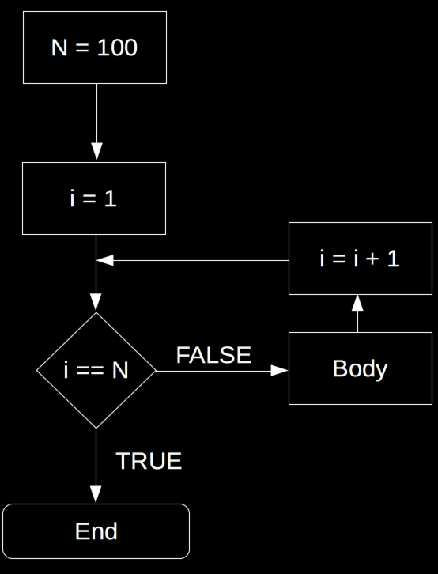
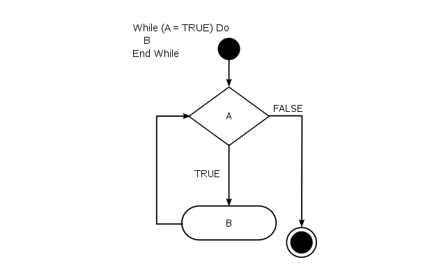

```{r set-options, echo=FALSE, cache=FALSE}
options(width = 100)
library(knitr)
```

<style>
pre {
  font-size: 21px;
}
</style>

# Recap: "Big Data" from the Web

## Limitations of rectangular data

- Only *two dimensions*.
    - Observations (rows)
    - Characteristics/variables (columns)
- Hard to represent hierarchical structures.
    - Might introduce redundancies.
    - Machine-readability suffers (standard parsers won't recognize it).
  
----

<div class="columns-2">
*XML:*
```{xml}
<person>
  <firstName>John</firstName>
  <lastName>Smith</lastName>
  <age>25</age>
  <address>
    <streetAddress>21 2nd Street</streetAddress>
    <city>New York</city>
    <state>NY</state>
    <postalCode>10021</postalCode>
  </address>
  <phoneNumber>
    <type>home</type>
    <number>212 555-1234</number>
  </phoneNumber>
  <phoneNumber>
    <type>fax</type>
    <number>646 555-4567</number>
  </phoneNumber>
  <gender>
    <type>male</type>
  </gender>
</person>

```

*JSON:*
```{json}
{"firstName": "John",
  "lastName": "Smith",
  "age": 25,
  "address": {
    "streetAddress": "21 2nd Street",
    "city": "New York",
    "state": "NY",
    "postalCode": "10021"
  },
  "phoneNumber": [
    {
      "type": "home",
      "number": "212 555-1234"
    },
    {
      "type": "fax",
      "number": "646 555-4567"
    }
  ],
  "gender": {
    "type": "male"
  }
}

```


----

<div class="columns-2">
*XML:*
```{xml}
<person>
  <firstName>John</firstName>
  <lastName>Smith</lastName>
 
</person>

```

*JSON:*
```{json}
{"firstName": "John",
  "lastName": "Smith",

}

```

</div>


## Parsing XML in R

The following examples are based on the example code shown above (the two text-files `persons.json` and `persons.xml`)


```{r eval=FALSE, purl=FALSE }
# load packages
library(xml2)

# parse XML, represent XML document as R object
xml_doc <- read_xml("persons.xml")
xml_doc

```


```{r echo=FALSE, purl=FALSE }
# load packages
library(xml2)

# parse XML, represent XML document as R object
xml_doc <- read_xml("../../data/persons.xml")
xml_doc

```

## Parsing JSON in R


```{r eval=FALSE, purl=TRUE}
# load packages
library(jsonlite)

# parse the JSON-document shown in the example above
json_doc <- fromJSON("persons.json")

# check the structure
str(json_doc)

```


```{r echo=FALSE, purl=FALSE}
# load packages
library(jsonlite)

# parse the JSON-document shown in the example above
json_doc <- fromJSON("../../data/persons.json")

# check the structure
str(json_doc)

```


----

```{html}
     <!DOCTYPE html>

     <html>
         <head>
             <title>hello, world</title>
         </head>
         <body>
             <h2> hello, world </h2>
         </body>
     </html>
```


## HTML documents: Code and Data!

HTML documents/webpages consist of *'semi-structured data'*: 
  
  - A webpage can contain a HTML-table (*structured data*)...
  - ...but likely also contains just raw text (*unstructured data*).

##  Characteristics of HTML
1. *Annotate/'mark up'* data/text (with tags)
     -  Defines *structure* and hierarchy
     -  Defines content (pictures, media)

2. *Nesting* principle
     - `head` and `body` are nested within the `html` document
     - Within the `head`, we define the `title`, etc.
     
3. Expresses what is what in a document. 
     - Doesn't explicitly 'tell' the computer what to do
     - HTML is a markup language, not a programming language.
     
     
## HTML document as a 'tree'

```{r dom, echo=FALSE, fig.align="center", out.width="50%", fig.cap="HTML (DOM) tree diagram (by Lubaochuan 2014, licensed under the [Creative Commons Attribution-Share Alike 4.0 International](https://creativecommons.org/licenses/by-sa/4.0/deed.en) license)."}
include_graphics("../img/dom_tree_white.png")
```


## Parsing a Webpage with R


```{r echo=FALSE}
# install package if not yet installed
# install.packages("rvest")

# load the package
library(rvest)
```


```{r eval=FALSE, purl=FALSE}
# install package if not yet installed
# install.packages("rvest")

# load the package
library(rvest)
```


```{r}
# parse the webpage, show the content
swiss_econ_parsed <- read_html("https://en.wikipedia.org/wiki/Economy_of_Switzerland")
swiss_econ_parsed
```

## Parsing a Webpage with R

Now we can easily separate the data/text from the html code. For example, we can extract the HTML table containing the data we are interested in as a `data.frames`.

```{r}
tab_node <- html_node(swiss_econ_parsed, xpath = "//*[@id='mw-content-text']/div/table[2]")
tab <- html_table(tab_node)
tab
```


# Basic Programming Concepts

## Loops
- Repeatedly execute a sequence of commands.
- Known or unknown number of iterations.
- Types: 'for-loop' and 'while-loop'.
     - 'for-loop': number of iterations typically known.
     - 'while-loop: number of iterations typically not known.

## for-loop

```{r echo=FALSE, fig.align='center', out.width="45%"}

```

## `for`-loop in R

```{r eval=FALSE}
# number of iterations
n <- 100
# start loop
for (i in 1:n) {

     # BODY
}

```

## `for`-loop in R

```{r}
# vector to be summed up
numbers <- c(1,2,3,4,5)
# initiate total
total_sum <- 0
# number of iterations
n <- length(numbers)
# start loop
for (i in 1:n) {
     total_sum <- total_sum + numbers[i]
}

```

## Nested `for`-loops

```{r eval=FALSE}
# number of iterations in outer loop
n <- 100
# start outer loop
for (i in 1:n) {

     # number of iterations in inner loop
     m <- 4
     # start inner loop
     for (j in 1:n) {

          # BODY
     }
}

```


## while-loop

```{r while, echo= FALSE, fig.align="center", out.width="80%", fig.cap="Source: https://en.wikipedia.org/wiki/While_loop#/media/File:While-loop-diagram.svg."}

```

## `while`-loop in R

```{r eval=FALSE}
# initiate variable for logical statement
x <- 1
# start loop
while (x == 1) {

     # BODY
}

```

## `while`-loop in R

```{r}
# initiate starting value
total <- 0
# start loop
while (total <= 20) {
     total <- total + 1.12
}

```


## Booleans and Logical Statements
```{r}
2+2 == 4
3+3 == 7
4!=7

```


## Booleans and Logical Statements
```{r}

condition <- TRUE

if (condition) {
     print("This is true!")
} else {
     print("This is false!")
}


```


## Booleans and Logical Statements
```{r}

condition <- FALSE

if (condition) {
     print("This is true!")
} else {
     print("This is false!")
}


```


## R Functions

- $f:X \rightarrow Y$
- 'Take a variable/parameter value $X$ as input and provide value $Y$ as output'
- For example, $2\times X = Y$.
- R functions take 'parameter values' as input, process those values according to a predefined program, and 'return' the results.

## R Functions

- Many functions are provided with R.
- More can be loaded by installing and loading packages.

```{r eval=FALSE, purl=FALSE}
# install a package
install.packages("<PACKAGE NAME>")
# load a package
library(<PACKAGE NAME>)
```


# Tutorial: A function to compute the mean

## Preparation

  1. Open a new R-script and save it in your `code`-directory as `my_mean.R`.
  2. In the first few lines, use `#` to write some comments describing what this script is about.
  
## Preparation

```{r}
#####################################
# Mean Function:
# Computes the mean, given a 
# numeric vector.

```

## Preparation

  1. Open a new R-script and save it in your `code`-directory as `my_mean.R`.
  2. In the first few lines, use `#` to write some comments describing what this script is about.
  3. Also in the comment section, describe the function argument (input) and the return value (output)
  
## Preparation

```{r}
#####################################
# Mean Function:
# Computes the mean, given a 
# numeric vector.
# x, a numeric vector
# returns the arithmetic mean of x (a numeric scalar)

```


## Preparation

  1. Open a new R-script and save it in your `code`-directory as `my_mean.R`.
  2. In the first few lines, use `#` to write some comments describing what this script is about.
  3. Also in the comment section, describe the function argument (input) and the return value (output)
  4. Add an example (with comments), illustrating how the function is supposed to work.

## Preparation

```{r}
# Example:
# a simlpe numeric vector, for which we want to compute the mean
# a <- c(5.5, 7.5)
# desired functionality and output:
# my_mean(a)
# 6.5
```


## 1. Know the concepts/context!

  - Programming a function in R means telling R how to transform a given input (x).
  - Before we think about how we can express this transformation in the R language, we should be sure that we understand the transformation per se.

## 1. Know the concepts/context!

  - Programming a function in R means telling R how to transform a given input (x).
  - Before we think about how we can express this transformation in the R language, we should be sure that we understand the transformation per se.

<center>
*Here, we should be aware of how the mean is defined:*

$\bar{x} = \frac{1}{n}\left (\sum_{i=1}^n{x_i}\right ) = \frac{x_1+x_2+\cdots +x_n}{n}$.
</center>

## 2. Split the problem into several smaller problems

From looking at the mathematical definition of the mean ($\bar{x}$), we recognize that there are two main components to computing the mean:

 - $\sum_{i=1}^n{x_i}$: the *sum* of all the elements in vector $x$
 - and $n$, the *number of elements* in vector $x$.
 
## 3. Address each problem step-by-step

In R, there are two built-in functions that deliver exactly these two components: 

 - *`sum()`* returns the sum of all the values in i ts arguments (i.e., if `x` is a numeric vector, `sum(x)` returns the sum of all elements in `x`).
 - *`length()`* returns the total number of elements in a given vector (the vector's 'length').


## 4. Putting the pieces together

With the following short line of code we thus get the mean of the elements in vector `a`.
```{r eval=FALSE}
sum(a)/length(a)
```

## 5. Define the function

All that is left to do is to pack all this into the function body of our newly defined `my_mean()` function:

```{r}
# define our own function to compute the mean, given a numeric vector
my_mean <- function(x) {
     x_bar <- sum(x) / length(x)
     return(x_bar)
}
```

## 6. Test it with the pre-defined example


```{r}
# test it
a <- c(5.5, 7.5)
my_mean(a)
```


## 6. Test it with other implementations


Here, compare  it with the built-in `mean()` function:

```{r}
b <- c(4,5,2,5,5,7)
my_mean(b) # our own implementation
mean(b) # the built_in function
```


# Q&A


<style>
slides > slide { overflow: scroll; }
slides > slide:not(.nobackground):after {
  content: '';
}


code {
  color: white;
}


pre {
  color: white;
}
</style>

## References {.smaller}

