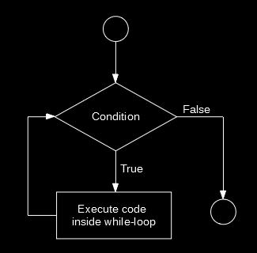

```{r set-options, echo=FALSE, cache=FALSE, warning=FALSE}
options(width = 100)
library(knitr)
```


<style>
pre {
  font-size: 21px;
}
</style>

# Welcome back!

# Updates

<!-- ## Online lecture mode -->

<!-- ```{r github, echo=FALSE, out.width = "85%", fig.align='center', purl=FALSE} -->
<!-- include_graphics("https://imagesvc.meredithcorp.io/v3/mm/gif?url=https%3A%2F%2Fstatic.onecms.io%2Fwp-content%2Fuploads%2Fsites%2F12%2F2020%2F03%2Fflatten-curve-coronavirus.gif") -->
<!-- ``` -->

<!-- ## Online lecture mode -->

<!-- - All lectures *via Zoom*, same time/day as usual. -->
<!--   - Lectures are recorded as usual. -->
<!--   - Preferably no breaks, max. 90+ minutes straight (including extended Q&A). -->
<!-- - Materials online, as usual. -->
<!-- - Extended notes (additional tutorials). -->


## Part II: Data gathering and preparation {.smaller}

```{r echo = FALSE, warning=FALSE}
library(readxl)
library(knitr)
library(magrittr)
library(kableExtra)

sched <- read_xlsx("../../../admin/2020/schedule.xlsx", col_types = "text")

#kable(sched[1:7, c(1,5)], format = "markdown")
```


```{r echo = FALSE}
kable(sched[12:14, c(1,5)], format = "markdown") 
```

## Part III: Analysis, visualisation, output {.smaller}

```{r echo = FALSE}
kable(sched[15:nrow(sched), c(1,5)], format = "markdown") 
```


# Recap: Programming with Data


## Loops
- Repeatedly execute a sequence of commands.
- Known or unknown number of iterations.
- Types: 'for-loop' and 'while-loop'.
     - 'for-loop': number of iterations typically known.
     - 'while-loop: number of iterations typically not known.

## for-loop

```{r echo=FALSE, fig.align='center', out.width="40%"}
include_graphics("../img/forloop_black.png")
```

## while-loop

```{r while, echo= FALSE, fig.align="center", out.width="45%"}

```


## Booleans and logical statements
```{r}
2+2 == 4
3+3 == 7
4!=7

```


## Booleans and logical statements
```{r}

condition <- TRUE

if (condition) {
     print("This is true!")
} else {
     print("This is false!")
}


```


## R functions

- $f:X \rightarrow Y$
- 'Take a variable/parameter value $X$ as input and provide value $Y$ as output'
- For example, $2\times X = Y$.
- R functions take 'parameter values' as input, process those values according to a predefined program, and 'return' the results.

## R functions

```{r}
# define our own function to compute the mean, given a numeric vector
my_mean <- function(x) {
     x_bar <- sum(x) / length(x)
     return(x_bar)
}
```


# Today: Putting it all Together

## Putting it all together

  - You know what *'data'* is...
  - You know how digital data is *stored*...
  - You know how to write *computer code*...
  - You know the basics of *programming in R*...

<center>
*These are the basics to handle data properly!*
</center>

<center>
*This is the basis of data science!*
</center>


## We are ready to start the data science journey

```{r echo=FALSE, fig.align='center', out.width="95%"}
include_graphics("../img/data_science_pipeline.png")
```


## Sources/formats in economics

<!-- show examples from applied research -->

## Sources/formats in economics

- CSV (typical for rectangular/table-like data)
- Variants of CSV (tab-delimited, fix length etc.)
- XML and JSON (useful for complex/high-dimensional data sets)
- HTML (a markup language to define the structure and layout of webpages)
- Unstructured text

## Sources/formats in economics


- Excel spreadsheets (`.xls`)
- Formats specific to statistical software packages (SPSS: `.sav`, STATA: `.dat`, etc.)
- Built-in R datasets
- Binary formats

<!-- While we will cover/revisit how to import all of these formats here, it is important to keep in mind that the learned fundamental concepts are as important (or more important) than knowing which function to call in R for each of these cases. New formats might evolve and become more relevant in the future for which no R function yet exists. However, the underlying logic of how formats to structure data work will hardly change. -->

  

# Data Gathering Procedure

## Organize your data pipeline!

- One R script to gather/import data.
- The beginning of your data pipeline!

## A Template/Blueprint

Tell your future self what this script is all about

```{r}
#######################################################################
# Data Handling Course: Example Script for Data Gathering and Import
#
# Imports data from ...
# Input: links to data sources (data comes in ... format)
# Output: cleaned data as CSV
# 
# U. Matter, St. Gallen, 2020
#######################################################################

```


## Script sections

- Recall: programming tasks can often be split into smaller tasks.
- Use sections to implement task-by-task and keep order.
- In RStudio: Use `----------` to indicate the beginning of sections.
- Start with a 'meta'-section.

## Script sections


```{r eval=FALSE}
#######################################################################
# Data Handling Course: Example Script for Data Gathering and Import
#
# Imports data from ...
# Input: links to data sources (data comes in ... format)
# Output: cleaned data as CSV
# 
# U. Matter, St. Gallen, 2018
#######################################################################


# SET UP --------------
# load packages
library(tidyverse)

# set fix variables
INPUT_PATH <- "/rawdata"
OUTPUT_FILE <- "/final_data/datafile.csv"

```


## Script sections

Finally we add sections with the actual code (in the case of a data import script, maybe one section per data source)

```{r eval=FALSE}
#######################################################################
# Project XY: Data Gathering and Import
#
# This script is the first part of the data pipeline of project XY.
# It imports data from ...
# Input: links to data sources (data comes in ... format)
# Output: cleaned data as CSV
# 
# U. Matter, St. Gallen, 2018
#######################################################################


# SET UP --------------
# load packages
library(tidyverse)

# set fix variables
INPUT_PATH <- "/rawdata"
OUTPUT_FILE <- "/final_data/datafile.csv"


# IMPORT RAW DATA FROM CSVs -------------


```


# Loading/Importing Rectangular Data

## Loading built-in datasets

In order to load such datasets, simply use the `data()`-function:

```{r eval=TRUE}
data(swiss)
```

## Inspect the data after loading

```{r eval=TRUE}
# inspect the structure
str(swiss)

# look at the first few rows
head(swiss)
```


# Importing Rectangular Data from Text-Files


## Comma Separated Values (CSV)

The `swiss`-dataset would look like this when stored in a CSV:

```{}
"District","Fertility","Agriculture","Examination","Education","Catholic","Infant.Mortality"
"Courtelary",80.2,17,15,12,9.96,22.2
```

<center>
*What do we need to read this format properly?*
</center>

## Parsing CSVs in R

- `read.csv()` (basic R distribution)
- Returns a `data.frame`

```{r eval=TRUE, echo=FALSE, purl=FALSE}
swiss_imported <- read.csv("../../data/swiss.csv")
```


```{r eval=FALSE, purl=FALSE}
swiss_imported <- read.csv("data/swiss.csv")
```


## Parsing CSVs in R

- Alternative: `read_csv()` (`readr`/`tidyr`-package) 
- Returns a `tibble`. 
- Used in @wickham_grolemund2017.

```{r eval=TRUE, echo=FALSE, message=FALSE, warning=FALSE, purl=FALSE}
library(readr)
swiss_imported <- read_csv("../../data/swiss.csv")
```


```{r eval=FALSE, purl=FALSE}
swiss_imported <- read_csv("data/swiss.csv")
```


## Import and parsing with `readr`

- Why `readr`?
  - Functions for all common rectangular data formats.
  - Consistent syntax.
  - More robust and faster than similar functions in basic R.
- Alternative: The `data.table`-package (handling large datasets).


## Basic usage of `readr` functions

Parse the first lines of the swiss dataset directly like this...

```{r}
library(readr)

read_csv('"District","Fertility","Agriculture","Examination","Education","Catholic","Infant.Mortality"
"Courtelary",80.2,17,15,12,9.96,22.2')

```

or read the entire `swiss` dataset by pointing to the file
```{r eval=FALSE}
swiss <- read_csv("data/swiss.csv")
```


```{r echo=FALSE, purl=FALSE}
swiss <- read_csv("../../data/swiss.csv")
```


## Basic usage of `readr` functions

In either case, the result is a `tibble`: 
```{r}
swiss
```

## Basic usage of `readr` functions


- Other `readr` functions have practically the same syntax and behavior.
    - `read_tsv()` (tab-separated)
    - `read_fwf()` (fixed-width)
    - ...

## Parsing CSVs

Recognizing columns and rows is one thing...

```{r}
swiss
```

<center>
*What else did `read_csv()` recognize?*
</center>

## Parsing CSVs

- Recall the introduction to data structures and data types in R
- How does R represent data in RAM
    - *Structure*: `data.frame`/`tibble`, etc.
    - *Types*: `character`, `numeric`, etc.
- Parsers in `read_csv()` guess the data *types*.

## Parsing CSV-columns

- `"12:00"`: type `character`?


## Parsing CSV-columns

- `"12:00"`: type `character`?
- What about `c("12:00", "midnight", "noon")`?

## Parsing CSV-columns

- `"12:00"`: type `character`?
- What about `c("12:00", "midnight", "noon")`?
- And now `c("12:00", "14:30", "20:01")`?

## Parsing CSV-columns

*Let's test it!*

```{r}
read_csv('A,B
         12:00, 12:00
         14:30, midnight
         20:01, noon')
```

## Parsing CSV-columns

*Let's test it!*

```{r}
read_csv('A,B
         12:00, 12:00
         14:30, midnight
         20:01, noon')
```

<center>
*How can `read_csv()` distinguish the two cases?*
</center>


## Parsing CSV-columns: guess types

Under the hood `read_csv()` used the `guess_parser()`- function to determine which type the two vectors likely contain:

```{r}
guess_parser(c("12:00", "midnight", "noon"))
guess_parser(c("12:00", "14:30", "20:01"))
```


# Other Common Rectangular Formats

## Spreadsheets/Excel

Needs additional R-package: `readxl`.

```{r eval=FALSE, warning=FALSE}
# install the package 
install.packages("readxl")
```

## Spreadsheets/Excel

Then we load this additional package ('library') and use the package's `read_excel()`-function to import data from an excel-sheet. 


```{r echo=FALSE, purl=FALSE, warning=FALSE, message=FALSE}
# load the package
library(readxl)

# import data from a spreadsheet
swiss_imported <- read_excel("../../data/swiss.xlsx")
```


```{r eval=FALSE}
# load the package
library(readxl)

# import data from a spreadsheet
swiss_imported <- read_excel("data/swiss.xlsx")
```

## Data from other data analysis software 

- STATA, SPSS, etc.
- Additional packages needed:
    - `foreign`
    - `haven`
- Parsers (functions) for many foreign formats.
    - For example, `read_spss()` for SPSS' `.sav`-format.


## Data from other data analysis software 

```{r echo=FALSE, purl=FALSE, warning=FALSE}
# install the package (if not yet installed):
# install.packages("haven")

# load the package
library(haven)

# read the data
swiss_imported <- read_spss("../../data/swiss.sav")

```

```{r eval=FALSE}
# install the package (if not yet installed):
# install.packages("haven")

# load the package
library(haven)

# read the data
swiss_imported <- read_spss("data/swiss.sav")

```


# Importing Web Data Formats

## XML in R

```{r echo=FALSE, warning=FALSE}
# load packages
library(xml2)

# parse XML, represent XML document as R object
xml_doc <- read_xml("../../data/customers.xml")
xml_doc

```

```{r eval=FALSE}
# load packages
library(xml2)

# parse XML, represent XML document as R object
xml_doc <- read_xml("data/customers.xml")
xml_doc

```


## XML in R: tree-structure

'customers' is the root-node, 'persons' are it's children:

```{r}

# navigate downwards
persons <- xml_children(xml_doc) 
persons

```


## XML in R: tree-structure

Navigate sidewards and upwards

```{r}

# navigate sidewards
persons[1]
xml_siblings(persons[[1]])
# navigate upwards
xml_parents(persons)

```


## XML in R: tree-structure

Extract specific parts of the data:

```{r}

# find data via XPath
customer_names <- xml_find_all(xml_doc, xpath = ".//name")
# extract the data as text
xml_text(customer_names)

```


## JSON in R


```{r eval=FALSE}
# load packages
library(jsonlite)

# parse the JSON-document shown in the example above
json_doc <- fromJSON("data/person.json")

# look at the structure of the document
str(json_doc)

```

```{r echo=FALSE, message=FALSE }
# load packages
library(jsonlite)

# parse the JSON-document shown in the example above
json_doc <- fromJSON("../../data/person.json")

# look at the structure of the document
str(json_doc)

```


## JSON in R

The nesting structure is represented as a *nested list*:

```{r}

# navigate the nested lists, extract data
# extract the address part
json_doc$address
# extract the gender (type)
json_doc$gender$type


```


# Tutorial (advanced): Importing data from a HTML table 

# Q&A


<style>
slides > slide { overflow: scroll; }
slides > slide:not(.nobackground):after {
  content: '';
}


</style>

## References {.smaller}

