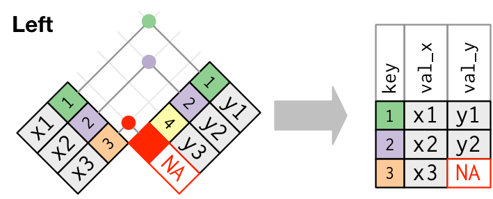
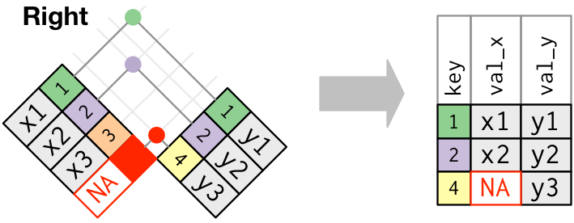
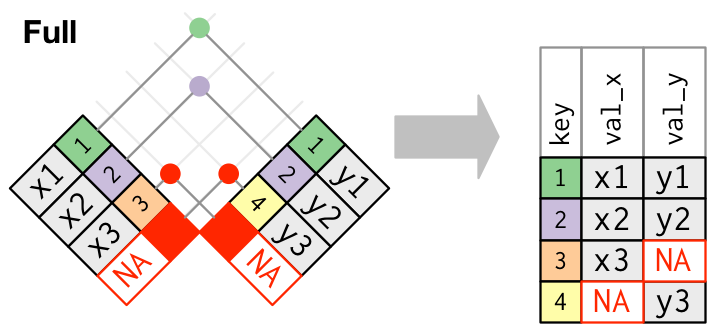

```{r set-options, echo=FALSE, cache=FALSE, warning=FALSE}
options(width = 100)
library(knitr)
```


<style>
pre {
  font-size: 21px;
}
</style>


# Updates

<!-- ## Mock exam is online! -->

<!-- - [Mock exam](https://learning.unisg.ch/courses/8120/files/601108?wrap=1) -->
<!-- - [Solutions](https://learning.unisg.ch/courses/8120/files/601109?wrap=1) -->

## Reminder

- Send questions for the Q&A session (last lecture)
- *ulrich.matter@unisg.ch *


## Reminder: Guest Lecture by Corina Grünenfelder

<center>
*9 December 2021, "Data Science in Insurance"*
<center/>

<br/>

```{r cgruenenfelder, echo=FALSE, out.width= "20%", fig.align='center',  purl=FALSE}

```

<center>
*Corina Grünenfelder*, M.Sc. Mathematics, Actuary SSA<br/>
Director, EY
<center/>


# Recap: Data Preparation

---

```{r pipeline, echo=FALSE, out.width = "85%", fig.align='center',  purl=FALSE}
include_graphics("../img/data_science_pipeline.png")
```


## The dataset is imported, now what?

- In practice: still a long way to go.
- Parsable, but messy data: Inconsistencies, data types, missing observations, wide format.
- *Goal* of data preparation: Dataset is ready for analysis.
- *Key conditions*:
  1. Data values are consistent/clean within each variable.
  2. Variables are of proper data types.
  3. Dataset is in 'tidy' (in long format)!
  

## Some vocabulary

Following @wickham_2014:

- *Dataset*: Collection of *values* (numbers and strings).
- Every value belongs to a *variable* and an *observation*
- *Variable*: Contains all values that measure the same underlying attribute across units.
- *Observation*: Contains all values measured on the same unit (e.g., a person).


## Tidy data

```{r tidydata, echo=FALSE, out.width = "90%", fig.align='center', purl=FALSE, fig.cap="Tidy data. Source: @wickham_grolemund2017, licensed under the [Creative Commons Attribution-Share Alike 3.0 United States](https://creativecommons.org/licenses/by-nc-nd/3.0/us/) license)"}
include_graphics("../img/tidy-1.png")
```


# Data Analysis with R

## Merging (Joining) datasets

- Combine data of two datasets in one dataset.
    - Why?
- Needed: Unique identifiers for observations ('keys').

## Merging (joining) datasets: example

```{r message=FALSE}
# load packages
library(tidyverse)

# initiate data frame on persons personal spending
df_c <- data.frame(id = c(1:3,1:3),
                   money_spent= c(1000, 2000, 6000, 1500, 3000, 5500),
                   currency = c("CHF", "CHF", "USD", "EUR", "CHF", "USD"),
                   year=c(2017,2017,2017,2018,2018,2018))
df_c

```


## Merging (joining) datasets: example

```{r message=FALSE}
# initiate data frame on persons' characteristics
df_p <- data.frame(id = 1:4,
                   first_name = c("Anna", "Betty", "Claire", "Diane"),
                   profession = c("Economist", "Data Scientist", "Data Scientist", "Economist"))
df_p
```

## Merging (joining) Datasets: Example

```{r}
df_merged <- merge(df_p, df_c, by="id")
df_merged
```


## Merging (joining) datasets: concept


```{r setupjoin, echo=FALSE, out.width = "60%", fig.align='center', fig.cap= 'Join setup. Source: @wickham_grolemund2017, licensed under the [Creative Commons Attribution-Share Alike 3.0 United States](https://creativecommons.org/licenses/by-nc-nd/3.0/us/) license.', purl=FALSE}
include_graphics("../img/join-setup.png")
```


## Merging (joining) datasets: concept


```{r setupjoin2, echo=FALSE, out.width = "70%", fig.align='center', fig.cap= 'Join setup. Source: @wickham_grolemund2017, licensed under the [Creative Commons Attribution-Share Alike 3.0 United States](https://creativecommons.org/licenses/by-nc-nd/3.0/us/) license.', purl=FALSE}
include_graphics("../img/join-setup2.png")
```


## Merging (joining) datasets: concept

*Merge: Inner join*

<br>


```{r innerjoin, echo=FALSE, out.width = "90%", fig.align='center', fig.cap= 'Inner join. Source: @wickham_grolemund2017, licensed under the [Creative Commons Attribution-Share Alike 3.0 United States](https://creativecommons.org/licenses/by-nc-nd/3.0/us/) license.', purl=FALSE}
include_graphics("../img/join-inner.png")
```


## Merging (joining) datasets: concept

*Merge all x: Left join*

<br>

```{r leftjoin, echo=FALSE, out.width = "90%", fig.align='center', fig.cap= 'Outer join. Source: @wickham_grolemund2017, licensed under the [Creative Commons Attribution-Share Alike 3.0 United States](https://creativecommons.org/licenses/by-nc-nd/3.0/us/) license.', purl=FALSE}

```


## Merging (joining) datasets: concept

*Merge all y: Right join*

<br>

```{r rightjoin, echo=FALSE, out.width = "90%", fig.align='center', fig.cap= 'Outer join. Source: @wickham_grolemund2017, licensed under the [Creative Commons Attribution-Share Alike 3.0 United States](https://creativecommons.org/licenses/by-nc-nd/3.0/us/) license.', purl=FALSE}

```


## Merging (joining) datasets: concept

*Merge all x and all y: Full join*

<br>


```{r fulljoin, echo=FALSE, out.width = "90%", fig.align='center', fig.cap= 'Outer join. Source: @wickham_grolemund2017, licensed under the [Creative Commons Attribution-Share Alike 3.0 United States](https://creativecommons.org/licenses/by-nc-nd/3.0/us/) license.', purl=FALSE}

```


## Merging (joining) datasets: concept


```{r vennjoin, echo=FALSE, out.width = "90%", fig.align='center', fig.cap= 'Join Venn Diagramm. Source: @wickham_grolemund2017, licensed under the [Creative Commons Attribution-Share Alike 3.0 United States](https://creativecommons.org/licenses/by-nc-nd/3.0/us/) license.', purl=FALSE}
include_graphics("../img/join-venn.png")
```


## Merging (joining) datasets: R

Overview by @wickham_grolemund2017:

dplyr (tidyverse)  | base::merge
-------------------|-------------------------------------------
`inner_join(x, y)` | `merge(x, y)`
`left_join(x, y)`  | `merge(x, y, all.x = TRUE)`
`right_join(x, y)` | `merge(x, y, all.y = TRUE)`,
`full_join(x, y)`  | `merge(x, y, all.x = TRUE, all.y = TRUE)`


# Data Summaries: Selecting, Filtering, and Mutating

## Data summaries

- First step of analysis.
- Get overview over dataset.
- Show key aspects of data.
  - Inform your own statistical analysis.
  - Inform audience (helps understand advanced analytics parts)

## Data summaries: first steps

- *Select* subset of variables (e.g., for comparisons).
- *Filter* the dataset (some observations not needed in _this_ analysis).
- *Mutate* the dataset: additional values needed

## Select, filter, mutate in R (tidyverse)

- `select()`
- `filter()`
- `mutate()`


# Data Summaries: Aggregate Statistics

## Descriptive/aggregate statistics

- Overview of key characteristics of main variables used in analysis.
- Key characteristics:
  - mean
  - standard deviation
  - No. of observations
  - etc.

## Aggregate statistics in R

1. Function to compute statistic (`mean()`).
2. Function to *apply* the statistics function to one or several columns in a tidy dataset.
  - All values.
  - By group (observation categories, e.g. by gender)

## Aggregate statistics in R

- `summarise()` (in `tidyverse`)
- `group_by()` (in `tidyverse`)
- `sapply()`, `apply()`, `lapply()`, etc. (in `base`)


# Data Analytics: a primer in linear regression/OLS

## Statistical modelling perspective

- *Dependent variable*: $y_i$.
- *Explanatory variable*: $x_i$. 
- "All the rest": $u_{i}$ (the *'residuals'* or the 'error term'). 

$y_{i}= \alpha + \beta x_{i} + u_{i}$.


## Statistical modelling perspective: causality?

```{r causality, warning=FALSE, message=FALSE, echo=FALSE, out.width="49%",out.height="49%",fig.show='hold', fig.align='center',  purl=FALSE}
include_graphics(c("../img/causal_diagram_endo.png", "../img/causal_diagram_exo.png"))

```


## Illustration with pseudo-data 


First, we define the key parameters for the simulation. We choose the actual values of $\alpha$ and $\beta$, and set the number of observations $N$.

```{r}
alpha <- 30
beta <- 0.9
N <- 1000
```

## Illustration with pseudo-data 

Now, we initiate a vector $x$ of length $N$ drawn from the uniform distribution (between 0 and 0.5). This will be our explanatory variable.

```{r}
x <- runif(N, 0, 50)
```

## Illustration with pseudo-data 


Next, we draw a vector of random errors (residuals) $u$ (from a normal distribution with mean=0 and SD=0.05) and compute the corresponding values of the dependent variable $y$. 

```{r}
# draw the random errors (all the other factors also affecting y)
epsilon <- rnorm(N, sd=10)
# compute the dependent variable values
y <- alpha + beta*x + epsilon
```


## Illustration with pseudo-data 


```{r}
plot(x,y)
abline(a = alpha, b=beta, col="red")
```

## Illustration with pseudo data: "averaging"


```{r}

# compute average y per x intervals
lower <- c(0,10,20,30,40)
upper <- c(lower[-1], 50)
n_intervals <- length(lower)
y_bars <- list()
length(y_bars) <- n_intervals
x_bars <- list()
length(x_bars) <- n_intervals
for (i in 1:n_intervals){
  y_bars[i] <- mean(y[lower[i] <= x & x < upper[i]])
  x_bars[i] <- mean(x[lower[i] <= x & x < upper[i]])

}
y_bars <- unlist(y_bars)
x_bars <- unlist(x_bars)

# add to plot
plot(x,y)
abline(a = alpha, b=beta, col="red")
points(x_bars, y_bars, col="blue", lwd=10)
```


## Parameter estimation: "average out the $u$"


Clearly, the average values are much closer to the real values. That is, we can 'average out' the $u$ in order to get a good estimate for the effect of $x$ on $y$ (to get an estimate of $\beta$). With this understanding, we can now formalize how to compute $\beta$ (or, to be more precise, an estimate of it: $\hat{\beta}$). For simplicity, we take $\alpha=30$ as given.

In a first step we take the averages of both sides of our initial regression equation:

$\frac{1}{N}\sum{y_i}=\frac{1}{N}\sum{(30 + \beta x_{i} + u_{i})}$,

rearranging and using the common 'bar'-notation for means, we get

$\bar{y}=30+\beta\bar{x} + \bar{u}$,

and solving for $\beta$ and some rearranging then yields

$\beta=\frac{\bar{y}-30-\bar{u}}{\bar{x}}$. 


## Parameter estimation: "average out the $u$"


While the elements in $\bar{u}$ are unobservable, we can use the rest to compute an estimate of $\beta$:


$\hat{\beta}=\frac{\bar{y}-30}{\bar{x}}$. 

```{r}
(mean(y) -30)/mean(x)
```


## Data analytics perspective and estimation: data


```{r eval=FALSE}
# load the data
data(swiss)
# look at the description
?swiss
```

```{r echo=FALSE, message=FALSE, warning=FALSE}
# load the data
data(swiss)

```

## Data analytics perspective and estimation: research question

- Do more years of schooling improve educational outcomes?
- Approximate educational attainment with the variable `Education` and educational outcomes with the variable `Examination`.
- Make use of the simple linear model to investigate whether more schooling improves educational outcomes (on average)?


## Model specification

$Examination_{i}= \alpha + \beta Education_{i}$,

- Intuitive hypothesis: $\beta$ is positive, indicating that a higher share of draftees with more years of schooling results in a higher share of draftees who reach the highest examination mark.
- *Problems*?


## Model specification

To formally acknowledge that other factors might also play a role, we extend our model with the term $u_{i}$. For the moment, we thus subsume all other potentially relevant factors in that term:

$Examination_{i}= \alpha + \beta Education_{i} + u_{i}$.


## Raw data


```{r}
plot(swiss$Education, swiss$Examination)
```


## Derivation and implementation of OLS estimator

From the model equation we easily see that these 'differences' between the predicted and the actual values of $y$ are the remaining unexplained component $u$: 

$y_{i}-\hat{\alpha}-\hat{\beta} x_i=u_i$.

Hence, we want to minimize the *sum of squared residuals (SSR)*: $\sum{u_i^2}=\sum{(y_{i}-\hat{\alpha}-\hat{\beta} x_i)^2}$. Using calculus, we define the two first order conditions:

$$\frac{\partial SSR}{\partial \hat{\alpha}}=\sum{-2(y_{i}-\hat{\alpha}-\hat{\beta} x_i)}=0$$

$$\frac{\partial SSR}{\partial \hat{\beta}}=\sum{-2x_i(y_{i}-\hat{\alpha}-\hat{\beta} x_i)}=0$$


## Derivation and implementation of OLS estimator

The first condition is relatively easily solved by getting rid of the $-2$ and considering that  $\sum{y_i}=N\bar{y}$:
$\hat{\alpha}=\bar{y}-\hat{\beta}\bar{x}$.


## Derivation and implementation of OLS estimator

By plugging the solution for $\hat{\alpha}$ into the first order condition regarding $\hat{\beta}$ and again considering that $\sum{y_i}=N\bar{y}$, we get the solution for the slope coefficient estimator:

$\frac{\sum{x_{i}y_{i}}-N\bar{y}\bar{x}}{\sum{x_i^2}-N\bar{x}^2}$.


## OLS estimator in R!


```{r}

# implement the simple OLS estimator
# verify implementation with simulated data from above
# my_ols(y,x) 
# should be very close to alpha=30 and beta=0.9
my_ols <- 
  function(y,x) {
    N <- length(y)
    betahat <- (sum(y*x) - N*mean(x)*mean(y)) / (sum(x^2)-N*mean(x)^2)
    alphahat <- mean(y)-betahat*mean(x)
    
    return(list(alpha=alphahat,beta=betahat))
  }

# estimate effect of Education on Examination
estimates <- my_ols(swiss$Examination, swiss$Education)
estimates
```


## Simple visualisation

```{r}
plot(swiss$Education, swiss$Examination)
abline(estimates$alpha, estimates$beta, col="red")
```


## Regression toolbox in R


```{r}
estimates2 <- lm(Examination~Education, data=swiss)
estimates2
```
With one additional line of code we can compute all the common statistics about the regression estimation:

```{r}
summary(estimates2)
```


<!-- # Unterstanding Statistics and Probability with Code -->

<!-- ## Random numbers and computation -->
<!-- <center> -->
<!-- *Can computers generate random numbers?!* -->
<!-- </center> -->


<!-- ## Random draws and distributions -->

<!-- ```{r} -->
<!-- normal_distr <- rnorm(1000) -->
<!-- hist(normal_distr) -->
<!-- ``` -->


<!-- ## Illustration of variability -->

<!-- ```{r, echo=TRUE} -->
<!-- # draw a random sample from a normal distribution with a large standard deviation -->
<!-- largevar <- rnorm(10000, mean = 5000, sd = 5) -->
<!-- # draw a random sample from a normal distribution with a small standard deviation -->
<!-- littlevar <- rnorm(10000, mean = 5000, sd = 1) -->
<!-- ``` -->


<!-- ## Illustration of variability -->

<!-- ```{r, echo=TRUE} -->
<!-- # visualize the distributions of both samples with a density plot -->
<!-- plot(density(littlevar), col = "blue",  -->
<!--      xlim=c(min(largevar), max(largevar)), main="Income Distribution") -->
<!-- lines(density(largevar), col = "red") -->

<!-- ``` -->
<!-- <!-- **Note:** the red curve illustrates the distribution of the sample with a large standard deviation (a lot of variability) whereas the blue curve illustrates the one with a rather small standard deviation. --> -->


<!-- ## Skewness and kurtosis -->

<!-- ```{r, echo=TRUE} -->
<!-- # install the R-package called "moments" with the following command (if not installed yet): -->
<!-- # install.packages("moments") -->

<!-- # load the package -->
<!-- library(moments) -->

<!-- ``` -->


<!-- ## Skewness -->

<!-- - Skewness refers to how symetric the frequency distribution of a variable is.  -->
<!-- - For example, a distribution can be *'positively skewed'* meaning it has a *long tail on the right* and a lot of 'mass' (observations) on the left.  -->

<!-- ## Skewness: R example -->

<!-- ```{r, echo=TRUE} -->
<!-- # draw a random sample of simulated data from a normal distribution -->
<!-- # the sample is of size 1000 (hence, n = 1000) -->
<!-- sample <- rnorm(n = 1000) -->

<!-- # plot a histogram and a density plot of that sample -->
<!-- # note that the distribution is neither strongly positively nor negatively skewed -->
<!-- # (this is to be expected, as we have drawn a sample from a normal distribution!) -->
<!-- hist(sample) -->


<!-- ``` -->


<!-- ## Skewness: R example -->

<!-- ```{r, echo=TRUE} -->

<!-- # now compute the skewness -->
<!-- skewness(sample) -->

<!-- ``` -->

<!-- ## Skewness: R example -->

<!-- ```{r, echo=TRUE} -->
<!-- # now we intentionally change our sample to be strongly positively skewed -->
<!-- # we do that by adding some outliers (observations with very high values) to the sample  -->
<!-- sample <- c(sample, (rnorm(200) + 2), (rnorm(200) + 3)) -->

<!-- # have a look at the distribution and re-calculate the skewness -->
<!-- hist(sample) -->
<!-- skewness(sample) -->


<!-- ``` -->


<!-- ## Skewness: R example -->

<!-- ```{r, echo=TRUE} -->

<!-- # have a look at the distribution and re-calculate the skewness -->
<!-- hist(sample) -->
<!-- skewness(sample) -->


<!-- ``` -->


<!-- ## Kurtosis -->

<!-- - Kurtosis refers to how much 'mass' a distribution has in its 'tails'.  -->
<!-- - Tells us something about whether a distribution tends to have a lot of outliers.  -->


<!-- ## Kurtosis: R example -->
<!-- ```{r} -->
<!-- # draw a random sample of simulated data from a normal distribution -->
<!-- # the sample is of size 1000 (hence, n = 1000) -->
<!-- sample <- rnorm(n = 1000) -->

<!-- # plot the density & compute the kurtosis -->
<!-- hist(sample) -->

<!-- ``` -->


<!-- ## Kurtosis: R example -->
<!-- ```{r} -->

<!-- # compute the kurtosis -->
<!-- kurtosis(sample) -->

<!-- ``` -->


<!-- ## Kurtosis: R example -->
<!-- ```{r} -->

<!-- # now lets remove observations from the extremes in this distribution -->
<!-- # we thus intentionally alter the distribution to have less mass in its tails -->
<!-- sample <- sample[ sample > -0.6 & sample < 0.6] -->

<!-- ``` -->


<!-- ## Kurtosis: R example -->
<!-- ```{r} -->


<!-- # plot the distribution again and see how the tails have changed -->
<!-- hist(sample) -->

<!-- # re-calculate the kurtosis -->
<!-- kurtosis(sample) -->
<!-- # as expected, the kurtosis has now a lower value -->

<!-- ``` -->


<!-- ## Compute the skewness in R -->


<!-- **Skewness** -->
<!-- ```{r, echo=TRUE} -->
<!-- # own implementation -->
<!-- sum((sample-mean(sample))^3) / ((length(sample)-1) * sd(sample)^3) -->

<!-- # implementation in moments package -->
<!-- skewness(sample) -->
<!-- ``` -->

<!-- ## Compute the kurtosis in R -->

<!-- **Kurtosis** -->
<!-- ```{r, echo=TRUE} -->
<!-- # own implementation -->
<!-- sum((sample-mean(sample))^4) / ((length(sample)-1) * sd(sample)^4) -->

<!-- # implementation in moments package -->
<!-- kurtosis(sample) -->
<!-- ``` -->


<!-- ## The Law of Large Numbers (LLN) -->

<!-- - Important statistical property. -->
<!-- - Essentially describes how the behavior of *sample averages* is related to *sample size*. -->
<!-- - States that the *sample mean* can come arbitrarily close to the *population mean* by increasing the sample size $N$. -->

<!-- ## The Law of Large Numbers (LLN): playing dice -->

<!-- - Roll a fair die, record result: either  1, 2, 3, 4, 5, or 6. -->
<!-- - Probability of each possible outcome is $1/6$. -->


<!-- ## The Law of Large Numbers (LLN): playing dice -->

<!-- - Roll a fair die, record result: either  1, 2, 3, 4, 5, or 6. -->
<!-- - Probability of each possible outcome is $1/6$. -->
<!-- - Expected value (average in the long run): $(1 + 2 + 3 + 4 + 5 + 6)/6 = 3.5$ -->


<!-- ## The Law of Large Numbers (LLN): playing dice -->

<!-- - Roll a fair die, record result: either  1, 2, 3, 4, 5, or 6. -->
<!-- - Probability of each possible outcome is $1/6$. -->
<!-- - Expected value (average in the long run): $(1 + 2 + 3 + 4 + 5 + 6)/6 = 3.5$ -->
<!-- - Proof?  -->
<!--   - Mathematically. -->
<!--   - Or: Experiment/Simulation (with R). -->


<!-- ## LLN in R -->

<!-- ```{r dice10, echo=TRUE} -->
<!-- # first we define the potential values a die can take -->
<!-- dvalues <- 1:6 # the : operater generates a regular sequence of numbers (from:to) -->
<!-- dvalues -->
<!-- # define the size of the sample n (how often do we roll the die...) -->
<!-- # for a start, we only roll the die ten times -->
<!-- n <- 10 -->
<!-- # draw the random sample: 'roll the die n times and record each result' -->
<!-- results <- sample( x = dvalues, size = n, replace = TRUE) -->
<!-- # compute the mean -->
<!-- mean(results) -->
<!-- ``` -->

<!-- ## LLN in R -->

<!-- ```{r dice100, echo=TRUE} -->
<!-- n <- 100 -->
<!-- # draw the random sample: 'roll the die n times and record each result' -->
<!-- results <- sample( x = dvalues, size = n, replace = TRUE) -->
<!-- # compute the mean -->
<!-- mean(results) -->
<!-- ``` -->

<!-- ## LLN in R -->

<!-- ```{r lln, echo=TRUE} -->
<!-- # essentially, what we are doing here is repeating the experiment above many times, -->
<!-- # each time increasing n -->
<!-- # define the set of sample sizes -->
<!-- ns <- seq(from = 10, to = 10000, by = 10) -->
<!-- # initiate an empty list to record the results -->
<!-- means <- list() -->
<!-- length(means) <- length(ns) -->
<!-- # iterate through each sample size: 'repeat the die experiment for each sample size' -->
<!-- for (i in 1:length(ns)) { -->

<!--      means[[i]] <- mean(sample( x = dvalues, size = ns[i], replace = TRUE)) -->
<!-- } -->


<!-- ``` -->


<!-- ## LLN in R -->

<!-- ```{r lln2, echo=TRUE} -->
<!-- # visualize the result: plot sample means against sample size -->
<!-- plot(ns, unlist(means), -->
<!--      ylab = "Sample Mean", -->
<!--      xlab = "Sample Size", -->
<!--      pch = 16, -->
<!--      cex = .6) -->
<!-- abline(h = 3.5, col = "red") -->
<!-- ``` -->


<!-- ## The Central Limit Theorem -->

<!-- The Central Limit Theorem (CLT) is an almost miraculous statistical property enabling us to test the statistical significance of a statistic such as the mean. In essence, the CLT states that as long as we have a large enough sample, the t-statistic (applied, e.g., to test whether the mean is equal to a particular value) is approximately standard normal distributed. This holds independently of how the underlying data is distributed. -->

<!-- Consider the dice play example above. We might want to statistically test whether we are indeed playing with a fair die (which would imply an expected mean value of 3.5!). In order to test that we would roll the die 100 times and record each resulting value. We would then compute the sample mean and standard deviation in order to assess how likely it was to observe the mean we observe if the population mean actually is 3.5 (thus our H0 would be pop_mean = 3.5, or in plain English 'the die is fair'). However, the distribution of the resulting die values are not standard normal distributed. So how can we interpret the sample standard deviation and the sample mean in the context of our hypothesis? -->

<!-- The simplest way to interpret these measures is by means of a *t-statistic*. A t-statistic for the sample mean under our working hypothesis that pop_mean = 3.5 is constructed as `t(3.5) = (sample_mean - 3.5) / (sample_sd/sqrt(n))`. Let's illustrate this in R: -->

<!-- ```{r t-test} -->

<!-- # First we roll the die like above -->
<!-- n <- 100 -->
<!-- # draw the random sample: 'roll the die n times and record each result' -->
<!-- results <- sample( x = dvalues, size = n, replace = TRUE) -->
<!-- # compute the mean -->
<!-- sample_mean <- mean(results) -->
<!-- # compute the sample sd -->
<!-- sample_sd <- sd(results) -->
<!-- # estimated standard error of the mean -->
<!-- mean_se <- sample_sd/sqrt(n) -->

<!-- # compute the t-statistic: -->
<!-- t <- (sample_mean - 3.5) / mean_se -->
<!-- t -->

<!-- ``` -->

<!-- At this point you might wonder what the use of t is if the underlying data is not drawn from a normal distribution. In other words: what is the use of t if we cannot interpret it as a value that tells us how likely it is to observe this sample mean, given our null hypothesis? Well, actually we can. And here is where the magic of the CLT comes in: It turns out that there is a mathematical proof (i.e. the CLT) which states that the t-statistic itself can arbitrarily well be approximated by the standard normal distribution. This is true independent of the distribution of the underlying data in our sample! That is, if we have a large enough sample, we can simply compute the t-statistic and look up how likely it is to observe a value at least as large as t, given the null hypothesis is true (-> the p-value): -->

<!-- ```{r p-value} -->
<!-- # calculate the p-value associated with the t-value calculated above -->
<!-- 2*pnorm(-abs(t)) -->
<!-- ``` -->
<!-- In that case we could not reject the null hypothesis of a fair die. However, as pointed out above, the t-statistic is only assymptotically (meaning with very large samples) normally distributed. We might not want to trust this hypothesis test too much because we were using a sample of only 100 observations. -->

<!-- Let's turn back to R in order to illustrate the CLT at work. Similar to the illustration of the LLN above, we will repeatedly compute the t-statistic of our dice play experiment and for each trial increase the number of observations.  -->

<!-- ```{r clt} -->
<!-- # define the set of sample sizes -->
<!-- ns <- c(10, 40, 100) -->
<!-- # initiate an empty list to record the results -->
<!-- ts <- list() -->
<!-- length(ts) <- length(ns) -->
<!-- # iterate through each sample size: 'repeat the die experiment for each sample size' -->
<!-- for (i in 1:length(ns)) { -->

<!--      samples.i <- sapply(1:500000, function(j) sample( x = dvalues, size = ns[i], replace = TRUE)) -->
<!--      ts[[i]] <- apply(samples.i, function(x) (mean(x) - 3.5) / sd(x), MARGIN = 2) -->
<!-- } -->

<!-- # visualize the result: plot the density for each sample size -->

<!-- # plot the density for each set of t values -->
<!-- hist(ts[[1]], main = "Sample size: 10", xlab = "T-value") -->
<!-- hist(ts[[2]], main = "Sample size: 40", xlab = "T-value") -->
<!-- hist(ts[[3]], main = "Sample size: 100", xlab = "T-value") -->

<!-- # finally have a look at the actual standard normol distribution as a reference point -->
<!-- plot(function(t)dnorm(t), -4, 4, main = "Normal density") -->
<!-- ``` -->

<!-- Note how the histogram is getting closer to a normal distribution with increasing sample size.  -->


# Q&A


<style>
slides > slide { overflow: scroll; }
slides > slide:not(.nobackground):after {
  content: '';
}


code {
  color: white;
}


pre {
  color: white;
}
</style>

## References {.smaller}

