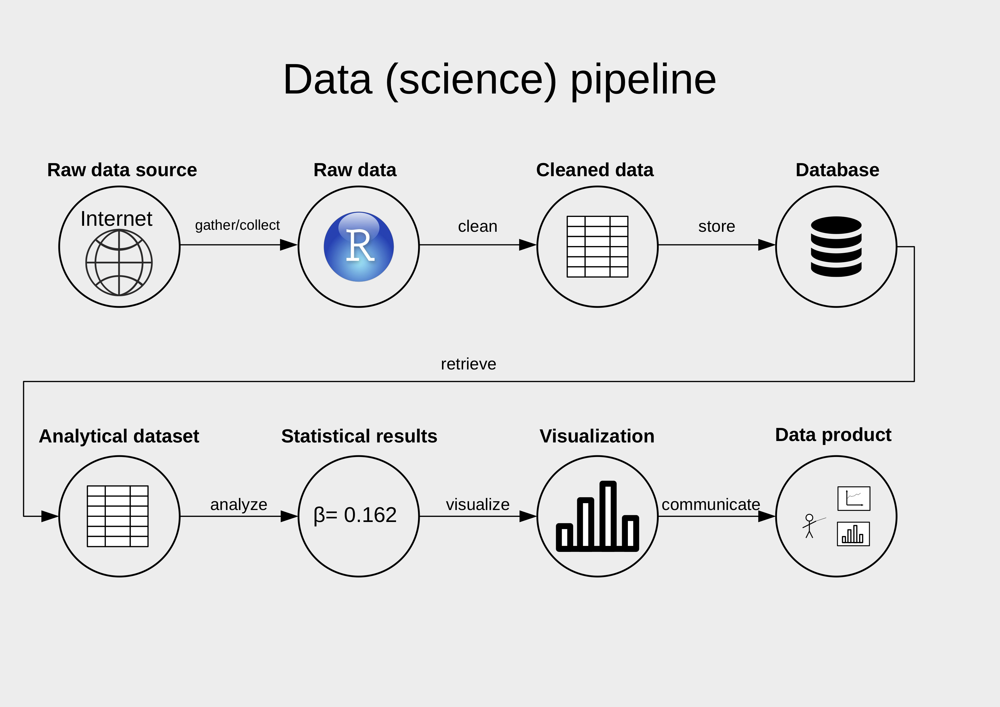

```{r set-options, echo=FALSE, cache=FALSE}
options(width = 100)
library(knitr)
```


# Updates

## Decentral exam

<!-- - Friday, 18 December -->
<!--     - Decentral exam for *exchange students*! -->
<!--     - See Canvas for details on *place/time*! -->
<!--     - Bring your *student ID*! -->


## Plan for today

1. Wrap up
2. Exam Info
3. Q&A
5. Suggested Improvements
6. Final Remarks
7. Happy Holidays!🎄


# Recap Visualisation

## Grammar of Graphics/`ggplot2`

- The *`ggplot2`* package [@wickham_2016].
- ... an implementation of Leland Wilkinson's ['Grammar of Graphics'](https://blog.gtwang.org/wp-content/uploads/2016/07/ggplot-grammar-of-graphics-stack-1.png).


## `ggplot2` basics

Using `ggplot2` to generate a basic plot in R is quite simple. Basically, it involves three key points:

  1. The data must be stored in a `data.frame`/`tibble` (in tidy format!). 
  2. The starting point of a plot is always the function `ggplot()`.
  3. The first line of plot code declares the data and the 'aesthetics' (e.g., which variables are mapped to the x-/y-axes):

```{r echo=TRUE, eval=FALSE}
ggplot(data = my_dataframe, aes(x= xvar, y= yvar))
```


```{r echo=FALSE, message=FALSE, warning=FALSE}
# load the R package
library(tidyverse) # automatically loads ggplot2
# load the data
data(swiss)
# get details about the data set
# ?swiss
# inspect the data
head(swiss)


# via tidyverse/mutate
swiss <- mutate(swiss, 
                Religion = 
                  ifelse(50 < Catholic, 'Catholic', 'Protestant'))

# 'old school' alternative
swiss$Religion <- 'Protestant'
swiss$Religion[50 < swiss$Catholic] <- 'Catholic'

# set to factor
swiss$Religion <- as.factor(swiss$Religion)
```


## `ggplot2`: building plots layer by layer

```{r echo=TRUE, out.width="85%", fig.width=6,fig.height=2.8}
ggplot(data = swiss, aes(x = Education, y = Examination))

```

## `ggplot2`: building plots layer by layer


```{r echo=TRUE, out.width="85%", fig.width=6,fig.height=2.8}
ggplot(data = swiss, aes(x = Education, y = Examination)) + 
     geom_point(aes(color = Agriculture)) +
     geom_smooth(method = 'lm') +
     facet_wrap(~Religion)

```


## `ggplot2`: building plots layer by layer

```{r echo=TRUE, out.width="85%", fig.width=6,fig.height=2.8}
ggplot(data = swiss, aes(x = Education, y = Examination)) + 
     geom_point(aes(color = Agriculture)) +
     geom_smooth(method = 'lm') +
     facet_wrap(~Religion)+
     theme_minimal()

```


# Wrap up

---

```{r pipeline, echo=FALSE, out.width = "85%", fig.align='center',  purl=FALSE}

```

## Wrap up: 'Theory'/Conceptual part

- Understand the very basics of how computers process data.
  - Binary code.
  - Representation of binary code as text (encodings/standards!).


## Wrap up: 'Theory'/Conceptual part

- Understand the very basics of how computers process data.
  - Binary code.
  - Representation of binary code as text (encodings/standards!).
  - Text files to store data: special characters (comma, semicolon, etc.) define the structure (following a standard!)
    - CSV: two-dimensional/table-like structure
    - JSON/XML: hierarchical data (high-dimensional)

## Wrap up: 'Theory'/Conceptual part

- Understand the very basics of how computers process data.
  - Binary code.
  - Representation of binary code as text (encodings/standards!).
  - Text files to store data: special characters (comma, semicolon, etc.) define the structure (following a standard!)
    - CSV: two-dimensional/table-like structure
    - JSON/XML: hierarchical data (high-dimensional)
  - Data in text file: how is data structured when stored on the hard disk (mass storage device).
  - Data structures in R (objects): How data is structured/represented when loaded into RAM (via a 'parser')
        
    
## Wrap up: Applied part: import, cleaning, analysis/visualisation.

- How to get from the data source to the final data product.
- `tidyverse`: tools to help you with every part of the data pipeline.


## Wrap up: Applied part: import, cleaning, analysis/visualisation.

- How to get from the data source to the final data product.
- `tidyverse`: tools to help you with every part of the data pipeline.
- How to import data into R? What to do if the parsing fails?
- How to clean/prepare data in R? Aim: tidy data set (rows:observations, columns:variables).
- How to filter for specific observations? How to select a set of variables/columns?
- How to modify/add variable?
- How to compute basic summary statistics?
- How to visualise raw data and basic statistics?


# Exam

## 'Code questions'

- Note: we do not invent wrong function parameters or misspell function names etc to mislead you!
- 'Passive' knowledge of key R syntax and most important functions of core lecture contents are important!

## 'Code questions'

- Work step-by-step through the code example. What happens in each parenthesis, on each line? 
- From the inner part to the outer part, from top to bottom.
- Use pencil/paper to keep track of values, data structures (how does a data-frame look like?), classes.

## MC questions type A

- Read the statement/question, then evaluate each statement (A-D) like a T/F question. 

## MC questions type B (only one correct)

- Here you can use an 'elimination process'. 
- Which statement is most likely the correct one?

## Open questions

- Read all parts carefully. Often, one question builds on a previous question.
- Respond brief and to the point.
- We want to test whether you can explain/illustrate/apply key concepts of the course in a specific domain of the course.
- [Mock exam](https://learning.unisg.ch/courses/10927/files/1196448?wrap=1)


## General questions

- *Do we need to know what packages need to be loaded for a certain command in R?*
- Only for the very core packages used in the course. 
- For example, you should know that in order to generate plots based on the Grammar of Graphics concept, you need to load the `ggplot2` package first.
- Importantly, if a code-example question refers to specific functions, you can always assume that the corresponding package is also loaded.

# Q&A


## Review of `typeof()` and `class()`

- Both `type` and `class` refer to the very basic "kind" or "type" of data we are dealing with in R.
- `type` refers to R's basic data types: `character`, `double`, `integer`, `complex`, `logical`, etc. Users cannot simply add new `type`s. 
- Any data value is stored in a specific *data type*. Objects of a specific *class* (e.g., a `tibble`) often contain values of various *types*.
- Object classes can be defined by users. There are way more classes than data types in R.
- Any object of a given class, can contain elements of various types but not the other way around. 


## Review of `typeof()` and `class()`

Illustration: an object of class `data.frame` is based on type list `list`. The columns of the data.frame can contain different types of data.

```{r}
test <- data.frame(a=1, b="c", stringsAsFactors = FALSE)
class(test)
typeof(test)

```

## Review of `typeof()` and `class()`

At the very basic level of an object, element `class` and `type` can be the same.

```{r}
class(test$b)
typeof(test$b)

```

## Review of `typeof()` and `class()`

Summary: `typeof()` shows you the very basic data type of an object. `class()` shows you the higher-level, overall 'type' of an object. Types are 'hard-coded' in the R language, no new types can be added by the user (easily). Classes are intended to be extened by users/R-programmers. They are a core aspect of object-oriented programming (in R and beyond).


## When is a number of type `double` and when of type `integer`?

- `integer` numbers are integer ('ganzzahlig'). They can precisely be expressed in binary. A number of type `integer` cannot be a fraction.

- `double` numbers are R's way of expressing floating point numbers, the way *fractions* can be expressed in a computer. An integer can be stored as type `integer` or as `double` (not a 100 percent precise).

```{r}
numbers <- c(2,3,4.5)
typeof(numbers)
as.integer(numbers)

```


## Booleans and filtering

Why `filter(flights, month == (11 | 12))` does not work?

Three aspects: 
- `month == (11 | 12)` is a logical statement (basic R).
- `(11 | 12)` itself is a logical statement.
- `filter()` returns rows for which the *overall* logical statement is TRUE. 

## Booleans and filtering

(for simplicity, we use a simpler 'month column')

```{r}
month <- c(1,3,5,12,11)
class(month)
```

Work from 'inside to outside'

```{r}
(11 | 12) # returns TRUE
```

We then would compare `TRUE` (a boolean) with each element in `month`, a numeric vector. `filter()` deals with this problem by automatically coercing `TRUE` to numeric, which is `1` (`FALSE` would be `0`).

```{r}
as.numeric(TRUE)
```

## Booleans and filtering

Hence, the overall logical statement we use for filtering is reduced to

```{r}
month == 1 # since (11 | 12) == TRUE == 1
```

Which means, `filter()` will return all rows, where `month` is equal to `1` (January).


## Booleans and filtering

The problem is that the logical statement is expressed the wrong way. Each logical condition needs to be expressed. The following would be correct:

```{r}
(month==11 | month==12)
```

This states month is equal to 11 or month is equal to 12. R evaluates this step by step: `month==11` is TRUE in some cases, `month==12` is TRUE in other cases, the `|` (or) combines the two sides in the sense that either one or the other is true.


## Booleans and filtering

Valid alternatives:
```{r eval=FALSE}
filter(flights, (month==11 | month==12))
filter(flights, month %in% c(11,12)) # is the value in month in the set c(11,12)? 
```


## CSV, End-of-line (mock-exam)

In the mock exam, Part 2 Q1 letter A: Why is this incorrect? Is it because it should be CSV file and not binary? In letter D: What special character marks the end of a line, I thought it was simply the end of the line.

*From the mock exam:*
1.  In csv files, rows of data are indicated by new lines. Therefore...

- A The underlying binary code contains white spaces whenever an end of line occurs
- B CSV files can only be opened in spreadsheet software like Excel.
- C Computers recognize the end of the line because each line contains the same amount of characters
- D A special character marks the end of a line. This is why a CSV-parser recognizes when a line ends.

## CSV, End-of-line (mock-exam)


*Explanation regarding A:* The point is that binary code only consists of 0s and 1s. 'White space' visible in a text file when looking at it though a text editor is in itself a combination of 0s and 1s in the underlying binary code. Also, the end of a line is indicated in the binary code by another combination of 0s and 1s (see also D).

*Explanation regarding D:* The point is that the 'end of a line' is actually indicated by a special character (a specific combination of 0s and 1s). See section 2.1 CSVs and fixed-width format in the lecture notes of week 3 for a detailed explanation and illustration.

## HTML (mock-exam)

*Question:* In the mock exam, Part 3 Q2, How is this a valid HTML if there are <head> …. <head/> tags in between the <body> … <body/> tags? How can you fit head inside body?

*From the mock exam:*

``<html><head><title>alpha</title></head><head><body>beta</body></head></html>``

  - A All tags occurring in the code are valid HTML tags
  - B The `<title>` tag should be placed in between the `<body>` tags in order to make this code a valid HTML document
  - C 'alpha' and 'beta' are HTML-tag attributes
  - D The code represents a basically correctly specified HTML-document


## HTML (mock-exam)

*From the Mock exam:*

``<html><head><title>alpha</title></head><head><body>beta</body></head></html>``

  - A All tags occurring in the code are valid HTML tags
  - B The `<title>` tag should be placed in between the `<body>` tags in order to make this code a valid HTML document
  - C 'alpha' and 'beta' are HTML-tag attributes
  - D The code represents a basically correctly specified HTML-document

*Explanation:*

  - A is TRUE, because all tags used in the document  (`<head></head>`, `<body></body>`, and `<html></html>`) are valid HTML-tags. For example,  `<<person-id>><</person-id>>` is not a valid HTML tag.
  - B is FALSE because the title-tag belongs in the head-section.
  - C is FALSE because HTML-tag attributes would have to be from a clearly defined set and would have to be placed in the tag not between tags.
  - D is FALSE because `<head></head>` should only occur once and `<body></body>` cannot be placed within `<head></head>`. Thus, the HTML-document is not valid/is mis-specified as the tags are nested in the wrong way. Specifically, regarding the question: for a correctly specified HTML-document, one cannot fit head inside body.

The point is that for the overall document to be valid (that is, to be parsed and interpreted correctly), valid tags need to be used in the right way (the right nesting-structure and order). In the example, the former is the case (A) but the latter not (D).


# Course Evaluation


## Course Evaluation
<center>
*Ongoing! See link on our course's StudyNet/Canvas page.*
</center>


# Suggested Improvements


## Improvements
- *Course structure*
  - First half: R boot camp, concepts/theory; second half: applied, each part of the "data pipeline."
  - Each slide set/lecture note will at the beginning explicitly mention the learning goals.
  - Online tutorials (via Nuvolos), and short videos/summaries.
  - Split exercises more explicitly into 'more comfortable'/'less comfortable'.

## Improvements
- *Infrastructure*
    - Further improve Nuvolos cloud solution for materials and exercises.
    - All materials automatically synced to Nuvolos student accounts.
    - *Thoughts, additional suggestions?*


# Final Remarks

## Final Remarks
- Materials will be updated on GitHub: https://github.com/umatter/datahandling.


## Final Remarks

- Materials will be updated on GitHub: https://github.com/umatter/datahandling.
- All the best for your exams! 👍


## Final Remarks

- Materials will be updated on GitHub: https://github.com/umatter/datahandling.
- All the best for your exams! 👍
- All the best for your studies and careers!

## Final Remarks

- Materials will be updated on GitHub: https://github.com/umatter/datahandling.
- All the best for your exams! 👍
- All the best for your studies and careers, *and finally, of course, ...*


------

```{}

       .     .                       *** **
                !      .           ._*.                       .
             - -*- -       .-'-.   !  !     .
    .    .      *       .-' .-. '-.!  !             .              .
               ***   .-' .-'   '-. '-.!    .
       *       ***.-' .-'         '-. '-.                   .
       *      ***$*.-'               '-. '-.     *
  *   ***     * ***     ___________     !-..!-.  *     *         *    *
  *   ***    **$** *   !__!__!__!__!    !    !  ***   ***    .   *   ***
 *** ****    * *****   !__!__!__!__!    !      .***-.-*** *     *** * #_
**********  * ****$ *  !__!__!__!__!    !-..--'*****   # '*-..---# ***
**** *****  * $** ***      .            !      *****     ***       ***
************ ***** ***-..-' -.._________!     *******    ***      *****
***********   .-#.-'           '-.-''-..!     *******   ****...     #
  # ''-.---''                           '-....---#..--'****** ''-.---''-
                  Merry Christmas                         # 
                  


```


-------


```{}
  _` | __ \   _` |    _` |   __ \   _` | __ \  __ \  |   |
 (   | | | | (   |   (   |   | | | (   | |   | |   | |   |
\__,_|_| |_|\__,_|  \__,_|  _| |_|\__,_| .__/  .__/ \__, |
                                        _|    _|    ____/
  \  |                \ \   /               |
   \ |  _ \ \  \   /   \   / _ \  _` |  __| |
 |\  |  __/\ \  \ /       |  __/ (   | |   _|
_| \_|\___| \_/\_/       _|\___|\__,_|_|   _)
```


## References


<style>

slides > slide { overflow: scroll; }
slides > slide:not(.nobackground):after {
  content: '';
}

</style>

