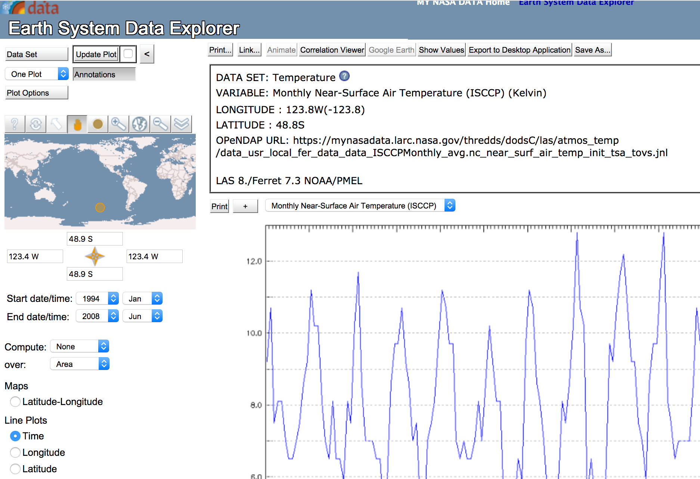
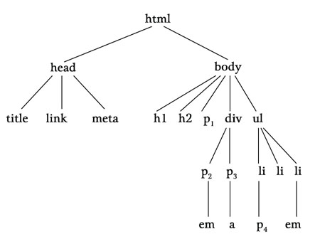

```{r set-options, echo=FALSE, cache=FALSE}
options(width = 100)
library(knitr)
```

# Part I: Point Nemo

## Set Up 

1. Go to [NASA's Earth System Data Explorer](https://mynasadata.larc.nasa.gov/EarthSystemLAS/UI.vm)
2. Click on Data Set, select `Temperatures/Monthly Near-Surface Air Temperature (ISCCP)`. 
3. In the lower left corner of the dashboard under 'Line Plots' select `Time`.
4. Enter the coordinats `48.9 S`/`123.4 W` (Point Nemo)
5. Click 'Update Plot' in the upper left corner.

---

```{r nasa, echo=FALSE, fig.align='center', fig.cap="NASA's Earth System Data Explorer (Live Access Server), coordinates set to the Pacific Pole of Inaccessibility ('Point Nemo')", out.width="75%", purl=FALSE}

```


## Read Raw ASCII Data

```{r echo=FALSE, purl = FALSE}
# read the data
point_nemo <- 
  read.table("../../data/PointNemo.txt", skip = 8,
           colClasses = c("character",
                          "NULL", "numeric"),
           col.names = c("date", "",  "temp"))
```


```{r eval=FALSE }
# read the data
point_nemo <- 
  read.table("PointNemo.txt", skip = 8,
           colClasses = c("character",
                          "NULL", "numeric"),
           col.names = c("date", "",  "temp"))

```

```{r}
# inspect the first rows
head(point_nemo)

```


## Read Raw ASCII Data


```{r echo=FALSE}
# read the data
eurasia <- 
  read.table("../../data/Eurasia.txt", skip = 8,
           colClasses = c("character",
                          "NULL", "numeric"),
           col.names = c("date", "",  "temp"))


```

```{r eval=FALSE, purl=FALSE}
# read the data
eurasia <- 
  read.table("Eurasia.txt", skip = 8,
           colClasses = c("character",
                          "NULL", "numeric"),
           col.names = c("date", "",  "temp"))

```


```{r}

# inspect the first rows
head(eurasia)

```


# Part II: Exploring Computer Code

## Hypertext Markup Language (HTML) 

``` {html }
<!DOCTYPE HTML>

<html>
  <head>
     <title>Poles of Inaccessibility</title>
  </head>
  <body>
    <h3>
    Temperatures at the Pacific and Eurasian
    <a href="http://wikipedia.org/wiki/Pole_of_inaccessibility"
       style="font-style: italic">
    Poles of Inaccessibility</a>
    </h3>

    <hr>
    <p>
    The Eurasion Pole of Inaccessibility experiences a much
    wider range of temperatures than the Pacific Pole of
    Inaccessibility.
    </p>

    <pre>
    pacific eurasian
min     4.3      -19.10001
max     11.7      26.60001
    </pre>

    <p>
    This reflects the fact that large bodies of water tend to
    absorb and release heat more slowly compared to large
    land masses.
    Temperatures also depend on the time of the year and which
    hemisphere the pole is located in.
    </p>

    

    <hr>
    <p>
    Source:  NASA's
    <a href="http://mynasadata.larc.nasa.gov/LASintro.html"
       style="font-style: italic">
    Live Access Server</a>.
    </p>
  </body>
</html>

```


## HTML Documents

``` {html }
<!DOCTYPE HTML>
<html>
    <head>
        <title></title>
    </head>
    <body>
    </body>
</html>
```


## HTML Syntax

``` {html }
<!DOCTYPE HTML PUBLIC "-//W3C//DTD HTML 4.01 Transitional//EN">
<html>
    <head>
        <title>Poles of Inaccessibility</title>
    </head>
    <body>
    </body>
</html>
```


## HTML Syntax: start tag and end tag

<div align="CENTER">
<table cellpadding="3">
<tbody><tr><td align="LEFT">start tag: </td>
<td align="RIGHT"><tt>
<font color="white">
<font color="red"><span id="txt843">&lt;title&gt;</span></font>Poles of Inaccessibility&lt;/title&gt;</font></tt></td>
</tr>
<tr><td align="LEFT">content:</td>
<td align="LEFT"><tt>
<font color="white">&lt;title&gt;
<font color="red"><span id="txt846">Poles of Inaccessibility</span></font>&lt;/title&gt;</font></tt></td>
</tr>
<tr><td align="LEFT">end tag: </td>
<td align="LEFT"><tt>
<font color="white">&lt;title&gt;Poles of Inaccessibility
<font color="red"><span id="txt849">&lt;/title&gt;</span></font></font></tt></td>
</tr>
</tbody></table>
</div>


## HTML Syntax: Start tag and end tag

```{r echo=FALSE, fig.align="center", out.width="80%", fig.cap="Source: https://developer.mozilla.org/en-US/docs/Learn/Getting_started_with_the_web/HTML_basics"}
include_graphics("../img/html_tags.png")
```


## HTML Syntax: Attributes

<div align="CENTER">
<table cellpadding="3">
<tbody><tr><td align="LEFT">HTML tag:</td>
<td align="RIGHT"><tt>
<font color="white">
<font color="red"><span id="txt890">&lt;img src="poleplot.png"&gt;</span></font></font></tt></td>
</tr>
<tr><td align="LEFT">element name:</td>
<td align="RIGHT"><tt>
<font color="white">&lt;
<font color="red"><span id="txt893">img</span></font> src="poleplot.png"&gt;</font></tt></td>
</tr>
<tr><td align="LEFT">attribute:</td>
<td align="RIGHT"><tt>
<font color="white">&lt;img 
<font color="red"><span id="txt896">src="poleplot.png"</span></font>&gt;</font></tt></td>
</tr>
<tr><td align="LEFT">attribute name:</td>
<td align="RIGHT"><tt>
<font color="white">&lt;img 
<font color="red"><span id="txt899">src</span></font>="poleplot.png"&gt;</font></tt></td>
</tr>
<tr><td align="LEFT">attribute value:</td>
<td align="RIGHT"><tt>
<font color="white">&lt;img src="
<font color="red"><span id="txt902">poleplot.png</span></font>"&gt;</font></tt></td>
</tr>
</tbody></table>
</div>

## HTML Syntax: Attributes

```{r echo=FALSE, fig.align="center", out.width="80%", fig.cap="Source: https://developer.mozilla.org/en-US/docs/Learn/Getting_started_with_the_web/HTML_basics"}
include_graphics("../img/html_attributes.png")
```


## HTML Syntax: Element order

``` {html }
<head>
    <title>
    Poles of Inaccessibility
</head>
    </title>
```

## HTML Syntax: Element order

``` {html }
<head>
    <title>
    Poles of Inaccessibility
    </title>
</head>
```

## HTML Syntax: Element order

```{r echo=FALSE, fig.align="center", out.width="80%", fig.cap="HTML tree diagram. Source: http://www.webreference.com/programming/css_utopia/chap3/3-1.jpg"}

```


## HTML Syntax: Special Characters

<div align="CENTER">
<table cellpadding="3">
<tbody><tr><td align="LEFT"></td>
<td align="CENTER"><tt>
<font color="white">
<font color="red"><span id="txt858">&lt;</span></font>title
<font color="red"><span id="txt860">&gt;</span></font>Poles of Inaccessibility
<font color="red"><span id="txt862">&lt;/</span></font>title
<font color="red"><span id="txt864">&gt;</span></font></font></tt></td>
</tr>
</tbody></table>
</div>

<div align="CENTER">
<table cellpadding="3">
<tbody><tr><td align="LEFT"></td>
<td align="CENTER"><tt>
<font color="white">
<font color="red"><span id="txt910">&lt;</span></font>img src
<font color="red"><span id="txt912">="</span></font>poleplot.png
<font color="red"><span id="txt914">"&gt;</span></font></font></tt></td>
</tr>
</tbody></table>
</div>


## Escape Sequences

- When writing HTML code, `<` cannot be used for its normal meaning of 'less than'.
- Instead, we have to type `&lt;`.
- `&lt;` is an example of what we call an **'escape sequence'**.


##  Recap: Characteristics of HTML
1. Annotate/'mark up' data/text (with tags)
     -  Defines structure and hierarchy
     -  Defines content (pictures, media)

2. Nesting principle
     - `head` and `body` are nested within the `html` document
     - Within the `head`, we define the `title`, etc.
     
3. Expresses what is what in a document. 
     - Doesn't explicitly 'tell' the computer what to do
     - HTML is a markup language, not a programming language
     


# Q&A


<style>
slides > slide { overflow: scroll; }
slides > slide:not(.nobackground):after {
  content: '';
}
</style>

## References {.smaller}
